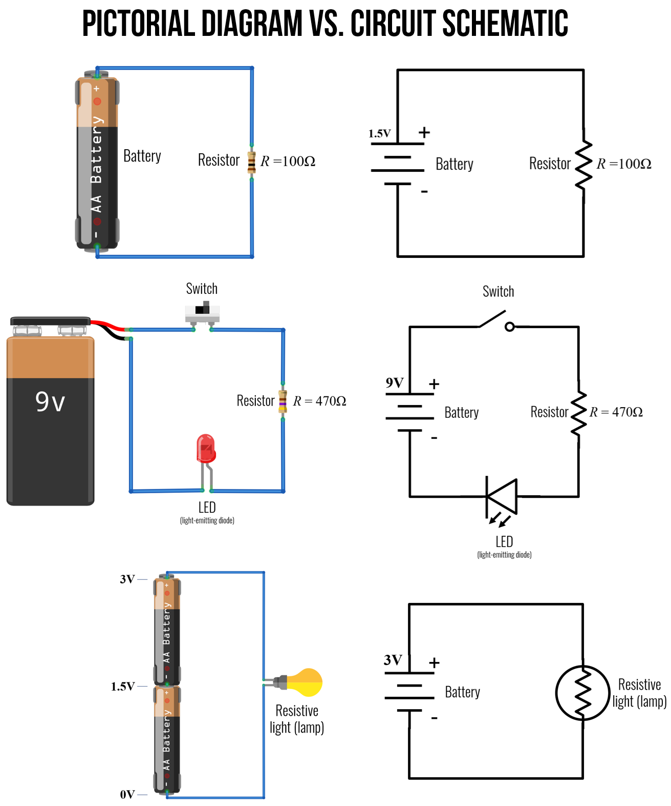

# {{ page.title | replace_first:'L','Lesson '}}
{: .no_toc }

## Table of Contents
{: .no_toc .text-delta }

1. TOC
{:toc}
---

In this lesson, we will learn about **Ohm's Law**, one of the most important empirical laws in electrical circuits that describes how *current*, *voltage*, and *resistance* relate together. While Ohm's Law is incredibly useful in analyzing and understanding how circuits work, like many "laws", it is not always obeyed (particularly for what are called "non-ohmic" devices like LEDs).

## Ohm's Law

Ohm's Law states that the current ($$I$$ in amperes) in a conductor is directly proportional to the applied voltage ($$V$$ in volts) *vs.* the conductor's resistance ($$R$$ in ohms):

$$I = \frac{V}{R}$$

Thus, if we double the voltage in our circuit—for example, by stacking two batteries—then we will also double the current. Ohm's Law has many implications for how we build circuits with microcontrollers, including voltage dividers and resistive sensors.

Importantly, you will see and use Ohm's Law in all three equivalent incarnations (which can be derived with simple algebra):

When you want to solve for **current** in your circuit, you use:
$$I = \frac{V}{R}$$

To solve for **voltage**, use:
$$V = I * R$$

To solve for **resistance**, use:
$$R = \frac{V}{I}$$

From these equations, you  

### Why $$I$$ and not $$C$$?

You might be asking, "If $$R$$ is the *resistance* in ohms (Ω) and V is the *voltage* in volts (V) then why is $$I$$ used to represent the *current* in amperes (A)?" or "Why is current $$I$$ and not $$C$$?" Two reasons: first, $$C$$ is already reserved for the SI unit of coloumbs (C), which is used in the very definition of amperes (recall that $$1\ A = 1\ C / s$$) and thus, could get confusing! Second, the ampere is named after [André-Marie Ampère](https://en.wikipedia.org/wiki/Andr%C3%A9-Marie_Amp%C3%A8re), considered the father of electromagnetism, who referred to amperage as the "***i**ntensity of current." So, current is $$I$$ and not $$C$$.

## Circuit diagrams

Before analyzing circuits with Ohm's Law, it's useful to introduce [**circuit schematics**](https://en.wikipedia.org/wiki/Circuit_diagram), which are diagrammatic abstractions of circuits. Unlike the more realistic pictorials that we have used thus far, circuit schematics are compact, standardized, visual representations of circuits used in electronic datasheets, CAD layout software, and circuit analysis.

Below, we've included some common electronic symbols for basic circuits. For more examples, see [Wikipedia's entry](https://en.wikipedia.org/wiki/Electronic_symbol). 

**Figure.** Common electronic symbols. Image made in PowerPoint.
{: .fs-1 }

To demonstrate the difference and utility of pictorial vs. circuit schematics, we provide three examples below. 

**Figure.** Three different example circuits with pictorial diagrams and their corresponding circuit schematics. Image made in [Fritzing](https://fritzing.org/) and PowerPoint.
{: .fs-1 }

When reading a circuit schematic, it can be confusing how to interpret crossing wires—*i.e.,* are they connected or not—there is a standard for this as well (though some deviations are possible).

<!-- - https://web.stanford.edu/class/archive/engr/engr40m.1178/slides/lecture01.pdf
- https://web.stanford.edu/class/archive/engr/engr40m.1178/slides/lecture02.pdf -->

## Notes
- Single loop one resistor
- Single loop two resistors in series

## Some gotchas

- Make sure all of your units are the same—convert to base metric units! In digital circuits, the current is often in milliamperes (milliamps or mA). Make sure to convert mA to A in your equation. So, $$3mA$$ would be $$3x10^{-3}A$$ or $$0.03A$$. 

## Notes

https://ccrma.stanford.edu/wiki/Introduction_to_Electronics_(condensed)