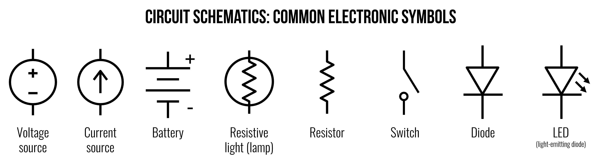
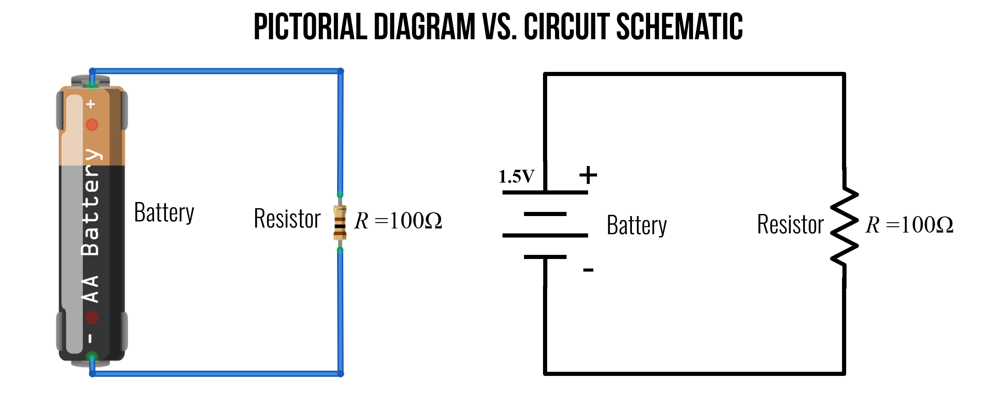
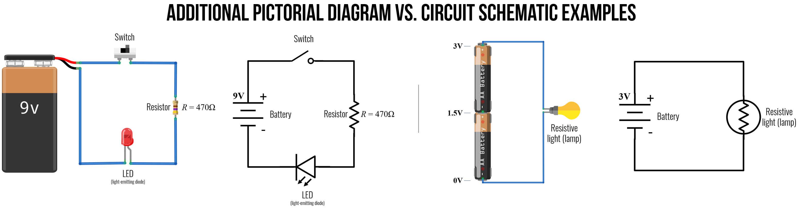
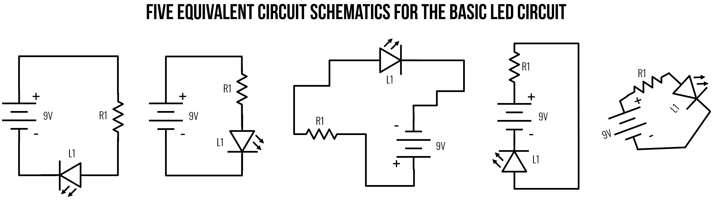
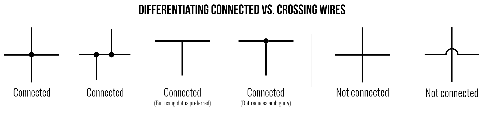
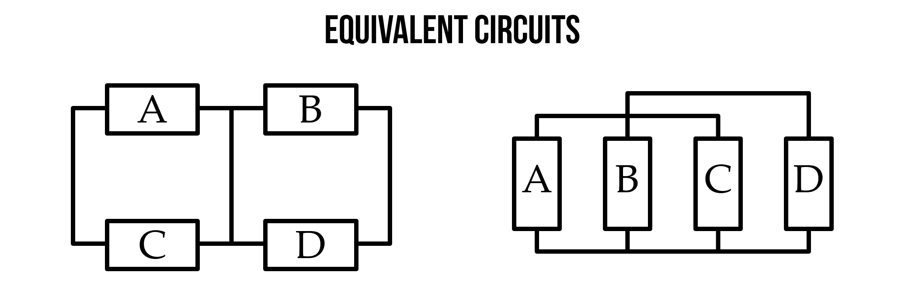
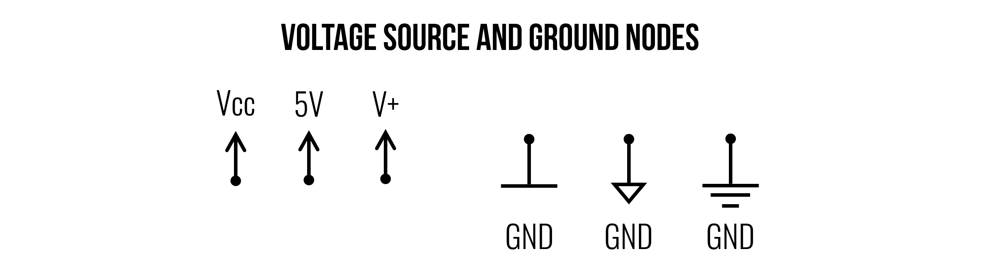
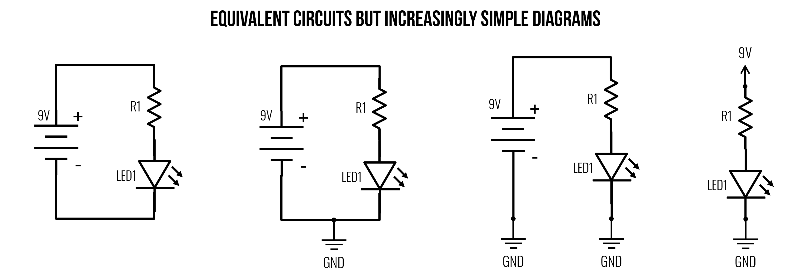
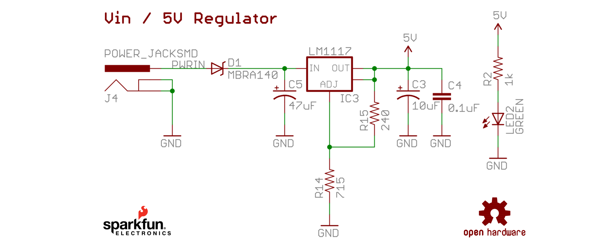

# {{ page.title | replace_first:'L','Lesson '}}
{: .no_toc }

## Table of Contents
{: .no_toc .text-delta }

1. TOC
{:toc}
---

Before going any further, it's useful to introduce [**circuit schematics**](https://en.wikipedia.org/wiki/Circuit_diagram), which are diagrammatic abstractions of circuits—this will allow us to "speak" about and describe circuits **visually**. 

Unlike the more realistic pictorials that we have used thus far (*e.g.,* like [this](assets/videos/ElectronFlowVsConventionalCurrent_PhetSimulation_ByJonFroehlich.mp4) or [this](assets/videos/WaterCircuitAnalogy_Trimmed_ByJonFroehlich.mp4)), circuit schematics are the [*lingua franca*](https://learning.oreilly.com/library/view/practical-electronics-components/9781449373221/app02.html) of electronics—they are a compact, standardized, and visual representations of circuits. You'll find them in electronic datasheets, CAD layout software, and circuit analysis.

But, like any "language", schematics take time and experience to learn and understand. For the most part, we will try to offer both pictorial representations and schematic representations in our tutorials but schematics are preferred for circuit analysis and you'll need to build up understanding in order to parse component datasheets—an important skill!

## Common electronic symbols

Below, we've included some common electronic symbols for basic circuits. We will begin using these symbols in our next lesson on Ohm's Law, so it's important to study them. What do you observe? 

For the most part, the symbols are clean, distinguishable, and help capture the "essence" of the underlying component. Notice how a resistor and a resistive (incandescent) lamp are related—and, as resistive elements, they share a zig-zaggy line. Notice too how the diode and light-emitting diode (LED) are visually similar (they are both diodes!)—the latter includes two little arrows indicating light emission.

For more examples, see [Wikipedia's entry](https://en.wikipedia.org/wiki/Electronic_symbol) or visit one of the [Resources](#resources) listed below.

<!-- TODO: consider adding ground to this diagram below? -->

**Figure.** Common electronic symbols. For the battery, the long line is used to indicate the positive terminal and the short line is the negative terminal (which is typically used as ground). Image made in PowerPoint.
{: .fs-1 }

## Pictorial vs. circuit schematics

To demonstrate the difference and utility of pictorial *vs.* circuit schematics, we provide some examples below. 

In the first example, we have a 1.5V battery with a 100Ω resistor. Unlike pictorial diagrams (on the left), circuit diagrams can be more visually compact as well as legible in black-and-white.

**Figure.** An example pictorial diagram and circuit schematic of a basic switching circuit with a 1.5V battery, a switch, a resistor, and an LED. Note: in a circuit schematic, the long line on the battery is used to indicate the positive terminal. Image made in [Fritzing](https://fritzing.org/) and PowerPoint.
{: .fs-1 }

Below, we have two additional examples. On the left, a 9V circuit with three components: a switch, a 470Ω, and an LED. On the right, we have two 1.5V batteries in series (stacked together, which creates a 3V voltage source) and a resistive light bulb (lamp). Do the schematic representations make sense? Do they seem to match their pictorial counterparts? Why or why not?

**Figure.** Additional examples of pictorial diagrams vs. circuit schematics for two more circuits. Right-click on the image and open it in a "new tab" to zoom. Image made in [Fritzing](https://fritzing.org/) and PowerPoint.
{: .fs-1 }

## Schematics do not capture physical arrangement

While a circuit schematic captures the relative ordering of and connections between components, the spacing and overall layout is *not* captured. When followed, you can use circuit schematics to build a circuit—a bit like following Ikea instructions. But, in this case, the schematic only captures the electrical relationships between components. So, you can use whatever spatial layout you want—as long as it is functionally equivalent to the diagram.

For example, the following five schematics of a basic LED circuit are all functionally equivalent! Take your time reading them—do you agree that they are all equivalent? What stands out to you?

**Figure.** Though they *look* different, all five of these basic LED circuits are functionally equivalent. Each of them have the positive terminal of the battery connected to a resistor, then an LED, and the cathode of the LED is connected to the negative terminal of the battery. Image made in PowerPoint.
{: .fs-1 }

## Representing connected vs. unconnected wires

When reading a circuit schematic, it can be difficult to properly interpret crossing wires—*i.e.,* "*are those wires connected or not?*" Thankfully, there is a standard for this as well (though some deviations are possible).

A wire is shown as a solid line. When two or more wires **connect**, the junction is *typically* depicted by a black dot—we call this junction a **node**. For **crossing** (unconnected) wires, there is *no* black dot. As [Hughes notes](https://learning.oreilly.com/library/view/practical-electronics-components/9781449373221/app02.html), schematics created before ~1980 used a *hump* or *arc* to indicate that one wire cross another without connecting (far right in image below). While valuable, this practice is far less common today perhaps because of the greater complexity of modern circuits, which have more crossing wires (thus, those humps could be visually distracting).

**Figure.** When reading a circuit schematic, it's important to properly assess and understand which wires are connected and how—but determining whether a crossing wire is unconnected (*e.g.,* jumping over a wire) or connected (*i.e.,* forming a node) can be confusing. Above, we show various examples of how to interpret whether wires are connected in a circuit diagram. Image made in PowerPoint.
{: .fs-1 }

But this can quickly get confusing. For example, are the two circuits below equivalent or not? In fact, they are! When in doubt, redraw the circuit yourself on a piece of paper!

An example of how even simple circuits can start to get confusing. What's connected to what? Are these two circuits the same? In fact, yes! When in doubt, redraw the circuit on paper. Image from [Stanford's ENGR 40M course](https://web.stanford.edu/class/archive/engr/engr40m.1178/slides/lecture01.pdf).
{: .fs-1 }

<!-- - https://web.stanford.edu/class/archive/engr/engr40m.1178/slides/lecture01.pdf
- https://web.stanford.edu/class/archive/engr/engr40m.1178/slides/lecture02.pdf -->

## Voltage source and ground nodes

On many circuit diagrams, you'll see special symbols used to denote the voltage source and ground nodes. Positive voltage source nodes are usually indicated by an arrow pointing up while ground nodes are typically pointed down (with a flat line, downward pointing triangle, or three lines).

Using these symbols has the advantage of more clearly marking what the reference or ground node of a circuit is but, more importantly, also allows the circuit designer to render more clean diagrams (by removing needless wires). 

For example, all four versions of this simple LED-based circuit are functionally equivalent but the one on the right is far simpler.

Four examples of the *same* circuit drawn differently. The circuit visuals become increasingly minimalist from left-to-right. Image made in PowerPoint (inspired by [Section 5.6](https://learning.oreilly.com/library/view/electronics-for-beginners/9781484259795/html/488495_1_En_5_Chapter.xhtml) of Electronics for Beginners)
{: .fs-1 }

### A real example

In the schematic below, you can see how the circuit designer made use of the voltage source and ground node symbols. This declutters the diagram by reducing the need to have many lines (wires) drawn to a shared $$GND$$ node.

This circuit schematic is of the 5V voltage regulator on the [Sparkfun RedBoard](https://www.sparkfun.com/products/13975), Sparkfun's open hardware version of the [Arduino Uno R3](https://store.arduino.cc/usa/arduino-uno-rev3) board. Notice how the schematic uses the voltage source and ground node symbols? A [voltage regulator](https://en.wikipedia.org/wiki/Voltage_regulator) is a system designed to maintain a constant voltage and is used here to stepdown 7-15V source inputs to a constant 5V. The full schematic is [here](http://cdn.sparkfun.com/datasheets/Dev/Arduino/Boards/RedBoard-v06.pdf).
{: .fs-1 }

The circuit schematic above also has a number of other symbols, including polarized and non-polarized [capacitors](https://en.wikipedia.org/wiki/Capacitor) (two parallel lines), a [zener diode](https://en.wikipedia.org/wiki/Zener_diode), and the [LM1117 linear regulator](https://www.ti.com/lit/ds/symlink/lm1117.pdf?ts=1617203074186&ref_url=https%253A%252F%252Fwww.google.com%252F).

## Activity: Building circuit diagrams in Fritzing

For your learning activity, we would like you to build both a *pictorial* representation and a *schematic* representation of the same circuit in the open-source hardware layout tool [Fritzing](https://fritzing.org/). While the production version of Fritzing is € 8, you can download development versions for free on [GitHub](https://github.com/fritzing/fritzing-app/releases).

### Download and install Fritzing

The latest development version of Fritzing is CD-548. Visit the GitHub Fritzing [releases page](https://github.com/fritzing/fritzing-app/releases) and scroll down to CD-548, then click on the 'Assets' link, which will expand a download menu for compiled versions of Fritzing for various OSes. See image below.

**Figure** Go to the GitHub Fritzing [releases page](https://github.com/fritzing/fritzing-app/releases), scroll down to CD-548, then click on the 'Assets' link to download a free development version of Fritzing.
{: .fs-1 }

### Using Fritzing

Once you've downloaded and unzipped the Fritzing release, open it and follow this tutorial video. Together, we will make a simple LED-based circuit with a 9V battery, a switch, a resistor, and an LED. To complement the video, we also have this [simple Fritzing PDF guide](assets/pdfs/RapidIntroduction_HowToUseFritizing_ByJonFroehlich.pdf).

<iframe width="736" height="414"  src="https://www.youtube.com/embed/x1aN9LwhIAQ" title="YouTube video player" frameborder="0" allow="accelerometer; autoplay; clipboard-write; encrypted-media; gyroscope; picture-in-picture" allowfullscreen></iframe>

**Video** A video tutorial of using [Fritzing](https://fritzing.org/) to build a simple LED-based circuit.
{: .fs-1 }

Unfortunately, while you can create nice pictorial and schematic diagrams of circuits in Fritzing, you cannot simulate them (ugh, I know!). So, you have to use another tool for this.

### For your prototyping journal

For your prototyping journal, take a screenshot of what you made following the tutorial video. Then save a new file, and make a simple modification to the circuit—it could be switching to a different color LED or adding in another part of the circuit. Take a screenshot of this new modified circuit and describe it, briefly, in your journal.

As usual, you should also report on any challenges or confusions you experienced!

Have fun!

## Schematic building tools

There are a number of schematic building tools aimed at makers, each with their own tradeoffs.

- [Circuit.io](https://www.circuito.io/). Has some very interesting auto-completion features, combines design+code, is purely a web app. No simulation support.

- [Fritzing](https://fritzing.org/). Provides both pictorial ("breadboard") plus schematic representations. Was "industry standard" for many years but has struggled with fundraising and feature improvements of late.

- [Tinkercad Circuits](https://www.tinkercad.com/learn/circuits). Allows you to design Arduino-based circuits, write code, and simulate. Does not provide schematic representations.

## Resources

- [How to Read a Schematic](https://learn.sparkfun.com/tutorials/how-to-read-a-schematic/all), sparkfun.com

- [From Schematic to Reality](http://beavisaudio.com/techpages/SchematicToReality/), beavisaudio.com

- [Appendix B: Schematics](https://learning.oreilly.com/library/view/practical-electronics-components/9781449373221/app02.html), John M. Hughes, [Practical Electronics: Components and Techniques](https://learning.oreilly.com/library/view/practical-electronics-components/9781449373221/), O'Reilly Media, 2015

- [Schematic Diagrams](https://itp.nyu.edu/physcomp/videos/videos-schematic-diagrams/), [ITP videos](https://vimeo.com/album/2801639) by [Jeff Feddersen](http://www.fddrsn.net/) on Vimeo

## Next Lesson

In the [next lesson](ohms-law.md), we will learn about [Ohm's Law](ohms-law.md), one of the most important and fundamental empirical laws in electrical circuits that relates voltage, current, and resistance together in a rather simple equation: $$I = \frac{V}{R}$$.

[Previous: Voltage, current, and resistance](electricity-basics.md){: .btn .btn-outline }
[Next: Ohm's Law](ohms-law.md){: .btn .btn-outline }

