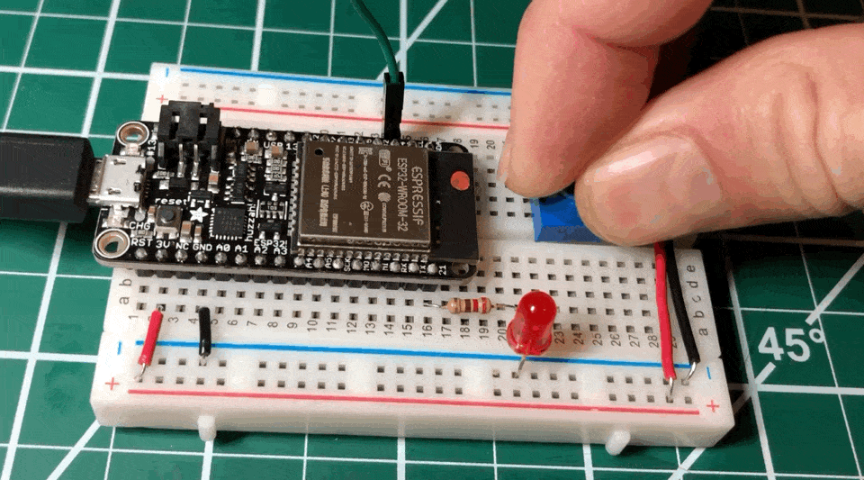
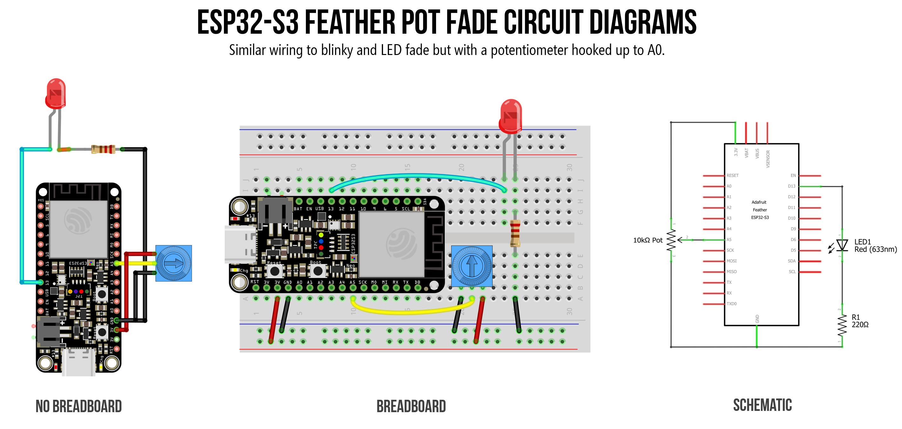
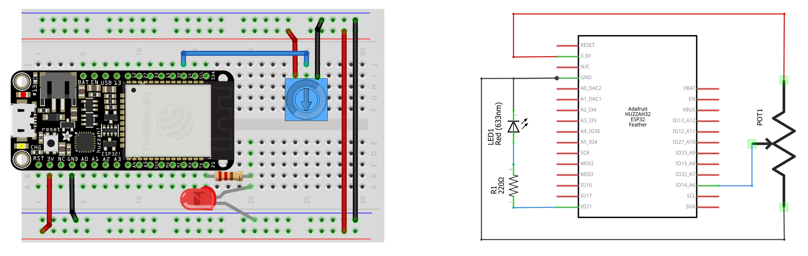

# {{ page.title | replace_first:'L','Lesson '}}
{: .no_toc }

## Table of Contents
{: .no_toc .text-delta }

1. TOC
{:toc}
---

In the [last lesson](led-fade.md), we used the LEDC library to control an LED's brightness with PWM—but the brightness was hardcoded in a `for` loop. Wouldn't it be more fun to control the brightness with a physical knob? In this lesson, we'll combine **analog input** (reading a potentiometer) with **analog output** (PWM) to build a hands-on LED fader. Along the way, you'll learn how the ESP32's ADC differs from the Arduino Uno's and why it matters.

<!-- TODO: Replace with <video> showing pot-fade on ESP32-S3 Feather -->
<video autoplay loop muted playsinline aria-label="Animation showing a potentiometer controlling the brightness of an LED on an ESP32 board">
  <source src="assets/movies/Huzzah32_PotFade-optimized.mp4" type="video/mp4">
  
</video>
**Video.** Using a potentiometer to control LED brightness on the ESP32 via analog input and PWM output.
{: .fs-1 }

{: .note }
> **In this lesson, you will learn:**
> - How to read analog input on the ESP32 using `analogRead()`
> - Why the ESP32 has a 12-bit ADC (0–4095) instead of the Arduino Uno's 10-bit ADC (0–1023)
> - How to use `map()` to convert between different value ranges
> - How to combine analog input with PWM output to build a physical LED dimmer
> - Which analog pins to use on the ESP32-S3 Feather (and why ADC1 pins are special)
> - How to write portable code that works on both ESP32 and Arduino using preprocessor defines
> - How to control the onboard NeoPixel's color with a potentiometer

## Materials

You'll need the same materials as the [last lesson](led-fade.md) plus a potentiometer. We use **[Adafruit's ESP32-S3 Feather](https://www.adafruit.com/product/5477)** but any ESP32-S3 board will work!

| Breadboard | ESP32 | LED | Resistor | Trimpot |
| ---------- |:-----:|:-----:|:-----:|:-----:|
|  |  |  |  |  |
| Breadboard | [ESP32-S3 Feather](https://www.adafruit.com/product/5477) | Red LED | 220Ω Resistor | 10kΩ Trimpot |

{: .note }
> If you haven't used a potentiometer before, see our [Potentiometers lesson](../arduino/potentiometers.md) in the Intro to Arduino series. It covers how potentiometers work as voltage dividers, how to wire them, and how `analogRead()` converts a voltage into a number.

## Analog input on the ESP32

If you completed the [Arduino Potentiometers lesson](../arduino/potentiometers.md), you already know how `analogRead()` works: the ADC (analog-to-digital converter) samples the voltage on a pin and returns a digital number proportional to that voltage. The good news is that `analogRead()` works **exactly the same** on the ESP32—no new functions to learn!

The key differences are in the hardware.

### 12-bit ADC (0–4095)

The Arduino Uno has a **10-bit** ADC, so `analogRead()` returns values from 0 to $$2^{10}-1 = 1023$$. The ESP32 has a **12-bit** ADC, so `analogRead()` returns values from 0 to $$2^{12}-1 = 4095$$. This means the ESP32 can distinguish finer voltage differences—each step represents about 0.8mV ($$3.3\text{V} \div 4096 \approx 0.0008\text{V}$$) compared to the Uno's ~4.9mV per step ($$5\text{V} \div 1024 \approx 0.0049\text{V}$$).

{: .warning }
> **Don't forget:** The ESP32 operates at **3.3V**, not 5V. So `analogRead()` returns 4095 at 3.3V, not at 5V. If you're porting Arduino Uno code that assumes a 0–1023 range or a 5V reference, you'll need to update those values!

### ADC pins: chip vs. board

The **ESP32-S3 chip** integrates two 12-bit SAR ADCs supporting **20 channels** total: ADC1 has 10 channels (GPIO1–GPIO10) and ADC2 has 10 channels (GPIO11–GPIO20). However, not all 20 are broken out on every development board—the board manufacturer chooses which GPIOs to expose on the header pins.

On the **Adafruit ESP32-S3 Feather**, **15 ADC-capable pins** are available. While only six are labeled A0–A5, many of the digital pins also support analog input:

| Pin label | GPIO | ADC | Channel |
|---|---|---|---|
| A0 | GPIO18 | ADC2 | CH7 |
| A1 | GPIO17 | ADC2 | CH6 |
| A2 | GPIO16 | ADC2 | CH5 |
| A3 | GPIO15 | ADC2 | CH4 |
| A4 | GPIO14 | ADC2 | CH3 |
| **A5** | **GPIO8** | **ADC1** | **CH7** |
| D5 | GPIO5 | ADC1 | CH4 |
| D6 | GPIO6 | ADC1 | CH5 |
| D9 | GPIO9 | ADC1 | CH8 |
| D10 | GPIO10 | ADC1 | CH9 |
| D11 | GPIO11 | ADC2 | CH0 |
| D12 | GPIO12 | ADC2 | CH1 |
| D13 | GPIO13 | ADC2 | CH2 |
| SDA | GPIO3 | ADC1 | CH2 |
| SCL | GPIO4 | ADC1 | CH3 |

<!-- TODO: Consider creating an annotated version of the pin diagram that specifically highlights ADC pins -->


**Figure.** Pin diagram for the Adafruit ESP32-S3 Feather. ADC-capable pins are highlighted in teal. Note that ADC1 pins (including A5, D5, D6, D9, D10, SDA, and SCL) work even when WiFi is active, while ADC2 pins (A0–A4, D11–D13) do not. See the Adafruit [pinouts guide](https://learn.adafruit.com/adafruit-esp32-s3-feather/pinouts) for details.
{: .fs-1 }

### ADC2 and WiFi

Why does the ADC1 vs. ADC2 distinction matter? Because **ADC2 is unavailable when WiFi is active**—this is a hardware limitation on all ESP32 variants (on the ESP32-S3, a hardware arbiter allows limited sharing, but WiFi takes priority and ADC2 reads will intermittently fail). If your project uses WiFi and analog input simultaneously, you must use an ADC1 pin.

{: .important }
> For this lesson, we'll use **A5** for our potentiometer input. A5 is on **ADC1**, which means it works whether WiFi is on or off—a good habit to build for when you add WiFi in [Lesson 7](iot.md). If you need more WiFi-compatible analog inputs, D5, D6, D9, and D10 are also on ADC1 (though SDA and SCL are typically reserved for I2C).

### ADC nonlinearity

{: .note }
> The ESP32's ADC is known to be somewhat **nonlinear** at the extremes of its range—readings below ~100mV and above ~3.2V can be inaccurate. You may notice that your potentiometer doesn't quite reach 0 or 4095 at the endpoints. In practice, this can feel like a small "dead zone" at the physical extremes of the knob—the LED stops changing brightness slightly before the knob reaches its endpoint. The ESP32-S3 is significantly better than the original ESP32 in this regard, thanks to a built-in hardware calibration circuit. For most interactive projects (like our LED fader), this nonlinearity is negligible. For precision measurement, Espressif provides [ADC calibration APIs](https://docs.espressif.com/projects/esp-idf/en/latest/esp32s3/api-reference/peripherals/adc_calibration.html) in the ESP-IDF.

### Changing the ADC resolution

If you're porting Arduino Uno code and don't want to change all your 0–1023 constants, you can tell the ESP32 to use 10-bit resolution instead:

```cpp
analogReadResolution(10);  // Now analogRead() returns 0-1023, like the Arduino Uno
```

We won't use this in our lesson (we'll embrace the full 12-bit range), but it's a handy trick when migrating existing code.

### Writing portable code with preprocessor defines

A more flexible approach to portability is to use **preprocessor defines**—conditional blocks that the C/C++ preprocessor evaluates *before* compilation. The Arduino build system automatically defines certain symbols for each board: `ESP32` is defined when compiling for any ESP32 board, while symbols like `ARDUINO_AVR_UNO` or `ARDUINO_AVR_LEONARDO` identify those boards.

Here's a pattern you'll see in many of our examples:

```cpp
// The preprocessor evaluates these BEFORE compilation.
// Only the matching block is included in the final program.
#if defined(ESP32)
  const int MAX_ANALOG_VAL = 4095;   // ESP32 has a 12-bit ADC (0-4095)
#else
  const int MAX_ANALOG_VAL = 1023;   // AVR Arduinos have a 10-bit ADC (0-1023)
#endif
```

When you compile for the ESP32-S3, the preprocessor sees that `ESP32` is defined and includes `4095`. When you compile for the Arduino Uno, `ESP32` is *not* defined, so it falls through to the `#else` block and uses `1023`. The rest of your code just uses `MAX_ANALOG_VAL` and works on both boards without any changes.

{: .note }
> You've already seen this mechanism in action! The `#if defined(NEOPIXEL_POWER)` guard we used in the [NeoPixel sections](led-blink.md#part-4-blink-the-onboard-neopixel-) works the same way—the board support package defines `NEOPIXEL_POWER` only for boards that have a NeoPixel power pin. If the symbol isn't defined, the code inside the block is silently skipped.

We'll use this pattern in our pot-fade code below.

<details markdown="1">
<summary><strong>Using the Huzzah32 instead?</strong> (click to expand)</summary>

### Huzzah32 ADC pin diagram

The Huzzah32 uses the original ESP32, which has a different set of ADC pins:


**Figure.** Huzzah32 pin diagram. ADC pins are marked in teal. Right-click and open in a new tab to zoom in.
{: .fs-1 }

The pin assignments on the Huzzah32:
- **ADC1** has 8 channels on GPIOs 32–39, which map to A7 (32), A9 (33), A2 (34), A4 (36), and A3 (39). GPIOs 35, 37, and 38 are not exposed on the Huzzah32.
- **ADC2** has 10 channels on GPIOs 0, 2, 4, 12–15, and 25–27, which map to A5 (4), A11 (12), A12 (13), A6 (14), A8 (15), A1 (25), A0 (26), A10 (27). GPIOs 0 and 2 are not exposed.

In total, the Huzzah32 has **13 usable analog inputs** (A0–A12). Our original code examples use **A6** (GPIO 14) for the potentiometer input.

### ADC2 and WiFi on the Huzzah32

The same ADC2/WiFi restriction applies: ADC2 pins are unavailable when WiFi is active. On the Huzzah32, ADC1 has more pins (GPIOs 32–39), so you have more options for WiFi-compatible analog input.

{: .note }
> The official Adafruit [Huzzah32 docs](https://learn.adafruit.com/adafruit-huzzah32-esp32-feather/pinouts) contain a confusing statement: "you can only read analog inputs on ADC #1 once WiFi has started." This is misleading—they mean that *only* ADC1 works when WiFi is active (ADC2 does not). We confirmed this through [experimentation](https://github.com/makeabilitylab/arduino/blob/master/ESP32/WiFi/WiFiAnalogInputTest/WiFiAnalogInputTest.ino).

### Huzzah32 workbench videos

In the following video, we test all 13 analog input pins (`A0`–`A12`) using a trim potentiometer for input and the Serial Plotter for output:

<!-- TODO: Consider downloading and hosting locally as .mp4 for consistent <video> tag usage -->
<iframe width="736" height="414" src="https://www.youtube.com/embed/8BBY-5n4e5A" title="Testing all 13 analog input pins on the Huzzah32 ESP32 using a potentiometer" frameborder="0" allow="accelerometer; autoplay; encrypted-media; gyroscope; picture-in-picture" allowfullscreen></iframe>
**Video.** Testing all 13 analog input pins on the Huzzah32 with a potentiometer and the Serial Plotter.
{: .fs-1 }

</details>

## Let's build a potentiometer-controlled LED fader!

Now let's put analog input and PWM output together. We'll read the potentiometer's position with `analogRead()` and use that value to control the LED's brightness with `ledcWrite()`.

### The circuit

We're combining two simple circuits:
1. **Input:** A 10kΩ potentiometer connected to **A5** (the ADC1 pin). Wire the outer legs to 3.3V and GND, and the center wiper to A5.
2. **Output:** An LED on **GPIO 13** through a 220Ω resistor (same as the [Blink](led-blink.md) and [Fade](led-fade.md) lessons)

<!-- TODO: Create an ESP32-S3 Feather Fritzing diagram showing:
     - Potentiometer: outer legs to 3.3V and GND, wiper to A5
     - LED: GPIO 13 → 220Ω resistor → LED anode, LED cathode → GND -->


**Figure.** Circuit diagram showing a potentiometer on A5 (analog input) and an LED on GPIO 13 (PWM output) on the ESP32-S3 Feather.
{: .fs-1 }

<details markdown="1">
<summary><strong>Using the Huzzah32 instead?</strong> (click to expand)</summary>


**Figure.** Huzzah32 circuit with potentiometer on A6 (GPIO 14) and LED on GPIO 21.
{: .fs-1 }

</details>

### The code

The core idea is simple: read the potentiometer → convert the value → write to the LED. But because the ADC and PWM use different ranges, we need the `map()` function to translate between them.

```cpp
/**
 * Reads a potentiometer on A5 and uses the value to control
 * LED brightness via PWM on GPIO 13.
 *
 * Demonstrates: analogRead (12-bit), map(), ledcWrite (8-bit PWM),
 * and preprocessor defines for portable code.
 *
 * See: https://makeabilitylab.github.io/physcomp/esp32/pot-fade
 */

// --- Preprocessor defines for cross-platform portability ---
#if defined(ESP32)
  const int MAX_ANALOG_VAL = 4095;       // ESP32 has a 12-bit ADC (0-4095)
#else
  const int MAX_ANALOG_VAL = 1023;       // AVR Arduinos have a 10-bit ADC (0-1023)
#endif

const int LED_OUTPUT_PIN = 13;           // GPIO 13 = LED_BUILTIN on ESP32-S3 Feather
const int POT_INPUT_PIN = A5;            // A5 is on ADC1 — works even when WiFi is active

const int PWM_FREQ = 5000;              // 5 kHz PWM frequency
const int PWM_RESOLUTION = 8;           // 8-bit resolution: duty cycle 0-255
const int MAX_DUTY_CYCLE = (1 << PWM_RESOLUTION) - 1;  // 2^8 - 1 = 255

void setup() {
  Serial.begin(115200);

  // Attach PWM to the LED pin (v3.x API — channel assigned automatically)
  ledcAttach(LED_OUTPUT_PIN, PWM_FREQ, PWM_RESOLUTION);
}

void loop() {
  // Read the potentiometer (returns 0-4095 on the ESP32's 12-bit ADC)
  int potVal = analogRead(POT_INPUT_PIN);

  // Map the 12-bit input (0-4095) to the 8-bit PWM range (0-255)
  int dutyCycle = map(potVal, 0, MAX_ANALOG_VAL, 0, MAX_DUTY_CYCLE);

  // Set the LED brightness
  ledcWrite(LED_OUTPUT_PIN, dutyCycle);

  // Print both values for debugging (use Serial Plotter to visualize!)
  Serial.print("PotVal:");
  Serial.print(potVal);
  Serial.print(", DutyCycle:");
  Serial.println(dutyCycle);

  delay(10);  // Small delay for stable readings
}
```

Let's walk through the key parts.

#### Preprocessor defines

At the top, we use `#if defined(ESP32)` to set `MAX_ANALOG_VAL` to the correct value for whichever board we're compiling for. This means the same code works on both an ESP32 and an Arduino Uno without modification—the preprocessor handles the difference before the compiler ever sees it.

#### The `map()` function

The potentiometer gives us a value from 0 to 4095 (12-bit ADC), but `ledcWrite` expects 0 to 255 (8-bit PWM). The [`map()`](https://www.arduino.cc/reference/en/language/functions/math/map/) function performs this linear conversion for us:

```cpp
int dutyCycle = map(potVal, 0, MAX_ANALOG_VAL, 0, MAX_DUTY_CYCLE);
//                  value   fromLow  fromHigh    toLow  toHigh
```

So `map(2048, 0, 4095, 0, 255)` returns ~127 (approximately half brightness). You could also do this with integer math (`potVal * 255 / 4095`), but `map()` is more readable and generalizes to any range conversion.

{: .note }
> The `map()` function uses **integer math only**—no floating point. This means the output can be off by 1 due to rounding, which is perfectly fine for LED brightness. If you ever need precise floating-point mapping, you'll need to write your own function.

#### Why A5?

We chose A5 because it's on **ADC1** on the ESP32-S3 Feather. While A0–A4 would also work for this lesson (since we're not using WiFi), using A5 is a good habit. When you add WiFi in [Lesson 7](iot.md), your analog input will keep working without any rewiring. If you need additional WiFi-compatible analog pins, D5, D6, D9, and D10 are also on ADC1.

{: .note }
> **Serial Plotter tip:** The `Serial.print` format used above (`"PotVal:"` followed by the value, then a comma separator) is designed for the Arduino IDE's **Serial Plotter**. Open it with **Tools → Serial Plotter** to see a real-time graph of both the potentiometer input and the duty cycle output. It's a great way to visualize what your code is doing!

### Workbench video

<!-- TODO: Record a workbench video showing the pot-fade circuit on the ESP32-S3 Feather.
     Use <video> with aria-label. -->

<details markdown="1">
<summary><strong>Huzzah32 workbench video</strong> (click to expand)</summary>

Here's a workbench video showing the pot-fade circuit on the Huzzah32, with the Serial Plotter graphing the analog input value and the converted duty cycle:

<iframe width="736" height="414" src="https://www.youtube.com/embed/E5YFtm0CLFY" title="Potentiometer-controlled LED fader on the Huzzah32 ESP32" frameborder="0" allow="accelerometer; autoplay; encrypted-media; gyroscope; picture-in-picture" allowfullscreen></iframe>
**Video.** Potentiometer-controlled LED fader on the Huzzah32 with Serial Plotter output.
{: .fs-1 }

</details>

### Try it in Wokwi

You can also build this circuit in the [Wokwi simulator](https://wokwi.com/). Add a potentiometer and an LED to the ESP32-S3 DevKitC, and use the same code above.

<!-- TODO: Create a Wokwi project for the pot-fade circuit and replace the URL below. -->

**[→ Open the Pot Fade simulation in Wokwi](https://wokwi.com/projects/new/esp32-s3)**

### Using `analogWrite` instead

Just like in the [LED fade lesson](led-fade.md#using-analogwrite-instead), you can simplify the output side by using `analogWrite()` instead of the LEDC API:

```cpp
/**
 * Potentiometer-controlled LED fader using analogWrite().
 * Same behavior as the LEDC version, but simpler code.
 *
 * See: https://makeabilitylab.github.io/physcomp/esp32/pot-fade
 */

#if defined(ESP32)
  const int MAX_ANALOG_VAL = 4095;
#else
  const int MAX_ANALOG_VAL = 1023;
#endif

const int LED_OUTPUT_PIN = 13;
const int POT_INPUT_PIN = A5;

void setup() {
  // No PWM setup needed — analogWrite handles it automatically
}

void loop() {
  int potVal = analogRead(POT_INPUT_PIN);

  // analogWrite expects 0-255; analogRead returns 0-4095 on ESP32
  int brightness = map(potVal, 0, MAX_ANALOG_VAL, 0, 255);
  analogWrite(LED_OUTPUT_PIN, brightness);

  delay(10);
}
```

This is even simpler—no `ledcAttach`, no frequency or resolution constants. The tradeoff is the same as in the [fade lesson](led-fade.md#using-analogwrite-instead): you're stuck with `analogWrite`'s default 1 kHz / 8-bit PWM unless you explicitly override it.

## Bonus: Potentiometer-controlled NeoPixel hue 🌈

In the [last lesson's bonus section](led-fade.md#bonus-fade-the-neopixel-through-the-rainbow-), we faded the NeoPixel through the color wheel automatically. Now let's put *you* in control—map the potentiometer to the hue so you can dial in any color you want!

```cpp
/**
 * Maps potentiometer input to the onboard NeoPixel's hue.
 * Turn the knob to sweep through the full rainbow!
 *
 * Requires the Adafruit NeoPixel library:
 *   Sketch -> Include Library -> Manage Libraries -> search "Adafruit NeoPixel"
 *
 * See: https://makeabilitylab.github.io/physcomp/esp32/pot-fade
 */
#include <Adafruit_NeoPixel.h>

Adafruit_NeoPixel _pixel(1, PIN_NEOPIXEL, NEO_GRB + NEO_KHZ800);

const int POT_INPUT_PIN = A5;            // ADC1 pin — works with WiFi too

#if defined(ESP32)
  const int MAX_ANALOG_VAL = 4095;
#else
  const int MAX_ANALOG_VAL = 1023;
#endif

const uint32_t MAX_HUE = 65536;          // Full color wheel in 16-bit hue

void setup() {
  #if defined(NEOPIXEL_POWER)
    pinMode(NEOPIXEL_POWER, OUTPUT);
    digitalWrite(NEOPIXEL_POWER, HIGH);
  #endif

  _pixel.begin();
  _pixel.setBrightness(30);  // Keep it gentle on the eyes
  _pixel.show();

  Serial.begin(115200);
}

void loop() {
  // Read the potentiometer (0-4095 on ESP32)
  int potVal = analogRead(POT_INPUT_PIN);

  // Map to the full hue range (0-65535)
  uint32_t hue = map(potVal, 0, MAX_ANALOG_VAL, 0, MAX_HUE - 1);

  // Apply the hue with full saturation and brightness, plus gamma correction
  uint32_t color = _pixel.gamma32(_pixel.ColorHSV(hue, 255, 255));
  _pixel.setPixelColor(0, color);
  _pixel.show();

  Serial.print("Pot:");
  Serial.print(potVal);
  Serial.print(", Hue:");
  Serial.println(hue);

  delay(20);
}
```

Turn the potentiometer slowly and watch the NeoPixel sweep through the entire rainbow—from red through orange, yellow, green, cyan, blue, purple, and back to red. This is the same `analogRead()` → `map()` → output pattern, just with a different (and more colorful!) output device.

{: .note }
> **Challenge:** Can you add a *second* potentiometer to control brightness independently? Map the second pot (on a different analog pin) to the third argument of `ColorHSV()` (the value/brightness parameter, 0–255). Now you have two-axis control: one knob for color, one for brightness!

<details markdown="1">
<summary><strong>Using the Huzzah32 instead?</strong> (click to expand)</summary>

The original Huzzah32 does not have an onboard NeoPixel. You can connect an external NeoPixel to a GPIO pin and update `PIN_NEOPIXEL` accordingly. See the [Addressable LEDs lesson](../advancedio/addressable-leds.md) for wiring details.

</details>

## Summary

In this lesson, you combined analog input with PWM output to build a physical LED dimmer—and controlled the NeoPixel's color with a knob! The key takeaways:

- `analogRead()` works the same on the ESP32 as on the Arduino Uno—but the ESP32's **12-bit ADC** returns values from 0 to 4095 (compared to the Uno's 10-bit range of 0–1023). Don't forget to update your constants when porting code!
- The **ESP32-S3 chip** has 20 ADC channels total (10 on ADC1, 10 on ADC2). The Adafruit ESP32-S3 Feather exposes **15** of these. Only **A5** among the "A"-labeled pins is on ADC1; but D5, D6, D9, and D10 are also on ADC1.
- **ADC2 is unavailable when WiFi is active**—a hardware limitation on all ESP32 variants. Use ADC1 pins if your project needs both WiFi and analog input.
- The [`map()`](https://www.arduino.cc/reference/en/language/functions/math/map/) function is essential for converting between different value ranges—in this case, mapping 12-bit ADC input (0–4095) to 8-bit PWM output (0–255).
- **Preprocessor defines** (`#if defined(ESP32)`) let you write a single codebase that compiles correctly on both ESP32 and Arduino boards—the preprocessor swaps in the right constants before compilation.
- The `analogRead()` → `map()` → output pattern is one of the most common patterns in physical computing. Once you can read a sensor and map its value to an output, you can build almost anything!

## Exercises

**Exercise 1:** Modify the pot-fade code to print the potentiometer reading as a **voltage** instead of a raw ADC value. The formula is: $$V = \frac{analogRead \times 3.3}{4095}$$. Make sure to store the result in a `float` (not an `int`), or you'll only see whole numbers! Compare your Serial Monitor output to a multimeter reading on the potentiometer's wiper pin.

**Exercise 2:** Instead of controlling brightness, use the potentiometer to control the **blink rate** of the LED. Map the pot value to a delay between 50ms (fast blinking) and 1000ms (slow blinking). Use `digitalWrite` for the blinking—no PWM needed.

**Exercise 3:** Add a second potentiometer to the NeoPixel bonus circuit. Use one pot for **hue** (A5) and one for **brightness** (on another analog pin). Map the second pot to the `value` parameter of `ColorHSV()` (0–255). Now you have two-knob color control!

**Exercise 4:** Slowly turn the potentiometer from one end to the other while watching the Serial Plotter. Is the ramp perfectly linear, or do you see any irregularity at the extremes (near 0 or 4095)? This is the ESP32 ADC nonlinearity in action—though the ESP32-S3's hardware calibration makes it much better than the original ESP32.

**Exercise 5:** Try adding `analogReadResolution(10)` to `setup()`. What range does `analogRead()` return now? Update your `map()` call accordingly. Why might this be useful when porting code from an Arduino Uno?

## Next Lesson

In the [next lesson](tone.md), we'll learn how to play tones and melodies on the ESP32 using the LEDC PWM library—the same hardware we used for LED fading, but now driving a speaker instead of an LED!

<span class="fs-6">
[Previous: Fading an LED with PWM](led-fade.md){: .btn .btn-outline }
[Next: Playing tones](tone.md){: .btn .btn-outline }
</span>