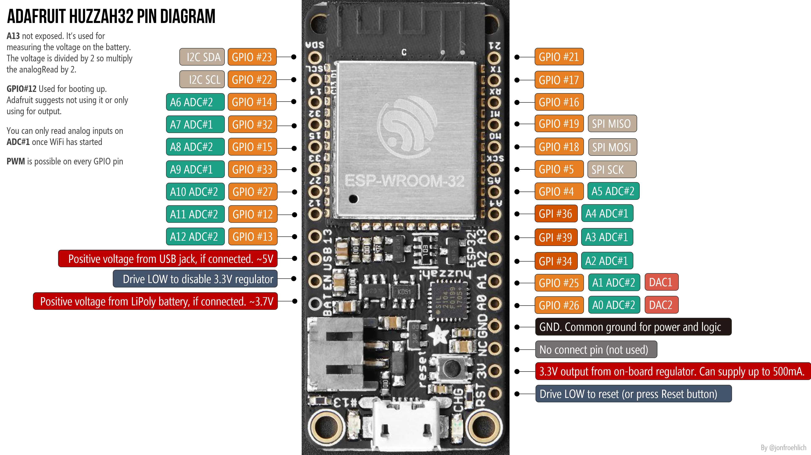
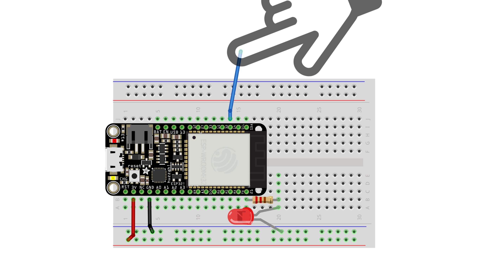

# {{ page.title | replace_first:'L','Lesson '}}
{: .no_toc }

## Table of Contents
{: .no_toc .text-delta }

1. TOC
{:toc}
---

The ESP32 has built-in circuitry and software for capacitive touch sensing ([docs](https://github.com/espressif/esp-iot-solution/blob/master/documents/touch_pad_solution/touch_sensor_design_en.md#1-introduction-to-touch-sensor-system)). In this lesson, we'll use the touch sensing functionality to turn on an LED.

## Materials

You'll need the following materials:

| Breadboard | ESP32 | LED | Resistor |
| ---------- |:-----:|:-----:|:-----:|
|  |     |  |  |
| Breadboard | Huzzah32  | Red LED | 220Ω Resistor |

## ESP32's touch sensor system

The ESP32's touch sensor circuit measures the total capacitance on a touch channel. When the capacitance changes and the amount of change exceeds the threshold value, the system can detect finger contact or proximity.

The ESP32 has 10 capacitive touch pins; however, only **eight** are exposed on the Huzzah32:

See the Adafruit Huzzah32 [docs](https://learn.adafruit.com/adafruit-huzzah32-esp32-feather/pinouts) for details. Right-click and open image in a new tab to zoom in. For more details on the capacitive touch pins, see the Espressif [docs](https://github.com/espressif/esp-iot-solution/blob/master/documents/touch_pad_solution/touch_sensor_design_en.md).
{: .fs-1 } 

Espressif sells the "[ESP32-Sense Kit](https://www.espressif.com/en/media_overview/news/look-out-new-esp32-sense-kit)" to help highlight how capacitive touch sensing may be integrated into products, including linear touch sliders, a wheel slider, and matrix buttons.

<!-- TODO: considering writing a background section on capacitive touch sensing -->

### Touch sensing vs. physical buttons

Capacitive touch sensing is now widely used in household appliances, consumer electronics, and in industrial contexts. As the ESP32 [docs](https://github.com/espressif/esp-iot-solution/blob/master/documents/touch_pad_solution/touch_sensor_design_en.md#1-introduction-to-touch-sensor-system) enumerate, compared with mechanical buttons, capacitive touch sensing offers:
- No mechanical parts that wear over time
- Completely sealed surfaces (that can be waterproofed)
- Fewer components
- A modern look

However, the lack of physical buttons can reduce accessibility, especially for blind or low-vision users.

### The ESP32's touch sensing API

ESP32's touch sensing API is described [here](https://docs.espressif.com/projects/esp-idf/en/latest/esp32/api-reference/peripherals/touch_pad.html); however, Espressif also developed an Arduino wrapper library to simplify its usage ([.h file](https://github.com/espressif/arduino-esp32/blob/a59eafbc9dfa3ce818c110f996eebf68d755be24/cores/esp32/esp32-hal-touch.h), [.c file](https://github.com/espressif/arduino-esp32/blob/a59eafbc9dfa3ce818c110f996eebf68d755be24/cores/esp32/esp32-hal-touch.c)). Touch sensing is part of the core ESP32 Arduino library, so if you've installed an ESP32 board via the Arduino IDE, then you'll be able to use the touch sensing library.

#### The ESP32 touch sensing Arduino API

The ESP32 touch sensing Arduino [API](https://github.com/espressif/arduino-esp32/blob/a59eafbc9dfa3ce818c110f996eebf68d755be24/cores/esp32/esp32-hal-touch.h) has three methods:


/*
 * Set cycles that measurement operation takes
 * The result from touchRead, threshold and detection
 * accuracy depend on these values. Defaults are
 * 0x1000 for measure and 0x1000 for sleep.
 * With default values touchRead takes 0.5ms
 * */
void touchSetCycles(uint16_t measure, uint16_t sleep);

/*
 * Read touch pad (values close to 0 mean touch detected)
 * You can use this method to chose a good threshold value
 * to use as value for touchAttachInterrupt
 * */
uint16_t touchRead(uint8_t pin);

/*
 * Set function to be called if touch pad value falls
 * below the given threshold. Use touchRead to determine
 * a proper threshold between touched and untouched state
 * */
void touchAttachInterrupt(uint8_t pin, void (*userFunc)(void), uint16_t threshold);


#### ESP32 touch sensing Arduino examples

Espressif has created two touch sensing Arduino examples: one using polling ([TouchRead.ino](https://github.com/espressif/arduino-esp32/blob/a59eafbc9dfa3ce818c110f996eebf68d755be24/libraries/ESP32/examples/Touch/TouchRead/TouchRead.ino)) and the other using an interrupt ([TouchInterrupt.ino](https://github.com/espressif/arduino-esp32/blob/a59eafbc9dfa3ce818c110f996eebf68d755be24/libraries/ESP32/examples/Touch/TouchInterrupt/TouchInterrupt.ino)). These are also accessible in the Arduino IDE: File -> Examples -> ESP32 -> Touch.

## Let's make stuff

Let's make a simple, touch-sensitive LED light. We will poll `touchRead` and determine when a touch has occurred based on a set threshold. 

### The circuit

We use TOUCH6 (`T6`), which is GPIO Pin 14.

### The code

The code is quite simple. We use `touchRead` to measure the capacitive value of the pin. Values close to zero indicate a touch. We initially wrote a quick program to print `touchRead` values to Serial and found that the `touchRead` returned ~60-70 when the wire was untouched and 6-15 when the wire was touched. We then used this to setup a `TOUCH_THRESHOLD`. To improve our approach, we could use basic smoothing (*e.g.,* a mean filter) to reduce transient and erroneous low reads.

Our full implementation is on [github](https://github.com/makeabilitylab/arduino/blob/master/ESP32/Sensors/TouchRead/TouchRead.ino):

### Workbench video

Here's a workbench video demonstrating our [TouchRead](https://github.com/makeabilitylab/arduino/blob/master/ESP32/Sensors/TouchRead/TouchRead.ino) code using both a wire and aluminum foil as a conductor. 

<iframe width="736" height="414" src="https://www.youtube.com/embed/RE2mH38e9RI" frameborder="0" allow="accelerometer; autoplay; encrypted-media; gyroscope; picture-in-picture" allowfullscreen></iframe>
Our circuit has a potentiometer but this was just left over from the previous lesson and is not used here!
{: .fs-1 } 

### Touch sensing interrupts

We also created two touch sensing examples using interrupts: [TouchInterrupt](https://github.com/makeabilitylab/arduino/blob/master/ESP32/Sensors/TouchInterrupt/TouchInterrupt.ino) uses `touchAttachInterrupt` on `T6` to print to serial when a touch has been detected and [TouchInterruptLed](https://github.com/makeabilitylab/arduino/blob/master/ESP32/Sensors/TouchInterruptLed/TouchInterruptLed.ino) extends this to also turn on an LED for a set amount of time after a touch has been detected.

## Next Lesson

In the [next lesson](iot.md), we will connect our ESP32 to the cloud over WiFi and use an IoT dashboard to view our data.

<!-- [Previous: Analog input using the ESP32](pot-fade.md){: .btn .btn-outline } -->
[Previous: Playing tones](tone.md){: .btn .btn-outline }
[Next: Making an IoT device](iot.md){: .btn .btn-outline }
