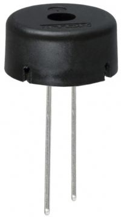

# {{ page.title | replace_first:'L','Lesson '}}
{: .no_toc }

## Table of Contents
{: .no_toc .text-delta }

1. TOC
{:toc}
---

{: .warning }
> This lesson is in draft form. There is missing circuit diagrams, images, videos, and other content.

<!-- Content TODOs:
1. Create updated Fritzing diagrams for ESP32-S3 Feather (currently using Huzzah32 diagrams)
2. Build an interactive p5.js simulation showing how capacitance changes when a finger approaches a touch pad
3. Record workbench video of touch-controlled LED on the ESP32-S3 Feather
4. Record workbench video of touch piano on the ESP32-S3 Feather
5. Create a Wokwi project for the basic touch read circuit
6. Create a Wokwi project for the touch piano
7. Get photos of banana piano and other creative touch surfaces
-->

<!-- See also:
- https://docs.espressif.com/projects/arduino-esp32/en/latest/api/touch.html
- https://github.com/espressif/arduino-esp32/blob/master/cores/esp32/esp32-hal-touch.h
- https://docs.espressif.com/projects/esp-idf/en/stable/esp32s3/api-reference/peripherals/cap_touch_sens.html
- ESP32 Touch Sensor Design Guide: https://github.com/espressif/esp-iot-solution/blob/master/documents/touch_pad_solution/touch_sensor_design_en.md
-->

<!-- TODO: Add a hero video or animated GIF showing something fun—like the banana piano in action,
     or a hand touching foil pads and lighting up LEDs -->

In the [last lesson](tone.md), we added **sound** to our output repertoire. In this lesson, we'll add a completely new *input* modality: **touch!** No buttons, no wires, no moving parts—just your finger and a bare GPIO pin. The ESP32 has built-in capacitive touch sensing hardware, which means it can detect when you touch (or even *approach*) a conductive surface connected to certain pins. And because it's built into the chip, no external components are needed beyond a piece of wire or aluminum foil.

By the end of this lesson, we'll combine touch input with tone output from [Lesson 5](tone.md) to build a **touch piano**—using bananas 🍌, foil strips, or anything conductive as the keys!

{: .note }
> **In this lesson, you will learn:**
> - How capacitive touch sensing works—the physics of capacitance and why your finger changes it
> - How to use the ESP32's built-in touch sensing hardware with `touchRead()`
> - The critical behavioral difference between the original ESP32 and the ESP32-S3 (touch values go in *opposite directions*!)
> - How to calibrate a touch threshold and handle noisy readings
> - The difference between polling and interrupt-based touch detection
> - How to combine touch input with `tone()` output to build a touch piano 🎹

## Materials

You'll need the same materials as the [last lesson](tone.md). We use **[Adafruit's ESP32-S3 Feather](https://www.adafruit.com/product/5477)** but any ESP32-S3 board will work!

| Breadboard | ESP32 | LED | Resistor | Piezo Buzzer | Conductive objects |
| ---------- |:-----:|:-----:|:-----:|:-----:|:-----:|
|  |  |  |  |  | 🍌🥝🍎 |
| Breadboard | [ESP32-S3 Feather](https://www.adafruit.com/product/5477) | Red LED | 220Ω Resistor | Passive Piezo Buzzer | Wires, foil, fruit, *etc.* |

For the touch piano project, you'll need conductive objects to use as touch pads. Jumper wires work, but the real fun is in using aluminum foil strips, copper tape, conductive fabric, or even fruit—bananas, apples, and kiwis all work because they contain enough water and electrolytes to conduct! 🍌

## How does capacitive touch sensing work?

Before we jump into code, let's build some intuition for *why* touching a wire with your finger can be detected by a microcontroller. The answer involves one of the most fundamental components in electronics: the **capacitor**.

### A quick refresher on capacitance

A [capacitor](../electronics/capacitors.md) stores electrical charge between two conductive plates separated by an insulating gap (called a *dielectric*). The amount of charge it can store—its **capacitance**, measured in farads (F)—depends on three things: the area of the plates, the distance between them, and the type of dielectric material. The relationship is:

$$C = \varepsilon \cdot \frac{A}{d}$$

where $$C$$ is capacitance, $$\varepsilon$$ is the dielectric constant (permittivity) of the material between the plates, $$A$$ is the plate area, and $$d$$ is the distance between plates.

You don't need to memorize this formula! The key insight is: **capacitance increases when a conductive object gets closer to the plate** (decreasing $$d$$) or **when the effective plate area increases** (increasing $$A$$).

### The touch pad as a capacitor

Every touch-capable GPIO pin on the ESP32 is connected to an internal circuit that measures the capacitance on that pin. When you connect a wire, a strip of copper tape, or a piece of aluminum foil to a touch pin, you've created one plate of a tiny capacitor. The other "plate" is the environment around it—the breadboard, the table, the air. This gives the pin a small **baseline capacitance**, typically just a few picofarads (pF).

Now here's the magic: **your body is a large, grounded conductor.** When your finger approaches or touches the pad, your body acts as the second plate of a new, much larger capacitor. Your skin (with its moisture and salts) couples capacitively through the thin insulating layer (air, or the surface coating of the object you're touching) to the conductive pad. This **increases the total capacitance** on the pin.

<!-- TODO: Build an interactive p5.js simulation showing:
     1. A touch pad with field lines and a capacitance meter
     2. A finger approaching—watch the capacitance value rise
     3. The ESP32's internal charge/discharge circuit counting cycles
     Similar to the piezo buzzer simulation in the Arduino tone lesson:
     https://editor.p5js.org/jonfroehlich/sketches/mU7YwoUol -->

### How the ESP32 measures capacitance

The ESP32 doesn't measure capacitance directly in farads. Instead, it uses an elegant trick: it repeatedly **charges and discharges** the touch pin through a known internal current source and counts how many charge/discharge cycles complete in a fixed time window. The count depends on the RC time constant, which depends on the capacitance:

- **No touch (low capacitance):** The pin charges and discharges quickly, completing many cycles in the measurement window. The count is high (on the ESP32-S3) or the charge completes quickly (on the original ESP32).
- **Touch detected (higher capacitance):** The added capacitance from your finger slows the charge/discharge cycle. Fewer cycles complete in the same time window, or the charge takes longer.

The exact way this measurement is reported differs between ESP32 variants—and this leads to an important gotcha we'll cover next.

{: .note }
> **Behind the scenes:** The charge/discharge process is managed by a hardware **finite state machine (FSM)** inside the ESP32's RTC (Real-Time Clock) low-power subsystem—it runs independently of the main CPU cores. When you call `touchRead()`, the Arduino wrapper triggers a measurement cycle, waits for the FSM to complete, and returns the result. This means `touchRead()` is a **blocking** call (it takes ~0.5ms by default), which is fine for simple polling but worth knowing if you're writing time-critical code. The interrupt-based approach (`touchAttachInterrupt`) is more efficient: the FSM continuously monitors the pin in hardware, and only interrupts the CPU when the threshold is crossed—your `loop()` runs unblocked. On the ESP32-S3, the touch FSM can even run during light sleep, enabling wake-on-touch with minimal power draw. For the full hardware details, see the [ESP32-S3 Technical Reference Manual](https://www.espressif.com/sites/default/files/documentation/esp32-s3_technical_reference_manual_en.pdf), Chapter "On-Chip Sensors."

{: .note }
> **Fun fact:** Capacitive touch sensing is the same technology used in your smartphone's touchscreen! Smartphone screens use a grid of transparent conductive traces (made from indium tin oxide, or ITO) embedded in the glass. When your finger touches the screen, it changes the capacitance at that grid intersection, and the touch controller triangulates the position. The ESP32's touch sensing is a simpler, single-point version of the same principle.

### Real-world capacitive touch examples

Capacitive touch sensing is everywhere in modern products. Compared with mechanical buttons, it offers no moving parts that wear out, completely sealed surfaces (that can be waterproofed), fewer components, and a sleek, modern look. You'll find it in smartphone screens, laptop trackpads, elevator buttons, kitchen appliance controls, car dashboards, and even smart home light switches.

Espressif sells the "[ESP32-Sense Kit](https://github.com/espressif/esp-iot-solution/blob/master/documents/touch_pad_solution/touch_sensor_design_en.md)" to showcase how capacitive touch can be integrated into products, including linear touch sliders, a wheel slider, and matrix button arrays.

{: .note }
> **Research spotlight: Touché** 🎓
>
> The simple capacitive touch sensing we use in this lesson detects a binary state: touched or not touched. But what if you could distinguish *how* something is being touched? Researchers Chris Harrison, Munehiko Sato, and Ivan Poupyrev at Disney Research and Carnegie Mellon developed [**Touché**](https://chrisharrison.net/index.php/Research/Touche), a swept-frequency capacitive sensing technique that measures impedance across a range of frequencies rather than at a single frequency. This lets a single sensor distinguish between different touch gestures—fingertip *vs.* palm *vs.* full grasp *vs.* pinch—on the same object. In their [CHI 2012 paper](https://dl.acm.org/doi/10.1145/2207676.2207743), they demonstrated touch sensing on doorknobs, tables, the human body, and even *liquids*. It's a brilliant example of how the basic capacitive sensing principles in this lesson can be extended through creative engineering and signal processing!

{: .warning }
> **Accessibility consideration:** While capacitive touch interfaces look sleek, the lack of physical buttons can reduce accessibility—especially for blind or low-vision users who rely on tactile feedback to locate and confirm button presses. Capacitive sensing also inherently depends on the electrical properties of human skin: users interacting via prosthetics, thick gloves, or non-conductive styluses may not trigger detection at all, and even heavy calluses can reduce the capacitive coupling enough to cause unreliable readings. When designing touch-based interfaces, consider adding haptic feedback (vibration), audio feedback (tones—like we learned in [Lesson 5](tone.md)!), or raised tactile landmarks so users can orient themselves by feel. The best designs combine multiple modalities and don't rely on capacitive touch as the *only* input method.

## ESP32 vs. ESP32-S3: the touch value inversion

This is the single most important thing to understand before writing touch sensing code, and it trips up almost everyone who follows an older tutorial:

{: .warning }
> **On the original ESP32** (like the Huzzah32), `touchRead()` returns values that **decrease** when you touch the pin. Untouched values are high (~60–80), and touched values drop low (~5–15). You detect a touch by checking if the value falls **below** a threshold.
>
> **On the ESP32-S3**, `touchRead()` returns values that **increase** when you touch the pin. Untouched values are low (~20,000–40,000), and touched values jump high (~60,000–100,000+). You detect a touch by checking if the value rises **above** a threshold.
>
> This is due to different hardware measurement circuits between the two chip generations. The Arduino wrapper API is the same (`touchRead(pin)`), but the *meaning* of the returned value is inverted!

This also affects interrupts: `touchAttachInterrupt` fires when the value falls **below** the threshold on the original ESP32, but when it rises **above** the threshold on the ESP32-S3.

Throughout this lesson, our code targets the **ESP32-S3** (our primary board). We'll include notes for Huzzah32 users where the behavior differs.

## Touch pins on the ESP32-S3 Feather

The ESP32-S3 chip has **14** capacitive touch pins (T1–T14), a significant upgrade from the original ESP32's 10. However, not all of them are broken out and available on every development board.

<!-- TODO: Create or update the ESP32-S3 Feather pin diagram highlighting touch-capable pins -->


**Figure.** Pin diagram for the Adafruit ESP32-S3 Feather. See the Adafruit [pinouts guide](https://learn.adafruit.com/adafruit-esp32-s3-feather/pinouts) for full details. Right-click and open image in a new tab to zoom in.
{: .fs-1 }

{: .note }
> In your Arduino code, you can reference touch pins using either the `T` prefix (*e.g.,* `T1`) or the GPIO number directly (*e.g.,* `touchRead(1)`). The `T` prefix constants are defined in the ESP32 Arduino core and map to the corresponding GPIO numbers.

<details markdown="1">
<summary><strong>Using the Huzzah32 instead?</strong> (click to expand)</summary>

The original ESP32 (Huzzah32) has **10** touch pins (T0–T9), of which **eight** are exposed on the Feather board. Key differences from the ESP32-S3:

- `touchRead()` returns `uint16_t` (not `uint32_t`) and values **decrease** on touch.
- The GPIO-to-touch-pin mapping is completely different. For example, on the Huzzah32, T6 is GPIO 14, while on the ESP32-S3, the mapping is different.
- Interrupt threshold direction is inverted (fires when value goes *below* threshold).

See the [Adafruit Huzzah32 pinout](https://learn.adafruit.com/adafruit-huzzah32-esp32-feather/pinouts) for the specific pin mapping.


The Adafruit Huzzah32 pin diagram. See the Adafruit Huzzah32 [docs](https://learn.adafruit.com/adafruit-huzzah32-esp32-feather/pinouts) for details.
{: .fs-1 }

</details>

## The Arduino touch sensing API

The ESP32 touch sensing API is part of the core [Arduino-ESP32](https://github.com/espressif/arduino-esp32) library—no `#include` needed. The [API reference](https://docs.espressif.com/projects/arduino-esp32/en/latest/api/touch.html) provides several functions, but the three you'll use most are:

```cpp
// Read the touch sensor value for a given pin.
// Returns uint16_t on ESP32, uint32_t on ESP32-S2/S3.
touch_value_t touchRead(uint8_t pin);

// Attach an interrupt that fires when a touch is detected.
// On ESP32: fires when value falls BELOW threshold.
// On ESP32-S3: fires when value rises ABOVE threshold.
void touchAttachInterrupt(uint8_t pin, void (*callback)(void), touch_value_t threshold);

// Configure the charge/discharge measurement timing.
// Default values make touchRead() take ~0.5ms.
void touchSetCycles(uint16_t measure, uint16_t sleep);
```

There are a few additional functions available on the ESP32-S3:

```cpp
// Get the interrupt status for the touch pad (true if triggered).
bool touchInterruptGetLastStatus(uint8_t pin);

// Enable a touch pad to wake the ESP32 from deep sleep.
// ESP32-S3 supports only ONE sleep wake-up touch pad.
void touchSleepWakeUpEnable(uint8_t pin, touch_value_t threshold);
```

{: .note }
> Espressif provides two built-in touch sensing examples in the Arduino IDE: a polling example ([TouchRead.ino](https://github.com/espressif/arduino-esp32/blob/master/libraries/ESP32/examples/Touch/TouchRead/TouchRead.ino)) and an interrupt example ([TouchInterrupt.ino](https://github.com/espressif/arduino-esp32/blob/master/libraries/ESP32/examples/Touch/TouchInterrupt/TouchInterrupt.ino)). Access them via **File → Examples → ESP32 → Touch** in the Arduino IDE.

## Part 1: Reading touch values

Let's start by simply reading the touch sensor and printing values to the Serial Monitor. This is the essential first step—you need to see what "untouched" and "touched" look like on *your specific setup* before you can set a threshold.

### The circuit

Connect a jumper wire (or any piece of conductive material) to a touch-capable GPIO pin. We'll use **GPIO 5** (which supports touch on the ESP32-S3 Feather). That's it—no resistors, no other components needed for the basic touch read!

<!-- TODO: Create Fritzing diagram for ESP32-S3 Feather with a wire on GPIO 5 -->


**Figure.** A simple touch sensing circuit: just connect a jumper wire to a touch-capable GPIO pin. The wire acts as the touch pad. No other components are needed for basic touch reading.
{: .fs-1 }

### The code

```cpp
/**
 * Read the capacitive touch sensor and print values to Serial.
 * Use this to determine appropriate threshold values for your setup.
 * 
 * On ESP32-S3: values INCREASE when touched.
 * On original ESP32: values DECREASE when touched.
 *
 * See: https://makeabilitylab.github.io/physcomp/esp32/capacitive-touch-sensing
 */
const int TOUCH_PIN = 5;  // Use any touch-capable GPIO

void setup() {
  Serial.begin(115200);
  delay(500);  // Give the serial monitor time to connect
  Serial.println("ESP32 Touch Sensor Test");
  Serial.println("Touch the wire and watch the values change!");
}

void loop() {
  int touchValue = touchRead(TOUCH_PIN);
  Serial.println(touchValue);
  delay(100);
}
```

Upload this sketch, open the **Serial Monitor** (or **Serial Plotter**!) at **115200 baud**, and try touching the wire. You should see the values change dramatically when you touch the exposed metal.

{: .note }
> **Use the Serial Plotter!** The Serial Plotter (**Tools → Serial Plotter** in the Arduino IDE) is particularly helpful here. It gives you a real-time graph of the touch values, making it easy to see the baseline, the touch peaks, and any noise. This is exactly how we determined our threshold values.

On the ESP32-S3, you'll see something like this:

- **Untouched:** values around 20,000–40,000 (this varies by pin, wire length, and environment)
- **Touched:** values jump to 60,000–100,000+

The exact values depend on your specific setup—wire length, how firmly you press, ambient humidity, and even what surface you're touching through. That's why we always start by reading raw values before choosing a threshold.

<details markdown="1">
<summary><strong>Using the Huzzah32 instead?</strong> (click to expand)</summary>

On the original ESP32 (Huzzah32), the behavior is inverted. You'll see:

- **Untouched:** values around 60–80
- **Touched:** values drop to 5–15

Use a touch-capable pin from the Huzzah32's pin diagram (*e.g.,* GPIO 14, which is T6 on the Huzzah32).

</details>

## Part 2: Touch-controlled LED

Now let's use the touch sensor to control something. We'll turn on an LED whenever a touch is detected by comparing `touchRead()` values against a **threshold**.

### Choosing a threshold

Based on your Serial Monitor observations from Part 1, pick a threshold value between the "untouched" and "touched" ranges. For example, if your untouched values are around 30,000 and touched values are around 80,000, a threshold of 50,000 would work well. Give yourself a comfortable margin—you don't want the LED flickering on and off from noise.

Hardcoding a threshold works for learning, but in practice the baseline varies with wire length, ambient humidity, and even the surface your breadboard is sitting on. A more robust approach is to **auto-calibrate at startup** by sampling the untouched baseline in `setup()` and computing the threshold as an offset:

```cpp
const int TOUCH_PIN = 5;
const int NUM_CALIBRATION_SAMPLES = 50;
int touchThreshold = 0;

void setup() {
  Serial.begin(115200);

  // Calibrate: average N readings while the pad is NOT being touched
  long total = 0;
  for (int i = 0; i < NUM_CALIBRATION_SAMPLES; i++) {
    total += touchRead(TOUCH_PIN);
    delay(10);
  }
  int baseline = total / NUM_CALIBRATION_SAMPLES;

  // Set threshold 50% above baseline (adjust the multiplier to taste)
  touchThreshold = baseline * 1.5;

  Serial.print("Baseline: ");
  Serial.print(baseline);
  Serial.print(" -> Threshold: ");
  Serial.println(touchThreshold);
}
```

{: .note }
> **Don't touch during calibration!** Make sure nobody is touching the pad during the first second after reset, or the baseline will be wrong. Some production systems solve this by periodically recalibrating during known-idle periods, or by using the ESP32-S3's hardware benchmark feature at the ESP-IDF level.

### The circuit

Add an LED and 220Ω resistor to the touch circuit from Part 1. Connect the LED to any output-capable GPIO pin—we'll use **GPIO 13** (which is also `LED_BUILTIN` on the ESP32-S3 Feather, so you can see the onboard LED respond even without an external one).

<!-- TODO: Create Fritzing diagram for ESP32-S3 Feather with touch wire on GPIO 5 and LED on GPIO 13 -->


**Figure.** A touch-controlled LED circuit. A wire on a touch-capable pin acts as the sensor, and an LED with a 220Ω current-limiting resistor provides visual feedback.
{: .fs-1 }

### The code

```cpp
/**
 * Touch-controlled LED on the ESP32-S3.
 * 
 * When the touch pad is touched, the LED turns on.
 * On ESP32-S3, touchRead() values INCREASE on touch,
 * so we check if the value is ABOVE the threshold.
 *
 * See: https://makeabilitylab.github.io/physcomp/esp32/capacitive-touch-sensing
 */
const int TOUCH_PIN = 5;
const int LED_PIN = LED_BUILTIN;  // GPIO 13 on the ESP32-S3 Feather

// Adjust this threshold based on YOUR Serial Monitor readings!
// On ESP32-S3: untouched ~30,000, touched ~80,000+
const int TOUCH_THRESHOLD = 50000;

void setup() {
  pinMode(LED_PIN, OUTPUT);
  Serial.begin(115200);
  Serial.println("Touch-controlled LED");
}

void loop() {
  int touchValue = touchRead(TOUCH_PIN);

  // On ESP32-S3, values INCREASE when touched
  if (touchValue > TOUCH_THRESHOLD) {
    digitalWrite(LED_PIN, HIGH);
    Serial.print("TOUCHED! Value: ");
  } else {
    digitalWrite(LED_PIN, LOW);
    Serial.print("Value: ");
  }
  Serial.println(touchValue);

  delay(50);
}
```

Touch the wire and the LED should light up! Release and it turns off. If the LED stays on constantly or never responds, adjust your `TOUCH_THRESHOLD` value based on what you saw in the Serial Monitor.

<details markdown="1">
<summary><strong>Using the Huzzah32 instead?</strong> (click to expand)</summary>

On the Huzzah32, change the threshold comparison direction. Untouched values are high (~60–80) and touched values are low (~5–15), so you check if the value falls *below* the threshold:

```cpp
const int TOUCH_THRESHOLD = 30;  // Huzzah32 threshold

// In loop():
if (touchValue < TOUCH_THRESHOLD) {
  // Touch detected!
}
```

</details>

### Dealing with noisy readings

You may notice that raw `touchRead()` values fluctuate a bit, especially at the boundary of your threshold. A stray bump of the wire or a shift in ambient conditions can cause false triggers. There are several techniques to improve reliability:

**Simple smoothing (moving average):** Instead of acting on a single reading, average the last *N* readings. This filters out transient spikes:

```cpp
const int NUM_SAMPLES = 5;

int smoothedTouchRead(int pin) {
  long total = 0;
  for (int i = 0; i < NUM_SAMPLES; i++) {
    total += touchRead(pin);
    delay(5);
  }
  return total / NUM_SAMPLES;
}
```

{: .note }
> **Ready-made filter class:** If you'd rather not write your own smoothing code, the [Makeability Lab Arduino Library](https://github.com/makeabilitylab/arduino-library) includes a [`MovingAverageFilter`](https://github.com/makeabilitylab/arduino-library/blob/master/MakeabilityLab_Arduino_Library/src/MovingAverageFilter.hpp) class that implements a sliding-window moving average with a circular buffer. Install it via the Arduino Library Manager (search "Makeability Lab") and use it like this:
>
> ```cpp
> #include <MovingAverageFilter.hpp>
> MovingAverageFilter filter(10);  // 10-sample window
>
> void loop() {
>   filter.add(touchRead(TOUCH_PIN));
>   int smoothed = filter.getAverage();
>   // use smoothed value for threshold comparison
> }
> ```

**Exponential moving average (EMA):** An even simpler and more memory-efficient alternative is the exponential moving average. Instead of storing a window of past samples, EMA blends each new reading with the previous smoothed value using a smoothing factor $$\alpha$$ (between 0 and 1):

$$\text{smoothed} = \alpha \cdot \text{newReading} + (1 - \alpha) \cdot \text{smoothed}$$

A small $$\alpha$$ (like 0.1) produces heavy smoothing with more lag; a large $$\alpha$$ (like 0.5) responds quickly but smooths less. The beauty of EMA is that it requires **no array, no buffer, just a single variable**—which makes it ideal when you're smoothing multiple touch pins at once (like our 5-key piano!). The tradeoff is explicit: a moving average with window size 10 costs 10 × 4 = 40 bytes of SRAM per channel (precious on microcontrollers) but uses only integer arithmetic; EMA costs just 4 bytes (one `float`) but requires floating-point math on every sample. On the ESP32-S3, which has a hardware FPU, the floating-point cost is negligible—making EMA the clear winner here:

```cpp
float smoothedValue = 0;
const float ALPHA = 0.2;  // 20% new, 80% old — adjust to taste

void loop() {
  int raw = touchRead(TOUCH_PIN);
  smoothedValue = ALPHA * raw + (1.0 - ALPHA) * smoothedValue;

  if (smoothedValue > TOUCH_THRESHOLD) {
    // Touch detected
  }
}
```

For more on EMA *vs.* moving average and other filters, see our [Smoothing Input](../advancedio/smoothing-input.md) lesson.

**Threshold hysteresis:** Use two thresholds—a higher one to detect a touch *starting* and a lower one to detect a touch *ending*. This prevents rapid on/off flickering when the value hovers near a single threshold:

```cpp
const int TOUCH_ON_THRESHOLD = 55000;   // Must exceed this to trigger
const int TOUCH_OFF_THRESHOLD = 45000;  // Must drop below this to release
bool isTouched = false;

void loop() {
  int touchValue = touchRead(TOUCH_PIN);
  
  if (!isTouched && touchValue > TOUCH_ON_THRESHOLD) {
    isTouched = true;
    digitalWrite(LED_PIN, HIGH);
  } else if (isTouched && touchValue < TOUCH_OFF_THRESHOLD) {
    isTouched = false;
    digitalWrite(LED_PIN, LOW);
  }
}
```

{: .note }
> **Pro tip:** For production-quality touch sensing, you'd also want to **recalibrate the baseline** periodically, since environmental conditions (humidity, temperature) can drift the untouched values over time. The ESP32-S3's hardware actually has a built-in benchmark system for this at the ESP-IDF level, but the Arduino wrapper keeps things simple with just `touchRead()`.

{: .highlight }
> **Want to go deeper on smoothing?** We only scratch the surface here. Our [Smoothing Input](../advancedio/smoothing-input.md) lesson in the [Advanced I/O](../advancedio/index.md) module covers moving average filters, exponentially weighted moving averages, and median filters in much more detail—including how window size affects lag and signal distortion. Those techniques apply directly to touch sensor data (and any noisy analog input).

### Workbench video

Here's a workbench video demonstrating touch-controlled LED using both a wire and aluminum foil as conductors. This video was recorded on the Huzzah32 with the original ESP32—the concept is identical on the ESP32-S3, just with inverted threshold logic.

<iframe width="736" height="414" src="https://www.youtube.com/embed/RE2mH38e9RI" title="Capacitive touch sensing on the ESP32 with a wire and aluminum foil" frameborder="0" allow="accelerometer; autoplay; clipboard-write; encrypted-media; gyroscope; picture-in-picture" allowfullscreen></iframe>
**Video.** A demonstration of capacitive touch sensing using a wire and aluminum foil on the Huzzah32. The LED turns on when the conductive surface is touched. Note: the potentiometer visible in the circuit is leftover from the previous lesson and is not used here. Recorded with the legacy Huzzah32 and original ESP32 touch behavior. Source: [TouchRead.ino](https://github.com/makeabilitylab/arduino/blob/master/ESP32/Sensors/TouchRead/TouchRead.ino) (legacy version).
{: .fs-1 }

## Part 3: Touch sensing with interrupts

So far, we've been **polling** the touch sensor—calling `touchRead()` in `loop()` and checking the value every iteration. This works fine for simple projects, but polling has a limitation: if your `loop()` is doing other time-consuming work (updating a display, running animations, communicating over WiFi), you might miss a brief touch.

**Interrupts** offer a better approach for responsive touch detection. With `touchAttachInterrupt()`, you register a callback function that the hardware calls *automatically* whenever a touch is detected—no polling required. Your `loop()` code keeps running, and the interrupt fires in the background.

### Polling vs. interrupts

| | Polling | Interrupts |
|---|---|---|
| **How it works** | You check the sensor value every loop iteration | Hardware triggers your callback function automatically |
| **Responsiveness** | Depends on how fast your loop runs | Near-instant (hardware-level) |
| **CPU usage** | Constantly reading the sensor | Only runs when a touch occurs |
| **Complexity** | Simpler code | Requires understanding ISR (Interrupt Service Routine) rules |
| **Best for** | Simple programs, learning | Responsive apps, multitasking, waking from sleep |

### Touch interrupt example

Here's an example that uses `touchAttachInterrupt` to detect a touch and turn on an LED for a brief period. Notice that we include **debouncing** in `loop()`—without it, a single physical touch can trigger the interrupt dozens of times as the capacitance fluctuates while your finger approaches the pad (especially with DIY conductors like foil or fruit):

```cpp
/**
 * Touch sensing using interrupts on the ESP32-S3.
 * 
 * The LED turns on for 500ms after each touch is detected.
 * Uses touchAttachInterrupt() for responsive, non-polling detection.
 * Includes millis()-based debouncing to prevent multiple triggers
 * from a single physical touch.
 *
 * See: https://makeabilitylab.github.io/physcomp/esp32/capacitive-touch-sensing
 */
const int TOUCH_PIN = 5;
const int LED_PIN = LED_BUILTIN;

// On ESP32-S3: interrupt fires when value rises ABOVE threshold
const int TOUCH_THRESHOLD = 50000;

// Debounce: ignore interrupts within this window of the last one
const unsigned long DEBOUNCE_MS = 200;

// Volatile because these variables are modified inside an ISR
volatile bool touchDetected = false;
volatile unsigned long lastTouchTime = 0;

// The interrupt callback function (ISR)
// Keep ISRs short—just set a flag and timestamp!
void IRAM_ATTR onTouchDetected() {
  unsigned long now = millis();
  if (now - lastTouchTime > DEBOUNCE_MS) {
    touchDetected = true;
    lastTouchTime = now;
  }
}

void setup() {
  pinMode(LED_PIN, OUTPUT);
  Serial.begin(115200);

  // Attach the interrupt
  touchAttachInterrupt(TOUCH_PIN, onTouchDetected, TOUCH_THRESHOLD);

  Serial.println("Touch interrupt enabled. Touch the wire!");
}

void loop() {
  if (touchDetected) {
    touchDetected = false;
    Serial.println("Touch detected via interrupt!");
    
    digitalWrite(LED_PIN, HIGH);
    delay(500);
    digitalWrite(LED_PIN, LOW);
  }

  // Your loop() is free to do other work here!
}
```

{: .warning }
> **ISR rules:** Interrupt Service Routines (ISRs) must be fast. Don't use `Serial.print()`, `delay()`, or any blocking calls inside an ISR. Instead, set a `volatile` flag and handle the work in `loop()`. The `volatile` keyword tells the compiler not to optimize away reads of this variable, since it can change at any time from the interrupt. The `IRAM_ATTR` attribute ensures the ISR code stays in fast internal RAM rather than being paged from flash—required for reliable interrupts on the ESP32.

{: .note }
> **Why debounce in the ISR?** Unlike mechanical buttons, capacitive touch doesn't have physical contact bounce—but it has its own version of the problem. As your finger approaches a DIY touch pad, the capacitance rises gradually, crossing the threshold multiple times if the signal is noisy. Without debouncing, a single touch can fire the interrupt 5–10+ times in rapid succession. The `millis()` check inside the ISR is a lightweight way to suppress these spurious re-triggers. For more on debouncing concepts, see our [Debouncing](../arduino/debouncing.md) lesson in the Intro to Arduino series.

{: .note }
> On the ESP32-S3, the threshold for `touchAttachInterrupt` works in the *opposite direction* from the original ESP32. On the ESP32-S3, the interrupt fires when the touch value rises **above** the threshold. On the original ESP32, it fires when the value falls **below** the threshold. The code example above is written for the ESP32-S3.

<details markdown="1">
<summary><strong>Using the Huzzah32 instead?</strong> (click to expand)</summary>

On the Huzzah32, the interrupt fires when the touch value falls *below* the threshold. Set a lower threshold value:

```cpp
const int TOUCH_THRESHOLD = 30;  // Fires when value drops below 30
```

</details>

Our GitHub repository includes two additional interrupt-based examples for the Huzzah32: [TouchInterrupt.ino](https://github.com/makeabilitylab/arduino/blob/master/ESP32/Sensors/TouchInterrupt/TouchInterrupt.ino), which prints to serial on touch detection, and [TouchInterruptLed.ino](https://github.com/makeabilitylab/arduino/blob/master/ESP32/Sensors/TouchInterruptLed/TouchInterruptLed.ino), which extends this to control an LED.

## Part 4: Touch piano 🎹🍌

Now for the grand finale—let's combine everything we've learned! In the [last lesson](tone.md), we learned how to play tones with `tone()`. In this lesson, we learned how to detect touch. Let's put them together to build a **touch piano** where each touch pad plays a different note.

The best part? Your "keys" can be *anything* conductive. Jumper wires work, but we *strongly* encourage you to get creative: aluminum foil strips, copper tape, conductive thread or fabric, metal spoons, or—our personal favorite—**fruit!** 🍌🍎🥝🍊 Bananas, apples, oranges, and kiwis all contain enough water and electrolytes to conduct the tiny signals needed for capacitive touch sensing.

<!-- TODO: Add a photo of the banana piano setup -->

### The circuit

Connect multiple touch-capable GPIO pins to your conductive objects (wires, foil, fruit, *etc.*). Each object becomes one "key" of the piano. Also connect a piezo buzzer to a GPIO pin for sound output, and optionally an LED for visual feedback.

We'll use five touch pins for a pentatonic scale (C, D, E, G, A—a scale that sounds good no matter what order you play the notes!):

<!-- TODO: Create Fritzing diagram for ESP32-S3 Feather touch piano with 5 touch pads + buzzer + LED -->


**Figure.** A touch piano circuit with five conductive pads connected to touch-capable GPIO pins, a piezo buzzer for sound, and an LED for visual feedback. Each pad plays a different note when touched!
{: .fs-1 }

### The code

```cpp
/**
 * Touch Piano on the ESP32-S3!
 * 
 * Five touch pads play a pentatonic scale (C4, D4, E4, G4, A4).
 * Works with wires, aluminum foil, copper tape, or fruit! 🍌
 * 
 * On ESP32-S3: touchRead() values INCREASE on touch.
 * Adjust TOUCH_THRESHOLD based on your Serial Monitor readings.
 *
 * See: https://makeabilitylab.github.io/physcomp/esp32/capacitive-touch-sensing
 */

// Note frequencies (from pitches.h)
#define NOTE_C4  262
#define NOTE_D4  294
#define NOTE_E4  330
#define NOTE_G4  392
#define NOTE_A4  440

const int BUZZER_PIN = 13;     // Piezo buzzer output
const int LED_PIN = 12;        // LED for visual feedback

// Touch pins — use any touch-capable GPIOs on your board
const int NUM_KEYS = 5;
const int TOUCH_PINS[NUM_KEYS] = {5, 6, 9, 10, 11};
const int NOTE_FREQS[NUM_KEYS] = {NOTE_C4, NOTE_D4, NOTE_E4, NOTE_G4, NOTE_A4};

// Adjust this threshold based on YOUR setup!
// Use the Serial Monitor/Plotter to find good values.
const int TOUCH_THRESHOLD = 50000;

// Track which key is currently playing (-1 = none)
int currentKey = -1;

void setup() {
  pinMode(LED_PIN, OUTPUT);
  Serial.begin(115200);
  Serial.println("🎹 Touch Piano Ready!");
  Serial.println("Touch the pads to play notes.");
  Serial.println("(Adjust TOUCH_THRESHOLD if needed)");
}

void loop() {
  int activeKey = -1;

  // Find the first touched key
  for (int i = 0; i < NUM_KEYS; i++) {
    int touchValue = touchRead(TOUCH_PINS[i]);

    // On ESP32-S3, values INCREASE when touched
    if (touchValue > TOUCH_THRESHOLD) {
      activeKey = i;
      break;  // Play only the first touched key (no polyphony!)
    }
  }

  // Only update tone output when the state changes.
  // This avoids calling tone() every loop iteration, which
  // would reset the PWM timer and cause audible clicking.
  if (activeKey != currentKey) {
    if (activeKey >= 0) {
      tone(BUZZER_PIN, NOTE_FREQS[activeKey]);
      digitalWrite(LED_PIN, HIGH);
      Serial.print("Playing key ");
      Serial.println(activeKey);
    } else {
      noTone(BUZZER_PIN);
      digitalWrite(LED_PIN, LOW);
    }
    currentKey = activeKey;
  }

  delay(20);  // Small delay to debounce and reduce CPU usage
}
```

Upload this sketch, connect your conductive objects to the touch pins, and start playing! Each object you touch should produce a different note. If notes aren't triggering or are triggering without touch, adjust `TOUCH_THRESHOLD`.

{: .note }
> **Why track `currentKey`?** Without state tracking, the code would call `tone()` on *every* loop iteration while a key is held. This resets the ESP32's internal PWM timer each time, which can cause an audible clicking or stuttering artifact. By only calling `tone()` when the active key *changes* (and `noTone()` only on release), we get clean, steady tones. This is the same "edge detection" pattern used in [button debouncing](../arduino/debouncing.md)—react to *transitions*, not states.

{: .note }
> **Why `break` after the first touch?** The piezo buzzer can only play one tone at a time (just like in [Lesson 5](tone.md)). If you touched two pads simultaneously, we'd need to pick one—`break` ensures we play the first detected touch. For polyphonic output, you'd need multiple buzzers or an I2S audio output (a topic for a future lesson!).

### Making it musical

A few tips for getting the best results from your touch piano:

- **Fruit piano:** Push a jumper wire firmly into each piece of fruit so it makes good contact. The wire connects to the ESP32's touch pin, and the fruit extends the conductive surface area so you can touch it comfortably. Your body provides the ground path—you don't need a separate ground wire to the fruit!
- **Foil keys:** Cut aluminum foil into strips or fun shapes. Tape them to your desk and connect each one to a touch pin with a jumper wire and alligator clip.
- **Sensitivity varies:** Different materials, wire lengths, and pad sizes will produce different touch value ranges. You might need a different threshold per key for the best experience. Try printing all five touch values simultaneously to calibrate.
- **Add the LED as visual feedback:** The LED tells you the system is responding even if you can't hear the buzzer (or have tape over it from [Lesson 5](tone.md)! 😄).

<details markdown="1">
<summary><strong>Using the Huzzah32 instead?</strong> (click to expand)</summary>

On the Huzzah32, use touch-capable pins from its pin diagram (*e.g.,* T0/GPIO4, T2/GPIO2, T4/GPIO13, T5/GPIO12, T6/GPIO14). Change the threshold comparison direction:

```cpp
const int TOUCH_THRESHOLD = 30;  // Huzzah32: lower = touched

// In loop():
if (touchValue < TOUCH_THRESHOLD) {
  // Touch detected on Huzzah32
}
```

</details>

### Extending the piano

Want to take the piano further? Here are some ideas:

- **Full octave:** The ESP32-S3 has 14 touch pins—more than enough for a full C major scale (8 notes) or even a chromatic scale (12 notes)!
- **NeoPixel feedback:** Instead of a single LED, use the onboard NeoPixel to display a different color for each note. Map note frequency to hue using `ColorHSV()` from the [Adafruit NeoPixel library](https://github.com/adafruit/Adafruit_NeoPixel), just like we mapped the potentiometer to color in [Lesson 4](analog-input.md).
- **Octave switch:** Add a potentiometer to select the octave—multiply all frequencies by 2 for one octave up, divide by 2 for one octave down.
- **Note duration:** Instead of playing only while touching, record the time of the touch-start and play for a minimum duration (*e.g.,* 200ms) so notes ring out naturally even on a quick tap.

## Exercises

**Exercise 1: Threshold finder.** Write a program that reads a touch pin and prints both the raw value and a "TOUCHED" or "RELEASED" message to the Serial Monitor. Use this to empirically determine the best threshold for each of your touch pads. Try different materials (bare wire, foil, copper tape, fruit) and note how the ranges differ.

**Exercise 2: Touch toggle.** Modify the touch-controlled LED to work as a **toggle**: touch once to turn the LED on, touch again to turn it off (like a light switch). You'll need to track the previous touch state and detect the *transition* from untouched to touched (*i.e.,* the rising edge). This is conceptually similar to button [debouncing](../arduino/debouncing.md)—see our [Using Buttons](../arduino/buttons.md) and [Debouncing](../arduino/debouncing.md) lessons in the Intro to Arduino series for background on edge detection and state tracking.

**Exercise 3: Touch-controlled NeoPixel.** Use a single touch pad to cycle the onboard NeoPixel through different colors. Each touch advances to the next color in a preset list (red → green → blue → yellow → purple → off → repeat). Combine this with the toggle logic from Exercise 2.

**Exercise 4: Smoothed touch.** Implement the moving average smoothing function shown earlier in this lesson (or use the [`MovingAverageFilter`](https://github.com/makeabilitylab/arduino-library/blob/master/MakeabilityLab_Arduino_Library/src/MovingAverageFilter.hpp) class from the [Makeability Lab Arduino Library](https://github.com/makeabilitylab/arduino-library)). Compare the raw `touchRead()` output with the smoothed output on the Serial Plotter. How many samples do you need for reliable detection without too much lag? For more on smoothing algorithms and their tradeoffs, see our [Smoothing Input](../advancedio/smoothing-input.md) lesson.

**Exercise 5: Touch + tone sweep.** Use a single touch pad to control a continuously sweeping tone. While the pad is touched, the buzzer sweeps from low to high pitch. When released, it's silent. Use `map()` to convert the touch value (which varies with how firmly you press) to a frequency range—can you make a theremin-like instrument where pressure controls pitch?

**Exercise 6: Deep sleep wake-up.** Use `touchSleepWakeUpEnable()` to configure a touch pin as a wake-up source from deep sleep. Write a program that goes to deep sleep after 10 seconds of inactivity, and wakes up when the touch pad is pressed. Print a message to Serial on wake-up. This is a preview of power management concepts we'll explore in a future lesson! See the Espressif [touch sleep wake-up docs](https://docs.espressif.com/projects/arduino-esp32/en/latest/api/touch.html) for details.

## Summary

In this lesson, you added a completely new input modality to your toolkit—one that requires no moving parts and can turn *anything* conductive into a sensor! Here's what you learned:

- **Capacitive touch sensing** works by measuring changes in capacitance when a conductive object (like your finger) approaches a touch pad. Your body acts as one plate of a capacitor, increasing the total capacitance on the pin.
- The ESP32-S3 has **14 capacitive touch pins** with built-in sensing hardware—no external components needed beyond a conductive surface.
- **`touchRead(pin)`** returns the touch sensor value. On the ESP32-S3, values **increase** on touch (opposite from the original ESP32, where values decrease).
- **Threshold calibration** is essential: always use the Serial Monitor or Plotter to determine appropriate threshold values for your specific setup, since values vary with materials, wire length, and environment.
- **Smoothing and hysteresis** help filter noisy readings and prevent false triggers at the threshold boundary.
- **`touchAttachInterrupt()`** provides interrupt-driven touch detection for more responsive applications—but keep ISR callbacks short and use `volatile` flags.
- Combining touch input with `tone()` output creates interactive instruments like a **touch piano**—playable with wires, foil, or fruit!

## Resources

- [ESP32 Arduino Touch API documentation](https://docs.espressif.com/projects/arduino-esp32/en/latest/api/touch.html) — the official API reference for `touchRead()`, `touchAttachInterrupt()`, and related functions
- [ESP32-S3 Touch Sensor Application Note](https://github.com/espressif/esp-iot-solution/blob/master/documents/touch_pad_solution/touch_sensor_design_en.md) — Espressif's detailed design guide for capacitive touch sensing
- [ESP32-S3 Capacitive Touch Sensor docs (ESP-IDF)](https://docs.espressif.com/projects/esp-idf/en/stable/esp32s3/api-reference/peripherals/cap_touch_sens.html) — lower-level API documentation for the ESP32-S3's touch hardware
- [Adafruit ESP32-S3 Feather pinouts](https://learn.adafruit.com/adafruit-esp32-s3-feather/pinouts) — pin diagram and detailed pin descriptions
- [TouchRead.ino example](https://github.com/espressif/arduino-esp32/blob/master/libraries/ESP32/examples/Touch/TouchRead/TouchRead.ino) — Espressif's built-in polling example
- [TouchInterrupt.ino example](https://github.com/espressif/arduino-esp32/blob/master/libraries/ESP32/examples/Touch/TouchInterrupt/TouchInterrupt.ino) — Espressif's built-in interrupt example
- [Capacitive Touch Sensor Design Guide (Microchip)](https://www.microchip.com/downloads/en/Appnotes/Capacitive-Touch-Sensor-Design-Guide-DS00002934-B.pdf) — a thorough guide to designing capacitive touch interfaces (from Microchip, but the principles apply to any platform)
- [Touché: Touch and Gesture Sensing for the Real World](https://chrisharrison.net/index.php/Research/Touche) — swept-frequency capacitive sensing that can distinguish *how* you touch an object (fingertip vs. grasp vs. pinch); a [CHI 2012 paper](https://dl.acm.org/doi/10.1145/2207676.2207743) by Chris Harrison, Munehiko Sato, and Ivan Poupyrev
- [Smoothing Input](../advancedio/smoothing-input.md) — our lesson on moving average, EMA, and median filters for noisy sensor data
- [MovingAverageFilter.hpp](https://github.com/makeabilitylab/arduino-library/blob/master/MakeabilityLab_Arduino_Library/src/MovingAverageFilter.hpp) — sliding-window moving average class from the [Makeability Lab Arduino Library](https://github.com/makeabilitylab/arduino-library)

## Next Lesson

In the [next lesson](iot.md), we'll connect our ESP32 to the cloud over WiFi and use an IoT dashboard to view our data. This is where the ESP32 truly shines! ✨

<span class="fs-6">
[Previous: Playing tones](tone.md){: .btn .btn-outline }
[Next: Making an IoT device](iot.md){: .btn .btn-outline }
</span>