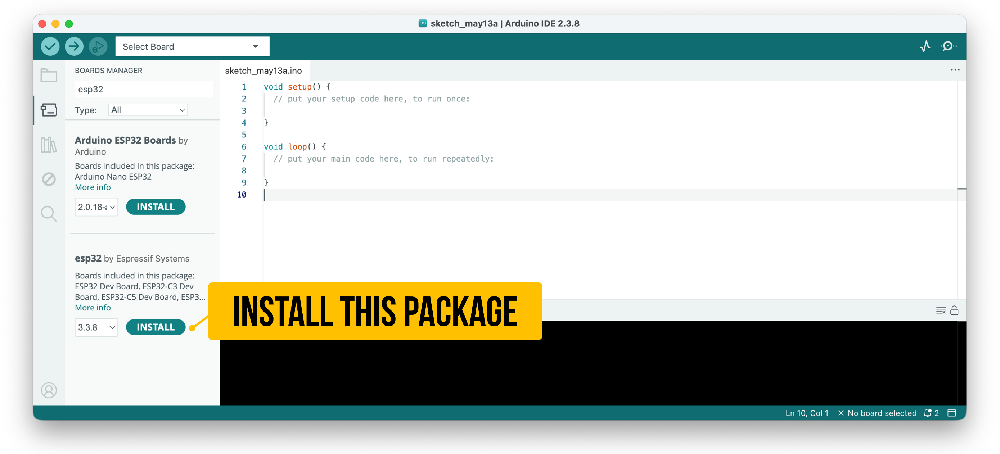
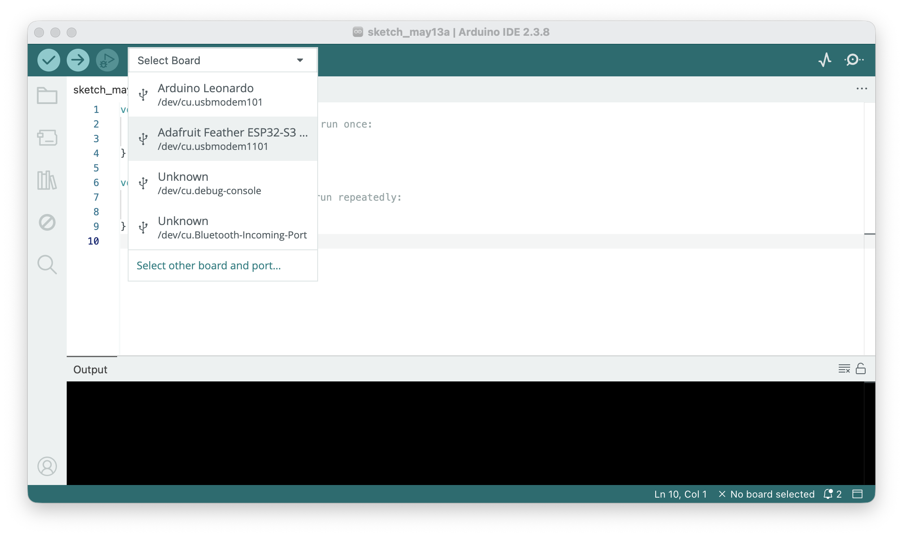
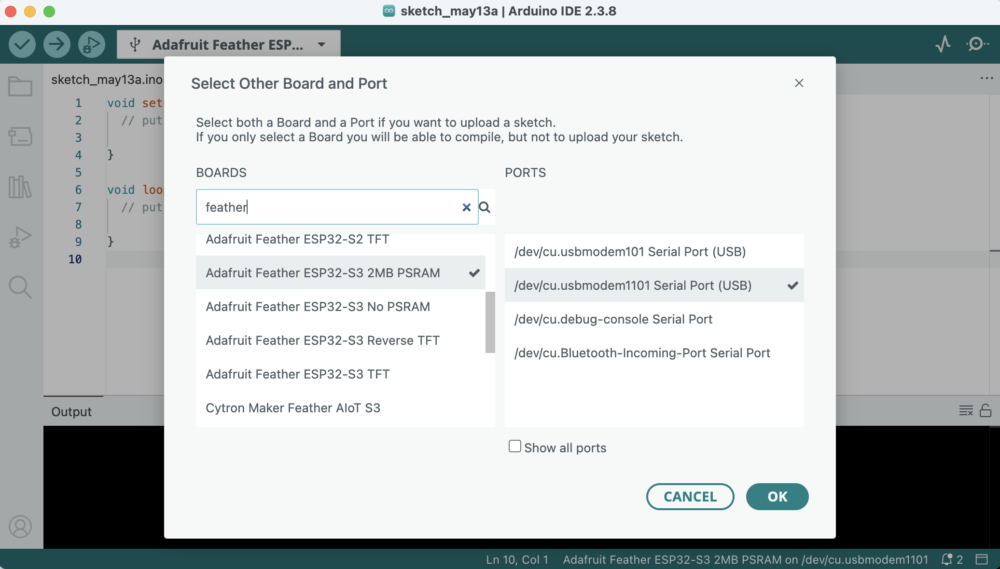
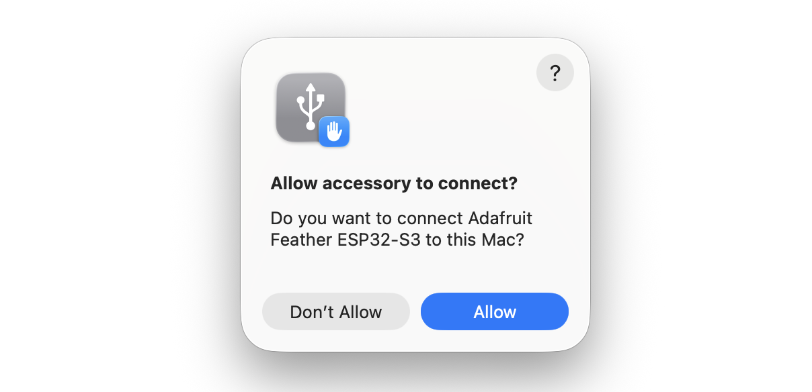

# Setting Up the Arduino IDE for ESP32
{: .no_toc }

## Table of Contents
{: .no_toc .text-delta }

1. TOC
{:toc}
---

{: .note }
> **In this guide, you will learn:**
> - How to add the ESP32 board support package to the Arduino IDE
> - How to select the correct board and port for your ESP32
> - How to upload a test sketch and verify your setup
> - How to troubleshoot common connection and upload issues
> - The key API differences between ESP32 Arduino core v2.x and v3.x

<video autoplay loop muted playsinline aria-label="Workbench video showing the Adafruit ESP32-S3 being plugged in and runinng the RGB cross-fade">
  <source src="assets/videos/PluggingInESP32-IMG_9319-TrimmedCroppedMuted.mp4" type="video/mp4">
</video>
**Video.** When you first power on the [Adafruit ESP32-S3](https://www.adafruit.com/product/5477), it runs a RGB cross-fade program that lights up the built-in NeoPixel LED on the ESP32-S3. Note: once you program the ESP32-S3 for the first time, you'll overwrite this program.
{: .fs-1 }

This page walks through setting up the Arduino IDE to program ESP32 boards. If you haven't already, make sure you've installed the [Arduino IDE 2](https://www.arduino.cc/en/software) and reviewed our [Arduino IDE setup page](../arduino/arduino-ide.md)—the basics of the IDE (editor layout, `setup()`/`loop()`, selecting ports) are the same.

## Step 1: Add the ESP32 board support package

The Arduino IDE doesn't include ESP32 support by default—you need to add Espressif's board support package.

1. Open the Arduino IDE
2. Go to **File → Preferences** (or **Arduino → Settings** on macOS)
3. In the **Additional Board Manager URLs** field, add:
   
   ```
   https://raw.githubusercontent.com/espressif/arduino-esp32/gh-pages/package_esp32_index.json
   ```
   {: .fs-1 }

   If you already have other URLs (such as the Adafruit AVR boards URL), separate them with commas.
4. Click **OK**
5. Open **Tools → Board → Boards Manager** (or click the Boards Manager icon in the left sidebar)
6. Search for `esp32` and install the **esp32 by Espressif Systems** package. This may take a few minutes—it's a large download.

<video loop controls playsinline style="margin:0px" aria-label="Video showing how to install the ESP32 with the Arduino IDE board manager">
  <source src="assets/videos/MacOS_ArduinoIDE_InstallingESP32Library_EditedAndCropped.mp4" type="video/mp4" />
</video>
**Video.** A screen recording of installing the ESP32 board in the Arduino IDE.
{: .fs-1 }

{: .important }
> **Which version of the ESP32 Arduino core?** As of Spring 2026, the ESP32 Arduino core is at version **3.x** (specifically 3.3.8 at time of writing). You can see the full changelog on the [GitHub releases page](https://github.com/espressif/arduino-esp32/releases). If you previously installed version 2.x, we recommend updating—the PWM and tone APIs changed significantly between v2 and v3. We'll note these API differences in the relevant lessons ([LED Fade](led-fade.md), [Tone](tone.md)).

{: .warning }
> You may notice **two** ESP32 packages in the Boards Manager: **"Arduino ESP32 Boards" by Arduino** and **"esp32" by Espressif Systems**. These are different! The "Arduino ESP32 Boards" package only supports official Arduino-manufactured ESP32 boards (like the Arduino Nano ESP32). For the Adafruit ESP32-S3 Feather, Huzzah32, and most third-party ESP32 boards, you need **"esp32" by Espressif Systems**.


**Figure.** The Arduino IDE Boards Manager showing two ESP32 packages. Install **"esp32" by Espressif Systems** (v3.x)—not "Arduino ESP32 Boards," which only supports official Arduino-branded ESP32 boards.
{: .fs-1 }

## Step 2: Select your board

Plug in your ESP32 board via USB. In Arduino IDE 2.x, you can select both the board and port from the **unified dropdown** at the top of the editor window—the IDE will often auto-detect your board. You can also use the traditional **Tools → Board → esp32** menu. Select the board that matches your hardware:

- **ESP32-S3 Feather** (4MB Flash, 2MB PSRAM, PID 5477): select **"Adafruit Feather ESP32-S3 2MB PSRAM"**
- **Huzzah32** (original ESP32): select **"Adafruit ESP32 Feather"**


**Figure.** Selecting an Adafruit ESP32 board in the Arduino IDE board menu.
{: .fs-1 }

{: .warning }
> **Selecting the wrong board** is one of the most common causes of upload failures and mysterious crashes. The ESP32-S3 Feather with 2MB PSRAM is a *different* board entry than the ESP32-S3 Feather with no PSRAM (PID 5323). Make sure the board name matches your exact hardware.

## Step 3: Select the port

If you used the unified dropdown in Step 2, the port may already be selected. Otherwise, select the correct serial port under **Tools → Port**:
- **Windows:** `COM#` (e.g., `COM3`)
- **macOS:** `/dev/cu.usbmodem#` (ESP32-S3) or `/dev/cu.SLAB_USBtoUART` (Huzzah32)
- **Linux:** `/dev/ttyACM#` (ESP32-S3) or `/dev/ttyUSB#` (Huzzah32)


**Figure.** To explicitly select both the board and port, click on "Select other board and port..." in the board menu drop down.
{: .fs-1 }

{: .note }
> **macOS users (Ventura 13+):** The first time you plug in your ESP32, macOS will show an **"Allow accessory to connect?"** dialog identifying the board and asking to connect. Click **Allow**—otherwise the board won't appear as a serial port. This is a macOS security feature for USB data accessories and only appears once per device.
>
> 
> **Figure.** On the Mac, you might get a security dialog asking "Allow accessory to connect?". Select "yes."
> {: .fs-1 }

{: .note }
> **ESP32-S3 Feather:** This board has **native USB**, so it should appear as a serial port automatically—no driver installation needed on any operating system.
>
> **Huzzah32:** This board uses a **CP2104 USB-to-UART bridge** chip. On **macOS 11 (Big Sur) and later**, Apple includes a native driver via DriverKit, so the board should work without installing anything. On **older macOS versions or Windows**, you may need to install the [Silicon Labs CP210x driver](https://www.silabs.com/developers/usb-to-uart-bridge-vcp-drivers). Linux typically includes the driver by default.

## Step 4: Upload a test sketch

To verify everything works, upload the built-in **Blink** example:

1. Open **File → Examples → 01.Basics → Blink**
2. Click the **Upload** button (→ arrow)
3. Wait for "Done uploading" in the status bar
4. The red LED on **Pin 13** (`LED_BUILTIN`) should blink on and off

🎉 If you see the LED blinking, congratulations—your ESP32 is ready to go!

{: .important }
> On some ESP32-S3 boards, you may need to **press the Reset button** after uploading for the code to start running. This is a [known issue](https://github.com/espressif/arduino-esp32/issues) in the ESP32 Arduino core.

### ESP32 blink built-in RGB LED

You could also try to blink the built-in RGB LED that is available on some ESP32-S3 boards, including the Adafruit ESP32-S3 Feather.

1. Open **File → Examples → ESP32 → GPIO → BlinkRGB** 
2. Click the **Upload** button (→ arrow)
3. Wait for "Done uploading" in the status bar
4. The built-in RGB LED will flash white, off, red, green, blue, off and cycle.

## Troubleshooting

### Board doesn't appear in the port list

- **Check your USB cable.** Some cheap cables are power-only and don't include data wires. Try a different cable. This is the #1 cause of "invisible" boards.
- **ESP32-S3:** Try pressing the **Reset** button. If that doesn't work, enter the ROM bootloader manually: hold **BOOT**, press and release **Reset**, then release **BOOT**. The board should now appear as a port. (If the board isn't plugged in yet, you can also hold BOOT while plugging in the USB cable, then release BOOT.)
- **Huzzah32:** Make sure you've installed the [CP210x driver](https://www.silabs.com/developers/usb-to-uart-bridge-vcp-drivers).
- **Linux users:** You may need to add your user to the `dialout` group: `sudo usermod -aG dialout $USER` (then log out and back in). On Arch/Manjaro, use the `uucp` group instead.

### "bad CPU type in executable" on Apple Silicon Macs

If you see a compilation error like `fork/exec .../ctags: bad CPU type in executable` or similar for `avr-g++`, the Arduino toolchain includes x86-only binaries that can't run natively on Apple Silicon (M1–M4). This affects **all boards**, not just ESP32. Install Apple's Rosetta 2 translation layer by opening Terminal and running:

```
softwareupdate --install-rosetta
```

This is a one-time install (~150 MB) and takes under a minute. Newer Apple Silicon Macs may not have Rosetta preinstalled since fewer apps require it now—so this error is especially common on fresh machines.

### Upload fails with timeout or connection error

- Verify the correct **board** and **port** are selected (see [Step 2](#step-2-select-your-board) and [Step 3](#step-3-select-the-port)).
- Close any other programs that might be using the serial port (Serial Monitor in another IDE window, PuTTY, screen, etc.).
- Try lowering the upload speed: **Tools → Upload Speed → 115200**.
- For the ESP32-S3: hold **BOOT**, press and release **Reset**, then release BOOT. Click Upload while the board is in bootloader mode.

### Code uploads but nothing happens

- Press the **Reset** button on the board.
- Check that `LED_BUILTIN` is defined for your board. On the ESP32-S3 Feather, `LED_BUILTIN` is GPIO 13. You can verify by replacing `LED_BUILTIN` with `13` in your Blink sketch.
- Open **Tools → Serial Monitor** at 115200 baud—look for error messages or boot logs.

### "A fatal error occurred: Failed to connect to ESP32"

This usually means the board is stuck or the bootloader can't be reached. Try the BOOT-button method described above. If that doesn't work, try a different USB port or cable.

### Decoding crash errors in Serial Monitor

If your ESP32 crashes, you'll see a "Guru Meditation Error" followed by a register dump and hex backtrace in the Serial Monitor. This looks alarming but is actually useful—it contains the exact location of the crash. To decode it into human-readable file names and line numbers, you can use an exception decoder tool. Unfortunately, the tooling situation is fragmented as of 2026: the [original EspExceptionDecoder](https://github.com/me-no-dev/EspExceptionDecoder) only works with the legacy Arduino IDE 1.x, and the [dankeboy36 fork](https://github.com/dankeboy36/esp-exception-decoder) has shifted its focus to VS Code. If you use VS Code with PlatformIO or the Arduino extension, the dankeboy36 decoder works well. For Arduino IDE 2.x users, you may need to [manually install a 1.x VSIX release](https://github.com/dankeboy36/esp-exception-decoder/tree/1.1.1). Alternatively, if you have [ESP-IDF](https://docs.espressif.com/projects/esp-idf/en/stable/esp32/get-started/index.html) installed, the [`idf.py monitor`](https://docs.espressif.com/projects/esp-idf/en/stable/esp32/api-guides/tools/idf-monitor.html) command automatically decodes backtraces in real time.

<!-- TODO: potentially revisit this when Arduino IDE 2.x or 3.x improves plugin support -->

## ESP32 Arduino core version: v2 vs. v3

If you're following older ESP32 tutorials online, be aware that the **ESP32 Arduino core API changed significantly** between version 2.x and 3.x. The most impactful changes for our lessons:

| Feature | v2.x API | v3.x API |
|---|---|---|
| PWM setup | `ledcSetup(channel, freq, bits)` + `ledcAttachPin(pin, channel)` | `ledcAttach(pin, freq, bits)` |
| PWM write | `ledcWrite(channel, duty)` | `ledcWrite(pin, duty)` |
| Tone | `ledcWriteTone(channel, freq)` | `ledcWriteTone(pin, freq)` |
| `tone()` | Not available | ✅ Supported (wrapper around LEDC) |
| `analogWrite()` | Not available | ✅ Supported (wrapper around LEDC) |

In v3.x, the **channel abstraction was removed** from the public API. You now attach PWM directly to a pin rather than configuring a channel first. This is simpler but means old v2.x code won't compile without changes. We'll cover this in detail in [Lesson 3: Fading an LED](led-fade.md) and [Lesson 5: Playing Tones](tone.md).

{: .note }
> To check which version you have installed, go to **Tools → Board → Boards Manager**, search for `esp32`, and look at the version number next to "esp32 by Espressif Systems."

## Summary

In this guide, you installed the ESP32 board support package in the Arduino IDE, selected your board and port, uploaded a test sketch, and verified everything works. You also learned the key differences between the v2.x and v3.x ESP32 Arduino core APIs—particularly the simplified PWM and tone functions in v3.x. If you ran into issues, the troubleshooting section above covers the most common problems.

With your IDE set up, you're ready to start building ESP32 projects!

## Next Step

Head back to [Lesson 1: Introduction to the ESP32](esp32.md) to learn about the hardware, or jump straight to [Lesson 2: Blinking an LED](led-blink.md) if you're ready to write code.

<span class="fs-6">
[Back to: Introduction to the ESP32](esp32.md){: .btn .btn-outline }
</span>