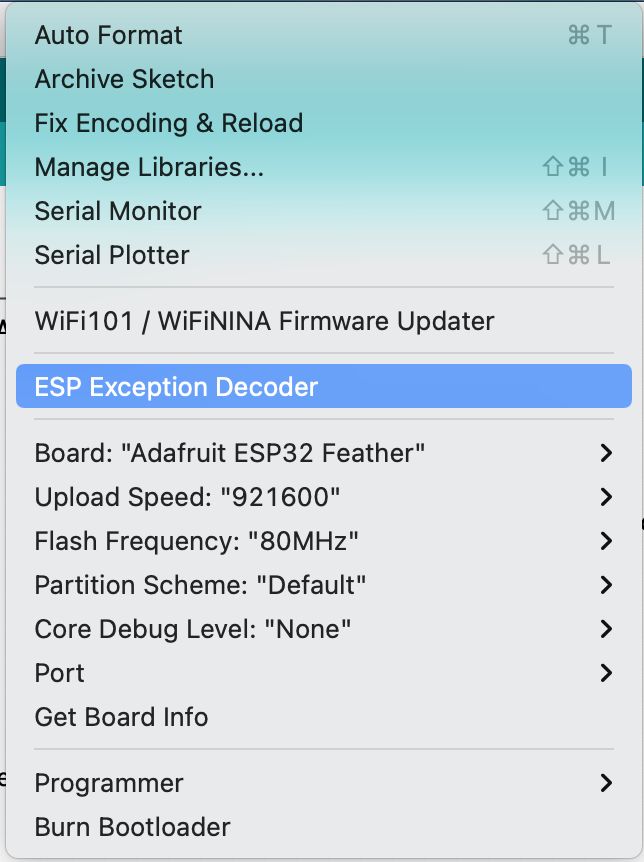
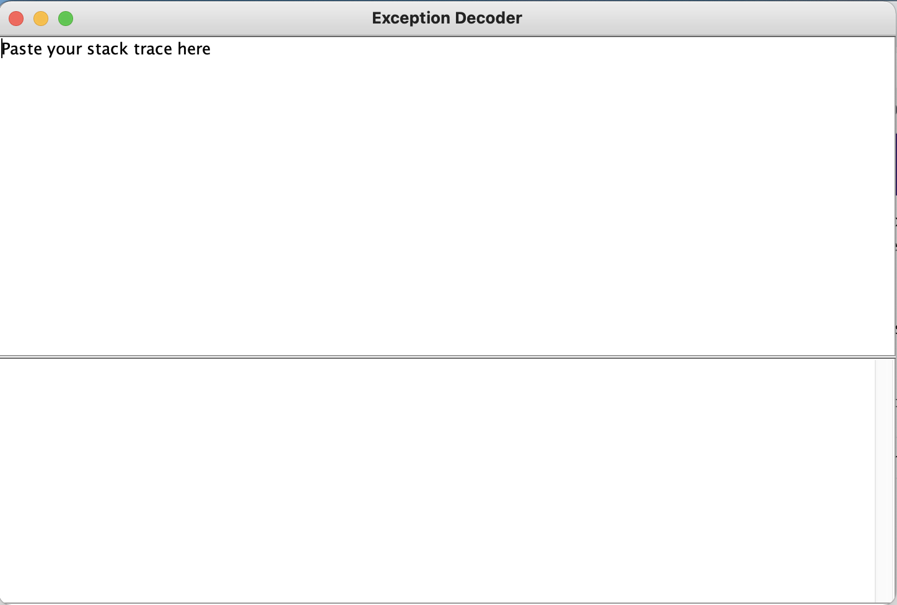

# {{ page.title }}
{: .no_toc }

## Table of Contents
{: .no_toc .text-delta }

1. TOC
{:toc}
---

We have collected some ESP32 tips-and-tricks below.

## Decoding errors in Serial Monitor

The ESP32 spits out fairly thorough exceptions, errors, and stack traces into Serial Monitor. For example:

```
⸮Guru Meditation Error: Core 1 panic'ed (LoadProhibited). 
Exception was unhandled. Core 1 register dump: 
 PC : 0x40080f85 PS : 0x00060530 A0 : 0x800d1a1a A1 : 0x3ffb1f60
 A2 : 0x00000009 A3 : 0x00000002 A4 : 0x0800001c A5 : 0x00000003
 A6 : 0x00000003 A7 : 0x00000000 A8 : 0x3f401048 A9 : 0xffffffff
 A10 : 0xffffffff A11 : 0x00000054 A12 : 0x08000000 A13 : 0x4a000000
 A14 : 0xffffffff A15 : 0x00000000 SAR : 0x0000001a EXCCAUSE: 0x0000001c
 EXCVADDR: 0xffffffff LBEG : 0x00000000 LEND : 0x00000000 LCOUNT : 0x00000000

ELF file SHA256: 0000000000000000

Backtrace: 0x40080f85:0x3ffb1f60 0x400d1a17:0x3ffb1f80 0x400d4f2e:0x3ffb1fb0 0x400869bd:0x3ffb1fd0

Rebooting...
```

To help decode these messages, you can install the [EspExceptionDecoder](https://github.com/me-no-dev/EspExceptionDecoder). This tip was submitted by CSE490 student W.Q. Thank you!

### Step 1: Install EspExceptionDecoder

Follow the installation instructions in the [README.md](https://github.com/me-no-dev/EspExceptionDecoder).

### Step 2: Select "ESP Exception Decoder" from Tools menu

Then, open the Arduino IDE. Under the `Tools` menu, there will be a new option called `ESP Exception Decoder`. See screenshot below.


{: .mx-auto .align-center }

**Figure.** The [EspExceptionDecoder](https://github.com/me-no-dev/EspExceptionDecoder) option in the Arduino IDE Tools menu. 
{: .fs-1 }

### Step 3: Copy/paste your stack error trace

Clicking on this option will open a new window where you can copy/paste the error message:


{: .mx-auto .align-center }

**Figure.** The [EspExceptionDecoder](https://github.com/me-no-dev/EspExceptionDecoder) window in the Arduino IDE.
{: .fs-1 }

When we pasted the stack trace from above, the exception decoder generated the following message:

```
PC: 0x40080f85: __pinMode at /Users/user/Library/Arduino15/packages/esp32/hardware/esp32/1.0.6/cores/esp32/esp32-hal-gpio.c line 115
EXCVADDR: 0xffffffff

Decoding stack results
0x40080f85: __pinMode at /Users/user/Library/Arduino15/packages/esp32/hardware/esp32/1.0.6/cores/esp32/esp32-hal-gpio.c line 115
0x400d1a17: showLoadScreen() at /Users/user/Desktop/GitProjects/490f-playground/BreakIt32/BreakIt32.ino line 525
0x400d4f2e: spiInitBus at /Users/user/Library/Arduino15/packages/esp32/hardware/esp32/1.0.6/cores/esp32/esp32-hal-spi.c line 396
0x400869bd: vPortTaskWrapper at /home/runner/work/esp32-arduino-lib-builder/esp32-arduino-lib-builder/esp-idf/components/freertos/port.c line 143
```

In this particular case, the messages states that there is an error on Line 525 of the user's code in the showLoadScreen() method. Indeed, upon investigation, the student found that they were using the wrong pin number and fixed this by re-examining the Huzzah32 pin diagram and updating the pin.
