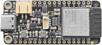

# {{ page.title | replace_first:'L','Lesson '}}
{: .no_toc }

## Table of Contents
{: .no_toc .text-delta }

1. TOC
{:toc}
---

<!-- Content TODOs:
1. Make blink example
2. Make fade example. Show PWM
3. Analog input
4. Make touch sensor example?
5. Show off WiFi? And/or bluetooth?
6.  -->

<!-- See also https://randomnerdtutorials.com/esp32-adc-analog-read-arduino-ide/ -->

Image from [makeradvisor.com](https://makeradvisor.com/esp32-development-boards-review-comparison/). There are literally dozens of ESP32 boards. Search online for comparisons (*e.g.,* [link](https://makeradvisor.com/esp32-development-boards-review-comparison/)).
{: .fs-1 } 

The [ESP32](https://en.wikipedia.org/wiki/ESP32) is a low-cost, "system-on-a-chip" board with integrated WiFi, Bluetooth, ultra-low power consumption, and a fast microprocessor created by [Espressif](https://www.espressif.com/en/products/socs/esp32). The ESP32 is the successor to Espressif's massively successful [ESP8266](https://en.wikipedia.org/wiki/ESP8266) but is far more powerful and feature rich.

The original ESP32 was released in 2016 but since then there have been dozens of variants and updates created by Espressif. The latest board is the ESP32-S3 released in 2020, which features a dual-core Xtensa® 32-bit LX7 running up to 240MHz, has built-in WiFi and Bluetooth, up to 8MB flash memory, and lots of peripheral support. In addition, there are now micro-variants like the [ESP32-C series](https://www.espressif.com/en/products/devkits/esp32-devkitc), which have smaller footprints. See [Espressif's product comparison tool](https://products.espressif.com/#/product-comparison).

<!-- The ESP32 is far more powerful than the ESP8266 as well as the 16-bit microcontrollers in the Arduino Uno or Leonardo—which we used in our [introductory lessons](../arduino/). -->

<!-- There are literally dozens of ESP32 boards on the market, including Adafruit's [ESP32 series](https://www.adafruit.com/product/3405) and Sparkfun's [ESP32 series](https://www.sparkfun.com/products/13907). Search online for comparisons (*e.g.,* [link](https://makeradvisor.com/esp32-development-boards-review-comparison/)). -->

### Programming environment

You can program the ESP32 in variety of languages and programming environments, including C/C++, [Micropython](https://github.com/pvanallen/esp32-getstarted), [Lua](https://nodemcu.readthedocs.io/en/dev-esp32/), and more. The ESP32 is completely **independent** of the Arduino ecosystem. Just as you don't have to use Arduino to program the ATmega328P (used in the Arduino Uno) or the ATmega32U4 (found in the Arduino Leonardo), you don't have to use Arduino to program the ESP32.

For our learning series, however, we *will* be using Arduino to program the ESP32—and so most of our [prior learning](../arduino/) will directly transfer (woohoo! 🎉). We can use Arduino to program the ESP32 because Espressif has created an [open-source Arduino core](https://github.com/espressif/arduino-esp32) for the ESP32 series. See [Espressif's official "Getting Started" guide](https://docs.espressif.com/projects/arduino-esp32/en/latest/getting_started.html). Note: not all of ESP32's functionality is exposed via this library, you can see [limitations here](https://docs.espressif.com/projects/arduino-esp32/en/latest/libraries.html).

If you want to try and program your ESP32 *without* Arduino, follow the [Espressif ESP-IDF Programming Guide ](https://docs.espressif.com/projects/esp-idf/en/stable/esp32/get-started/index.html). We have never done this, so this approach is beyond the scope of our learning series.

<!-- For non-Arduino options, you can use Espressif's IoT Development Framework ([IDF](https://docs.espressif.com/projects/esp-idf/en/latest/esp32/)) or [VSCode with PlatformIO](https://docs.platformio.org/en/latest/tutorials/espressif32/arduino_debugging_unit_testing.html). Many ESP32 boards have Arduino libraries so you can also use the [Arduino IDE](https://www.arduino.cc/en/main/software), which is what we will do. This greatly simplifies programming the ESP32 (but at a cost of flexibility and efficiency). -->

## Comparison Table

Here's a comparison table of the Arduino Uno Rev3 and ESP32s derived from [Espressif's official documentation](https://docs.espressif.com/projects/esp-idf/en/v5.0/esp32s3/hw-reference/chip-series-comparison.html) and this [comparison table on GitHub Gist](https://gist.github.com/sekcompsci/2bf39e715d5fe47579fa184fa819f421).

{: .note }
While there are many differences between the Arduino Uno/Leonardo and the ESP32, a major one is that the ESP32s run at 3.3V rather than 5V. This has implications for how you interface with electronic components via the GPIO pins.

|Feature|Arduino Uno|ESP32|ESP32-S2|ESP32-S3|
|--- |--- |--- |--- |--- |
|Launch year|2010|2016|2020|2020|
|Datasheet| [Uno Datasheet (PDF)](https://www.arduino.cc/en/uploads/Main/Arduino_Uno_Rev3.pdf) | [ESP Datasheet (PDF)](https://espressif.com/sites/default/files/documentation/esp32_datasheet_en.pdf) | [ESP-S2 Datasheet (PDF)](https://www.espressif.com/sites/default/files/documentation/esp32-s2_datasheet_en.pdf) | [ESP-S3 Datasheet (PDF)](https://www.espressif.com/sites/default/files/documentation/esp32-s3_datasheet_en.pdf) |
|Core|ATmega328P|Xtensa® dual-/single core 32-bit LX6|Xtensa® single-core 32-bit LX7|Xtensa® dual-core 32-bit LX7|
|Wi-Fi protocols|✖️|802.11 b/g/n, 2.4 GHz|802.11 b/g/n, 2.4 GHz|802.11 b/g/n, 2.4 GHz|
|Bluetooth®|✖️|Bluetooth v4.2 & BLE |✖️|Bluetooth 5.0|
|Typical frequency|16 MHz|240 MHz|240 MHz|240 MHz|
|SRAM|2 KB|520 KB|320 KB|512 KB|
|ROM|32 KB|448 KB |128 KB |384 KB |
|Embedded flash|32 KB|2 MB, 4 MB, or none|2 MB, 4 MB, or none|8 MB or none|
|External flash|✖️|Up to 16 MB device|Up to 1 GB device|Up to 1 GB device|
|External RAM|✖️|Up to 8 MB device|Up to 1 GB device|Up to 1 GB device|

And peripheral support. Note that the ADCs on the ESP32s are 12-bit rather than 10-bit so they ostensibly provide far more analog-to-digital precision: 3.3V is linearly divided across 0-4095 (10 bits).

|Peripherals|Arduino Uno|ESP32|ESP32-S2|ESP32-S3|
|--- |--- |--- |--- |--- |
|ADC|One 10-bit, 6 channels|Two 12-bit, 18 channels|Two 12-bit, 20 channels|Two 12-bit SAR ADCs, 20 channels|
|DAC|✖️|Two 8-bit channels|Two 8-bit channels|✖️|
|Timers|Three 16-bit|Four 64-bit|Four 64-bit|Four 54-bit|
|Watchdog Timers|1|Three|Three|Three|
|Temperature sensor|✖️|✖️|1|1|
|Touch sensor|✖️|10|14|14|
|Hall sensor|✖️|1|✖️|✖️|
|GPIO|14|34|43|45|
|SPI|1|4|4|4|
|LCD interface|✖️|1|1|1|
|UART|1|3|2|3|
|I2C|1|2|2|2|
|I2S|✖️|2, can be configured to operate with 8/16/32/40/48-bit resolution as an input or output channel.|1, can be configured to operate with 8/16/24/32/48/64-bit resolution as an input or output channel.|2, can be configured to operate with 8/16/24/32-bit resolution as an input or output channel.|
|Camera interface|✖️|1|1|1|
|Pulse counter|✖️|8 channels|4 channels|4 channels|
|LED PWM|✖️|16 channels|8 channels|8 channels|
|Motor Control PWM|✖️|2, six PWM outputs|✖️|2, six PWM outputs|

<!-- |Feature|ESP32 Series|ESP32-S2 Series|ESP32-S3 Series|
|--- |--- |--- |--- |
|Launch year|2016|2020|2020|
|Datasheet| [ESP Datasheet (PDF)](https://espressif.com/sites/default/files/documentation/esp32_datasheet_en.pdf) | [ESP-S2 Datasheet (PDF)](https://www.espressif.com/sites/default/files/documentation/esp32-s2_datasheet_en.pdf) | [ESP-S3 Datasheet (PDF)](https://www.espressif.com/sites/default/files/documentation/esp32-s3_datasheet_en.pdf) |
|Core|Xtensa dual-/single core 32-bit LX6|Xtensa single-core 32-bit LX7|Xtensa dual-core 32-bit LX7|
|Wi-Fi protocols|802.11 b/g/n, 2.4 GHz|802.11 b/g/n, 2.4 GHz|802.11 b/g/n, 2.4 GHz|
|Bluetooth®|Bluetooth v4.2 & Bluetooth LE |✖️|Bluetooth 5.0|
|Typical frequency|240 MHz|240 MHz|240 MHz|
|SRAM|520 KB|320 KB|512 KB|
|ROM|448 KB |128 KB |384 KB |
|Embedded flash|2 MB, 4 MB, or none|2 MB, 4 MB, or none|8 MB or none|
|External flash|Up to 16 MB device|Up to 1 GB device|Up to 1 GB device|
|External RAM|Up to 8 MB device|Up to 1 GB device|Up to 1 GB device|
|**Peripherals**||||
|ADC|Two 12-bit, 18 channels|Two 12-bit, 20 channels|Two 12-bit SAR ADCs, 20 channels|
|DAC|Two 8-bit channels|Two 8-bit channels|✖️|
|Timers|Four 64-bit general-purpose timers|Four 64-bit general-purpose timers|Four 54-bit general-purpose timers|
|Watchdog Timers|Three|Three|Three|
|Temperature sensor|✖️|1|1|
|Touch sensor|10|14|14|
|Hall sensor|1|✖️|✖️|
|GPIO|34|43|45|
|SPI|4|4|4|
|LCD interface|1|1|1|
|UART|3|2|3|
|I2C|2|2|2|
|I2S|2, can be configured to operate with 8/16/32/40/48-bit resolution as an input or output channel.|1, can be configured to operate with 8/16/24/32/48/64-bit resolution as an input or output channel.|2, can be configured to operate with 8/16/24/32-bit resolution as an input or output channel.|
|Camera interface|1|1|1|
|Pulse counter|8 channels|4 channels|4 channels|
|LED PWM|16 channels|8 channels 1|8 channels|
|Motor Control PWM|2, six PWM outputs|✖️|2, six PWM outputs| -->

## The Adafruit ESP32 Series

For our tutorial series, we will be using **Adafruit's ESP32 boards**. Specifically, Adafruit's original ESP32 board called the [Huzzah32 ESP32 Feather](https://www.adafruit.com/product/3405), which came out in May 2017, as well as [Adafruit's ESP32-S3](https://www.adafruit.com/product/5477) board released in Nov, 2021.

<!-- This board is built on Espressif's [ESP32 WROOM](https://www.espressif.com/en/products/modules/esp-wroom-32/overview) module.  -->

While you can find (far) cheaper ESP32 alternatives on [AliExpress](https://www.aliexpress.com/w/wholesale-esp32.html) or [Amazon](https://www.amazon.com/s?k=esp+32+board)—down to only a few dollars—Adafruit produces reliable, high-quality products and has good customer support (check out the [Adafruit forums](https://forums.adafruit.com/)). In addition, just as the Arduino Uno's standardized form factor created an eco-system of [stackable expansion boards](https://learn.sparkfun.com/tutorials/arduino-shields-v2) so too has **Adafruit created stackable shields** for "Feather"-compatible boards like the ESP32. Adafruit calls these expansion boards Wings—see [a listing here](https://www.adafruit.com/category/814) and an overview of the [FeatherWings here](https://learn.adafruit.com/adafruit-feather/featherwings)). For example, you can add an [MP3 Player FeatherWing](https://www.adafruit.com/product/3357), [a GPS FeatherWing](https://www.adafruit.com/product/3133), or a [DC Motor FeatherWing](https://www.adafruit.com/product/2927), to name a few.

Regardless of which ESP32 board you use, our tutorial series should help. Note, however, that pin locations may be different.

### The Adafruit ESP32 Specs

| Name | Arduino Uno | Adafruit ESP32 | Adafruit ESP32-S3 |
| ---- | ----------- | -------- | ----------------- |
| Image |  |  |  |
| Store | [Arduino](https://store.arduino.cc/arduino-uno-rev3) | [Adafruit](https://www.adafruit.com/product/3405) | [Adafruit](https://www.adafruit.com/product/5477) |
| Microcontroller | 8-bit, 16 MHz [ATmega328P](https://www.microchip.com/wwwproducts/en/ATmega328) | 32-bit, 240 MHz dual core Tensilica LX6 | 32-bit, 240 MHz dual core Tensilica LX7 |
| Input voltage (limit) | 6-20V | Use either USB (5V) or 3.7V LiPoly | 5V (via USB) or 3.7V (LiPoly) |
| Operating voltage | 5V | 3.3V | 3.3V |
| Flash memory | 32KB | 4MB | Up to 8MB |
| SRAM | 2KB | 520KB | Up to 2MB |
| GPIO pins | 14 | 21 | 25 |
| PWM pins | 6 | All | All |
| Analog inputs | 6 | 14 | 20 |
| Wi-Fi | N/A | 802.11b/g/n HT40 Wi-Fi transceiver | 802.11b/g/n HT40 Wi-Fi transceiver |
| Bluetooth | N/A | Dual mode (classic and BLE) | Bluetooth 5.0 (LE) |
| USB Connection | Type-B (rectangular connection used on printers) | MicroUSB | USB-C |

<!-- | Name | Arduino Uno | Huzzah32 |
| ---- | ----------- | -------- |
| Image |  |  |
| Microcontroller | 8-bit, 16 MHz [ATmega328P](https://www.microchip.com/wwwproducts/en/ATmega328) | 32-bit, 240 MHz dual core Tensilica LX6 |
| Microcontroller Manufacturer | Microchip (Atmel) | Espressif |
| System-on-a-chip | N/A | [ESP32](https://www.espressif.com/sites/default/files/documentation/esp32_datasheet_en.pdf) |
| Input voltage (limit) | 6-20V | Use either USB (5V) or LiPoly (3.7/4.2V) |
| Operating voltage | 5V | 3.3V |
| Flash memory | 32KB (0.5KB used by bootloader) | 4MB |
| SRAM | 2KB | 520KB |
| GPIO pins | 14 | 21 |
| PWM pins | 6 | All |
| Analog inputs | 6 | 14 |
| Wi-Fi | N/A | 802.11b/g/n HT40 Wi-Fi transceiver |
| Bluetooth | N/A | Dual mode (classic and BLE) | -->

<!-- Recall that flash memory is where your compiled program is stored and SRAM is where your microcontroller creates and manipulates variables when it runs. -->

<!-- The ESP32 also has 2xI2S Audio, 2xDAC, 2xI2C (only one configured by default in the Feather Arduino IDE support), 3xSPI (only one configured by default in Feather IDE support). See [Adafruit overview](https://learn.adafruit.com/adafruit-huzzah32-esp32-feather/overview). -->

Unlike the ATmega chips used in the Uno and Leonardo, there is a hardware floating point unit (FPU) on the ESP32; however, there have been some criticisms about its performance ([link1](https://blog.classycode.com/esp32-floating-point-performance-6e9f6f567a69), [link2](https://www.esp32.com/viewtopic.php?f=14&t=800)). Our understanding is that FPU performance has been improved on the ESP32-S3s (and supports both single and double precision).

The Huzzah32 is **not** designed for external power supplies, so either use the USB port with a [5V 1A USB wall adapter](https://www.adafruit.com/product/501) or by plugging into your computer or a LiPoly battery (3.7/4.2V). Unlike with the Arduino Uno and Leonardo, do not use a 9V battery or you could damage your board!

### ESP32 pin list

The official ESP32 pin list is [here](https://www.espressif.com/sites/default/files/1a-esp32_pin_list_en-v0.1.pdf):

Screenshot of the ESP32 pin list [PDF](https://www.espressif.com/sites/default/files/1a-esp32_pin_list_en-v0.1.pdf).
{: .fs-1 }

In our code, we will reference the pins based on their GPIO number, their analog input number (prefixed by 'A') for analog input, or their touch number (prefixed by 'T') for using capacitive touch sensing. We can always use the GPIO number, however (which is just an integer). The ESP32 [datasheet](https://www.espressif.com/sites/default/files/documentation/esp32_datasheet_en.pdf) often uses the pin name (far left column of the above pin list) to refer to pins.

### Huzzah32 pin diagram

So, what do all of these pins do? Oh, so many things!

The pin diagram for the Huzzah32 in the official Adafruit [docs](https://learn.adafruit.com/adafruit-huzzah32-esp32-feather/pinouts) is pretty confusing. So, we created our own:

See the Adafruit Huzzah32 [docs](https://learn.adafruit.com/adafruit-huzzah32-esp32-feather/pinouts) for details. Right-click and open image in a new tab to zoom in.
{: .fs-1 } 

### Important notes

- The ESP32 runs on **3.3V power and logic**, and unless otherwise specified, GPIO pins are not 5V safe! The **BAT** pin should generally not be used directly as the Huzzah32 has a JST connection for the LiPoly battery. You should most definitely not hook up a 9V connection here.
- There are **21 GPIO pins**; however, on the Huzzah32, pins 34 (A2), 39 (A3), 36 (A4) are not output-capable and thus should only be used for input. So, **18 GPIO pins** in total. Be forewarned: the pins are in a strange order, so read the diagram carefully.
- **PWM** is possible on all 18 GPIO pins
- **14 of the 21 GPIO pins** can be used **analog input pins**; however, A13 is not exposed. It's used for measuring the voltage on the LiPoly battery via a voltage divider. When reading in the battery level using `analogRead(A13)`, make sure to multiply by 2 to get correct reading. Here's an initial program to read and print out the battery level to Serial ([link](https://github.com/makeabilitylab/arduino/blob/master/ESP32/BatteryLevel/BatteryLevel.ino))
- The **ADC resolution is 12 bits** (0-4095). This is in contrast to the Arduino Uno and Leonardo, which uses ATmega chips with 10 bit ADCs (so, 0-1023). Make sure you use the proper max value in your conversions (*e.g.,* using [`map()`](https://www.arduino.cc/reference/en/language/functions/math/map/))
- **GPIO 13** is the `LED_BUILTIN` (the red LED next to micro USB)
- The charging circuit light will flash quickly when there is no LiPoly battery plugged in. It's harmless and doesn't mean anything. This LED will also flash (more slowly) when the battery is plugged in and charging. The battery charges automatically when plugged in and the Huzzah32 is externally powered.
- Only power your Huzzah32 either using the USB plug (max 5V, 1A) or a LiPoly battery (3.7/4.2V)

The Huzzah32 has 21 GPIO pins; however pins 34 (A2), 39 (A3), 36 (A4) are not output-capable. In this animation, we are attempting to fade in/out all 21 GPIO pins and demonstrating that only 18 work for output.
{: .fs-1 } 

### ADC2 is only usable when WiFi not activated

The Adafruit [docs](https://learn.adafruit.com/adafruit-huzzah32-esp32-feather/pinouts) state (somewhat confusingly) that ADC#1 only works when WiFi has started. We empirically tested this (see video below) and found this **not** to be true.  On the other hand, the Espressif [docs](https://docs.espressif.com/projects/esp-idf/en/latest/esp32/api-reference/peripherals/adc.html) state that ADC#2 only works when WiFi has **not** started. We **did** find this to be true. So, we believe the Espressif docs are right and the Adafruit docs are wrong. **Update:** it turns out that the Adafruit docs _are_ accurate but just poorly phrased. Indeed, ADC#1 is the only ADC that works when using WiFi (see [Reddit post](https://www.reddit.com/r/esp32/comments/gav6mw/huzzah32_pin_diagram_draft/)).

Indeed, we empirically tested this. Check out our two programs:
- [AnalogInputTest.ino](https://github.com/makeabilitylab/arduino/blob/master/ESP32/Basics/AnalogInputTest/AnalogInputTest.ino) reads from all analog input pins and prints the values to Serial (so you can view them in Serial Console or Serial Plotter)
- [WiFiAnalogInputTest.ino](https://github.com/makeabilitylab/arduino/blob/master/ESP32/WiFi/WiFiAnalogInputTest/WiFiAnalogInputTest.ino) extends AnalogInputTest but turns on WiFi.

In the following video, I'm using [AnalogInputTest.ino](https://github.com/makeabilitylab/arduino/blob/master/ESP32/Basics/AnalogInputTest/AnalogInputTest.ino) to test all 13 analog input pins (`A0` - `A12`) using a trim potentiometer for input and the Serial Plotter for output.

<iframe width="736" height="414" src="https://www.youtube.com/embed/8BBY-5n4e5A" frameborder="0" allow="accelerometer; autoplay; encrypted-media; gyroscope; picture-in-picture" allowfullscreen></iframe>

<!-- 
Pin diagram from [Zerynth](https://docs.zerynth.com/latest/official/board.zerynth.adafruit_huzzah32/docs/index.html). ICU stands for [Input Capture Unit](https://docs.zerynth.com/official/core.zerynth.stdlib/r2.0.9/icu.html).
{: .fs-1 }  -->

<!-- Another helpful pin diagram: https://people.eecs.berkeley.edu/~boser/courses/49_sp_2019/N_gpio.html#_pin_diagram -->

### Huzzah32 installation instructions for the Arduino IDE

You can follow the [official Adafruit Huzzah32 Arduino IDE installation instructions](https://learn.adafruit.com/adafruit-huzzah32-esp32-feather/using-with-arduino-ide), which we've expanded a bit below.

#### Step 1: Add ESP32 to Arduino Board Manager

1. Open the Arduino IDE

2. Go to Preferences

3. In preferences, find the `Additional Board Manager URLs:` field 

4. Add the ESP32 JSON url `https://raw.githubusercontent.com/espressif/arduino-esp32/gh-pages/package_esp32_index.json`

5. Open the Arduino IDE Board Manager

6. Search for `ESP32` and click `Install`

#### Step 2: Install USB to UART Bridge Virtual COM Port Driver

As noted in the [official Adafruit Huzzah32 Arduino IDE installation instructions](https://learn.adafruit.com/adafruit-huzzah32-esp32-feather/using-with-arduino-ide), the second step is to install the USB to UART Bridge Virtual COM Port (VCP) driver to interface with the ESP32 board. You can download the driver from Windows, Mac, and Linux [here](https://www.silabs.com/products/development-tools/software/usb-to-uart-bridge-vcp-drivers).

#### Step 3: Select "Adafruit ESP32 Feather" in board menu

Once installed, select the `Adafruit ESP32 Feather` in the Board menu.

#### Step 4: Select the appropriate port

Finally, select the appropriate port

## Resources

### Official ESP32 Documentation

- [API Reference](https://docs.espressif.com/projects/esp-idf/en/latest/esp32/api-reference/index.html)
- [API Guides](https://docs.espressif.com/projects/esp-idf/en/latest/esp32/api-guides/index.html)
- [Arduino core for ESP32](https://github.com/espressif/arduino-esp32)

### Other

- [Sparkfun's ESP32 Thing Hookup Guide](https://learn.sparkfun.com/tutorials/esp32-thing-hookup-guide/all). Written for Sparkfun's ESP32 Thing board but has relevant WiFi and BLE examples.

<!-- ## Application ideas
- Connect to WiFi, get the time, print out on OLED. Create a clock?
- Connect to WiFi, download Covid-19 stats, print out on display
- Evidently ESP32 may support Serial.printf? [See link](https://arduino.stackexchange.com/a/53751).

### Sound / VUMeters

- [Using the ESP32's built-in DAC](https://www.reddit.com/r/esp32/comments/bid08m/finally_got_audio_sampling_via_dma_with_no_cpu/)?
- [Streaming music with I2S](https://www.reddit.com/r/esp32/comments/dluvgl/streaming_web_radio_to_esp32_playing_it_using_the/)

### Platform IO for VSCode

- https://docs.platformio.org/en/latest/integration/ide/visualstudio.html
- https://maker.pro/arduino/tutorial/how-to-use-platformio-in-visual-studio-code-to-program-arduino -->

## Next Lesson

In the [next lesson](led-blink.md), you will write your first ESP32 program using the ESP32 Arduino library.

[Next: Blink an LED with ESP32](led-blink.md){: .btn .btn-outline }

