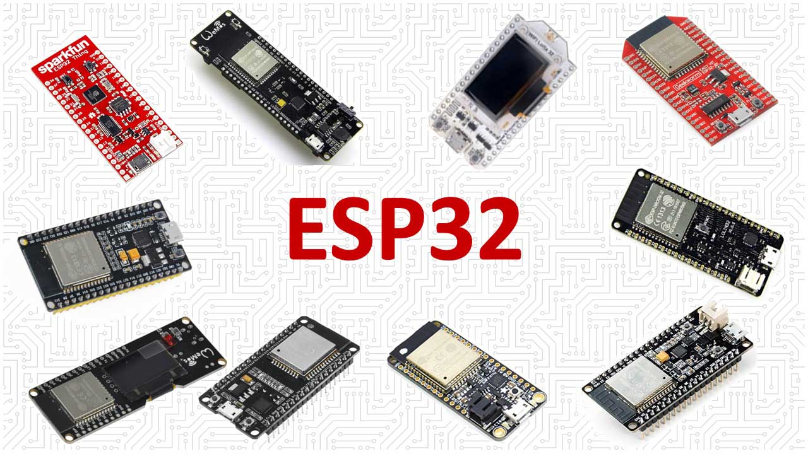
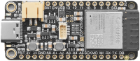
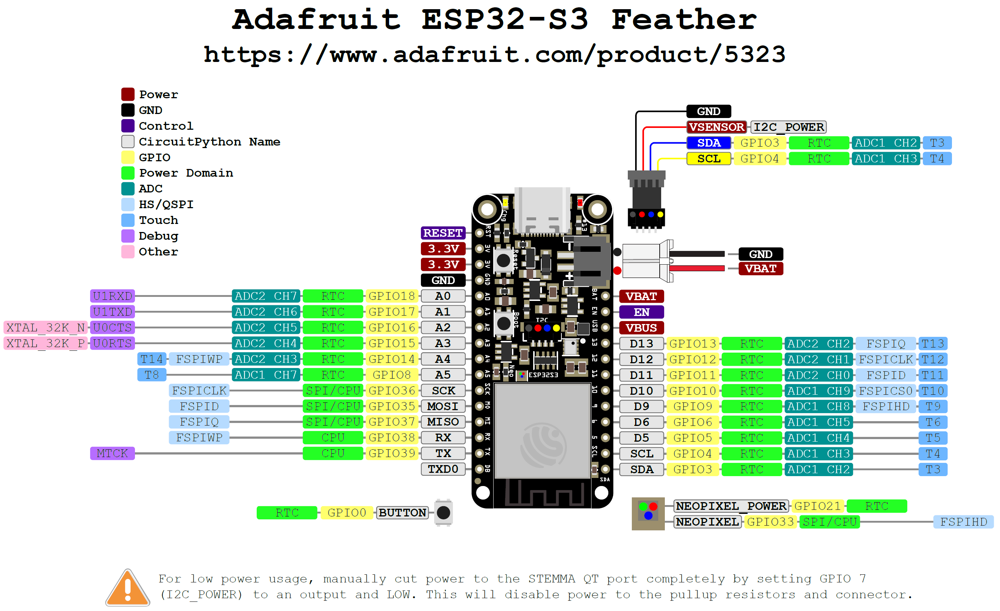
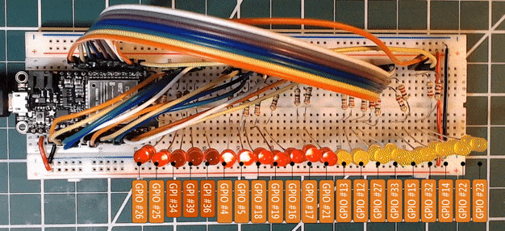
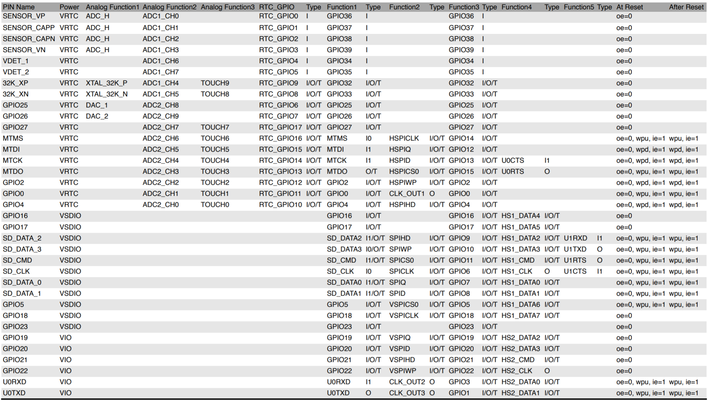

# {{ page.title | replace_first:'L','Lesson '}}
{: .no_toc }

## Table of Contents
{: .no_toc .text-delta }

1. TOC
{:toc}
---

<!-- Content TODOs:
1. Make blink example
2. Make fade example. Show PWM
3. Analog input
4. Make touch sensor example?
5. Show off WiFi? And/or bluetooth?
6.  -->

<!-- See also https://randomnerdtutorials.com/esp32-adc-analog-read-arduino-ide/ -->

<!-- TODO: Add a hero image or animated GIF showing something exciting built with the ESP32
     (e.g., the WiFi sensor dashboard, capacitive touch piano, or NeoPixel BLE controller) -->

**Figure.** There are dozens of ESP32 development boards from Espressif, Adafruit, SparkFun, and others. Image from [makeradvisor.com](https://makeradvisor.com/esp32-development-boards-review-comparison/).
{: .fs-1 }

{: .note }
> **In this lesson, you will learn:**
> - What the ESP32 is and how it compares to the Arduino Uno and Leonardo
> - Key differences between the original ESP32 and the ESP32-S3
> - Why the ESP32 operates at 3.3V (not 5V) and why this matters
> - How to identify pins on the Adafruit ESP32-S3 Feather
> - How to set up the Arduino IDE to program your ESP32

## What is the ESP32?

The [ESP32](https://en.wikipedia.org/wiki/ESP32) is a low-cost "system-on-a-chip" (SoC) with integrated WiFi, Bluetooth, and a powerful microprocessor, created by [Espressif Systems](https://www.espressif.com/en/products/socs/esp32). The original ESP32, released in 2016, succeeded Espressif's hugely popular [ESP8266](https://en.wikipedia.org/wiki/ESP8266) and brought dual-core processing, Bluetooth support, and many more peripherals.

Since then, Espressif has released an entire *family* of ESP32 variants—each optimized for different use cases. The family now includes eleven SoCs: the original ESP32, the S-series (S2, S3) for high-performance applications, the C-series (C2, C3, C5, C6) for cost-effective RISC-V-based IoT, the H-series (H2, H4) for Thread/Zigbee mesh networking, and the P4 for multimedia. See [Espressif's product comparison tool](https://products.espressif.com/#/product-comparison) for details.

For our lessons, we focus on two boards:

- **Adafruit ESP32-S3 Feather** (4MB Flash, 2MB PSRAM) — our **primary board** for Spring 2026. It features a dual-core 240 MHz Tensilica LX7 processor, native USB-C, WiFi, Bluetooth LE 5.0, a STEMMA QT connector, an onboard NeoPixel, and a LiPoly battery monitor.

- **Adafruit Huzzah32 ESP32 Feather** — uses the original ESP32 (dual-core Tensilica LX6). Our earlier Fritzing diagrams and videos reference this board. The concepts and code transfer directly to the S3.

<!-- There are literally dozens of ESP32 boards on the market, including Adafruit's [ESP32 series](https://www.adafruit.com/product/3405) and Sparkfun's [ESP32 series](https://www.sparkfun.com/products/13907). Search online for comparisons (*e.g.,* [link](https://makeradvisor.com/esp32-development-boards-review-comparison/)). -->

## ESP32 vs. Arduino: comparison table

Here's a side-by-side comparison of the Arduino Uno Rev3, the original ESP32, and the ESP32-S3. Data derived from [Espressif's official documentation](https://docs.espressif.com/projects/esp-idf/en/v5.0/esp32s3/hw-reference/chip-series-comparison.html).

{: .warning }
> A major difference: the ESP32 runs at **3.3V**, **not 5V** like the Arduino Uno and Leonardo. This affects how you interface with electronic components via the GPIO pins. **Do not apply 5V to an ESP32 GPIO pin**—you can permanently damage the chip!

### General features

| Feature | Arduino Uno | ESP32 (original) | ESP32-S3 |
|--- |--- |--- |--- |
| Launch year | 2010 | 2016 | 2020 |
| Core | 8-bit ATmega328P | Xtensa® dual-core 32-bit LX6 | Xtensa® dual-core 32-bit LX7 |
| Typical frequency | 16 MHz | 240 MHz | 240 MHz |
| **Operating voltage** | **5V** | **3.3V** | **3.3V** |
| Wi-Fi | ✖️ | 802.11 b/g/n, 2.4 GHz | 802.11 b/g/n, 2.4 GHz |
| Bluetooth | ✖️ | Bluetooth v4.2 (Classic + BLE) | Bluetooth 5 (LE only) |
| Native USB | ✖️ | ✖️ | ✅ (USB OTG) |
| SRAM | 2 KB | 520 KB | 512 KB |
| Flash | 32 KB | Up to 4 MB | Up to 8 MB |
| PSRAM | ✖️ | ✖️ (optional external) | Up to 8 MB (2 MB on Feather) |
| Datasheet | [ATmega328P (PDF)](https://ww1.microchip.com/downloads/en/DeviceDoc/Atmel-7810-Automotive-Microcontrollers-ATmega328P_Datasheet.pdf) | [ESP32 (PDF)](https://espressif.com/sites/default/files/documentation/esp32_datasheet_en.pdf) | [ESP32-S3 (PDF)](https://www.espressif.com/sites/default/files/documentation/esp32-s3_datasheet_en.pdf) |

### Key peripherals

| Peripheral | Arduino Uno | ESP32 (original) | ESP32-S3 |
|--- |--- |--- |--- |
| ADC | One 10-bit, 6 channels | Two 12-bit, 18 channels | Two 12-bit, 20 channels |
| DAC | ✖️ | Two 8-bit channels | ✖️ |
| Touch sensor | ✖️ | 10 | 14 |
| GPIO | 14 | 34 | 45 |
| LED PWM channels | 6 (via timers) | 16 | 8 |
| SPI | 1 | 4 | 4 |
| I2C | 1 | 2 | 2 |
| UART | 1 | 3 | 3 |

A few things to note from these tables:

- **ADC (Analog-to-Digital Converter):** Converts an analog voltage to a digital number. The ESP32's ADCs are **12-bit** (values range from 0–4095) compared to the Uno's 10-bit ADCs (0–1023). Make sure you use the correct maximum value in functions like [`map()`](https://www.arduino.cc/reference/en/language/functions/math/map/). You'll use the ADC in [Lesson 4](analog-input.md).
- **DAC (Digital-to-Analog Converter):** Outputs a true analog voltage (not PWM). The original ESP32 has two **DAC** channels for true analog output; the ESP32-S3 does **not** have a DAC. If you need analog output on the S3, use PWM with a low-pass filter or an external DAC like the [MCP4725](https://learn.adafruit.com/mcp4725-12-bit-dac-tutorial/using-with-arduino).
- **Touch sensor:** Built-in capacitive touch sensing hardware—no external components needed. The ESP32-S3 has **14 capacitive touch** sensing pins—we'll use these in [Lesson 6](capacitive-touch-sensing.md).
- **LED PWM (LEDC):** The ESP32's dedicated PWM peripheral for dimming LEDs, driving motors, and generating tones. Unlike the Uno (which has 6 PWM pins), **all** ESP32 GPIO pins can do PWM, though there are a limited number of independent PWM channels. You'll learn the LEDC API in [Lesson 3](led-fade.md).
- **SPI / I2C / UART:** Standard communication buses for connecting to sensors, displays, and other devices. SPI is fast (displays, SD cards), I2C is simple (sensors, OLEDs), and UART is serial communication (`Serial.print()` uses UART). The ESP32 has more of each than the Uno.
- **FPU (Floating Point Unit):** The ESP32 has a hardware floating point unit for fast math. On the ESP32-S3, the FPU supports both single and double precision—the Arduino Uno has no FPU and must emulate floating point in software, which is much slower.

## The Adafruit ESP32-S3 Feather

For our course, we use the [Adafruit ESP32-S3 Feather](https://www.adafruit.com/product/5477) with 4MB Flash and 2MB PSRAM. Here's how it compares to the Arduino Uno and the legacy Huzzah32:

| | Arduino Uno | Huzzah32 (ESP32) | **ESP32-S3 Feather** |
| ---- | ----------- | -------- | ----------------- |
| Image |  |  |  |
| Store | [Arduino](https://store.arduino.cc/arduino-uno-rev3) | [Adafruit](https://www.adafruit.com/product/3591) | [Adafruit](https://www.adafruit.com/product/5477) |
| Microcontroller | 8-bit, 16 MHz ATmega328P | 32-bit, 240 MHz dual-core LX6 | 32-bit, 240 MHz dual-core LX7 |
| Operating voltage | 5V | 3.3V | 3.3V |
| Flash memory | 32 KB | 4 MB | 4 MB |
| SRAM | 2 KB | 520 KB | 512 KB + 2 MB PSRAM |
| GPIO pins | 14 | 21 | 21 |
| PWM pins | 6 | All | All |
| Analog inputs | 6 | 13 (A0–A12) | 6 (A0–A5) |
| Wi-Fi | ✖️ | 802.11 b/g/n | 802.11 b/g/n |
| Bluetooth | ✖️ | Classic + BLE | BLE 5.0 only |
| USB connection | Type-B | Micro-USB | USB-C (native) |
| Battery monitor | ✖️ | Via voltage divider on A13 | MAX17048 over I2C |
| NeoPixel | ✖️ | ✖️ | ✅ (1 onboard) |
| STEMMA QT | ✖️ | ✖️ | ✅ |

<!-- This board is built on Espressif's [ESP32 WROOM](https://www.espressif.com/en/products/modules/esp-wroom-32/overview) module.  -->

<!-- Recall that flash memory is where your compiled program is stored and SRAM is where your microcontroller creates and manipulates variables when it runs. -->

<!-- The ESP32 also has 2xI2S Audio, 2xDAC, 2xI2C (only one configured by default in the Feather Arduino IDE support), 3xSPI (only one configured by default in Feather IDE support). See [Adafruit overview](https://learn.adafruit.com/adafruit-huzzah32-esp32-feather/overview). -->

While you can find far cheaper ESP32 boards on [AliExpress](https://www.aliexpress.com/w/wholesale-esp32.html) or [Amazon](https://www.amazon.com/s?k=esp+32+board), Adafruit produces reliable, well-documented products with the [Feather ecosystem](https://learn.adafruit.com/adafruit-feather/featherwings) of stackable expansion boards ("FeatherWings"). For example, you can add an [MP3 Player FeatherWing](https://www.adafruit.com/product/3357), [a GPS FeatherWing](https://www.adafruit.com/product/3133), or a [DC Motor FeatherWing](https://www.adafruit.com/product/2927). Regardless of which ESP32 board you use, our lessons should help—just consult your board's specific pin diagram.

### Powering the ESP32-S3 Feather

{: .warning }
> The ESP32-S3 Feather is **not** designed for external power supplies. Power it only via **USB-C** (5V) or a **LiPoly battery** (3.7/4.2V) connected to the JST port. **Do not** use a 9V battery—you will damage your board!

The ESP32-S3 Feather has a built-in LiPoly battery charger. When USB is plugged in, the battery charges automatically. The onboard MAX17048 battery monitor reports voltage and charge percentage over I2C. The charge LED (yellow) lights when charging and turns off when complete. If no battery is plugged in, the charge LED may blink rapidly—this is harmless.

## ESP32-S3 Feather pin diagram

**Figure.** A pin diagram for the Adafruit ESP32-S3 Feather. You may want to right click and select "Open image in new tab" to see a full-size version. See also the [PDF on Adafruit's GitHub here](https://github.com/adafruit/Adafruit-Feather-ESP32-S3-PCB/blob/main/Adafruit%20Feather%20ESP32-S3%20Pinout.pdf).
{: .fs-1 }

The pin diagram above is from [Adafruit's official ESP32-S3 documentation](https://learn.adafruit.com/adafruit-esp32-s3-feather/pinouts). We recommend printing it out or keeping it open on a second monitor—you'll refer to it constantly! See also the [PDF on GitHub](https://github.com/adafruit/Adafruit-Feather-ESP32-S3-PCB/blob/main/Adafruit%20Feather%20ESP32-S3%20Pinout.pdf) for full details.

In our code, we reference pins either by their **GPIO number** (an integer), their **analog input number** (prefixed by `A`, *e.g.,* `A0`), or their **touch number** (prefixed by `T`, *e.g.,* `T1`) for capacitive touch sensing. You can always use the GPIO number directly.

### Important notes for the ESP32-S3 Feather

- The ESP32-S3 runs on **3.3V power and logic**. GPIO pins are **not** 5V safe!
- There are **21 GPIO pins** available on the breakout headers. All are output-capable, and all support PWM.
- There are **6 analog input** pins (A0–A5). A0–A4 are on ADC2; A5 is on ADC1.
- The **ADC resolution is 12 bits** (0–4095), compared to the Arduino Uno's 10-bit ADC (0–1023).
- **Pin 13** has a small red LED connected to it (`LED_BUILTIN`), just like on the Arduino Uno.
- There is an onboard **NeoPixel** RGB LED. The NeoPixel data pin and power pin are controllable in software for low-power applications.
- The **STEMMA QT** connector provides plug-and-play I2C for connecting sensors without soldering.
- The ESP32-S3 has **native USB**, so it appears as a serial port without needing an external USB-to-UART bridge chip. **No driver installation is needed** on most operating systems.

### ADC2 and WiFi

{: .important }
> **ADC2 is unavailable when WiFi is active.** This is a hardware limitation on all ESP32 variants. When you use WiFi, you can only read analog input from ADC1 pins. On the ESP32-S3 Feather, only **A5** is on ADC1; A0–A4 are on ADC2. Plan your circuits accordingly—if you need WiFi and analog input simultaneously, use A5 or an external ADC.

<strong>Using the Huzzah32 instead?</strong> (click to expand)

### Huzzah32 pin diagram

The Huzzah32 uses the original ESP32 chip. The pin layout differs from the ESP32-S3 Feather. We created a custom pin diagram:

**Figure.** Custom pin diagram for the Adafruit Huzzah32. See the Adafruit Huzzah32 [docs](https://learn.adafruit.com/adafruit-huzzah32-esp32-feather/pinouts) for details.
{: .fs-1 }

### Huzzah32-specific notes

- The Huzzah32 has **21 GPIO pins**, but pins 34 (A2), 39 (A3), and 36 (A4) are **input-only** (not output-capable). So only **18 GPIO pins** work for output.
- The Huzzah32 has **13 analog input** pins (A0–A12). A13 is not exposed on the breakout pins—it's used internally for measuring the LiPoly battery voltage via a voltage divider. When reading battery level with `analogRead(A13)`, multiply by 2 for the correct reading. Here's a [battery level program](https://github.com/makeabilitylab/arduino/blob/master/ESP32/BatteryLevel/BatteryLevel.ino).
- **GPIO 13** is `LED_BUILTIN` (the red LED next to the Micro-USB port).
- The Huzzah32 uses a **CP2104 USB-to-UART bridge** chip, so you need to install a driver (see setup instructions below).
- On the Huzzah32, **ADC1** has 8 channels (GPIOs 32–39) and **ADC2** has 10 channels (GPIOs 0, 2, 4, 12–15, 25–27). ADC2 is unavailable when WiFi is active, so use ADC1 pins for analog input when using WiFi.
- The charge LED will blink rapidly when no LiPoly battery is plugged in—this is harmless.
- Power via USB (max 5V, 1A) or LiPoly battery (3.7/4.2V) only. **Do not** use a 9V battery!

**Figure.** The Huzzah32 has 21 GPIO pins, but pins 34, 39, and 36 are input-only. Here, all 21 GPIO pins are set to fade—only 18 produce output.
{: .fs-1 }

### ESP32 pin list (original ESP32)

The official ESP32 pin list is [here](https://www.espressif.com/sites/default/files/1a-esp32_pin_list_en-v0.1.pdf):

**Figure.** Screenshot of the ESP32 pin list [PDF](https://www.espressif.com/sites/default/files/1a-esp32_pin_list_en-v0.1.pdf).
{: .fs-1 }

### ADC2 and WiFi on the Huzzah32

We empirically tested analog input with and without WiFi active. Check out our two test programs:
- [AnalogInputTest.ino](https://github.com/makeabilitylab/arduino/blob/master/ESP32/Basics/AnalogInputTest/AnalogInputTest.ino) reads all analog input pins and prints values to Serial
- [WiFiAnalogInputTest.ino](https://github.com/makeabilitylab/arduino/blob/master/ESP32/WiFi/WiFiAnalogInputTest/WiFiAnalogInputTest.ino) extends AnalogInputTest but activates WiFi

In the following video, we test all 13 analog input pins (`A0`–`A12`) using a potentiometer for input and the Serial Plotter for output:

<iframe width="736" height="414" src="https://www.youtube.com/embed/8BBY-5n4e5A" title="Testing all 13 analog input pins on the Huzzah32 ESP32 using a potentiometer" frameborder="0" allow="accelerometer; autoplay; encrypted-media; gyroscope; picture-in-picture" allowfullscreen></iframe>
**Video.** Testing all analog input pins on the Huzzah32 with a potentiometer and the Serial Plotter.
{: .fs-1 }

<!-- 
Pin diagram from [Zerynth](https://docs.zerynth.com/latest/official/board.zerynth.adafruit_huzzah32/docs/index.html). ICU stands for [Input Capture Unit](https://docs.zerynth.com/official/core.zerynth.stdlib/r2.0.9/icu.html).
{: .fs-1 }  -->

<!-- Another helpful pin diagram: https://people.eecs.berkeley.edu/~boser/courses/49_sp_2019/N_gpio.html#_pin_diagram -->

## Setting up the Arduino IDE

Before you can program the ESP32, you need to install the ESP32 board support package in the Arduino IDE. We've put the full setup instructions—including troubleshooting tips—on a separate page:

**[→ ESP32 Arduino IDE Setup](esp32-ide.md)**

{: .note }
> Already set up? Make sure you have **ESP32 Arduino core v3.x** installed. The PWM and tone APIs changed significantly between v2 and v3—see the [version comparison table](esp32-ide.md#esp32-arduino-core-version-v2-vs-v3).

## Resources

### Official ESP32 documentation

- [ESP-IDF API Reference](https://docs.espressif.com/projects/esp-idf/en/latest/esp32/api-reference/index.html)
- [ESP-IDF API Guides](https://docs.espressif.com/projects/esp-idf/en/latest/esp32/api-guides/index.html)
- [Arduino core for ESP32 (GitHub)](https://github.com/espressif/arduino-esp32)
- [Espressif product comparison tool](https://products.espressif.com/#/product-comparison)

### Adafruit guides

- [Adafruit ESP32-S3 Feather guide](https://learn.adafruit.com/adafruit-esp32-s3-feather)
- [Adafruit Huzzah32 guide](https://learn.adafruit.com/adafruit-huzzah32-esp32-feather)
- [Feather ecosystem overview](https://learn.adafruit.com/adafruit-feather)

### Other

- [SparkFun's ESP32 Thing Hookup Guide](https://learn.sparkfun.com/tutorials/esp32-thing-hookup-guide/all) — written for SparkFun's board but has relevant WiFi and BLE examples
- [DroneBot Workshop ESP32 Selection Guide (2026)](https://dronebotworkshop.com/esp32-2026/) — excellent overview of all ESP32 variants

<!-- ## Application ideas
- Connect to WiFi, get the time, print out on OLED. Create a clock?
- Connect to WiFi, download Covid-19 stats, print out on display
- Evidently ESP32 may support Serial.printf? [See link](https://arduino.stackexchange.com/a/53751).

### Sound / VUMeters

- [Using the ESP32's built-in DAC](https://www.reddit.com/r/esp32/comments/bid08m/finally_got_audio_sampling_via_dma_with_no_cpu/)?
- [Streaming music with I2S](https://www.reddit.com/r/esp32/comments/dluvgl/streaming_web_radio_to_esp32_playing_it_using_the/)

### Platform IO for VSCode

- https://docs.platformio.org/en/latest/integration/ide/visualstudio.html
- https://maker.pro/arduino/tutorial/how-to-use-platformio-in-visual-studio-code-to-program-arduino -->

## Summary

In this lesson, you learned about the ESP32 platform—a powerful, WiFi- and Bluetooth-enabled microcontroller family from Espressif. You saw how it compares to the Arduino Uno in terms of speed (240 MHz vs. 16 MHz), memory (512 KB+ vs. 2 KB SRAM), connectivity (WiFi, Bluetooth), and peripherals (12-bit ADC, capacitive touch, native USB on the S3). You also learned the most critical hardware difference: the ESP32 operates at **3.3V**, not 5V.

You set up the Arduino IDE with the ESP32 board support package and verified your installation by uploading a test sketch. In the lessons ahead, you'll use this foundation to blink LEDs, fade lights with PWM, play tones, sense touch, and connect to the internet!

## Exercises

**Exercise 1:** Look up the pin diagram for your ESP32 board (ESP32-S3 Feather or Huzzah32). Identify: (a) which pins support analog input, (b) which pin is `LED_BUILTIN`, and (c) where the I2C (SDA/SCL) and SPI (MOSI/MISO/SCK) pins are located.

**Exercise 2:** Upload the built-in Blink example to your ESP32. Modify it to blink at a different rate—say, 100ms on and 900ms off. Verify that it works.

**Exercise 3:** Open **Tools → Board Info** (or look at the Serial Monitor output on boot) to find out which version of the ESP32 Arduino core you have installed. Is it version 2.x or 3.x? This matters because the PWM and tone APIs changed between versions—we'll discuss this in [Lesson 3](led-fade.md).

## Next Lesson

In the [next lesson](led-blink.md), you will write your first ESP32 program to blink an LED using the ESP32 Arduino library.

[Next: Blink an LED with ESP32](led-blink.md){: .btn .btn-outline }
