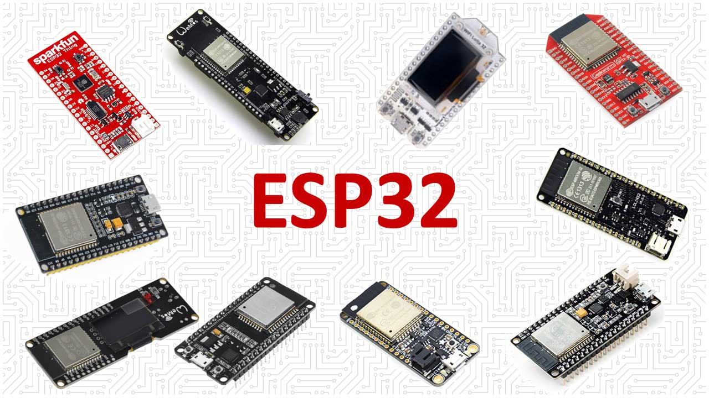
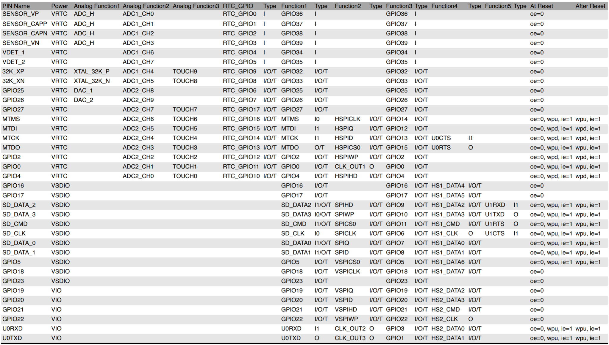
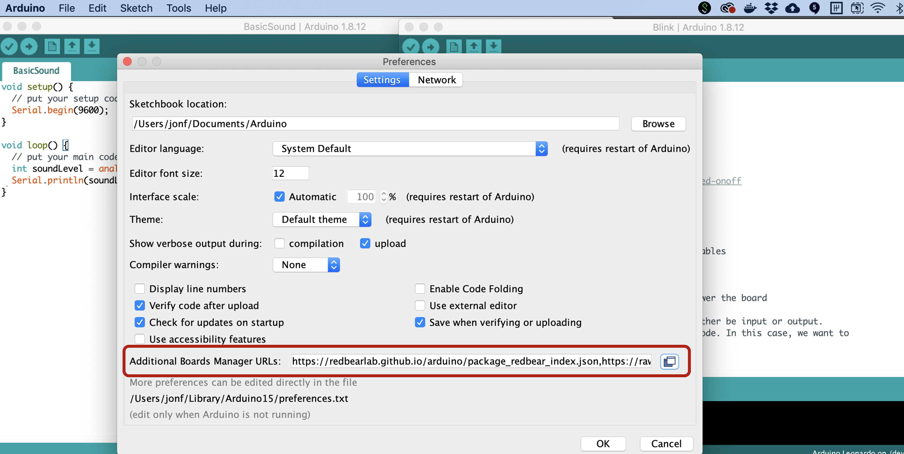
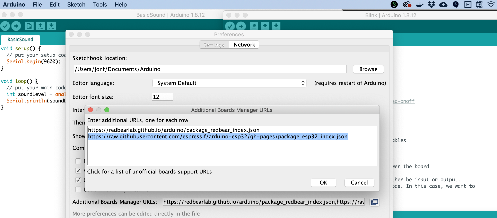
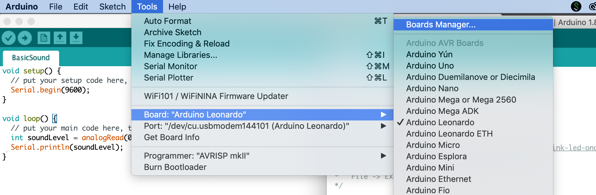
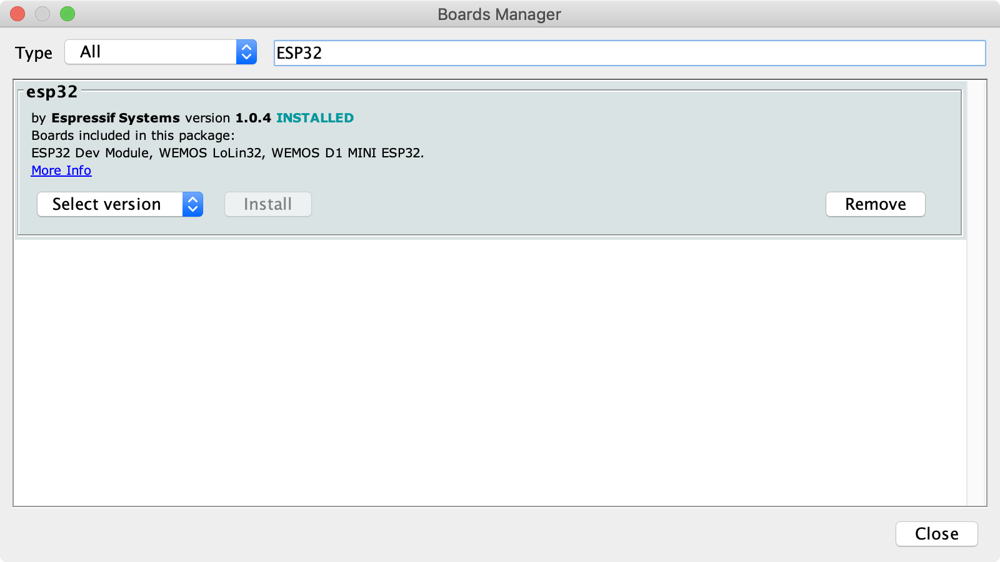
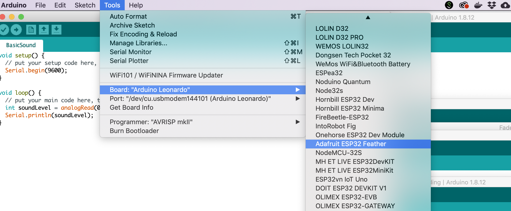
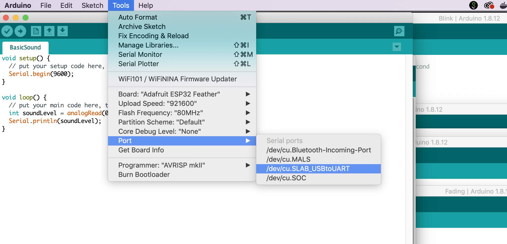

# {{ page.title }}
{: .no_toc }

## Table of Contents
{: .no_toc .text-delta }

1. TOC
{:toc}
---

<!-- Content TODOs:
1. Make blink example
2. Make fade example. Show PWM
3. Analog input
4. Make touch sensor example?
5. Show off WiFi? And/or bluetooth?
6.  -->

Image from [makeradvisor.com](https://makeradvisor.com/esp32-development-boards-review-comparison/). There are literally dozens of ESP32 boards. Search online for comparisons (*e.g.,* [link](https://makeradvisor.com/esp32-development-boards-review-comparison/)).
{: .fs-1 } 

The [ESP32](https://en.wikipedia.org/wiki/ESP32) is a low-cost, "system-on-a-chip" board with integrated WiFi, Bluetooth, and a Tensilica Xtensa LX6 microprocessor running at 160 or 240 MHz. It is a successor to the massively successful [ESP8266](https://en.wikipedia.org/wiki/ESP8266). The ESP32 is far more powerful than introductory Arduino boards like the Uno or Leonardo but also more complex.

There are literally dozens of ESP32 boards on the market, including Adafruit's [Huzzah32](https://www.adafruit.com/product/3405) and Sparkfun's [ESP32 Thing](https://www.sparkfun.com/products/13907). Search online for comparisons (*e.g.,* [link](https://makeradvisor.com/esp32-development-boards-review-comparison/)). We will be using the [Huzzah32](https://www.adafruit.com/product/3405), which came out in May 2017.

### Programming environment

You can program the ESP32 in variety of languages and programming environments, including `C/C++`, [Micropython](https://github.com/pvanallen/esp32-getstarted), [Lua](https://nodemcu.readthedocs.io/en/dev-esp32/), and more. For programming environments, you can use Espressif's IoT Development Framework ([IDF](https://docs.espressif.com/projects/esp-idf/en/latest/esp32/)) or [VSCode with PlatformIO](https://docs.platformio.org/en/latest/tutorials/espressif32/arduino_debugging_unit_testing.html). Many ESP32 boards have Arduino libraries so you can also use the [Arduino IDE](https://www.arduino.cc/en/main/software), which is what we will do. This greatly simplifies programming the ESP32 (but at a cost of flexibility and efficiency).

## The Adafruit ESP32 Huzzah32 Feather

| Name | Arduino Uno | Huzzah32 |
| ---- | ----------- | -------- |
| Image |  |  |
| Microcontroller | 8-bit, 16 MHz [ATmega328P](https://www.microchip.com/wwwproducts/en/ATmega328) | 32-bit, 240 MHz dual core Tensilica LX6 |
| Microcontroller Manufacturer | Microchip (Atmel) | Espressif |
| System-on-a-chip | N/A | [ESP32](https://www.espressif.com/sites/default/files/documentation/esp32_datasheet_en.pdf) |
| Input voltage (limit) | 6-20V | 7-12V |
| Operating voltage | 5V | 3.3V |
| Flash memory | 32KB (0.5KB used by bootloader) | 4MB |
| SRAM | 2KB | 520KB |
| GPIO pins | 14 | 21 |
| PWM pins | 6 | All |
| Analog inputs | 6 | 14 |
| Wi-Fi | N/A | 802.11b/g/n HT40 Wi-Fi transceiver |
| Bluetooth | N/A | Dual mode (classic and BLE) |

Recall that flash memory is where your compiled program is stored and SRAM is where your microcontroller creates and manipulates variables when it runs.

The ESP32 also has 2xI2S Audio, 2xDAC, 2xI2C (only one configured by default in the Feather Arduino IDE support), 3xSPI (only one configured by default in Feather IDE support). See [Adafruit overview](https://learn.adafruit.com/adafruit-huzzah32-esp32-feather/overview).

There is a hardware floating point unit (FPU) on ESP32; however, there have been some criticisms about its performance ([link1](https://blog.classycode.com/esp32-floating-point-performance-6e9f6f567a69), [link2](https://www.esp32.com/viewtopic.php?f=14&t=800)).

### ESP32 pin list

The official ESP32 pin list is [here](https://www.espressif.com/sites/default/files/1a-esp32_pin_list_en-v0.1.pdf):

Screenshot of the ESP32 pin list [PDF](https://www.espressif.com/sites/default/files/1a-esp32_pin_list_en-v0.1.pdf).
{: .fs-1 }

In our code, we will reference the pins based on their GPIO number. However, the ESP32 [docs](https://www.espressif.com/sites/default/files/documentation/esp32_datasheet_en.pdf) often use the pin name (far left column).

### Huzzah32 pin diagram

So, what do all of these pins do? Oh, so many things!

The pin diagram for the Huzzah32 in the official Adafruit [docs](https://learn.adafruit.com/adafruit-huzzah32-esp32-feather/pinouts) is pretty confusing. So, we created our own:

See the Adafruit Huzzah32 [docs](https://learn.adafruit.com/adafruit-huzzah32-esp32-feather/pinouts) for details. Right-click and open image in a new tab to zoom in.
{: .fs-1 } 

### Important notes

The Huzzah32 has 21 GPIO pins; however pins 34 (A2), 39 (A3), 36 (A4) are not output-capable. In this animation, we are attempting to fade in/out all 21 GPIO pins and demonstrating that only 18 work for output.
{: .fs-1 } 

- The ESP32 runs on **3.3V power and logic**, and unless otherwise specified, GPIO pins are not 5V safe!
- There are **21 GPIO pins**; however, on the Huzzah32, pins 34 (A2), 39 (A3), 36 (A4) are not output-capable and thus should only be used for input. So, **18 GPIO pins** in total. Be forwarned: the pins are in a strange order, so read the diagram carefully.
- **PWM** is possible on all 18 GPIO pin
- **14 of the 21 GPIO pins** can be used **analog input pins**; however, A13 is not exposed. It's used for measuring the voltage on the LiPoly battery via a voltage divider. When reading in the battery level using `analogRead(A13)`, make sure multiply by 2 to get correct reading.
- The **ADC resolution is 12 bits** (0-4095). This is in contrast to the Arduino Uno and Leonardo, which uses ATmega chips with 10 bit ADCs (so, 0-1023). Make sure you use the proper max value in your conversions (*e.g.,* using [`map()`](https://www.arduino.cc/reference/en/language/functions/math/map/))
- The Adafruit [docs](https://learn.adafruit.com/adafruit-huzzah32-esp32-feather/pinouts) state (somewhat confusingly) that ADC#1 only works when WiFi has started. However, the Espressif [docs](https://docs.espressif.com/projects/esp-idf/en/latest/esp32/api-reference/peripherals/adc.html) state that ADC#2 only works when WiFi has **not** started, so there are strange (potential) contradictions here. Based on our investigations, we believe the Espressif docs are right and the Adafruit docs are wrong. Check out our test program here.
- The charging circuit light will flash quickly when there is no LiPoly battery plugged in. It's harmless and doesn't mean anything. This LED will also flash (more slowly) when the battery is plugged in and charging. The battery charges automatically when plugged in and the Huzzah32 is externally powered.

In the following video, I'm testing all 13 analog input pins (`A0` - `A12`) using a trim potentiometer for input and the Serial Plotter for output.

<iframe width="736" height="414" src="https://www.youtube.com/embed/8BBY-5n4e5A" frameborder="0" allow="accelerometer; autoplay; encrypted-media; gyroscope; picture-in-picture" allowfullscreen></iframe>

<!-- 
Pin diagram from [Zerynth](https://docs.zerynth.com/latest/official/board.zerynth.adafruit_huzzah32/docs/index.html). ICU stands for [Input Capture Unit](https://docs.zerynth.com/official/core.zerynth.stdlib/r2.0.9/icu.html).
{: .fs-1 }  -->

<!-- Another helpful pin diagram: https://people.eecs.berkeley.edu/~boser/courses/49_sp_2019/N_gpio.html#_pin_diagram -->

### Huzzah32 installation instructions for the Arduino IDE

You can follow the [official Adafruit Huzzah32 Arduino IDE installation instructions](https://learn.adafruit.com/adafruit-huzzah32-esp32-feather/using-with-arduino-ide), which we've expanded a bit below.

#### Step 1: Add ESP32 to Arduino Board Manager

1. Open the Arduino IDE

2. Go to Preferences

3. In preferences, find the `Additional Board Manager URLs:` field 

4. Add the ESP32 JSON url `https://raw.githubusercontent.com/espressif/arduino-esp32/gh-pages/package_esp32_index.json`

5. Open the Arduino IDE Board Manager

6. Search for `ESP32` and click `Install`

#### Step 2: Install USB to UART Bridge Virtual COM Port Driver

As noted in the [official Adafruit Huzzah32 Arduino IDE installation instructions](https://learn.adafruit.com/adafruit-huzzah32-esp32-feather/using-with-arduino-ide), the second step is to install the USB to UART Bridge Virtual COM Port (VCP) driver to interface with the ESP32 board. You can download the driver from Windows, Mac, and Linux [here](https://www.silabs.com/products/development-tools/software/usb-to-uart-bridge-vcp-drivers).

#### Step 3: Select "Adafruit ESP32 Feather" in board menu

Once installed, select the `Adafruit ESP32 Feather` in the Board menu.

#### Step 4: Select the appropriate port

Finally, select the appropriate port

## Resources

### Official ESP32 Documentation
- [API Reference](https://docs.espressif.com/projects/esp-idf/en/latest/esp32/api-reference/index.html)
- [API Guides](https://docs.espressif.com/projects/esp-idf/en/latest/esp32/api-guides/index.html)

### Other
- [Sparkfun's ESP32 Thing Hookup Guide](https://learn.sparkfun.com/tutorials/esp32-thing-hookup-guide/all). Written for Sparkfun's ESP32 Thing board but has relevant WiFi and BLE examples.

<!-- ## Application ideas
- Connect to WiFi, get the time, print out on OLED. Create a clock?
- Connect to WiFi, download Covid-19 stats, print out on display
- Evidently ESP32 may support Serial.printf? [See link](https://arduino.stackexchange.com/a/53751).

### Sound / VUMeters

- [Using the ESP32's built-in DAC](https://www.reddit.com/r/esp32/comments/bid08m/finally_got_audio_sampling_via_dma_with_no_cpu/)?
- [Streaming music with I2S](https://www.reddit.com/r/esp32/comments/dluvgl/streaming_web_radio_to_esp32_playing_it_using_the/)

### Platform IO for VSCode

- https://docs.platformio.org/en/latest/integration/ide/visualstudio.html
- https://maker.pro/arduino/tutorial/how-to-use-platformio-in-visual-studio-code-to-program-arduino -->

