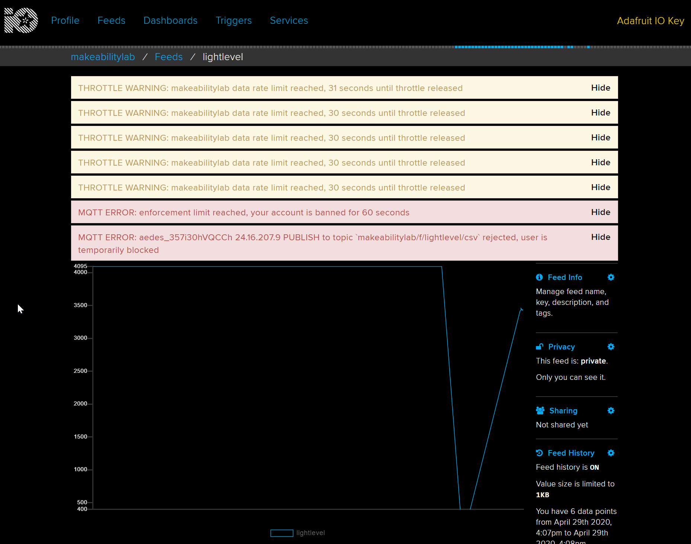
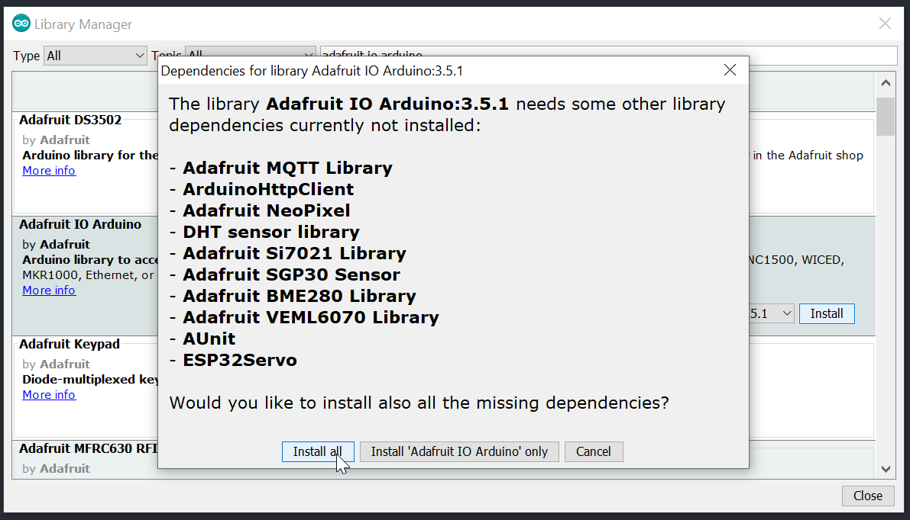
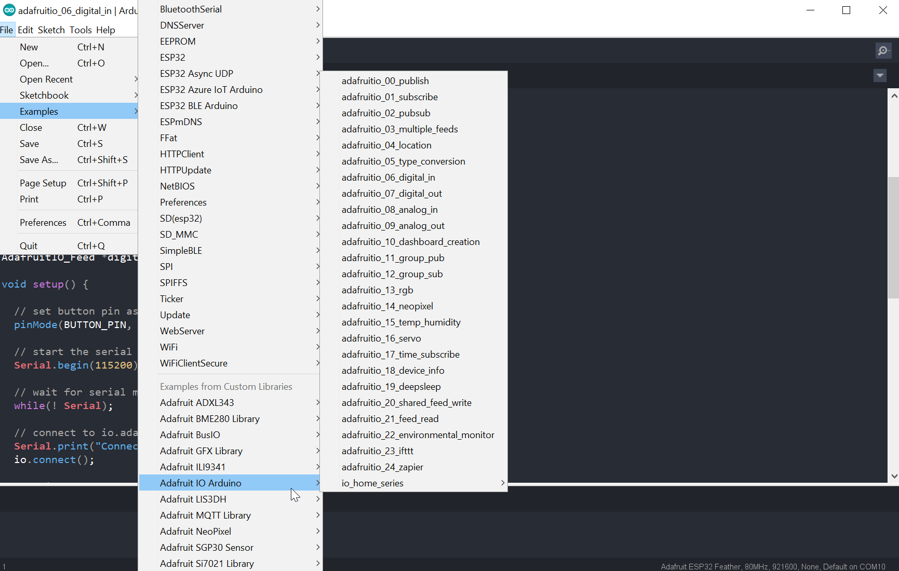
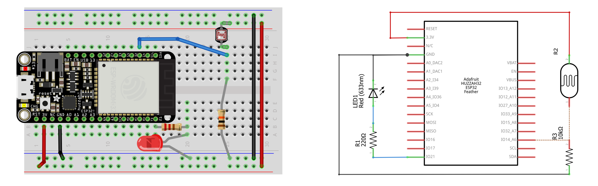

# {{ page.title | replace_first:'L','Lesson '}}
{: .no_toc }

## Table of Contents
{: .no_toc .text-delta }

1. TOC
{:toc}
---

The ESP32 is exciting not just because of its speed, memory, and GPIO capabilities but also because it is truly a modern Internet of Things (IoT) board with Wi-Fi and Bluetooth support. And it's never been easier to get data off of these Internet-connected devices and into "the cloud" (for better or worse). :)

## IoT Platforms

There are a **ton** of IoT platforms—significantly more than even a few years ago—including [Adafruit IO](https://learn.adafruit.com/welcome-to-adafruit-io), [Blynk](https://blynk.io/), [ThingsSpeak](https://thingspeak.com/), and [Losant](https://www.losant.com/). See [Hackaday](https://hackaday.com/2017/10/31/review-iot-data-logging-services-with-mqtt/) and [bigmessowires](https://www.bigmessowires.com/2017/06/29/esp8266-freeboard-io-blynk-and-iot/) for reviews.

If you don't want to dev out your own backend or you simply want a platform to rapidly prototype an idea, then these IoT sites are convenient, easy-to-use, flexible, and fairly feature rich. You can get real-time displays of your data, control and interact with this data and Internet-connected devices, connect your projects to web services like Twitter, *etc.* Many of the IoT platforms also connect with services like IFTTT and/or offer their own event triggering to, for example, email you when an anomaly is detected.

And many of these platforms support both REST APIs—which you're likely familiar with if you've done any web dev—as well as the Message Queuing Telemetry Transport ([MQTT](https://en.wikipedia.org/wiki/MQTT)) protocol, which is an open standard for lightweight, publish-subscribe networking. See [MQTT](http://mqtt.org/).

## Adafruit IO

For our lesson, we'll be using [Adafruit.io](https://learn.adafruit.com/welcome-to-adafruit-io), which greatly simplifies interfacing with a cloud backend from the ESP32 and provides a rich array of features. The free tier provides 10 feeds, 5 dashboards, an upload rate limit of 30 data points/minute, 30 day storage, and privacy controls. The paid tier, called [Adafruit IO Plus,](https://io.adafruit.com/plus) is $99/year and provides unlimited feeds, unlimited dashboards, 60 data points/minute, and 60 days of storage.

You must register for Adafruit IO on their website. Follow their step-by-step instructions [here](https://learn.adafruit.com/welcome-to-adafruit-io/overview). If you don't rate throttle your uploads to a maximum of 1 upload every 2 seconds (30 uploads/minute), you'll receive this warning and a temporary block from Adafruit IO

### Install Adafruit IO in Arduino IDE

To install the Adafruit IO library for Arduino, open the Arduino IDE and go to Tools -> Library -> Manage Libraries. When the Library Manager opens, search for "Adafruit IO Arduino" and scroll to find the match:

When asked to install dependencies, click on "Install All"

### Using Adafruit IO

Adafruit has published a 7-step guide that covers everything from uploading [sensor data](https://learn.adafruit.com/adafruit-io-basics-analog-input) and viewing it on a dashboard (took us ~5 minutes to setup) to sending data from Adafruit IO to control an [RGB LED](https://learn.adafruit.com/adafruit-io-basics-color) or [servo motor](https://learn.adafruit.com/adafruit-io-basics-servo). You can access these examples (and many more) within the Arduino IDE by going to File -> Examples -> Adafruit IO Arduino:

## Let's make something!

We suggest following the Adafruit IO [guide](https://learn.adafruit.com/adafruit-io-basics-analog-input) to learn all facets of the IoT platform. However, as a start, we created a simple real-time sensor feed based on the Analog Input Adafruit example. Their source code is [here](https://github.com/adafruit/Adafruit_IO_Arduino/tree/master/examples/adafruitio_08_analog_in) or you can access it via File -> Examples -> Adafruit IO Arduino -> adafruitio_08_analog_in.

Because the max upload rate is 30 data points/minute (1 data point every two seconds), we throttle our uploads. If the photoresistor value has changed, we upload at a maximum rate of every two seconds. If the photoresistor value has not changed, we upload at a rate of once every 10 seconds.

### The circuit

We have a photoresistor in a voltage divider with a 10k resistor connected to `A7` (we can only use ADC1 pins because we're going to use WiFi). The analog input voltage will increase as the brightness level increases. We drive a PWM output on pin GPIO 21 whose duty cycle is inversely proportional to the light level thereby turning on an LED brighter as the light level decreases.

### The code

<!-- https://github.com/makeabilitylab/arduino/blob/master/ESP32/WiFi/IoTPhotoresistorLed/IoTPhotoresistorLed.ino -->

The code is on [github](https://github.com/makeabilitylab/arduino/tree/master/ESP32/WiFi/IoTPhotoresistorLed). Note: there are two files. The [IotPhotoresistorLed.ino](https://github.com/makeabilitylab/arduino/blob/master/ESP32/WiFi/IoTPhotoresistorLed/IoTPhotoresistorLed.ino) file and the [config.h](https://github.com/makeabilitylab/arduino/blob/master/ESP32/WiFi/IoTPhotoresistorLed/config.h) file. 

In the `config.h` file, you must change the following:


// visit io.adafruit.com if you need to create an account,
// or if you need your Adafruit IO key.
#define IO_USERNAME "your_username"
#define IO_KEY "your_key"

#define WIFI_SSID "your_ssid"
#define WIFI_PASS "your_pass"


And here's the full [IotPhotoresistorLed.ino](https://github.com/makeabilitylab/arduino/blob/master/ESP32/WiFi/IoTPhotoresistorLed/IoTPhotoresistorLed.ino) code:

### Workbench video

Here's a brief video demonstration showing a workbench recording paired with a screen recording of Adafruit IO.

<iframe width="736" height="414" src="https://www.youtube.com/embed/DgCFUHGSKSM" frameborder="0" allow="accelerometer; autoplay; encrypted-media; gyroscope; picture-in-picture" allowfullscreen></iframe>

## Previous lesson

[Previous: Capacitive Touch Sensing](capacitive-touch-sensing.md){: .btn .btn-outline }
