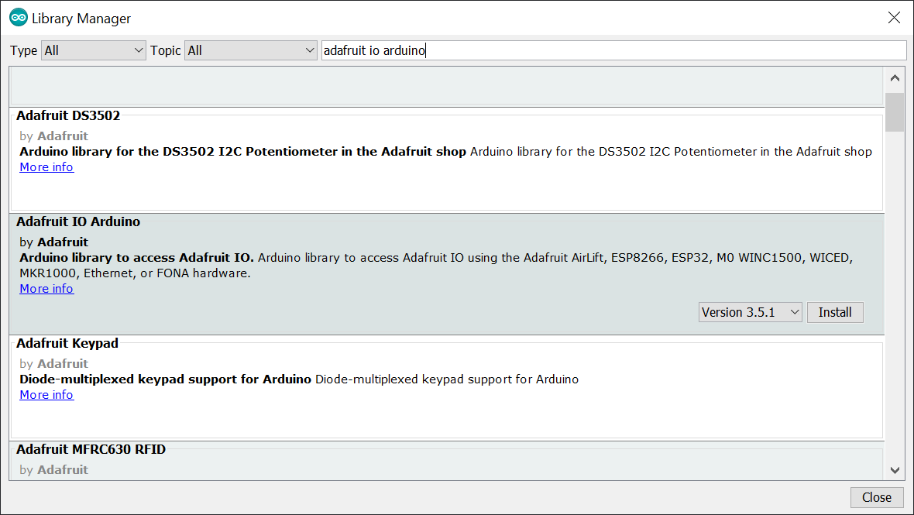
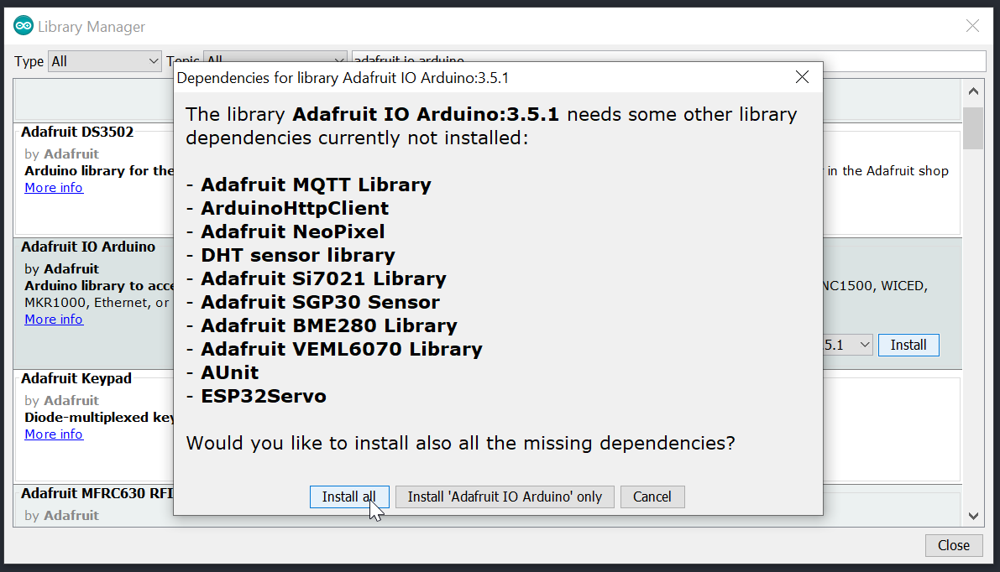
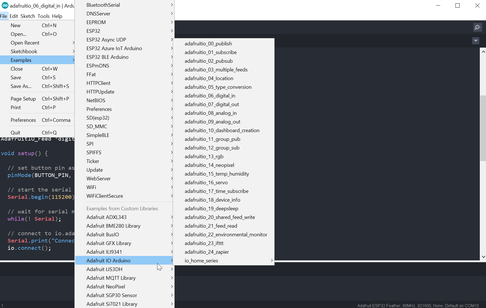
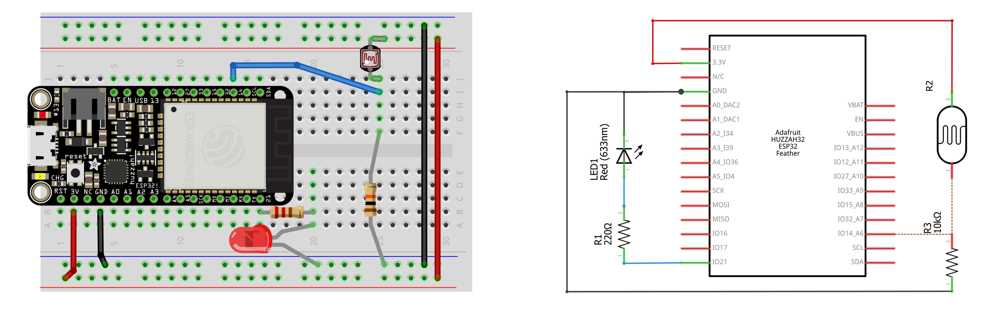

# {{ page.title | replace_first:'L','Lesson '}}
{: .no_toc }

## Table of Contents
{: .no_toc .text-delta }

1. TOC
{:toc}
---

<!-- Content TODOs:
1. Create an updated Fritzing wiring diagram for the ESP32-S3 Feather with the photoresistor + LED circuit
2. Record a workbench video of the IoT photoresistor demo with the ESP32-S3 Feather
3. Create a Wokwi project for the WiFi + sensor upload demo (if Wokwi supports WiFi simulation)
4. Add screenshots of the Adafruit IO dashboard setup process
5. Add a screenshot or video of the bidirectional LED control demo
6. Update the existing source code on GitHub to use analogWrite and non-blocking loop
-->

<!-- See also:
- Adafruit IO guides: https://learn.adafruit.com/welcome-to-adafruit-io
- Adafruit IO Arduino library: https://github.com/adafruit/Adafruit_IO_Arduino
- MQTT protocol: https://mqtt.org/
- ThingSpeak Arduino library: https://github.com/mathworks/thingspeak-arduino
- Our existing IoT code: https://github.com/makeabilitylab/arduino/tree/master/ESP32/WiFi/IoTPhotoresistorLed
-->

Throughout this module, every input and output we've built has lived entirely on the breadboard: LEDs blink, buzzers beep, potentiometers twist—but the moment you unplug the USB cable, the data is gone. What if your sensor readings were accessible from *anywhere*? What if you could check on your plant's soil moisture from your phone, log temperature data for a week-long experiment, or flip an LED on from across campus?

That's the promise of the **Internet of Things (IoT)**: connecting physical devices to the internet so they can send data to the cloud, receive commands, and interact with web services. And the ESP32 is purpose-built for exactly this—it has Wi-Fi and Bluetooth baked right into the chip. In this lesson, we'll take the sensor skills you've built in previous lessons and connect them to the internet for the first time. 🌐

{: .note }
> **In this lesson, you will learn:**
> - What IoT is and the basic architecture of an IoT system (device → internet → cloud → dashboard)
> - How IoT communication works: REST APIs vs. the MQTT protocol
> - How to set up [Adafruit IO](https://io.adafruit.com/) as a free cloud backend for your ESP32
> - How to upload real-time sensor data to the cloud and visualize it on a dashboard
> - How to receive data *from* the cloud to control an LED remotely
> - The critical constraint that **ADC2 pins cannot be used when WiFi is active**
> - How to rate-limit uploads to stay within free-tier limits
> - Why `delay()` is dangerous in IoT code and how to write a fully non-blocking `loop()`
> - How to keep local control responsive even when the network drops

## What is IoT?

The term "Internet of Things" refers to the network of physical objects—sensors, appliances, wearables, vehicles—that are connected to the internet and can exchange data. Your Fitbit tracking your steps, a Nest thermostat adjusting your home's temperature, a city's air quality sensors feeding a public dashboard—these are all IoT systems.

At its core, every IoT system has the same basic architecture:

1. **A device** (like our ESP32) with sensors and/or actuators
2. **A network connection** (WiFi, Bluetooth, cellular) to send and receive data
3. **A cloud platform** that stores, processes, and visualizes the data
4. **A user interface** (web dashboard, mobile app) to view and interact with the data

In this lesson, we'll build all four layers: the ESP32 reads a photoresistor (device), connects via WiFi (network), uploads to Adafruit IO (cloud), and we'll view the data on a live dashboard (interface).

## How IoT communication works

IoT devices communicate with cloud platforms using standard internet protocols. The two most common are **REST** (HTTP) and **MQTT**. Understanding the difference will help you choose the right approach for your projects.

### REST APIs (HTTP)

If you've done any web development, you're already familiar with REST. Your device makes standard HTTP requests—`GET` to read data, `POST` to send data—to a cloud server's API endpoints. It's the same technology your web browser uses to load a webpage.

REST is simple and widely supported, but it has a drawback for IoT: every communication requires the device to initiate a new HTTP connection. This is fine for periodic uploads ("send the temperature every 30 seconds") but inefficient for real-time, bidirectional communication.

### MQTT protocol

[MQTT](https://mqtt.org/) (Message Queuing Telemetry Transport) is a lightweight messaging protocol designed specifically for IoT. It uses a **publish/subscribe** model:

- Devices **publish** data to named **topics** (like `sensors/temperature`)
- Other devices or dashboards **subscribe** to those topics to receive updates
- A central **broker** (the cloud server) routes messages between publishers and subscribers

MQTT is designed for constrained devices and unreliable networks—it has very low overhead, supports persistent connections, and can even queue messages when a device goes offline. This makes it ideal for battery-powered sensors or applications where you need real-time updates in both directions.

{: .warning }
> **Security note: TLS/SSL.** Standard MQTT (port 1883) transmits data—including your credentials—in **plaintext**. Production IoT systems use MQTT over TLS/SSL (port 8883) to encrypt all communication. The Adafruit IO library uses SSL by default on ESP32 boards, so your data is encrypted in transit. But this is an important consideration if you ever build IoT systems that use a raw MQTT broker: always enable TLS. For a deeper dive, see the [HiveMQ MQTT Security Fundamentals](https://www.hivemq.com/mqtt-essentials/) series.

{: .note }
> **Which should you use?** For this course, you don't need to choose—Adafruit IO supports both REST and MQTT behind the scenes. The Adafruit IO Arduino library uses MQTT by default for its persistent connection, and REST for individual data operations. As you build more complex IoT projects, understanding MQTT becomes increasingly valuable.

## IoT platforms overview

There are many IoT platforms available that handle the cloud infrastructure for you—data storage, dashboards, alerts, and APIs—so you can focus on the hardware and firmware. Here are the most popular options for makers and students:

| Platform | Free Tier | Protocol | Best For |
|---|---|---|---|
| [Adafruit IO](https://io.adafruit.com/) | 10 feeds, 30 pts/min, 30-day storage | REST + MQTT | Beginners, Adafruit hardware, rapid prototyping |
| [ThingSpeak](https://thingspeak.com/) | 4 channels, 15-sec intervals | REST + MQTT | Data analysis (MATLAB integration) |
| [Blynk](https://blynk.io/) | 5 devices | REST + MQTT | Mobile app control |

{: .note }
> All three platforms are free for the scale of projects we do in this course. We use **Adafruit IO** because it has the simplest onboarding (you can be uploading data in under 5 minutes), excellent Arduino library support, and integrates naturally with the Adafruit hardware we use. If you want to explore alternatives, ThingSpeak is a great choice—especially if you're interested in data analysis with MATLAB.

## Getting started with Adafruit IO

[Adafruit IO](https://io.adafruit.com/) is a cloud service designed to make IoT simple and fun. It provides **feeds** (data streams from your sensors), **dashboards** (visual displays of your data), and both REST and MQTT APIs.

### Creating an account

1. Go to [io.adafruit.com](https://io.adafruit.com/) and click **Get Started for Free**
2. Create an Adafruit account (or sign in if you have one from buying hardware)
3. Once logged in, click on **IO** in the top navigation bar, then click **My Key** to find your **username** and **active key**—you'll need both in your Arduino code

{: .warning }
> **Treat your Adafruit IO key like a password.** Anyone with your key can read and write to your feeds. Never commit it to a public GitHub repository! We'll use a separate `config.h` file to keep credentials out of your main sketch.

### Understanding feeds and dashboards

- A **feed** is a named data stream. Think of it as a single column in a spreadsheet that collects timestamped values. For example, you might have a feed called `lightlevel` that stores photoresistor readings.
- A **dashboard** is a visual display made up of **blocks** (charts, gauges, buttons, sliders) that show data from your feeds. You can create multiple dashboards to organize your data however you like.

### Free tier limits

The free tier is generous for learning and prototyping:

- **10 feeds** and **5 dashboards**
- **30 data points per minute** (1 every 2 seconds)
- **30 days** of data storage
- Privacy controls (public or private feeds)

{: .warning }
> **Rate limiting is strict.** If you exceed 30 uploads per minute, Adafruit IO will temporarily block your account. Always throttle your uploads in code! We'll show you how to do this properly in our example.

The paid tier ([Adafruit IO+](https://io.adafruit.com/plus), $10/month or $99/year) provides unlimited feeds, unlimited dashboards, 60 data points/minute, and 60 days of storage. You won't need it for this course.

## Installing the Adafruit IO Arduino library

To install the Adafruit IO library, open the Arduino IDE and go to **Sketch → Include Library → Manage Libraries**. Search for `Adafruit IO Arduino` and install it:


**Figure.** Installing the Adafruit IO Arduino library from the Library Manager. Search for "Adafruit IO Arduino" and click install.
{: .fs-1 }

When prompted to install dependencies, click **Install All**:


**Figure.** Click "Install All" to install the required dependencies (including the Adafruit MQTT library).
{: .fs-1 }

{: .note }
> The Adafruit IO library depends on several other libraries (including Adafruit MQTT, ArduinoHttpClient, and WiFi101). Installing all dependencies ensures everything works together.

Adafruit also provides many example sketches you can access within the Arduino IDE via **File → Examples → Adafruit IO Arduino**:


**Figure.** The Adafruit IO Arduino library includes many example sketches covering analog input, digital input, color control, servo motors, and more.
{: .fs-1 }

## Materials

You'll need the following components. We use **[Adafruit's ESP32-S3 Feather](https://www.adafruit.com/product/5477)** but any ESP32-S3 board will work!

| Breadboard | ESP32 | LED | Resistors | Photoresistor |
| ---------- |:-----:|:-----:|:-----:|:-----:|
|  |  |  |  |  |
| Breadboard | [ESP32-S3 Feather](https://www.adafruit.com/product/5477) | Red LED | 220Ω + 10kΩ Resistors | Photoresistor |

{: .note }
> If you haven't used a photoresistor before, see our [Photoresistors lesson](../sensors/photoresistors.md) for details on how they work and how to wire a voltage divider circuit.

## Part 1: Upload sensor data to the cloud

Let's build our first IoT project! We'll read a photoresistor (light sensor), drive an LED whose brightness is inversely proportional to ambient light (a nightlight!), and upload the light level data to Adafruit IO in real time.

### The circuit

We have a photoresistor in a voltage divider with a 10kΩ resistor. The analog input voltage changes with the ambient light level. We also drive an LED via PWM, making it brighter as the room gets darker.

{: .warning }
> **ADC2 + WiFi conflict!** As we covered in the [Analog Input lesson](analog-input.md), the ESP32's ADC2 pins **cannot be used when WiFi is active**—this is a hardware limitation on all ESP32 variants. You must use **ADC1 pins** for any analog input in IoT projects. On the ESP32-S3 Feather, **A5** is the only "A"-labeled pin on ADC1. Pins labeled D5, D6, D9, and D10 are also ADC1 pins and can be used with `analogRead()` by passing their GPIO number. See the [Analog Input lesson](analog-input.md#which-pins-can-i-use) for full details.

<!-- TODO: Create an updated Fritzing wiring diagram for the ESP32-S3 Feather with photoresistor + LED -->

<details markdown="1">
<summary><strong>Using the Huzzah32 instead?</strong> (click to expand)</summary>

On the Huzzah32, use pin **A7** (GPIO 32) for the photoresistor, which is an ADC1 pin safe for use with WiFi. Use any output-capable GPIO pin for the LED (the original code used GPIO 21). Avoid ADC2 pins: A5 (GPIO 4), A11 (GPIO 12), A12 (GPIO 13), A6 (GPIO 14), A8 (GPIO 15), A1 (GPIO 25), A0 (GPIO 26), A10 (GPIO 27).


**Figure.** Circuit diagram for the Huzzah32 version showing a photoresistor voltage divider on A7 and an LED on GPIO 21.
{: .fs-1 }

</details>

### The config.h file

The Adafruit IO examples use a separate `config.h` file to store your credentials. This keeps your API keys and WiFi password out of your main sketch—important if you share your code on GitHub!

Create a new tab in the Arduino IDE (click the ▾ dropdown arrow next to your sketch tab and select **New Tab**), name it `config.h`, and paste the following:

```cpp
/************************ Adafruit IO Config *******************************/

// visit io.adafruit.com if you need to create an account,
// or if you need your Adafruit IO key.
#define IO_USERNAME "your_username"
#define IO_KEY      "your_key"

/******************************* WiFi **************************************/

#define WIFI_SSID "your_wifi_network_name"
#define WIFI_PASS "your_wifi_password"

// comment out the following lines if you are using fona or ethernet
#include "AdafruitIO_WiFi.h"
AdafruitIO_WiFi io(IO_USERNAME, IO_KEY, WIFI_SSID, WIFI_PASS);
```

{: .warning }
> **Never commit `config.h` to a public repository!** Add `config.h` to your `.gitignore` file. If you accidentally push your API key, regenerate it immediately on the [Adafruit IO website](https://io.adafruit.com/).

### The code

<!-- https://github.com/makeabilitylab/arduino/blob/master/ESP32/WiFi/IoTPhotoresistorLed/IoTPhotoresistorLed.ino -->

Here's the full sketch. It reads the photoresistor, maps the value to LED brightness, and uploads the light level to Adafruit IO—all without using `delay()` in the main loop:

```cpp
/**
 * IoT Photoresistor + LED: reads a photoresistor, controls LED brightness
 * inversely proportional to ambient light, and uploads light level data
 * to Adafruit IO.
 *
 * Circuit:
 * - Photoresistor in a voltage divider with 10kΩ resistor on an ADC1 pin
 * - LED with 220Ω resistor on a PWM-capable GPIO pin
 *
 * IMPORTANT: You must use ADC1 pins for analogRead() when WiFi is active.
 * ADC2 pins are unavailable when WiFi is in use.
 *
 * Based on: https://learn.adafruit.com/adafruit-io-basics-analog-input
 * See: https://makeabilitylab.github.io/physcomp/esp32/iot
 *
 * By Jon E. Froehlich
 * @jonfroehlich
 * http://makeabilitylab.io
 */

/************************** Configuration ***********************************/
// Edit the config.h tab and enter your Adafruit IO credentials
// and WiFi network name/password
#include "config.h"

/******************** Photoresistor + LED Pins *****************************/
const int PHOTOCELL_INPUT_PIN = A5;   // Must be an ADC1 pin (WiFi uses ADC2)
const int LED_OUTPUT_PIN = 13;        // GPIO 13 (also LED_BUILTIN)

// Calibration values — measure these empirically in your environment
// by watching the Serial Monitor under different lighting conditions
const int MIN_PHOTOCELL_VAL = 500;    // analogRead value in darkest condition
const int MAX_PHOTOCELL_VAL = 3500;   // analogRead value in brightest condition

// Set to true if the photoresistor is in the R2 (bottom) position of the
// voltage divider. If the photoresistor is in the R1 (top) position,
// set to false. See: https://makeabilitylab.github.io/physcomp/sensors/photoresistors.html
const boolean PHOTOCELL_IS_R2_IN_VOLTAGE_DIVIDER = false;

/************************** Adafruit IO Feed ********************************/
// This feed name will appear at: https://io.adafruit.com/<username>/feeds
AdafruitIO_Feed *_adafruitIoFeed = io.feed("lightlevel");

/************************** Timing (non-blocking) ***************************/
unsigned long _lastSensorReadMs = 0;
unsigned long _lastUploadMs = 0;
int _lastUploadedVal = -1;

const unsigned long SENSOR_READ_INTERVAL_MS = 100;    // read sensor ~10x/sec
const unsigned long MIN_UPLOAD_INTERVAL_MS = 2000;     // min 2 sec between uploads
const unsigned long MAX_UPLOAD_INTERVAL_MS = 10000;    // upload at least every 10 sec

void setup() {
  Serial.begin(115200);

  pinMode(PHOTOCELL_INPUT_PIN, INPUT);
  pinMode(LED_OUTPUT_PIN, OUTPUT);

  // Wait for Serial Monitor to open
  while (!Serial);

  // Connect to Adafruit IO
  Serial.print("Connecting to Adafruit IO");
  io.connect();

  // Wait for a connection
  while (io.status() < AIO_CONNECTED) {
    Serial.print(".");
    delay(500);
  }

  // Connected!
  Serial.println();
  Serial.println(io.statusText());
}

void loop() {
  // io.run() keeps the MQTT connection alive and processes incoming data.
  // Always call this at the top of loop() — see the warning below about
  // why we never use delay() in the main loop.
  io.run();

  unsigned long now = millis();

  // --- Read sensor on a schedule (non-blocking) ---
  if (now - _lastSensorReadMs >= SENSOR_READ_INTERVAL_MS) {
    _lastSensorReadMs = now;

    int photocellVal = analogRead(PHOTOCELL_INPUT_PIN);

    // --- Upload to Adafruit IO (with rate limiting) ---
    bool valueChanged = (photocellVal != _lastUploadedVal);
    unsigned long elapsed = now - _lastUploadMs;

    // Upload if: (a) value changed AND enough time has passed, or
    //            (b) value is the same but we haven't uploaded in a while
    if ((valueChanged && elapsed >= MIN_UPLOAD_INTERVAL_MS) ||
        (!valueChanged && elapsed >= MAX_UPLOAD_INTERVAL_MS)) {

      Serial.print("Uploading lightlevel = ");
      Serial.println(photocellVal);

      _adafruitIoFeed->save(photocellVal);
      _lastUploadedVal = photocellVal;
      _lastUploadMs = millis();
    }

    // --- Map photoresistor value to LED brightness ---
    int ledBrightness = map(photocellVal, MIN_PHOTOCELL_VAL, MAX_PHOTOCELL_VAL, 0, 255);
    ledBrightness = constrain(ledBrightness, 0, 255);

    // If photoresistor is in R1 (top) position, invert so LED is
    // brighter when the environment is darker
    if (!PHOTOCELL_IS_R2_IN_VOLTAGE_DIVIDER) {
      ledBrightness = 255 - ledBrightness;
    }

    // Write the PWM value to the LED
    analogWrite(LED_OUTPUT_PIN, ledBrightness);

    // Print values for Serial Plotter
    Serial.print("Photocell:");
    Serial.print(photocellVal);
    Serial.print(",LED:");
    Serial.println(ledBrightness);
  }

  // No delay() here! The loop spins freely so io.run() is called frequently.
}
```

This [source code](https://github.com/makeabilitylab/arduino/tree/master/ESP32/WiFi/IoTPhotoresistorLed) is on GitHub.
{: .fs-1 }

Let's walk through the key design decisions:

**WiFi and Adafruit IO connection.** The `config.h` file defines your credentials and creates the `io` object. In `setup()`, we call `io.connect()` and wait until the status reaches `AIO_CONNECTED`. This establishes both a WiFi connection and an MQTT connection to Adafruit IO's broker.

**The feed.** `io.feed("lightlevel")` creates a reference to a feed named `lightlevel` on your Adafruit IO account. If the feed doesn't exist yet, Adafruit IO will create it automatically when you first publish to it.

**Rate limiting.** The free tier allows 30 uploads per minute. Our code enforces this with two thresholds: if the sensor value has changed, we upload at most once every 2 seconds; if it hasn't changed, we still upload a "heartbeat" every 10 seconds. This keeps the dashboard current without hitting the rate limit.

**`io.run()`.** This must be called at the top of every `loop()` iteration. It maintains the MQTT connection and processes any incoming messages (important for Part 2, when we receive data *from* the cloud).

**`analogWrite()`.** In ESP32 Arduino core v3.x, `analogWrite()` is fully supported and works just like it does on the Arduino Uno—no need to manually configure LEDC channels. Under the hood, it still uses the LEDC peripheral, but the Arduino layer handles channel allocation for you. This is the simplest way to do PWM output on the ESP32.

{: .note }
> **Data types for `save()`.** The `_adafruitIoFeed->save()` method is overloaded and accepts `int`, `float`, `double`, `String`, and `char*` types. If you're uploading temperature data as `23.4`, you can pass a `float` directly—no need to round to an integer. The feed will store the full precision.

### Why no `delay()` in the main loop?

You might have noticed that our `loop()` has **no `delay()` call**—instead, we use `millis()` to schedule the sensor read every 100ms. This is a critical design pattern for IoT code.

The MQTT protocol relies on periodic "keepalive" pings between the client and broker. If `io.run()` isn't called frequently enough, the broker assumes the client has disconnected and drops the connection. A `delay(100)` might seem harmless, but students inevitably modify code—changing it to `delay(5000)` because they "only want to read every 5 seconds" will silently break the MQTT connection.

The `millis()`-based approach solves this: the `loop()` spins freely (calling `io.run()` hundreds of times per second), while the sensor reading and upload happen on their own independent schedules. This is the same asynchronous, non-blocking pattern used in professional embedded IoT firmware.

{: .warning }
> **The `delay()` rule for IoT:** Once your sketch uses a persistent network connection (MQTT, WebSockets, *etc.*), **banish `delay()` from your main `loop()`**. Use `millis()`-based timing instead. The `delay()` in `setup()` (while waiting for the connection) is fine—it's only the main loop where blocking is dangerous.

### Local control vs. cloud sync: designing for resilience

There's a subtle but important architectural point in our code: the **local behavior** (reading the photoresistor and driving the LED) and the **cloud sync** (uploading to Adafruit IO) are **interleaved in the same loop**. This means they share the same timing and, critically, the same failure modes.

What happens if the university WiFi drops? The `io.run()` call will attempt to reconnect, and depending on the library's internal state, this can introduce delays or block the loop entirely. Your smart nightlight stops being a nightlight just because the router rebooted.

In production IoT systems, local control is typically **decoupled** from cloud telemetry—the device keeps working locally regardless of network status. For our example, this isn't a problem in practice (the Adafruit IO library handles reconnection gracefully), but it's worth thinking about as you design more complex systems.

{: .note }
> **Design challenge:** How would you restructure this code so the LED continues responding to the photoresistor even when `io.status()` reports `AIO_DISCONNECTED`? Think about what should happen to the upload logic when the network is down. Should it buffer readings? Drop them? This is the kind of resilience thinking that separates a classroom prototype from a deployable product.

### Building your Adafruit IO dashboard

Once your ESP32 is uploading data, let's create a dashboard to visualize it:

1. Go to [io.adafruit.com](https://io.adafruit.com/) and click **Dashboards** → **New Dashboard**
2. Give it a name like "Photoresistor Monitor"
3. Click the **⚙ gear icon** (top right) → **Create New Block**
4. Choose **Line Chart** and select your `lightlevel` feed. This gives you a real-time graph of your sensor data over time.
5. Add a **Gauge** block connected to the same feed for an at-a-glance reading of the current value.

<!-- TODO: Add screenshot of a completed Adafruit IO dashboard with line chart and gauge -->

{: .note }
> **Tip:** You can adjust the time window on your line chart (past hour, past 24 hours, *etc.*) to see different levels of detail. The free tier stores 30 days of data, so you can look back at trends over time.

### Workbench demo

Here's a brief video demonstration showing the photoresistor + LED circuit paired with a live screen recording of the Adafruit IO dashboard.

<iframe width="736" height="414" src="https://www.youtube.com/embed/DgCFUHGSKSM" title="ESP32 IoT demo: photoresistor data uploading to Adafruit IO dashboard in real time" frameborder="0" allow="accelerometer; autoplay; encrypted-media; gyroscope; picture-in-picture" allowfullscreen></iframe>
**Video.** Workbench recording of the ESP32 reading a photoresistor and uploading the light level to Adafruit IO. The screen recording on the right shows the Adafruit IO dashboard updating in real time. Make sure your sound is on.
{: .fs-1 }

## Part 2: Receive data from the cloud

Uploading sensor data is only half the story. The real power of IoT is **bidirectional communication**: your device can also *receive* commands from the cloud. Let's add a feed that lets us toggle an LED from the Adafruit IO dashboard—from anywhere with an internet connection.

### Adding a toggle block to your dashboard

1. On Adafruit IO, create a new feed called `led-control`
2. Open your dashboard, click the **⚙ gear icon** → **Create New Block**
3. Choose **Toggle** and connect it to the `led-control` feed
4. Set the "Button On Text" to `1` and "Button Off Text" to `0`

Now you have a button on your dashboard that publishes `1` or `0` to the `led-control` feed whenever you click it.

### Subscribing to a feed in code

To receive data from Adafruit IO, you **subscribe** to a feed and provide a **callback function** that runs whenever a new value arrives. Add the following to your sketch:

```cpp
// Add this with your other feed declarations at the top
AdafruitIO_Feed *_ledControlFeed = io.feed("led-control");

// Add this to setup(), after io.connect() and the connection wait loop
_ledControlFeed->onMessage(handleLedControl);
_ledControlFeed->get();  // Request the current value on startup

// Add this callback function (outside of setup/loop)
void handleLedControl(AdafruitIO_Data *data) {
  Serial.print("Received from cloud: ");
  Serial.println(data->value());

  int val = data->toInt();
  if (val == 1) {
    digitalWrite(LED_BUILTIN, HIGH);
    Serial.println("Cloud LED: ON");
  } else {
    digitalWrite(LED_BUILTIN, LOW);
    Serial.println("Cloud LED: OFF");
  }
}
```

Now, clicking the toggle on your Adafruit IO dashboard will turn the onboard LED on and off—from anywhere in the world! This is the `io.run()` call in action: it continuously listens for incoming MQTT messages and triggers your callback when one arrives.

{: .note }
> **Two LEDs, two roles.** In this extended example, the external LED still responds to the photoresistor (local control), while the onboard LED (`LED_BUILTIN`) is controlled from the cloud (remote control). This demonstrates how a single ESP32 can handle both local sensing and remote commands simultaneously.

### The HCI of IoT: latency and feedback

Try clicking the toggle and watching how long it takes for the LED to respond. You'll notice a perceptible delay—typically 200ms to 1 second, depending on network conditions. Compare this to the **instantaneous** response of a hardware button (like the capacitive touch input from [Lesson 6](capacitive-touch-sensing.md)) and you can *feel* the difference that network latency makes.

This latency is inherent to any cloud-mediated interaction: your click travels from your browser to the Adafruit IO server, gets published as an MQTT message, is relayed to your ESP32, which processes it in the next `io.run()` cycle, and finally toggles the pin. Every hop adds delay.

In HCI terms, research shows that latency above ~100ms starts to feel sluggish, and above ~300ms the system starts to feel broken. This is a fundamental design tension in IoT: the convenience of remote control comes at the cost of responsiveness. Professional IoT products handle this with **optimistic UI** (the dashboard shows the change immediately, before confirming the device received it) and **local-first control** (physical buttons on the device always respond instantly, regardless of network state).

<!-- TODO: Add a screenshot or video of the bidirectional LED control in action -->

## Exploring Adafruit IO further

Adafruit has published an excellent multi-part guide that covers far more than we can in a single lesson. We recommend working through their tutorials to explore the full platform:

- [Analog Input](https://learn.adafruit.com/adafruit-io-basics-analog-input) — upload sensor data (our lesson is based on this)
- [Digital Input](https://learn.adafruit.com/adafruit-io-basics-digital-input) — upload button presses
- [Color Picker](https://learn.adafruit.com/adafruit-io-basics-color) — control an RGB LED from a color wheel
- [Servo Control](https://learn.adafruit.com/adafruit-io-basics-servo) — control a servo motor from a slider

You can also access many of these examples directly within the Arduino IDE via **File → Examples → Adafruit IO Arduino**.

{: .note }
> **Fun project idea:** Combine the [Color Picker](https://learn.adafruit.com/adafruit-io-basics-color) tutorial with the onboard NeoPixel from our [Blink lesson](led-blink.md#part-4-blink-the-onboard-neopixel-). Now you can change the NeoPixel's color from your phone! 🌈

## Alternative IoT platforms

While we use Adafruit IO in this course, there are several other excellent platforms worth knowing about:

<details markdown="1">
<summary><strong>ThingSpeak</strong> (click to expand)</summary>

[ThingSpeak](https://thingspeak.com/) is an open IoT platform by MathWorks (the makers of MATLAB). It's particularly strong for data analysis—you can run MATLAB scripts directly on your cloud data. The free tier supports 4 channels with up to 8 fields each, unlimited storage, and a 15-second minimum update interval. ThingSpeak has an excellent Arduino library ([thingspeak-arduino](https://github.com/mathworks/thingspeak-arduino)) with ESP32-specific examples. If your project involves heavy data analysis or you're already comfortable with MATLAB, ThingSpeak is a great choice.

</details>

<details markdown="1">
<summary><strong>Blynk</strong> (click to expand)</summary>

[Blynk](https://blynk.io/) is an IoT platform focused on mobile app control. Its standout feature is a drag-and-drop mobile app builder that lets you create custom control interfaces for your hardware without writing any app code. The free tier supports 5 devices. Blynk is a good choice if your project needs a polished mobile interface—but it's more commercially oriented than Adafruit IO or ThingSpeak.

</details>

<details markdown="1">
<summary><strong>Firebase Realtime Database</strong> (click to expand)</summary>

[Firebase](https://firebase.google.com/) is Google's mobile development platform. Its Realtime Database can be used as an IoT backend with the [FirebaseClient](https://github.com/mobizt/FirebaseClient) Arduino library. Firebase is powerful and free for small projects, but it has more setup complexity (Google Cloud Console, authentication tokens, JSON data structure) than the purpose-built IoT platforms above. Consider Firebase if you plan to build a custom web or mobile app that interacts with your sensor data.

</details>

## Exercises

**Exercise 1:** Modify the code to upload data from a **different sensor**—a potentiometer, a temperature sensor (like the BME280), or even the ESP32's built-in hall effect sensor. Create a new feed on Adafruit IO and build a dashboard to visualize the data.

**Exercise 2:** Add a **second feed** to the photoresistor sketch that uploads the LED duty cycle value alongside the raw photoresistor reading. Create a line chart that shows both feeds overlaid so you can see how they inversely track each other.

**Exercise 3: Two-way control.** Extend the bidirectional example from Part 2 to control the **NeoPixel color** from the cloud. Use the Adafruit IO [Color Picker block](https://learn.adafruit.com/adafruit-io-basics-color) and the Adafruit NeoPixel library. (Hint: the color arrives as a hex string like `#FF0000`—Adafruit's library can parse this for you.)

**Exercise 4: Threshold alert.** Add logic to your sketch that publishes a `1` to a new feed called `alert` whenever the light level drops below a threshold (for example, when the lights in the room are turned off). On the Adafruit IO dashboard, add a **text indicator** block that shows "DARK" or "LIGHT" based on this feed's value.

**Exercise 5: Try ThingSpeak.** Port the photoresistor upload example to [ThingSpeak](https://thingspeak.com/) using the [thingspeak-arduino](https://github.com/mathworks/thingspeak-arduino) library. How does the setup process compare to Adafruit IO? What are the trade-offs?

**Exercise 6: Data logging experiment.** Leave your photoresistor circuit running overnight (or for 24 hours). Use the Adafruit IO dashboard to examine the data the next day. Can you identify when the lights were turned on and off? When daylight entered the room? This is the power of IoT: long-term, unattended data collection.

**Exercise 7: Network resilience.** Deliberately disconnect your WiFi router while the sketch is running. Does the LED still respond to the photoresistor? What happens when WiFi comes back? Modify the code to explicitly check `io.status()` and only attempt uploads when connected, ensuring the local nightlight behavior never interrupts. (Hint: wrap the upload block in an `if (io.status() >= AIO_CONNECTED)` check.)

## Summary

In this lesson, you connected your ESP32 to the internet and built your first IoT system! Here's what you learned:

- **IoT architecture** follows a simple pattern: device → network → cloud → dashboard. The ESP32's built-in WiFi makes it a natural fit for this architecture.
- **REST** (HTTP GET/POST) and **MQTT** (lightweight publish/subscribe) are the two main communication protocols for IoT. Adafruit IO supports both, and its Arduino library uses MQTT by default for efficient, persistent connections. Production systems use **TLS/SSL** to encrypt MQTT traffic.
- **Adafruit IO** provides a free, beginner-friendly cloud backend with feeds (data streams), dashboards (visual displays), and both upload and download capabilities.
- **Rate limiting** is essential when working with free-tier IoT platforms. Our code uses two thresholds to upload changed values quickly (every 2 seconds) while avoiding the 30-per-minute limit.
- **ADC2 pins cannot be used when WiFi is active** on any ESP32 variant—a critical constraint for IoT projects that combine analog sensing with wireless connectivity. Always use ADC1 pins.
- **Non-blocking code is essential for IoT.** Using `millis()`-based timing instead of `delay()` ensures that `io.run()` is called frequently enough to maintain the MQTT connection. This is the same asynchronous pattern used in professional embedded firmware.
- **Bidirectional communication** lets your ESP32 both send data *to* the cloud and receive commands *from* the cloud, enabling remote monitoring and control from anywhere with an internet connection.
- **Network latency** introduces a perceptible delay in cloud-mediated control (typically 200ms–1s) that fundamentally changes the user experience compared to local hardware interaction. Designing for resilience—keeping local control responsive even when the network drops—is a key challenge in IoT system design.
- The `analogRead()` → `map()` → output pattern from the [Analog Input lesson](analog-input.md) extends naturally to IoT: read a sensor, process the value, and now you have a third destination—the cloud—alongside local outputs like LEDs and buzzers.

## Resources

- [Adafruit IO documentation](https://learn.adafruit.com/welcome-to-adafruit-io) — comprehensive guides covering feeds, dashboards, MQTT, triggers, and more
- [Adafruit IO Arduino library](https://github.com/adafruit/Adafruit_IO_Arduino) — the library we used in this lesson, with many example sketches
- [Adafruit IO API documentation](https://io.adafruit.com/api/docs) — REST and MQTT API reference
- [MQTT.org](https://mqtt.org/) — the official MQTT protocol website with specification and client libraries
- [HiveMQ MQTT Essentials](https://www.hivemq.com/mqtt-essentials/) — an excellent series of blog posts explaining MQTT concepts
- [ThingSpeak](https://thingspeak.com/) — alternative IoT platform with MATLAB integration
- [ThingSpeak Arduino library](https://github.com/mathworks/thingspeak-arduino) — for connecting Arduino and ESP32 boards to ThingSpeak
- [Random Nerd Tutorials: ESP32 with ThingSpeak](https://randomnerdtutorials.com/esp32-thingspeak-publish-arduino/) — step-by-step guide for ThingSpeak with ESP32

<span class="fs-6">
[Previous: Capacitive Touch Sensing](capacitive-touch-sensing.md){: .btn .btn-outline }
</span>