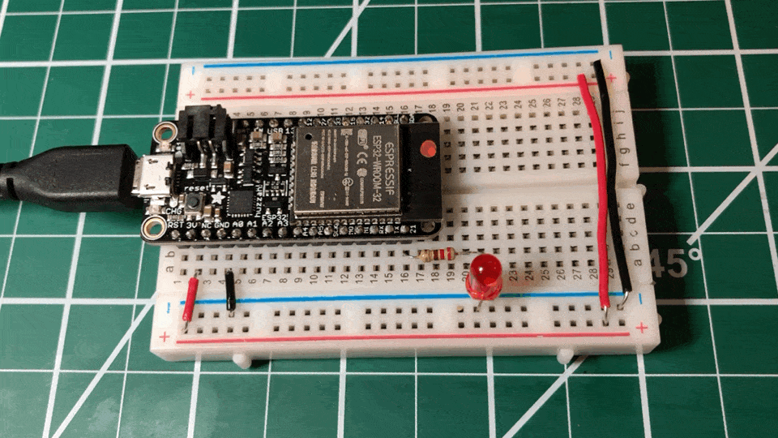

# {{ page.title | replace_first:'L','Lesson '}}
{: .no_toc }

## Table of Contents
{: .no_toc .text-delta }

1. TOC
{:toc}
---

In this lesson, we'll write our first ESP32 program: blinking an LED! If you've completed the Arduino [Blink lesson](../arduino/led-blink.md), you'll find that the code is *identical*—the beauty of the Arduino ecosystem. The challenge here is getting comfortable with the new board's pin layout and the 3.3V operating voltage.

We'll start with the **onboard LED** (no wiring required!), then move to an **external LED circuit**, and finish with a fun bonus: blinking the **onboard NeoPixel** in any color you want. 🌈

{: .note }
> **In this lesson, you will learn:**
> - How to blink the onboard LED using `LED_BUILTIN`—no wiring needed
> - How to wire an external LED to an ESP32 GPIO pin with a current-limiting resistor
> - How `digitalWrite()` works the same on both ESP32 and Arduino
> - How the 3.3V operating voltage affects current calculations
> - How to blink the onboard NeoPixel RGB LED on the ESP32-S3 Feather

## Part 1: Blink the onboard LED

Let's start with the simplest possible program—no breadboard, no wiring, just the ESP32 and a USB cable. This is a great way to verify your [IDE setup](esp32-ide.md) is working before adding external components.

The ESP32-S3 Feather (and the Huzzah32) have a small **red LED** on the board connected to **GPIO 13**, which is defined as `LED_BUILTIN` in the Arduino core—just like on the Uno!

### The code

This is the exact same Blink sketch you wrote for the Arduino. It transfers directly to the ESP32 with zero changes:

```cpp
/**
 * Blink the onboard LED.
 * This code is identical for Arduino Uno, Leonardo, Huzzah32, and ESP32-S3 Feather.
 *
 * See: https://makeabilitylab.github.io/physcomp/esp32/led-blink
 */

void setup() {
  pinMode(LED_BUILTIN, OUTPUT);
  Serial.begin(115200);           // ESP32 defaults to 115200 baud
  Serial.println("Hello from the ESP32! 🚀");
  Serial.print("LED_BUILTIN is on pin: ");
  Serial.println(LED_BUILTIN);
}

void loop() {
  digitalWrite(LED_BUILTIN, HIGH);  // turn LED on (3.3V)
  delay(1000);                      // wait one second

  digitalWrite(LED_BUILTIN, LOW);   // turn LED off (0V)
  delay(1000);                      // wait one second
}
```

Upload this sketch and open the **Serial Monitor** at **115200 baud**. You should see the hello message and the red onboard LED blinking. 🎉

{: .note }
> We use `115200` baud for `Serial.begin()` instead of the `9600` we used with the Arduino Uno. The ESP32 defaults to 115200 baud, and since the ESP32 is much faster, there's no reason to use the slower rate. Make sure your Serial Monitor baud rate matches!

{: .warning }
> **Native USB gotcha (ESP32-S3):** Because the ESP32-S3 uses native USB (not a separate USB-to-UART chip like the Uno's ATmega16U2 or the Huzzah32's CP2104), the serial port will **temporarily disappear** if the board crashes, resets, or enters deep sleep. If your Serial Monitor disconnects unexpectedly, just press the **Reset** button and reopen it. This is normal behavior for native USB—it's the same with the Arduino Leonardo.

<!-- TODO: Add Wokwi simulation link
     > **Try it in the simulator!** You can run this circuit in [Wokwi](https://wokwi.com/projects/new/esp32)
     > without any hardware. [Open the Blink simulation →](URL)
     Also save the Wokwi project JSON in the GitHub repo as a backup. -->

## Part 2: Blink an external LED

Now let's connect an external LED—this is where you'll practice reading the pin diagram and wiring up a real circuit.

### Materials

| Breadboard | ESP32 | LED | Resistor |
| ---------- |:-----:|:-----:|:-----:|
|  |  |  |  |
| Breadboard | ESP32-S3 Feather | Red LED | 220Ω Resistor |

<!-- TODO: Update the materials table image to show the ESP32-S3 Feather if we don't have one yet. -->

### Picking a pin

The ESP32 has many GPIO pins, and unlike the Arduino Uno (where pins 0–13 are neatly labeled), the numbering can seem a bit unusual at first. Don't worry—in the code, a pin is just an integer. When you write `const int LED_PIN = 5;`, that refers to GPIO 5, regardless of where it sits physically on the board. Always consult your board's pin diagram to find which GPIO number maps to which physical location.

{: .important }
> For this lesson, we'll use **GPIO 13**. Since GPIO 13 is also `LED_BUILTIN`, your external LED and the onboard red LED will blink together—a nice visual confirmation that everything is connected correctly. You can use any output-capable GPIO pin; just update the pin number in your code.

See the [ESP32-S3 Feather pinouts](https://learn.adafruit.com/adafruit-esp32-s3-feather/pinouts) and our [Lesson 1 pin diagram section](esp32.md#esp32-s3-feather-pin-diagram) for details.

<details markdown="1">
<summary><strong>Using the Huzzah32 instead?</strong> (click to expand)</summary>

On the Huzzah32, our original code examples and Fritzing diagrams use **GPIO 21**, which is a general-purpose GPIO pin. You can also use GPIO 13 (`LED_BUILTIN`) for consistency with the ESP32-S3. Any output-capable GPIO pin will work—just avoid pins 34, 39, and 36, which are input-only on the Huzzah32.


**Figure.** Huzzah32 pin diagram. See the Adafruit Huzzah32 [docs](https://learn.adafruit.com/adafruit-huzzah32-esp32-feather/pinouts) for details.
{: .fs-1 }

</details>

### Building the circuit

Our circuit is about as simple as they come: an LED connected to a GPIO pin through a current-limiting resistor.

<!-- TODO: Create a new Fritzing diagram showing the ESP32-S3 Feather with LED on GPIO 13.
     Keep the Huzzah32 version in a collapsible block. -->


**Figure.** Circuit diagram showing an LED connected to GPIO 21 on the Huzzah32 via a 220Ω current-limiting resistor. If you're using the ESP32-S3 Feather, use GPIO 13 (or any output-capable pin) instead.
{: .fs-1 }

Seating the ESP32 into the breadboard might take some effort. Please take care not to bend pins when placing and removing the board. Given that the ESP32 Feather boards take up so much room on a half-sized breadboard, you might consider using a full-sized breadboard instead.

### Calculating the current

We're using the same 220Ω resistor from the Arduino [Blink lesson](../arduino/led-blink.md). But now we're on a **3.3V** board instead of 5V, so the current will be lower.

Assuming a ~2V forward voltage ($$V_f$$) for a red LED:

$$I = \frac{V_{cc} - V_f}{R} = \frac{3.3V - 2V}{220Ω} = 5.9mA$$

Compare this to the ~13.6mA we'd get on a 5V Arduino Uno ($$\frac{5V - 2V}{220Ω} = 13.6mA$$). Your LED will be slightly dimmer—but still clearly visible. If you want to match the Arduino brightness, use a smaller resistor like 100Ω ($$\frac{3.3V - 2V}{100Ω} = 13mA$$).

{: .warning }
> The ESP32's GPIO pins can source up to ~40mA per pin, but Espressif recommends staying under **20mA** for long-term reliability. Our 5.9mA is well within the safe range!

### The code

The code is identical to Part 1. If you used `LED_BUILTIN` (which maps to GPIO 13), your external LED on GPIO 13 is already blinking! If you wired your LED to a different pin, just change the constant:

```cpp
const int LED_OUTPUT_PIN = 5;  // change to whatever GPIO pin you used

void setup() {
  pinMode(LED_OUTPUT_PIN, OUTPUT);
}

void loop() {
  digitalWrite(LED_OUTPUT_PIN, HIGH);
  delay(1000);
  digitalWrite(LED_OUTPUT_PIN, LOW);
  delay(1000);
}
```

This [source code](https://github.com/makeabilitylab/arduino/blob/master/ESP32/Basics/Blink/Blink.ino) is on GitHub.
{: .fs-1 }

### Workbench video

<!-- TODO: Record a workbench video showing the blink circuit on the ESP32-S3 Feather.
     Use <video> with aria-label. For now, reusing the Huzzah32 animation. -->

<video autoplay loop muted playsinline aria-label="Animation showing an LED blinking on and off, connected to an ESP32 Huzzah32 on a breadboard">
  <source src="assets/movies/Huzzah32_Blink-optimized.mp4" type="video/mp4">
  
</video>
**Video.** Blink running on the Huzzah32 with an external LED on GPIO 21.
{: .fs-1 }

## Part 3: Blink the onboard NeoPixel 🌈

The ESP32-S3 Feather has a built-in **NeoPixel** RGB LED—the same type of addressable LED we covered in the [Addressable LEDs lesson](../advancedio/addressable-leds.md)! Unlike the plain red `LED_BUILTIN`, the NeoPixel can display **any color**. Let's blink it!

{: .note }
> This section uses the **Adafruit NeoPixel library**. If you haven't installed it yet, open the Arduino IDE, go to **Sketch → Include Library → Manage Libraries**, search for `Adafruit NeoPixel`, and install it.

{: .important }
> The onboard NeoPixel requires a **power pin** to be pulled HIGH before it will work. The ESP32-S3 Feather defines this as `NEOPIXEL_POWER`. If you skip this step, the NeoPixel will stay dark!

```cpp
/**
 * Blink the onboard NeoPixel RGB LED in different colors.
 * Works on any Adafruit Feather with a built-in NeoPixel.
 *
 * Requires the Adafruit NeoPixel library:
 *   Sketch -> Include Library -> Manage Libraries -> search "Adafruit NeoPixel"
 */
#include <Adafruit_NeoPixel.h>

// One NeoPixel on the board, on the pin defined by PIN_NEOPIXEL
Adafruit_NeoPixel pixel(1, PIN_NEOPIXEL, NEO_GRB + NEO_KHZ800);

void setup() {
  // The NeoPixel on the ESP32-S3 Feather has a separate power pin
  // that must be set HIGH before the NeoPixel will light up
  #if defined(NEOPIXEL_POWER)
    pinMode(NEOPIXEL_POWER, OUTPUT);
    digitalWrite(NEOPIXEL_POWER, HIGH);
  #endif

  pixel.begin();
  pixel.setBrightness(30);  // 0-255; keep it low to avoid blinding yourself!
}

void loop() {
  pixel.setPixelColor(0, pixel.Color(255, 0, 0));    // Red
  pixel.show();
  delay(500);

  pixel.setPixelColor(0, pixel.Color(0, 0, 0));      // Off
  pixel.show();
  delay(500);

  pixel.setPixelColor(0, pixel.Color(0, 255, 0));    // Green
  pixel.show();
  delay(500);

  pixel.setPixelColor(0, pixel.Color(0, 0, 0));      // Off
  pixel.show();
  delay(500);

  pixel.setPixelColor(0, pixel.Color(0, 0, 255));    // Blue
  pixel.show();
  delay(500);

  pixel.setPixelColor(0, pixel.Color(0, 0, 0));      // Off
  pixel.show();
  delay(500);
}
```

Upload this and watch your NeoPixel cycle through red, green, and blue! Try changing the color values to create your own colors—remember, each value (R, G, B) ranges from 0 to 255.

{: .note }
> Notice the `#if defined(NEOPIXEL_POWER)` guard. This makes the code portable across Adafruit boards—some have a NeoPixel power pin, some don't. The `PIN_NEOPIXEL` constant is also board-specific and defined automatically by the board support package.

<details markdown="1">
<summary><strong>Using the Huzzah32 instead?</strong> (click to expand)</summary>

The original Huzzah32 **does not** have an onboard NeoPixel. If you want to try this, you'll need to connect an external NeoPixel (or NeoPixel strip) to a GPIO pin and update `PIN_NEOPIXEL` to match your wiring. See our [Addressable LEDs lesson](../advancedio/addressable-leds.md) for details on wiring external NeoPixels.

</details>

## Summary

In this lesson, you blinked LEDs on the ESP32 in three different ways:

- **Part 1:** Blinked the onboard red LED using `LED_BUILTIN` and `digitalWrite`—zero wiring, identical code to the Arduino Uno.
- **Part 2:** Wired an external LED circuit and calculated the current with the ESP32's 3.3V supply (5.9mA with a 220Ω resistor vs. 13.6mA on the 5V Uno).
- **Part 3:** Blinked the onboard NeoPixel RGB LED using the Adafruit NeoPixel library, learning about `NEOPIXEL_POWER` and `PIN_NEOPIXEL` along the way.

The key takeaway: `pinMode`, `digitalWrite`, and `delay` work **identically** on the ESP32 and Arduino. The differences are in the pin layout, the 3.3V voltage, and the extra hardware features (like the NeoPixel) that the ESP32-S3 Feather provides.

## Exercises

{: .highlight }
> **Exercise 1:** Modify the blink rate to create a pattern: blink fast three times (100ms on, 100ms off), then pause for one second. Repeat. Try this with both `LED_BUILTIN` and the NeoPixel.

{: .highlight }
> **Exercise 2:** Make the onboard NeoPixel display a **rainbow cycle**. Use a `for` loop to step through hue values and convert to RGB. (Hint: the `Adafruit_NeoPixel` library has a `ColorHSV()` function that takes a hue value from 0–65535.)

{: .highlight }
> **Exercise 3:** Connect a second LED to a different GPIO pin and make the two LEDs alternate: when one is on, the other is off. What happens if you use `delay(1)` instead of `delay(1000)`? Can you still see the alternation?

{: .highlight }
> **Exercise 4:** Write a program that blinks the NeoPixel in a different color every time the board resets. (Hint: use `random(256)` to pick random R, G, B values in `setup()`.)

## Next Lesson

In the [next lesson](led-fade.md), we'll learn how to use "analog output" on the ESP32 to smoothly fade an LED's brightness up and down. This is where things start to diverge from Arduino: instead of `analogWrite`, the ESP32 uses the **LEDC** (LED Control) PWM library!

<span class="fs-6">
[Previous: Introduction to the ESP32](esp32.md){: .btn .btn-outline }
[Next: Fading an LED with PWM](led-fade.md){: .btn .btn-outline }
</span>