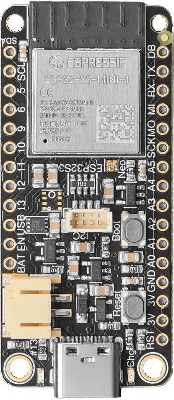
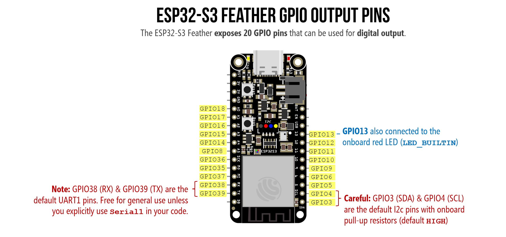
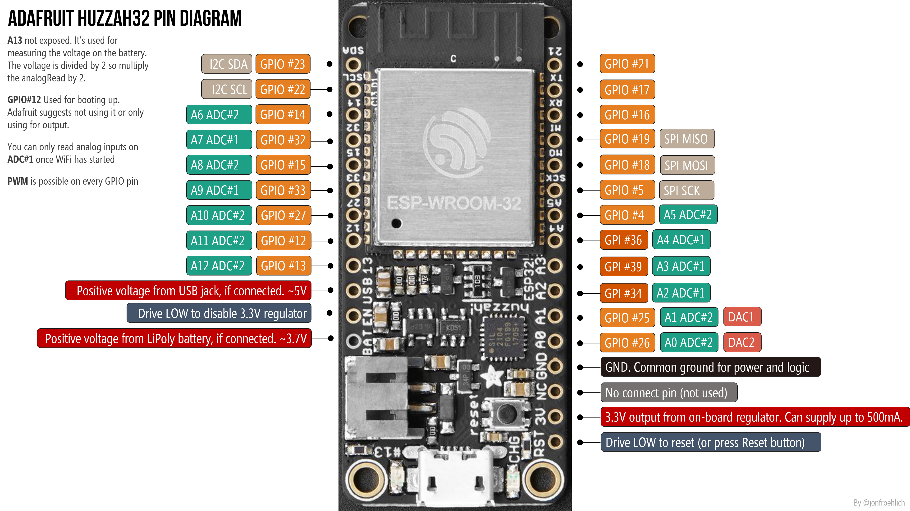
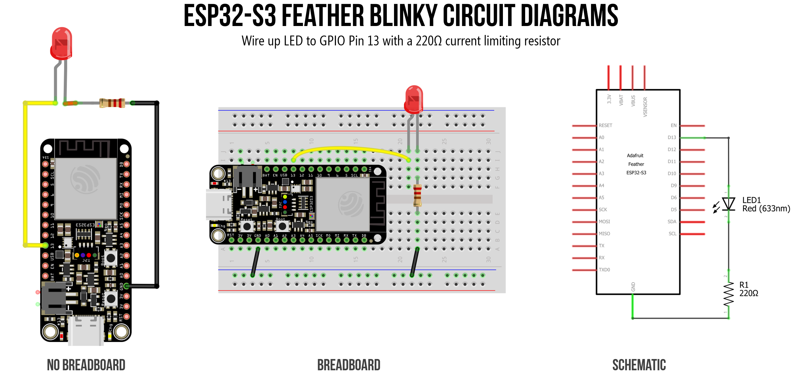
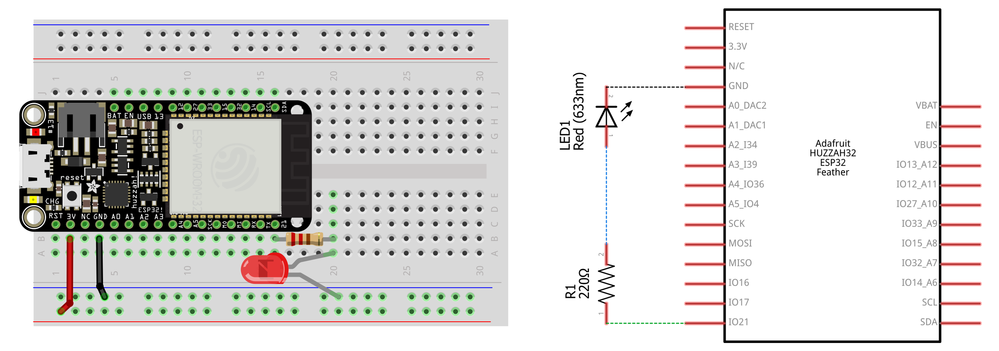

# {{ page.title | replace_first:'L','Lesson '}}
{: .no_toc }

## Table of Contents
{: .no_toc .text-delta }

1. TOC
{:toc}
---

In this lesson, we'll write our first ESP32 program: blinking an LED! If you've completed the Arduino [Blink lesson](../arduino/led-blink.md), you'll find that the code is *identical*—the beauty of the Arduino ecosystem. The challenge here is getting comfortable with the new board's pin layout and the 3.3V operating voltage.

We'll start with the **onboard LED** (no wiring required!), then move to an **external LED circuit**, try it in the **Wokwi simulator**, and finish with a fun bonus: blinking the **onboard NeoPixel** in any color you want. 🌈

{: .note }
> **In this lesson, you will learn:**
> - How to blink the onboard LED using `LED_BUILTIN`—no wiring needed
> - How to wire an external LED to an ESP32 GPIO pin with a current-limiting resistor
> - How `digitalWrite()` works the same on both ESP32 and Arduino
> - How the 3.3V operating voltage affects current calculations
> - How to blink the onboard NeoPixel RGB LED on the ESP32-S3 Feather

## Part 1: Blink the onboard LED

Let's start with the simplest possible program—**blinking the built-in LED** on the ESP32. The nice thing is, this requires no breadboard, no wiring, just the ESP32 and a USB cable. This is a great way to verify your [IDE setup](esp32-ide.md) is working before adding external components.

The ESP32-S3 Feather (and the Huzzah32) have a small **red LED** on the board connected to **GPIO 13**, which is defined as `LED_BUILTIN` in the Arduino core—just like on the Uno!

### The code

This is (almost) the same Blink sketch you wrote for the [Blink lesson](../arduino/led-blink.md) in the ["Intro to Arduino"](../arduino/index.md) series (that's the beauty of Arduino!). 

```cpp
/**
 * Blink the onboard LED.
 *
 * This code is identical for Arduino Uno, Leonardo, 
 * Huzzah32, ESP32-S3 Feather, and more! That's the beauty of Arduino!
 *
 * See: https://makeabilitylab.github.io/physcomp/esp32/led-blink
 */

void setup() {
  pinMode(LED_BUILTIN, OUTPUT);
  Serial.begin(115200);           // ESP32 defaults to 115200 baud
  Serial.println("Hello from the ESP32! 🚀");
  Serial.print("LED_BUILTIN is on pin: ");
  Serial.println(LED_BUILTIN);
}

void loop() {
  digitalWrite(LED_BUILTIN, HIGH);  // turn LED on (3.3V)
  delay(1000);                      // wait one second

  digitalWrite(LED_BUILTIN, LOW);   // turn LED off (0V)
  delay(1000);                      // wait one second
}
```

Upload this sketch and open the **Serial Monitor** at **115200 baud**. You should see the hello message and the red onboard LED blinking. 🎉

{: .note }
> We use `115200` baud for `Serial.begin()` instead of the `9600` we used with the Arduino Uno. The ESP32 defaults to 115200 baud, and since the ESP32 is much faster, there's no reason to use the slower rate. Make sure your Serial Monitor baud rate matches!

{: .warning }
> **Native USB gotcha (ESP32-S3):** Because the ESP32-S3 uses native USB (not a separate USB-to-UART chip like the Uno's ATmega16U2 or the Huzzah32's CP2104), the serial port will **temporarily disappear** if the board crashes, resets, or enters deep sleep. If your Serial Monitor disconnects unexpectedly, just press the **Reset** button and reopen it. This is normal behavior for native USB—it's the same with the Arduino Leonardo.

### Workbench video blinking built-in LED

<video autoplay loop muted playsinline aria-label="Workbench video showing the Adafruit ESP32-S3 blinking the internal LED on GPIO 13">
  <source src="assets/videos/ESP32-S3-BlinkyBuiltInLED-IMG_9348-Trimmed_optimized_muted.mp4" type="video/mp4">
</video>
**Video.** A workbench video of blinking the built-in LED on the Adafruit ESP32-S3.
{: .fs-1 }

## Part 2: Blink an external LED

Now let's connect an external LED—this is where you'll practice reading the pin diagram and wiring up a real circuit (again, mirroring our [Blink lesson](../arduino/led-blink.md) in the "Intro to Arduino" series).

### Materials

We're using the **[Adafruit's ESP32-S3 Feather](https://www.adafruit.com/product/5477)** but any ESP32-S3 board will work!

| Breadboard | ESP32 | LED | Resistor |
| ---------- |:-----:|:-----:|:-----:|
|  |  |  |  |
| Breadboard | [ESP32-S3 Feather](https://www.adafruit.com/product/5477)| Red LED | 220Ω Resistor |

### Picking a pin

The ESP32-S3 Feather exposes **20 general-purpose GPIO pins** on its breakout headers, all of which support digital output—so any of them can blink an LED. There is also a dedicated **DB** (Debug) pin that outputs low-level [ESP-IDF](https://docs.espressif.com/projects/esp-idf/en/stable/esp32s3/get-started/index.html) boot messages. This is separate from `Serial.print()`, which goes over native USB. A few additional GPIOs—like GPIO 21 (`NEOPIXEL_POWER`) and GPIO 33 (`PIN_NEOPIXEL`)—are used internally on the board but are not broken out to headers.


**Figure.** The ESP32-S3 Feather exposes 20 GPIO pins that can be used for digital output. GPIO 13 is also connected to the onboard red LED (`LED_BUILTIN`). Right-click and open image in a new tab to zoom in.
{: .fs-1 }

Unlike the Arduino Uno where pins 0–13 are neatly numerically sequenced along one side of the board, the ESP32-S3 Feather's pins have multiple names depending on context. For example, the pin labeled **A5** on the board silkscreen is also **GPIO 8**, **ADC1 channel 7**, and **touch input T8**. In your Arduino code, you can refer to it by any of these aliases:

- `8` — the raw GPIO number (always works)
- `A5` — the analog input alias (defined by the board variant file)
- `T8` — the touch input alias

For digital output like blinking an LED, just use the GPIO number. When you write `const int LED_PIN = 5;`, that refers to GPIO 5, regardless of where it sits physically on the board. Always consult your board's [pin diagram](esp32.md#esp32-s3-feather-pin-diagram) to find which GPIO number maps to which physical location.

Most of the 20 pins are completely free to use, but a few have secondary roles:

- **GPIO 38 (RX)** and **GPIO 39 (TX)** are the default UART pins. Unlike the Arduino Uno—where TX/RX carry all Serial Monitor traffic—the ESP32-S3 uses **native USB** for `Serial.print()` and code upload, so these two pins are free for general use unless you explicitly initialize `Serial1` in your code (*e.g.,* to communicate with serial devices or other ESP32 boards).

- **GPIO 3 (SDA)** and **GPIO 4 (SCL)** are the default I2C pins and are wired to the onboard STEMMA QT connector with physical pull-up resistors (~5–10kΩ), so they default HIGH. An LED on one of these pins may appear dimly lit before your code runs. For a first blink exercise, the simplest choice is to avoid SDA and SCL.

For this lesson, we'll use **GPIO 13**. Since GPIO 13 is also `LED_BUILTIN`, your external LED and the onboard red LED will blink together—a nice visual confirmation that everything is connected correctly. You can use any other output-capable GPIO pin; just update the pin number in your code.

<!-- TODO: use Sparkfun LEDs with resistors built in to connect one LED per GPIO pin on a breadboard and write a program to show them all sequentially blink. Then take a video.

See https://www.sparkfun.com/led-blue-with-resistor-5mm-25-pack.html -->

<details markdown="1">
<summary><strong>Using the Huzzah32 instead?</strong> (click to expand)</summary>

On the Huzzah32, our original code examples and Fritzing diagrams use **GPIO 21**, which is a general-purpose GPIO pin. You can also use GPIO 13 (`LED_BUILTIN`) for consistency with the ESP32-S3. Any output-capable GPIO pin will work—just avoid pins 34, 39, and 36, which are input-only on the Huzzah32.


**Figure.** Huzzah32 pin diagram. See the Adafruit Huzzah32 [docs](https://learn.adafruit.com/adafruit-huzzah32-esp32-feather/pinouts) for details.
{: .fs-1 }

</details>

### Building the circuit

Our circuit is about as simple as they come: an LED connected to a GPIO pin through a current-limiting resistor. It should look familiar, we did something similar in the [Blink lesson](../arduino/led-blink.md) in the ["Intro to Arduino series"](../arduino/index.md).


**Figure.** Circuit diagram showing a red LED connected to GPIO 13 on the ESP32 via a 220Ω current-limiting resistor.
{: .fs-1 }

<details markdown="1">
<summary><strong>Using the Huzzah32 instead?</strong> (click to expand)</summary>

**Figure.** Circuit diagram showing an LED connected to GPIO 21 on the Huzzah32 via a 220Ω current-limiting resistor. If you're using the ESP32-S3 Feather, use GPIO 13 (or any output-capable pin) instead.
{: .fs-1 }
</details>

Seating the ESP32 into the breadboard might take some effort. Please take care not to bend pins when placing and removing the board. Given that the ESP32 Feather boards take up so much room on a half-sized breadboard, you might consider using a full-sized breadboard instead.

### Calculating the current

We're using the same 220Ω resistor from the Arduino [Blink lesson](../arduino/led-blink.md). But now we're on a **3.3V** board instead of 5V, so the current will be lower.

Assuming a ~2V forward voltage ($$V_f$$) for a red LED:

$$I = \frac{V_{cc} - V_f}{R} = \frac{3.3V - 2V}{220Ω} = 5.9mA$$

Compare this to the ~13.6mA we'd get on a 5V Arduino Uno ($$\frac{5V - 2V}{220Ω} = 13.6mA$$). Your LED will be slightly dimmer—but still clearly visible. If you want to match the Arduino brightness, use a smaller resistor like 100Ω ($$\frac{3.3V - 2V}{100Ω} = 13mA$$).

{: .warning }
> The ESP32-S3's GPIO pins default to a drive strength of ~**20mA** per pin, except for GPIO17 and 18 (default to 10mA) and GPIO19 and 20 (default to 40mA)—see Section 2.2 of the [ESP32-S3 datasheet (PDF)](https://www.espressif.com/sites/default/files/documentation/esp32-s3_datasheet_en.pdf). The original ESP32 defaults to ~20mA as well, with a recommended max of 40mA per pin. Our 5.9mA is well within the safe range!

### The code

The code is identical to Part 1. If you used `LED_BUILTIN` (which maps to GPIO 13), your external LED on GPIO 13 is already blinking! If you wired your LED to a different pin, just change the constant. We're keeping ours on `LED_BUILTIN` (GPIO 13), so we'll wire up the external LED to GPIO 13 as well—then the internal and external LEDs will blink in sync.

```cpp
const int LED_OUTPUT_PIN = LED_BUILTIN;  // change to whatever GPIO pin you used

void setup() {
  pinMode(LED_OUTPUT_PIN, OUTPUT);
}

void loop() {
  digitalWrite(LED_OUTPUT_PIN, HIGH);
  delay(1000);
  digitalWrite(LED_OUTPUT_PIN, LOW);
  delay(1000);
}
```

This [source code](https://github.com/makeabilitylab/arduino/blob/master/ESP32/Basics/Blink/Blink.ino) is on GitHub.
{: .fs-1 }

### Workbench video of blinking the external LED

<video autoplay loop muted playsinline aria-label="Workbench video showing the Adafruit ESP32-S3 blinking the external LED hooked up to GPIO 13">
  <source src="assets/videos/ESP32-S3-BlinkyExternalLED-IMG_9350-Trimmed_optimized_muted.mp4" type="video/mp4">
</video>
**Video.** A workbench video of blinking the external LED hooked up to GPIO 13 on the Adafruit ESP32-S3. Because GPIO 13 is also tied to the `LED_BUILTIN`, the built-in LED on the board blinks in sync!
{: .fs-1 }

## Part 3: Try it in the Wokwi simulator

<video autoplay loop muted playsinline style="margin:0px" aria-label="Video showing blinky running in the Wokwi simulator">
  <source src="assets/videos/Wokwi_ESP32-S3-Blink_optimized.mp4" type="video/mp4" />
</video>
**Video.** Blinky running in the **Wokwi simulator** on the ESP32-S3 DevKitC. Run it yourself on [Wokwi here](https://wokwi.com/projects/463754140590397441).
{: .fs-1 }

In our [Intro to Arduino lessons](../arduino/), we use [Autodesk Tinkercad](https://www.tinkercad.com/circuits) for circuit simulation—but unfortunately, Tinkercad does not support the ESP32. So, [Wokwi](https://wokwi.com/) is the best available alternative: it simulates the ESP32, ESP32-S3, and many other boards, and even supports WiFi simulation. If you don't have hardware handy, you can build and run circuits in Wokwi entirely in the browser. We'll link to Wokwi projects throughout these ESP32 lessons so you can experiment without hardware.

A few things to be aware of:

- **Wokwi does not simulate the Adafruit ESP32-S3 Feather specifically.** It uses a generic Espressif ESP32-S3 DevKitC board. The code you write is identical, but some board-specific pin definitions (like `LED_BUILTIN` or `PIN_NEOPIXEL`) may map to different GPIO numbers than on the Adafruit Feather. When in doubt, use explicit GPIO numbers (*e.g.,* `13` instead of `LED_BUILTIN`) in your Wokwi projects.

- **Compile times are slower** than Tinkercad—you may wait 90+ seconds for your code to compile on the free tier. The site will also occasionally prompt you to upgrade to a paid plan. The free tier is sufficient for everything in our lessons.

- **Wokwi is a small company**, not backed by a large corporation like Autodesk. It could go down or go away. We always try to show real hardware videos or images of our build examples as well.

**[→ Open the external LED Blink simulation in Wokwi](https://wokwi.com/projects/463754140590397441)**

### Building blinky in Wokwi

As this is our first time introducing Wokwi, the video below shows a full build out of blinky in the Wokwi simulation environment, including both wiring and coding. The video also shows the long compile times. This is because Wokwi actually compiles the C++ Arduino code using a real compiler toolchain and compiling the ESP32 takes longer than just compiling the traditional Arduino libraries.

<video loop controls playsinline style="margin:0px" aria-label="Video showing us building blinky in the Wokwi simulation environment">
  <source src="assets/videos/Wokwi_ESP32-S3-BuildingBlink_SpedUp_optimized_muted.mp4" type="video/mp4" />
</video>
**Video.** This video shows us building the basic blinky program on the ESP32-S3 DevKitC board in Wokwi. Run it yourself on [Wokwi here](https://wokwi.com/projects/463754140590397441).
{: .fs-1 }

### Quick tips for using Wokwi

- **Adding components:** Click the blue **+** button above the simulation area to add LEDs, resistors, buttons, potentiometers, and more. Click on a component to edit its properties (like resistor value).
- **Wiring:** Click on a pin to start a wire, then click on the destination pin to complete the connection. Wires snap to pins automatically.
- **Serial Monitor:** Your `Serial.println` output appears in the **console pane** below the code editor—look for it after pressing ▶ play.
- **Under the hood:** Wokwi circuits are defined by a `diagram.json` file (visible in the editor tabs), not a visual canvas like Tinkercad. You can edit this JSON directly to add or modify components, but the visual editor is easier for beginners.
- **Saving projects:** You'll need a free Wokwi account to save your projects. You can also export the `diagram.json` and `.ino` files to keep a local backup.

{: .warning }
> **Why not simulate Part 1 (onboard LED)?** Wokwi's default ESP32-S3 board is the generic Espressif DevKitC, which does not have a standard red LED on GPIO 13 like the Adafruit Feather does. On the DevKitC, `LED_BUILTIN` maps to an internal NeoPixel hack (pin 97!) that doesn't respond to `digitalWrite`. That's why we start with an external LED in the simulator—it works the same regardless of which ESP32-S3 board Wokwi emulates.

### Start your own Wokwi projects

Here are the standard template URLs you'll want to bookmark to spin up fresh projects:

- **ESP32-S3** (Arduino): [https://wokwi.com/projects/new/esp32-s3](https://wokwi.com/projects/new/esp32-s3)
- **Classic ESP32** (Arduino): [https://wokwi.com/projects/new/esp32](https://wokwi.com/projects/new/esp32)

Once you open one of those, you can add components (like the NeoPixel ring or an OLED), write your code, and click Save. Wokwi will then generate a unique, permanent URL for that specific circuit and code that you can share.

## Part 4: Blink the onboard NeoPixel 🌈

Many ESP32-S3 development boards—including the Adafruit ESP32-S3 Feather and Espressif's own ESP32-S3-DevKitC—include a built-in **NeoPixel** (WS2812B) RGB LED. Unlike the plain red `LED_BUILTIN`, the NeoPixel can display **any color** by mixing red, green, and blue channels (each 0–255). Let's blink it!

There are two main ways to control the onboard NeoPixel: a zero-dependency built-in function, and the full-featured Adafruit NeoPixel library. We'll show both.

### Option 1: `rgbLedWrite()` (built-in, no library needed)

The ESP32 Arduino core v3.x includes a built-in [`rgbLedWrite()`](https://github.com/espressif/arduino-esp32/blob/master/cores/esp32/esp32-hal-rgb-led.h) function that drives NeoPixel LEDs using the chip's [RMT (Remote Control Transceiver)](https://docs.espressif.com/projects/esp-idf/en/latest/esp32s3/api-reference/peripherals/rmt.html) peripheral—no library installation required. This is the approach used by the built-in BlinkRGB example (**File → Examples → ESP32 → GPIO → BlinkRGB**).

```cpp
/**
 * Blink the onboard NeoPixel RGB LED using the built-in rgbLedWrite() function.
 * No library installation needed—this function is part of the ESP32 Arduino core.
 *
 * See: File -> Examples -> ESP32 -> GPIO -> BlinkRGB
 * 
 * By Jon E. Froehlich
 * @jonfroehlich | https://jonfroehlich.github.io/
 * https://makeabilitylab.github.io/physcomp/esp32/led-blink
 */

void setup() {
  // No setup needed! The Arduino core handles the NeoPixel power pin
  // and RMT peripheral initialization automatically when you use RGB_BUILTIN.
}

void loop() {
  rgbLedWrite(RGB_BUILTIN, 255, 0, 0);  // Red
  delay(500);
  rgbLedWrite(RGB_BUILTIN, 0, 0, 0);    // Off
  delay(500);

  rgbLedWrite(RGB_BUILTIN, 0, 255, 0);  // Green
  delay(500);
  rgbLedWrite(RGB_BUILTIN, 0, 0, 0);    // Off
  delay(500);

  rgbLedWrite(RGB_BUILTIN, 0, 0, 255);  // Blue
  delay(500);
  rgbLedWrite(RGB_BUILTIN, 0, 0, 0);    // Off
  delay(500);

  rgbLedWrite(RGB_BUILTIN, 255, 0, 255); // Purple (Go UW Huskies!)
  delay(500);
  rgbLedWrite(RGB_BUILTIN, 0, 0, 0);     // Off
  delay(500);
}
```

Upload this and watch your NeoPixel cycle through red, green, and blue! Try changing the color values to create your own colors—remember, each channel (R, G, B) ranges from 0 to 255.

`RGB_BUILTIN` is a special *virtual* pin constant defined by the board variant file—you don't need to know the actual GPIO number. When you pass `RGB_BUILTIN` to `rgbLedWrite()` or even `digitalWrite()`, the Arduino core automatically routes the call through the RMT-based NeoPixel driver and handles the NeoPixel power pin for you.

{: .note }
> You can also use `digitalWrite(RGB_BUILTIN, HIGH)` to turn the NeoPixel on (white at default brightness) and `LOW` to turn it off. This is the simplest possible approach but gives you no color control. The default brightness is set by `#define RGB_BRIGHTNESS` (64 out of 255) but that `#define` must come before any includes or usage and only works for `digitalWrite`.

{: .warning }
> `RGB_BUILTIN` is a virtual pin number—it won't work with third-party NeoPixel libraries like `Adafruit_NeoPixel` or `FastLED`. Those libraries need the real GPIO pin number (use `PIN_NEOPIXEL` instead). See Option 2 below.

#### Add brightness control

If you ran this program on your own ESP32-S3, you may have noticed that the RGB LED is **very bright** 😎 (yikes!). With `rgbLedWrite()`, you control brightness by scaling down the R, G, B values themselves—there's no separate brightness parameter. For example, `rgbLedWrite(RGB_BUILTIN, 128, 0, 0)` gives you a dimmer red than `(255, 0, 0)`.

We can thus create a small utility function to help us provide brightness control:

```cpp
void rgbLedWriteWithBrightness(uint8_t pin, uint8_t r, uint8_t g, uint8_t b, uint8_t brightness) {
  rgbLedWrite(pin, (r * brightness) / 255, (g * brightness) / 255, (b * brightness) / 255);
}
```

Integrating that into the full sketch looks like:

```cpp
/**
 * Blink the onboard NeoPixel RGB LED using the built-in rgbLedWrite() function
 * with adjustable brightness. No library installation needed—this function is
 * part of the ESP32 Arduino core.
 *
 * The rgbLedWrite() function has no brightness parameter, so we scale each
 * color channel manually in rgbLedWriteWithBrightness().
 *
 * See: File -> Examples -> ESP32 -> GPIO -> BlinkRGB
 * 
 * By Jon E. Froehlich
 * @jonfroehlich | https://jonfroehlich.github.io/
 * https://makeabilitylab.github.io/physcomp/esp32/led-blink
 */

const uint8_t BRIGHTNESS = 64; // 0-255, where 255 is full brightness

void setup() {
  // No setup needed! The Arduino core handles the NeoPixel power pin
  // and RMT peripheral initialization automatically when you use RGB_BUILTIN.
}

void loop() {
  rgbLedWriteWithBrightness(RGB_BUILTIN, 255, 0, 0, BRIGHTNESS);    // Red
  delay(500);
  rgbLedWriteWithBrightness(RGB_BUILTIN, 0, 0, 0, BRIGHTNESS);      // Off
  delay(500);

  rgbLedWriteWithBrightness(RGB_BUILTIN, 0, 255, 0, BRIGHTNESS);    // Green
  delay(500);
  rgbLedWriteWithBrightness(RGB_BUILTIN, 0, 0, 0, BRIGHTNESS);      // Off
  delay(500);

  rgbLedWriteWithBrightness(RGB_BUILTIN, 0, 0, 255, BRIGHTNESS);    // Blue
  delay(500);
  rgbLedWriteWithBrightness(RGB_BUILTIN, 0, 0, 0, BRIGHTNESS);      // Off
  delay(500);

  rgbLedWriteWithBrightness(RGB_BUILTIN, 255, 0, 255, BRIGHTNESS);  // Purple (Go UW Huskies!)
  delay(500);
  rgbLedWriteWithBrightness(RGB_BUILTIN, 0, 0, 0, BRIGHTNESS);      // Off
  delay(500);
}

/**
 * Writes an RGB color to a NeoPixel pin, scaled by a brightness value.
 * 
 * Since rgbLedWrite() has no built-in brightness control, this function
 * scales each color channel proportionally: output = (channel * brightness) / 255.
 *
 * @param pin        The NeoPixel pin (e.g., RGB_BUILTIN)
 * @param r          Red channel (0-255, before brightness scaling)
 * @param g          Green channel (0-255, before brightness scaling)
 * @param b          Blue channel (0-255, before brightness scaling)
 * @param brightness Overall brightness (0-255, where 255 = no dimming)
 */
void rgbLedWriteWithBrightness(uint8_t pin, uint8_t r, uint8_t g, uint8_t b, uint8_t brightness) {
  rgbLedWrite(pin, (r * brightness) / 255, (g * brightness) / 255, (b * brightness) / 255);
}
```

### Workbench video of rgbLedWriteWithBrightness

<video autoplay loop muted playsinline aria-label="Workbench video showing the Adafruit ESP32-S3 blinking the onboard NeoPixel RGB LED using the built-in rgbLedWrite() function with adjustable brightness">
  <source src="assets/videos/ESP32-S3-BlinkingBuiltInNeoPixelUsingRgbLedWrite_optimized_muted.mp4" type="video/mp4">
</video>
**Video.** A workbench video of blinking internal RGB LED on the Adafruit ESP32-S3.
{: .fs-1 }

### Option 2: Adafruit NeoPixel library

If you need more advanced features—like driving a *strip* of NeoPixels, adjusting global brightness, using color helper functions like `ColorHSV()`, or doing gamma correction—install the **Adafruit NeoPixel** library. This is the approach you'll want for [addressable LED projects](../advancedio/addressable-leds.md).

To install: open the Arduino IDE, go to **Sketch → Include Library → Manage Libraries**, search for `Adafruit NeoPixel`, and install it.

{: .important }
> When using the Adafruit NeoPixel library, you must use the real GPIO pin (`PIN_NEOPIXEL`), not `RGB_BUILTIN`. You also need to manually enable the **NeoPixel power pin** (`NEOPIXEL_POWER`)—unlike `rgbLedWrite()`, the Adafruit library doesn't handle this automatically. If you skip this step, the NeoPixel will stay dark!

```cpp
/**
 * Blink the onboard NeoPixel RGB LED using the Adafruit NeoPixel library.
 * Works on any Adafruit Feather with a built-in NeoPixel.
 *
 * Requires the Adafruit NeoPixel library:
 *   Sketch -> Include Library -> Manage Libraries -> search "Adafruit NeoPixel"
 *
 * By Jon E. Froehlich
 * @jonfroehlich | https://jonfroehlich.github.io/
 * https://makeabilitylab.github.io/physcomp/esp32/led-blink
 */
#include <Adafruit_NeoPixel.h>

// One NeoPixel on the board, on the pin defined by PIN_NEOPIXEL
Adafruit_NeoPixel _pixel(1, PIN_NEOPIXEL, NEO_GRB + NEO_KHZ800);

// Blink delay
const int BLINK_DELAY_MS = 500;

void setup() {
  // The NeoPixel on the ESP32-S3 Feather has a separate power pin
  // that must be set HIGH before the NeoPixel will light up.
  // The #if defined guard makes this code portable across boards.
  #if defined(NEOPIXEL_POWER)
    pinMode(NEOPIXEL_POWER, OUTPUT);
    digitalWrite(NEOPIXEL_POWER, HIGH);
  #endif

  _pixel.begin();
  _pixel.setBrightness(30);  // 0-255; keep it low to avoid blinding yourself!
}

void loop() {
  _pixel.setPixelColor(0, _pixel.Color(255, 0, 0));    // Red
  _pixel.show();
  delay(BLINK_DELAY_MS);

  _pixel.setPixelColor(0, _pixel.Color(0, 0, 0));      // Off
  _pixel.show();
  delay(BLINK_DELAY_MS);

  _pixel.setPixelColor(0, _pixel.Color(0, 255, 0));    // Green
  _pixel.show();
  delay(BLINK_DELAY_MS);

  _pixel.setPixelColor(0, _pixel.Color(0, 0, 0));      // Off
  _pixel.show();
  delay(BLINK_DELAY_MS);

  _pixel.setPixelColor(0, _pixel.Color(0, 0, 255));    // Blue
  _pixel.show();
  delay(BLINK_DELAY_MS);

  _pixel.setPixelColor(0, _pixel.Color(0, 0, 0));      // Off
  _pixel.show();
  delay(BLINK_DELAY_MS);

  _pixel.setPixelColor(0, _pixel.Color(255, 0, 255));  // Purple (Go UW Huskies!)
  _pixel.show();
  delay(BLINK_DELAY_MS);

  _pixel.setPixelColor(0, _pixel.Color(0, 0, 0));      // Off
  _pixel.show();
  delay(BLINK_DELAY_MS);
}
```

We also built a version on Wokwi, which you can [simulate here](https://wokwi.com/projects/463762124548962305).

<!-- TODO: Record a workbench video showing the blink RGB LED circuit on the ESP32-S3 Feather.
     Use <video> with aria-label.-->

{: .note }
> **Which approach should I use?** For the onboard NeoPixel, `rgbLedWrite()` is simpler—zero setup, zero dependencies. Use the Adafruit NeoPixel library when you need to drive external NeoPixel strips, need color utilities like `ColorHSV()` and `gamma32()`, or just because you're already familiar with the NeoPixel library!

<details markdown="1">
<summary><strong>Using the Huzzah32 instead?</strong> (click to expand)</summary>

The original Huzzah32 **does not** have an onboard NeoPixel, and `RGB_BUILTIN` is not defined for that board. If you want to try NeoPixel code, you'll need to connect an external NeoPixel (or NeoPixel strip) to a GPIO pin and use the Adafruit NeoPixel library with that pin number. See our [Addressable LEDs lesson](../advancedio/addressable-leds.md) for details on wiring external NeoPixels.

</details>

## Summary

In this lesson, you blinked LEDs on the ESP32 in four parts:

- **Part 1:** Blinked the onboard red LED using `LED_BUILTIN` and `digitalWrite`—zero wiring, identical code to the Arduino Uno.
- **Part 2:** Wired an external LED circuit and calculated the current with the ESP32's 3.3V supply (5.9mA with a 220Ω resistor vs. 13.6mA on the 5V Uno).
- **Part 3:** Built and ran the blink circuit in the Wokwi simulator—our browser-based alternative to Tinkercad for ESP32.
- **Part 4:** Blinked the onboard NeoPixel RGB LED two ways: using the built-in `rgbLedWrite()` function (zero dependencies) and the Adafruit NeoPixel library (for advanced features like strips and brightness control).

The key takeaway: `pinMode`, `digitalWrite`, and `delay` work **identically** on the ESP32 and Arduino. The differences are in the pin layout, the 3.3V voltage, and the extra hardware features (like the NeoPixel) that the ESP32-S3 Feather provides.

## Exercises

**Exercise 1:** Modify the blink rate to create a pattern: blink fast three times (100ms on, 100ms off), then pause for one second. Repeat. Try this with both `LED_BUILTIN` and the NeoPixel.

**Exercise 2:** Make the onboard NeoPixel display a **rainbow cycle**. Use a `for` loop to step through hue values and convert to RGB. (Hint: the `Adafruit_NeoPixel` library has a `ColorHSV()` function that takes a hue value from 0–65535.)

**Exercise 3:** Connect a second LED to a different GPIO pin and make the two LEDs alternate: when one is on, the other is off. What happens if you use `delay(1)` instead of `delay(1000)`? Can you still see the alternation?

**Exercise 4:** Write a program that blinks the NeoPixel in a different color every time the board resets. (Hint: use `random(256)` to pick random R, G, B values in `setup()`.)

## Next Lesson

In the [next lesson](led-fade.md), we'll learn how to use "analog output" on the ESP32 to smoothly fade an LED's brightness up and down. This is where things start to diverge from Arduino: instead of `analogWrite`, the ESP32 uses the **LEDC** (LED Control) PWM library!

<span class="fs-6">
[Previous: Introduction to the ESP32](esp32.md){: .btn .btn-outline }
[Next: Fading an LED with PWM](led-fade.md){: .btn .btn-outline }
</span>