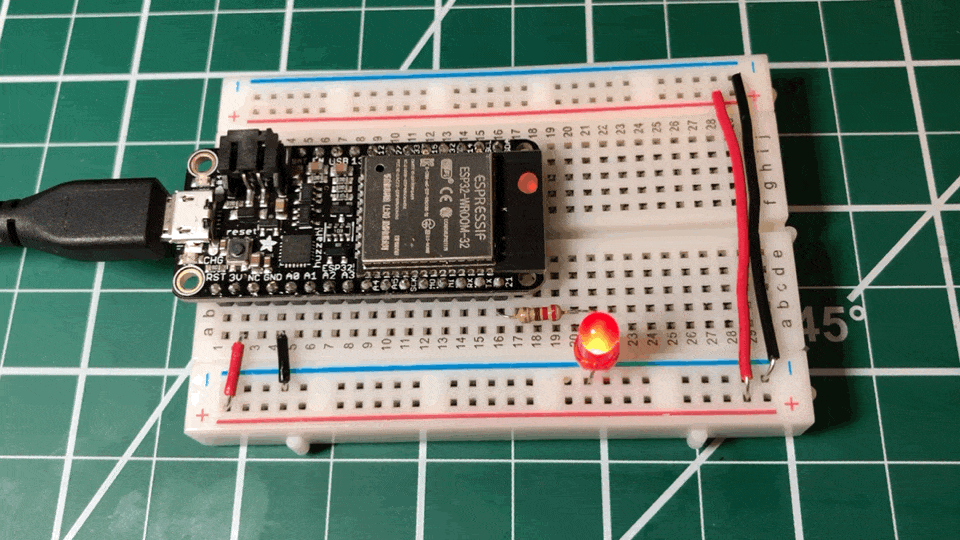
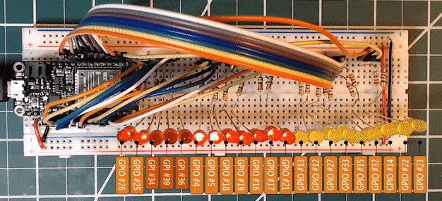
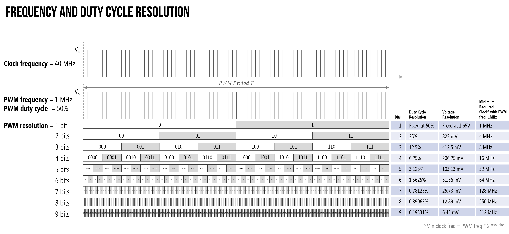
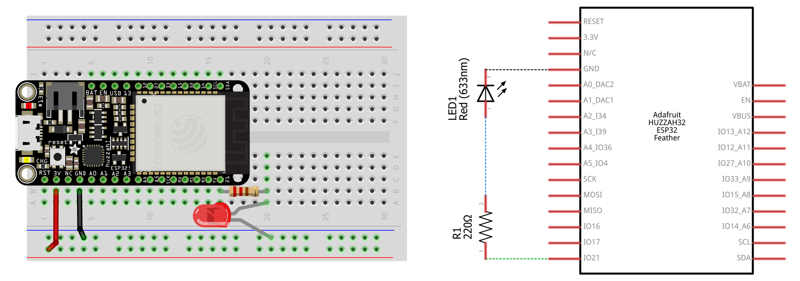
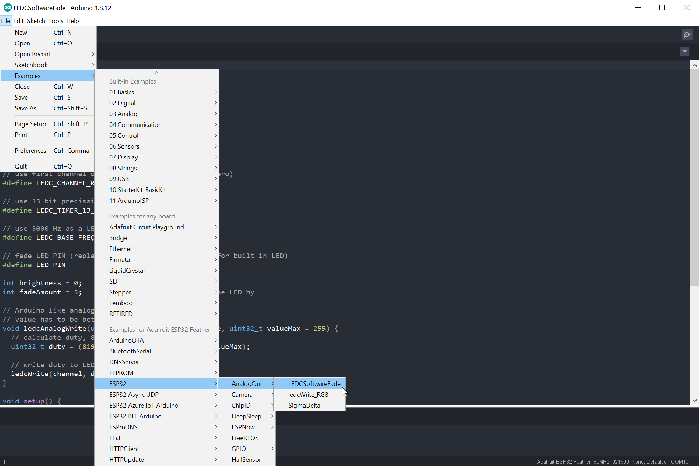

# {{ page.title | replace_first:'L','Lesson '}}
{: .no_toc }

## Table of Contents
{: .no_toc .text-delta }

1. TOC
{:toc}
---

In this lesson, we'll show how to use [PWM](https://www.arduino.cc/en/Tutorial/PWM) output on the ESP32 to fade an LED on and off. This is where our lessons begin to differ from the [Intro to Output](../arduino/intro-output.md) series in the [Intro to Arduino section](../arduino/).

Importantly, the [`analogWrite`](https://www.arduino.cc/reference/en/language/functions/analog-io/analogwrite/) method—which was always a misnomer in the Arduino library because it output a pulse-width modulation (PWM) waveform rather than a true analog voltage—is not implemented in the ESP32 Arduino library. Instead, there is a set of PWM methods, which provide additional control but at a cost of complexity. So, it's good that, by now, you understand PWM. If you want a refresher, see our description and watch the videos [here](../arduino/led-fade.md#Pulse-width-modulation-PWM).



## Materials

You'll need the same materials as the [last lesson](led-blink.md):

| Breadboard | ESP32 | LED | Resistor |
| ---------- |:-----:|:-----:|:-----:|
|  |     |  |  |
| Breadboard | Huzzah32  | Red LED | 220Ω Resistor |

## PWM on ESP32

To fade an LED on and off with an Arduino Uno (or other basic Arduino boards), you use the [`analogWrite`](https://www.arduino.cc/reference/en/language/functions/analog-io/analogwrite/) method. As we know by now, `analogWrite` does not actually drive an analog voltage to the specified pin but, instead, uses pulse-width modulation (PWM). These PWM waves are produced by hardware timers, which precisely drive a pin `HIGH` and `LOW` based on the set duty cycle. So, on the Arduino Uno, `analogWrite(3, 127)` would output a 5V value for half the period (because 127/255 = ~50%) on Pin 3 and `analogWrite(3, 191)` would output a 5V for 75% of the period (because 191/255 = ~75%). The fraction of the time the signal is `HIGH` is called the duty cycle. The Arduino Uno (and Leonardo) only have six PWM outputs because they have three timers, each which can be used to control two PWM pins.

On the ESP32, all 18 GPIO pins support PWM but the programming approach is different. Rather than `analogWrite`, we'll use Espressif's [LED control (LEDC)](https://docs.espressif.com/projects/esp-idf/en/latest/esp32/api-reference/peripherals/ledc.html) library. More specifically, we'll use an Arduino-based abstraction layer above this. While the available documentation for the Arduino LEDC library is a bit light (indeed, I never found formal API docs), the code is open source and available here ([.h file](https://github.com/espressif/arduino-esp32/blob/a4305284d085caeddd1190d141710fb6f1c6cbe1/cores/esp32/esp32-hal-ledc.h), [.c file](https://github.com/espressif/arduino-esp32/blob/a4305284d085caeddd1190d141710fb6f1c6cbe1/cores/esp32/esp32-hal-ledc.c)). And we'll show you how to use it below.

### The LEDC PWM library

The LEDC library was written primarily to control LEDs but can also be used for other purposes where PWM waveforms are useful like playing "music" to piezo speakers (just like we did with [`tone()`](https://www.arduino.cc/reference/en/language/functions/advanced-io/tone/) in our [simple piano](../arduino/piano.md) lesson) and driving motors. The Arduino version of this library is part of the core ESP32 Arduino library, so you don't need any `include` statements to use it.

Unlike all the other I/O we've done thus far with the Arduino, the LEDC library works on **channels** rather than individual **pins**. To apply a PWM wave to a pin, first setup a channel with a PWM waveform frequency and duty cycle and then subscribe or "attach" that pin to this channel. Multiple pins can attach to the same channel and will receive the same PWM waveform. The ESP32 has 16 channels in total, each which can generate an independent waveform. So, while all 18 GPIO pins support PWM, we can only drive 16 of them at once with **unique** waveforms. However, we can attach all 18 GPIO pins to a single channel (or divide them across channels). In the animation below, we've attached all 18 GPIO pins to channel 0.



All 18 GPIO pins are subscribed to the same PWM channel.
{: .fs-1 } 

#### The LEDC API

<!-- https://github.com/espressif/arduino-esp32/blob/96822d783f3ab6a56a69b227ba4d1a1a36c66268/tools/sdk/include/driver/driver/ledc.h -->

The LEDC API has four relevant methods:


/**
 * Sets up a channel (0-15), a PWM duty cycle frequency, and a PWM resolution (1 - 16 bits) 
 */
double      ledcSetup(uint8_t channel, double freq, uint8_t resolution_bits);

/**
 * Writes out a duty cycle value to the specified channel. The duty cycle value should be
 * between 0 - 2^PWM resolution
 */
void        ledcWrite(uint8_t channel, uint32_t duty);

/**
 * Attach the given pin to the specified channel (0-15)
 */
void        ledcAttachPin(uint8_t pin, uint8_t channel);

/**
 * Detach the previously attached pin
 */
void        ledcDetachPin(uint8_t pin);


The Espressif [docs](https://docs.espressif.com/projects/esp-idf/en/latest/esp32/api-reference/peripherals/ledc.html#supported-range-of-frequency-and-duty-resolutions) emphasize that the PWM frequency and resolution are interdependent; however, they do not precisely describe this relationship but rather provide examples:
- A PWM frequency of **5 kHz** can have a maximum duty resolution of **13 bits**, which results in a resolution of ~0.012% or $$2^{13}=8192$$ discrete levels of LED intensity
- A PWM frequency of **20 MHz** can have a maximum duty resolution of **2 bits**, which results in a resolution of 25% or $$2^2=4$$ discrete levels
- A PWM frequency of **40 MHz** can have a duty resolution of 1 bit, which means the duty cycle is fixed at 50% and cannot be adjusted

If you attempt to set incompatible frequency and duty resolution combinations, the following error will be reported on serial monitor:

```
E (196) ledc: requested frequency and duty resolution cannot be achieved, try reducing freq_hz or duty_resolution.
```

**UPDATE:** I found that this error is not shown when using the Arduino LEDC library because internally, the `ledcSetup` function does bounds checking and, if a threshold is exceeded, sets things to their maximum values ([link](https://github.com/espressif/arduino-esp32/blob/a4305284d085caeddd1190d141710fb6f1c6cbe1/cores/esp32/esp32-hal-ledc.c)).

<!-- The LEDC on ESP32 has a total of 16 channels (0-15), divided into high and low speed channels (0-7) driven by 80MHz clock and low speed channels (8-15) driven by 1MHz clock. http://forum.banana-pi.org/t/arduino-for-bpi-bit-3-using-ledc-pwm/9394 --->

<!-- TODO: experiment with different resolutions and frequency combos and report back -->

<!-- I read more about the relationship between PWM frequency and duty cycle resolution. Still reading. No definitive answers, but some potentially helpful posts:
- https://www.microchip.com/forums/m79448.aspx. Which says: 

"PWM output is a tradeoff between PWM frequency and duty cycle resolution. For example, with a 1MHz oscillator you get a minimum PWM time slice of 1uS. You chose how many of these to include in a PWM period. If Ts is the time slice period, and N is the number of time slices selected per period, then:

PWM Frequency = 1 / (Ts * N)
Duty cycle resolution = 1 / (N + 1)"

- http://www.t-es-t.hu/download/microchip/an539c.pdf
This datasheet has a PWM resolution vs PWM frequency graph 

https://electrosome.com/pwm-pulse-width-modulation/
http://inst.eecs.berkeley.edu/~ee40/calbot/pdf/ChapterFive/ChapterFive.pdf
-->

<!-- some discussion of max pwm freq on esp33:
https://forum.micropython.org/viewtopic.php?t=3717. Appears to be 40MHz, which is 1/6 clock speed of 240MHz -->

#### Relationship between PWM frequency and resolution

So *why* and *how* are the PWM frequency and resolution interdependent? While the ESP32 [docs](https://docs.espressif.com/projects/esp-idf/en/latest/esp32/api-reference/peripherals/ledc.html#supported-range-of-frequency-and-duty-resolutions) are, unfortunately, sparse, here's the explanation.

Imagine you have a clock (CPU clock or a timer, doesn't matter) running at some frequency, and we want to set some PWM wave frequency and resolution. Our maximum PWM wave frequency is bound by the clock. If it's 40MHz, then our max PWM frequency is also 40MHz. We cannot produce a PWM wave faster than our clock.

But what about **resolution**? Well, resolution is really about how much we can slice up one period of the PWM wave into different duty cycles. And here's the insight: slicing up the PWM wave requires a CPU clock running at the $$PWM_{freq} * 2^{PWM resolution}$$. Why? Because to generate those duty cycles, you need to be able to create those time slices. And the only way to do so is with an even faster clock. (Note: this is the *ideal*. In reality, all things have overhead and so my understanding is that you generally want a CPU clock to be 30-50% faster than your fastest PWM freq; again, it would be nice if ESP32 actually gave us the equation).

Here's a visual example that, hopefully, further clarifies the concept. Here, you can see the clock running at 40MHz, the PWM freq at 1MHz, and then various PWM resolutions. For each of the PWM resolutions, I put in their "time slices"—this is when the PWM waveform generator would be able to potentially set the PWM wave HIGH or LOW for a given duty cycle. Notice how as the PWM resolution increases, the need for a faster and faster CPU clock also increases (to be able to meet those increasingly demanding duty cycle resolutions).

So, for example, if we want to set a PWM resolution of 5 bits running at 1MHz, then we need a clock running at least 32MHz. If we want a resolution of 6 bits at 1MHz, then we exceed our 40MHz clock speed.



For more PWM examples, see this [PDF](assets/images/PWM_FrequencyAndDutyCycle.pdf) that we made.

#### So what PWM frequency and resolution should I use?

So, what PWM frequency and resolution should you use? This is context dependent. Remember, the Arduino Uno supplies a ~490 Hz PWM waveform at 8 bits—though pins 5 and 6 are can drive a waveform at 980 Hz ([link](https://www.arduino.cc/reference/en/language/functions/analog-io/analogwrite/)). And this is more than fast enough to smoothly fade between different LED brightness levels. So, you can always start there (~490 Hz freq, 8-bit resolution) and then play around.

#### Using the LEDC API

Despite the somewhat confusing (and lacking) documentation, using the LEDC API is relatively straightforward: 
- First call `ledcSetup` to configure a channel with a specific PWM frequency and resolution
- Then attach a pin to that channel using `ledcAttachPin`
- Finally, to set the actual duty cycle value to a given channel, we call `ledcWrite` (this latter function is somewhat analogous to `analogWrite`; however, `ledcWrite` works on the "channel" abstraction whereas `analogWrite` works on pins).

### Alternatives to LEDC

In addition to the LEDC module, the ESP32 supports two other analog output options:

1. A **sigma-delta modulation module** ([docs](https://docs.espressif.com/projects/esp-idf/en/latest/esp32/api-reference/peripherals/sigmadelta.html)). In comparison to PWM, [sigma-delta modulation](https://en.wikipedia.org/wiki/Delta-sigma_modulation) has a built-in feedback loop to try and minimize timer errors and produce more accurate waveforms. There is a sigma-delta example in the Arduino IDE. Go to File -> Examples -> ESP32 -> AnalogOut -> SigmaDelta. Similar to the LEDC library, you attach pins to preconfigured sigma-delta channels.

2. **True analog output** via a digital-to-analog (DAC) converter ([docs](https://docs.espressif.com/projects/esp-idf/en/latest/esp32/api-reference/peripherals/dac.html)). The ESP32 has two 8-bit DACs connected to GPIO25 (Channel 1) and GPIO26 (Channel 2). The DAC driver allows these channels to be set to arbitrary voltages, which means you can finally produce beautiful sinusoidal voltage waveforms rather than those boring square waves. There are many examples online of folks using the ESP32's DAC to play music. Here's a tutorial by [Xtronical](https://www.xtronical.com/introduction-to-dac-audio/) but search online for more!

In this lesson, however, we are going to focus on using the LEDC library to produce PWM waveforms that will fade in and out an LED.

## Let's make an ESP32-based LED fader!

Let's make an ESP32-based LED fader.

### The Circuit

We can use the same circuit as before:



### The Code

We'll walk you through the code just as we did for some of the original Arduino [Intro to Output lessons](../arduino/intro-output.md). While our code is different, you may want to also access ESP32's official fade example in the Arduino IDE by clicking on File -> Examples -> ESP32 -> AnalogOut -> LEDCSoftwareFade. It's also open source and on [github](https://github.com/espressif/arduino-esp32/blob/master/libraries/ESP32/examples/AnalogOut/LEDCSoftwareFade/LEDCSoftwareFade.ino).


You can also access ESP32's official fade example in the Arduino IDE by clicking on File -> Examples -> ESP32 -> AnalogOut -> LEDCSoftwareFade.
{: .fs-1 } 

#### Step 1: Setup the PWM values

First, let's setup some PWM constants. Feel free to play with these.



const int PWM_CHANNEL = 0;    // ESP32 has 16 channels which can generate 16 independent waveforms
const int PWM_FREQ = 500;     // Recall that Arduino Uno is ~490 Hz. Official ESP32 example uses 5,000Hz
const int PWM_RESOLUTION = 8; // We'll use same resolution as Uno (8 bits, 0-255) but ESP32 can go up to 16 bits 

// The max duty cycle value based on PWM resolution (will be 255 if resolution is 8 bits)
const int MAX_DUTY_CYCLE = (int)(pow(2, PWM_RESOLUTION) - 1); 


#### Step 2: Setup other constants and variables

Then setup the other constants and variables. This is similar to other Arduino programs we've written.


// The pin numbering on the Huzzah32 is a bit strange so always helps to consult the pin diagram
// See pin diagram here: https://makeabilitylab.github.io/physcomp/esp32/
const int LED_OUTPUT_PIN = 21;

const int DELAY_MS = 4;  // delay between fade increments
int _ledFadeStep = 5;    // amount to fade per loop


#### Step 3: The setup() function

In `setup()`, we will setup a PWM channel and attach a pin to that channel.


void setup() {

  // Sets up a channel (0-15), a PWM duty cycle frequency, and a PWM resolution (1 - 16 bits) 
  // ledcSetup(uint8_t channel, double freq, uint8_t resolution_bits);
  ledcSetup(PWM_CHANNEL, PWM_FREQ, PWM_RESOLUTION);

  // ledcAttachPin(uint8_t pin, uint8_t channel);
  ledcAttachPin(LED_OUTPUT_PIN, PWM_CHANNEL);
}


#### Step 4: Write the fade loop()

And the fade `loop()` is almost the exact same as the original fade loop (from [here](../arduino/led-fade.md)); however, we are now using `ledcWrite` to change the duty cycle of a given channel rather than `analogWrite` to change the duty cycle on a given pin.


void loop() {

  // fade up PWM on given channel
  for(int dutyCycle = 0; dutyCycle <= MAX_DUTY_CYCLE; dutyCycle++){   
    ledcWrite(PWM_CHANNEL, dutyCycle);
    delay(DELAY_MS);
  }

  // fade down PWM on given channel
  for(int dutyCycle = MAX_DUTY_CYCLE; dutyCycle >= 0; dutyCycle--){
    ledcWrite(PWM_CHANNEL, dutyCycle);   
    delay(DELAY_MS);
  }
}


#### Step 5: We did it!

That's it, you can run the program! Try experimenting with different frequency and resolution values, what happens?


<!-- TODO: insert workbench video -->

<!-- TODO: consider an example that uses multiple channels to flash different freqs -->

### Our ESP32 fade code on github

And here's our ESP32 fade code on [github](https://github.com/makeabilitylab/arduino/blob/master/ESP32/Basics/Fade/Fade.ino).

<script src="https://gist-it.appspot.com/https://github.com/makeabilitylab/arduino/blob/master/ESP32/Basics/Fade/Fade.ino?footer=minimal"></script>

## Next Lesson

In the [next lesson](pot-fade.md), we will use a potentiometer to control an LED's brightness and learn about the ESP32's analog input.

<span class="fs-6">
[Previous: Blinking an LED with ESP32](led-blink.md){: .btn .btn-outline }
[Next: Analog input with the ESP32](pot-fade.md){: .btn .btn-outline }
</span>
