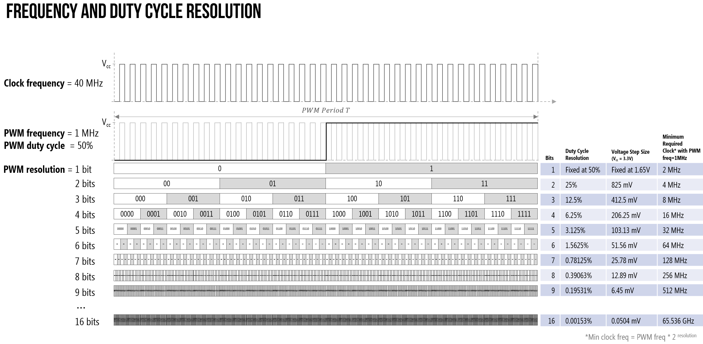
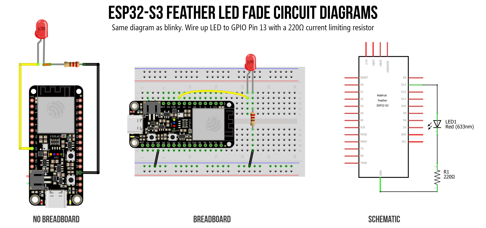

# {{ page.title | replace_first:'L','Lesson '}}
{: .no_toc }

## Table of Contents
{: .no_toc .text-delta }

1. TOC
{:toc}
---

In this lesson, we'll show how to use [PWM](https://www.arduino.cc/en/Tutorial/PWM) output on the ESP32 to smoothly fade an LED on and off. This is where our ESP32 lessons begin to diverge from our Arduino [Intro to Output](../arduino/intro-output.md) series—the ESP32 uses a different, more powerful PWM system than the Arduino Uno or Leonardo.

<video autoplay loop muted playsinline aria-label="Workbench video showing the Adafruit ESP32-S3 cross fading an external red LED">
  <source src="assets/videos/ESP32-S3-FadingExternalLed_optimized_muted.mp4" type="video/mp4">
</video>
**Video.** A workbench video of fading an external LED on the Adafruit ESP32-S3.
{: .fs-1 }

{: .note }
> **In this lesson, you will learn:**
> - How PWM works on the ESP32 using the LEDC (LED Control) library
> - The relationship between PWM frequency and duty cycle resolution
> - How to use the ESP32 Arduino LEDC API to fade an LED
> - The difference between the v2.x and v3.x LEDC APIs
> - How to use `analogWrite()` as a simpler alternative on ESP32 Arduino core v3.x
> - How to fade the onboard NeoPixel through the HSV color wheel

## Materials

You'll need the same materials as the [last lesson](led-blink.md). We use **[Adafruit's ESP32-S3 Feather](https://www.adafruit.com/product/5477)** but any ESP32-S3 board will work!

| Breadboard | ESP32 | LED | Resistor |
| ---------- |:-----:|:-----:|:-----:|
|  |  |  |  |
| Breadboard | [ESP32-S3 Feather](https://www.adafruit.com/product/5477) | Red LED | 220Ω Resistor |

## PWM on the ESP32

To fade an LED on an Arduino Uno, you use [`analogWrite`](https://www.arduino.cc/reference/en/language/functions/analog-io/analogwrite/) as we did in our [LED fade lesson](../arduino/led-fade.md) in our [Intro to Arduino series](../arduino/led-fade.md). 

Recall that `analogWrite` doesn't actually drive an analog voltage to the pin. Instead, it uses **pulse-width modulation (PWM)**. These PWM waves are produced by hardware timers that precisely drive a pin `HIGH` and `LOW` based on the set duty cycle. So, on the Arduino Uno, `analogWrite(3, 127)` would output a 5V value for half the period (because 127/255 ≈ 50%) on Pin 3. The Arduino Uno and Leonardo only have **six** PWM outputs because they have three timers, each of which can control two PWM pins.

On the ESP32, **all** GPIO pins support PWM, but the programming approach is different. The ESP32 uses a dedicated hardware peripheral called **LEDC** (LED Control) for PWM generation. The [LEDC module](https://docs.espressif.com/projects/arduino-esp32/en/latest/api/ledc.html) was designed primarily for LED dimming but can also drive motors, generate tones, and produce any PWM waveform.

{: .note }
> **What about `analogWrite` on the ESP32?** In **ESP32 Arduino core v3.x**, `analogWrite()` is now supported as a convenience wrapper around the LEDC library (search for `analogWrite()` in the [esp32-hal-ledc.c source code](https://github.com/espressif/arduino-esp32/blob/master/cores/esp32/esp32-hal-ledc.c)). So you *can* use `analogWrite()` on the ESP32, and it will work! However, we also teach the underlying LEDC API because it gives you more control over PWM frequency, resolution, and channel management—things you may for more advanced projects. And understanding the LEDC library helps you understand what `analogWrite` is doing under the hood.

### The LEDC PWM library

The [LEDC library](https://docs.espressif.com/projects/arduino-esp32/en/latest/api/ledc.html) provides fine-grained control over PWM output. Unlike the Arduino `analogWrite` (which defaults to ~490 Hz, 8-bit resolution), the LEDC library lets you choose your **own PWM frequency** (up to 40 MHz) and **resolution** (1 to 14 bits on the ESP32-S3, or up to 16 bits on the original ESP32). The Arduino version of this library is part of the core ESP32 Arduino library ([esp32-hal-ledc.c](https://github.com/espressif/arduino-esp32/blob/master/cores/esp32/esp32-hal-ledc.c)), so you don't need any `#include` statements to use it.

{: .note }
> If you want to dive deeper, check out [EspressIf's LEDC guide](https://docs.espressif.com/projects/esp-idf/en/latest/esp32/api-reference/peripherals/ledc.html) and the [LEDC source code on GitHub](https://github.com/espressif/arduino-esp32/blob/master/cores/esp32/esp32-hal-ledc.c).

#### Understanding channels (the hardware)

Under the hood, the LEDC module works on **channels** rather than individual **pins**. The ESP32-S3 has **8 independent PWM channels**, which means you can generate up to **8 different PWM waveforms simultaneously** (each with its own frequency, resolution, and duty cycle). To apply a PWM wave to a pin, you configure a channel and then attach a pin to it. You can attach *multiple* pins to the exact same channel—they will all share that identical waveform—but you are **limited to 8 unique waveforms** running at the same time (*i.e.,* because there are 8 independent PWM channels).

{: .note }
> In **ESP32 Arduino core v3.x**, the channel abstraction was removed from the public API—you attach PWM directly to a pin with `ledcAttach(pin, freq, resolution)`, and the library assigns a channel automatically behind the scenes. The channels still exist in hardware, but you don't need to manage them yourself. This is much simpler! We'll show both the v3.x and legacy v2.x APIs below.

#### The LEDC API (v3.x)

In ESP32 Arduino core v3.x (which we use in this course), the LEDC API has three key methods:

```cpp
/**
 * Attach a PWM channel to a pin with the specified frequency and resolution.
 * The library automatically assigns an available hardware channel.
 * Returns true on success, false if no channels are available.
 */
bool ledcAttach(uint8_t pin, uint32_t freq, uint8_t resolution);

/**
 * Write a duty cycle value to the specified pin.
 * The value should be between 0 and (2^resolution - 1).
 */
void ledcWrite(uint8_t pin, uint32_t duty);

/**
 * Detach the PWM channel from the specified pin.
 */
void ledcDetach(uint8_t pin);
```

Notice how much simpler this is compared to the old v2.x API (shown below for reference). You no longer need to manually manage channel numbers—just attach a pin, write a duty cycle, and you're done!

<details markdown="1">
<summary><strong>Legacy v2.x API</strong> (click to expand)</summary>

In ESP32 Arduino core v2.x, you had to explicitly manage channels:

```cpp
// Step 1: Configure a channel (0-15) with a frequency and resolution
double ledcSetup(uint8_t channel, double freq, uint8_t resolution_bits);

// Step 2: Attach a pin to that channel
void ledcAttachPin(uint8_t pin, uint8_t channel);

// Step 3: Write a duty cycle to the channel (not the pin!)
void ledcWrite(uint8_t channel, uint32_t duty);

// Detach a pin
void ledcDetachPin(uint8_t pin);
```

The key difference: in v2.x, `ledcWrite` takes a **channel** number. In v3.x, `ledcWrite` takes a **pin** number. If you're following older tutorials online, this is the most common source of confusion. See the [migration guide](https://docs.espressif.com/projects/arduino-esp32/en/latest/migration_guides/2.x_to_3.0.html) for full details.

</details>

### PWM frequency and resolution tradeoff

The [LEDC library](https://docs.espressif.com/projects/arduino-esp32/en/latest/api/ledc.html) lets you choose both the PWM frequency and the duty cycle resolution (in bits). But these two parameters are **interdependent**—you can't max out both simultaneously. The Espressif [docs](https://docs.espressif.com/projects/esp-idf/en/latest/esp32/api-reference/peripherals/ledc.html#supported-range-of-frequency-and-duty-resolutions) provide some examples:

- A PWM frequency of **5 kHz** can have a maximum duty resolution of **13 bits** ($$2^{13}=8192$$ discrete brightness levels, so `ledcWrite` values range from 0 to 8191)
- A PWM frequency of **20 MHz** can have a maximum duty resolution of **2 bits** (only $$2^2=4$$ discrete levels)
- A PWM frequency of **40 MHz** can have a duty resolution of 1 bit—meaning the duty cycle is fixed at 50% and cannot be adjusted!

If you attempt to set incompatible frequency and resolution combinations, you'll see an error on the Serial Monitor:

```text
E (196) ledc: requested frequency and duty resolution cannot be achieved,
try reducing freq_hz or duty_resolution.
```

<!-- NOTE: In the Arduino LEDC library, ledcAttach (v3.x) / ledcSetup (v2.x) does bounds
     checking internally and may silently clamp values rather than showing this error.
     See: https://github.com/espressif/arduino-esp32/blob/master/cores/esp32/esp32-hal-ledc.c -->

<!-- TODO: experiment with different resolutions and frequency combos and report back -->

#### Why are frequency and resolution linked?

So *why* and *how* are the PWM frequency and resolution interdependent? To understand this, we need to look at how the LEDC hardware actually works.

The ESP32's LEDC peripheral is driven by the **APB clock**, which runs at a fixed **80 MHz**. This clock is the heartbeat that drives all the PWM timing. When you set a PWM frequency, you're telling the LEDC hardware how long one period should be—and the clock determines how many **ticks** fit inside that period.

For example, at a PWM frequency of 1 MHz, each period lasts 1 µs. At 80 MHz, the clock produces 80 ticks per microsecond, so you get **80 clock ticks per period** ($$80\text{ MHz} \div 1\text{ MHz} = 80$$).

Now here's the key: **resolution** is about how finely you can slice up that period into distinct duty cycle levels. An $$n$$-bit resolution means you need $$2^n$$ time slices. Because the hardware requires at least one clock tick per time slice, the maximum number of slices cannot exceed the total number of clock ticks available in a period. 

Therefore, the fundamental rule is:

$$2^{\text{resolution}} \leq \frac{\text{APB}_{\text{clock}}}{\text{PWM}_{\text{freq}}}$$

If you need more slices than you have ticks, the hardware simply can't produce them—and `ledcAttach` will fail.

Here's a visual example. The clock runs at 40 MHz, the PWM frequency is set to 1 MHz, and we show how increasing the resolution requires finer and finer time slices—which in turn demand more clock ticks:


**Figure.** As PWM resolution increases, the number of required time slices grows exponentially. This diagram uses a simplified 40 MHz clock example—on the real ESP32 the APB clock is 80 MHz, giving you twice as many ticks to work with (and one extra bit of resolution headroom). See this [PDF](assets/images/PWM_FrequencyAndDutyCycle.pdf) for a printable version.
{: .fs-1 }

<!-- some discussion of max pwm freq on esp32:
https://forum.micropython.org/viewtopic.php?t=3717. Appears to be 40MHz, which is 1/6 clock speed of 240MHz -->

<!-- I read more about the relationship between PWM frequency and duty cycle resolution. Still reading. No definitive answers, but some potentially helpful posts:
- https://www.microchip.com/forums/m79448.aspx. Which says: 

"PWM output is a tradeoff between PWM frequency and duty cycle resolution. For example, with a 1MHz oscillator you get a minimum PWM time slice of 1uS. You chose how many of these to include in a PWM period. If Ts is the time slice period, and N is the number of time slices selected per period, then:

PWM Frequency = 1 / (Ts * N)
Duty cycle resolution = 1 / (N + 1)"

- http://www.t-es-t.hu/download/microchip/an539c.pdf
This datasheet has a PWM resolution vs PWM frequency graph 

https://electrosome.com/pwm-pulse-width-modulation/
http://inst.eecs.berkeley.edu/~ee40/calbot/pdf/ChapterFive/ChapterFive.pdf
-->

#### Interactive: explore the tradeoff yourself

To advance your understanding, try the interactive visualization below. It shows a single PWM period with the 80 MHz clock ticks drawn along the top.

- Adjust the **PWM Frequency** slider and watch the ticks shrink (higher frequency → shorter period → fewer ticks).
- Then adjust the **Resolution** slider and watch the time slices multiply until they exceed the available ticks and the waveform turns red.

The insight box at the top makes the math visible: *clock ticks available* vs. *slices needed*. When slices exceed ticks, you'll see ✗ Can't fit—that's the hardware telling you this combination is impossible.

<iframe src="https://editor.p5js.org/jonfroehlich/embed/_NLZiLjtL" width="100%" height="680" style="border: none;"></iframe>
**Interactive Figure.** Explore how PWM frequency, resolution, and duty cycle interact on the ESP32. The LEDC peripheral's 80 MHz APB clock determines how many clock ticks fit in each PWM period. Try it: start at 1 MHz / 3 bits, then increase resolution until it breaks. Then lower the frequency and watch it become achievable again. ([Open in the p5.js editor](https://editor.p5js.org/jonfroehlich/sketches/_NLZiLjtL))
{: .fs-1 }

{: .note }
> **Why 80 MHz?** The ESP32's LEDC timers are clocked by the APB (Advanced Peripheral Bus) clock, which runs at 80 MHz. This is separate from the CPU clock (240 MHz on the ESP32-S3). The 80 MHz APB clock sets the *theoretical* maximum PWM frequency at 40 MHz (with 1-bit resolution: $$80 \div 2^1 = 40$$). In practice, the ESP32's GPIO pins can't toggle faster than about 40 MHz due to electrical switching limits, so **40 MHz at 1-bit resolution is the highest usable PWM frequency**. The interactive includes 80 MHz to show the theoretical limit of the clock divider math (1 tick = 1 bit = 50% duty cycle), but you'd never use that on a real pin.

#### What frequency and resolution should I use?

For LED fading, you don't need extreme values. The Arduino Uno uses ~490 Hz at 8-bit resolution, and that's more than fast enough for smooth, flicker-free fading. A good starting point on the ESP32 is **5000 Hz at 8 bits**—comfortably within the clock's capability, with 256 brightness levels. Feel free to experiment!

### Alternatives to LEDC

In addition to the LEDC module, the ESP32 supports other analog output options. We won't use these alternatives in this course, but they're worth knowing about if you explore audio or precision analog output projects in the future.

- **Sigma-delta modulation** ([docs](https://docs.espressif.com/projects/esp-idf/en/latest/esp32/api-reference/peripherals/sigmadelta.html)): Uses a feedback loop to minimize timer errors and produce more accurate waveforms than PWM. There is a sigma-delta example in the Arduino IDE: File → Examples → ESP32 → AnalogOut → SigmaDelta.

- **DAC (original ESP32 only):** The original ESP32 has two 8-bit digital-to-analog converter channels on GPIO25 and GPIO26, which can output true analog voltages (not PWM!). This enables smooth sinusoidal waveforms and audio output. There are many examples online of using the ESP32's DAC to play music—see this [tutorial by Xtronical](https://www.xtronical.com/introduction-to-dac-audio/).

{: .warning }
> The **ESP32-S3 does not have a DAC**. If you need true analog output on the ESP32-S3, you'll need an external DAC module (like the MCP4725) connected via I2C, or you can use PWM with a low-pass RC filter to approximate an analog voltage.

## Let's make an ESP32-based LED fader!

Let's put it all together and fade an LED.

### The circuit

We can use the same circuit as the [Blink lesson](led-blink.md):


**Figure.** Same circuit as the [Blink lesson](led-blink.md). On the ESP32-S3 Feather, we're using GPIO 13 (but you can use any output-capable pin, just change the `LED_OUTPUT_PIN` in the code).
{: .fs-1 }

### The code (v3.x API)

We'll walk through the code step by step. You may also want to check out the official ESP32 fade example in the Arduino IDE: File → Examples → ESP32 → AnalogOut → LEDCSoftwareFade ([source on GitHub](https://github.com/espressif/arduino-esp32/blob/master/libraries/ESP32/examples/AnalogOut/LEDCSoftwareFade/LEDCSoftwareFade.ino)).

#### Step 1: Set up the PWM and pin constants

```cpp
const int LED_OUTPUT_PIN = 13;  // GPIO 13 = LED_BUILTIN on ESP32-S3 Feather and Huzzah32
                                // Change to match your wiring if using a different pin

const int PWM_FREQ = 5000;     // 5 kHz PWM frequency (Arduino Uno uses ~490 Hz)
const int PWM_RESOLUTION = 8;  // Set to 8-bit resolution (0-255), same as Arduino Uno
                               // ESP32-S3 supports up to 14-bit resolution

// The max duty cycle value based on PWM resolution (255 for 8 bits)
const int MAX_DUTY_CYCLE = (1 << PWM_RESOLUTION) - 1;

const int DELAY_MS = 4;        // delay between fade increments
```

#### Step 2: Attach PWM to the pin in `setup()`

In v3.x, this is a single call—no separate channel setup required:

```cpp
void setup() {
  Serial.begin(115200);

  // Attach a PWM channel to the pin with the specified frequency and resolution.
  // The library automatically assigns an available hardware channel.
  ledcAttach(LED_OUTPUT_PIN, PWM_FREQ, PWM_RESOLUTION);
}
```

Compare this to the v2.x approach, which required two separate calls:
```cpp
// v2.x (legacy) — DON'T use this with ESP32 Arduino core v3.x!
// ledcSetup(PWM_CHANNEL, PWM_FREQ, PWM_RESOLUTION);
// ledcAttachPin(LED_OUTPUT_PIN, PWM_CHANNEL);
```

#### Step 3: Write the fade `loop()`

The fade loop is similar to the original Arduino [LED fade](../arduino/led-fade.md) lesson. Instead of `analogWrite(pin, value)`, we use `ledcWrite(pin, value)`:

```cpp
void loop() {
  // Fade up: ramp duty cycle from 0% (off) to 100% (full brightness)
  for (int dutyCycle = 0; dutyCycle <= MAX_DUTY_CYCLE; dutyCycle++) {
    ledcWrite(LED_OUTPUT_PIN, dutyCycle);
    delay(DELAY_MS);
  }

  // Fade down: ramp duty cycle from 100% back to 0% (off)
  for (int dutyCycle = MAX_DUTY_CYCLE; dutyCycle >= 0; dutyCycle--) {
    ledcWrite(LED_OUTPUT_PIN, dutyCycle);
    delay(DELAY_MS);
  }
}
```

{: .note }
> In v3.x, `ledcWrite` takes a **pin** number. In the old v2.x API, it took a **channel** number. If you're following older tutorials online and your LED doesn't fade, this is probably why!

#### Step 4: Run it!

That's it—upload and run! You should see your LED smoothly fade on and off. Try experimenting with different `PWM_FREQ` and `PWM_RESOLUTION` values to see the tradeoff in action.

### Full source code

Here's the complete program. This [source code](https://github.com/makeabilitylab/arduino/blob/master/ESP32/Basics/Fade/Fade.ino) is also on GitHub (note: the GitHub version may still use the v2.x API).

```cpp
/**
 * Fades an LED on and off using the ESP32 LEDC PWM library.
 *
 * Uses the v3.x LEDC API (ledcAttach / ledcWrite with pin numbers).
 * If you're using ESP32 Arduino core v2.x, see the legacy API in the lesson.
 *
 * See: https://makeabilitylab.github.io/physcomp/esp32/led-fade
 * Source: https://github.com/makeabilitylab/arduino/blob/master/ESP32/Basics/Fade/Fade.ino
 */

const int LED_OUTPUT_PIN = 13;  // GPIO 13
const int PWM_FREQ = 5000;      // 5 kHz — fast enough to avoid visible flicker
const int PWM_RESOLUTION = 8;   // 8-bit resolution: duty cycle ranges from 0 to 255
const int MAX_DUTY_CYCLE = (1 << PWM_RESOLUTION) - 1;  // 2^8 - 1 = 255

const int DELAY_MS = 4;         // Small delay between steps for a smooth ~1-second fade

void setup() {
  Serial.begin(115200);

  // Attach a PWM channel to the pin with the specified frequency and resolution.
  // The library automatically assigns an available hardware channel.
  ledcAttach(LED_OUTPUT_PIN, PWM_FREQ, PWM_RESOLUTION);
}

void loop() {
  // Fade up: ramp duty cycle from 0% (off) to 100% (full brightness)
  for (int dutyCycle = 0; dutyCycle <= MAX_DUTY_CYCLE; dutyCycle++) {
    ledcWrite(LED_OUTPUT_PIN, dutyCycle);
    Serial.print("Duty cycle: ");
    Serial.println(dutyCycle);
    delay(DELAY_MS);
  }

  // Fade down: ramp duty cycle from 100% back to 0% (off)
  for (int dutyCycle = MAX_DUTY_CYCLE; dutyCycle >= 0; dutyCycle--) {
    ledcWrite(LED_OUTPUT_PIN, dutyCycle);
    Serial.print("Duty cycle: ");
    Serial.println(dutyCycle);
    delay(DELAY_MS);
  }
}
```

<details markdown="1">
<summary><strong>Legacy v2.x version of this code</strong> (click to expand)</summary>

If you're using ESP32 Arduino core v2.x, the code uses explicit channel management:

```cpp
const int PWM_CHANNEL = 0;     // ESP32 has 16 channels (0-15) for independent waveforms
const int PWM_FREQ = 5000;
const int PWM_RESOLUTION = 8;
const int MAX_DUTY_CYCLE = (1 << PWM_RESOLUTION) - 1;

const int LED_OUTPUT_PIN = 21;  // GPIO 21 on Huzzah32
const int DELAY_MS = 4;

void setup() {
  // Step 1: Configure channel 0 with frequency and resolution
  ledcSetup(PWM_CHANNEL, PWM_FREQ, PWM_RESOLUTION);

  // Step 2: Attach pin to that channel
  ledcAttachPin(LED_OUTPUT_PIN, PWM_CHANNEL);
}

void loop() {
  // Note: ledcWrite takes a CHANNEL number in v2.x, not a pin!
  for (int dutyCycle = 0; dutyCycle <= MAX_DUTY_CYCLE; dutyCycle++) {
    ledcWrite(PWM_CHANNEL, dutyCycle);
    delay(DELAY_MS);
  }

  for (int dutyCycle = MAX_DUTY_CYCLE; dutyCycle >= 0; dutyCycle--) {
    ledcWrite(PWM_CHANNEL, dutyCycle);
    delay(DELAY_MS);
  }
}
```

</details>

### Workbench video

<video autoplay loop muted playsinline aria-label="Workbench video showing the Adafruit ESP32-S3 cross fading an external red LED">
  <source src="assets/videos/ESP32-S3-FadingExternalLed_optimized_muted.mp4" type="video/mp4">
</video>
**Video.** A workbench video of fading an external LED on the Adafruit ESP32-S3.
{: .fs-1 }

<!-- TODO: consider an example that uses multiple channels to flash different freqs -->

### Try it in Wokwi

You can also run this circuit in the [Wokwi simulator](https://wokwi.com/) (introduced in the [Blink lesson](led-blink.md#part-3-try-it-in-the-wokwi-simulator)). Wokwi uses the ESP32-S3 DevKitC board but since the LEDC library works the same on any ESP32-S3 board, the fade code runs identically in the simulator as it would on the ESP32-S3 Feather.

<video autoplay loop muted playsinline aria-label="Video showing LED fade running in the Wokwi simulator">
  <source src="assets/videos/Wokwi_ESP32-S3-LedFade_optimized_muted.mp4" type="video/mp4" />
</video>
**Video.** LED fade running in the **Wokwi simulator** on the ESP32-S3 DevKitC. Run it yourself on [Wokwi here](https://wokwi.com/projects/463782700188143617).
{: .fs-1 }

**[→ Open the Fade simulation in Wokwi](https://wokwi.com/projects/463782700188143617)**

### Using `analogWrite` instead

Since ESP32 Arduino core v3.x supports `analogWrite` as a wrapper around the LEDC library, you can write the same fade with much less code. Under the hood, `analogWrite` calls `ledcAttach` and `ledcWrite` for you, using defaults of **1 kHz** and **8-bit resolution**.

```cpp
/**
 * Fades an LED on and off using analogWrite().
 *
 * On ESP32 Arduino core v3.x, analogWrite() is a convenience wrapper
 * around the LEDC library. It defaults to 1 kHz PWM at 8-bit resolution.
 * This is the simplest way to fade an LED—identical to Arduino Uno code!
 *
 * See: https://makeabilitylab.github.io/physcomp/esp32/led-fade
 */

const int LED_OUTPUT_PIN = 13;  // GPIO 13 = LED_BUILTIN on ESP32-S3 Feather
const int DELAY_MS = 4;         // Small delay between steps for a smooth fade

void setup() {
  // Set the LED output pin
  pinMode(LED_OUTPUT_PIN, OUTPUT);
}

void loop() {
  // Fade up: ramp from 0 (off) to 255 (full brightness)
  for (int brightness = 0; brightness <= 255; brightness++) {
    analogWrite(LED_OUTPUT_PIN, brightness);
    delay(DELAY_MS);
  }

  // Fade down: ramp from 255 back to 0
  for (int brightness = 255; brightness >= 0; brightness--) {
    analogWrite(LED_OUTPUT_PIN, brightness);
    delay(DELAY_MS);
  }
}
```

Look familiar? This code is *identical* to what you'd write on an Arduino Uno—that's the whole point of the `analogWrite` wrapper. The tradeoff is that you lose control over PWM frequency and resolution (stuck at 1 kHz / 8-bit defaults). You can change these defaults with `analogWriteFrequency(pin, freq)` and `analogWriteResolution(pin, bits)`, but at that point you might as well use the LEDC API directly.

You can play with the above LED fade `analogWrite` example on [Wokwi here](https://wokwi.com/projects/463817926218345473).

{: .note }
> Now that you know about both the LEDC and the `analogWrite` approach to driving PWM signals on the ESP32 GPIO pins, you should decide which is better for you and your program!

## Bonus: Fade the NeoPixel through the rainbow 🌈

In [Lesson 2](led-blink.md), we blinked the onboard NeoPixel in discrete colors using both the built-in `rgbLedWrite()` function as well as via the external `Adafruit_NeoPixel.h` library. Now let's smoothly *fade* through the entire color wheel using the **HSV color space**—the same approach we used in the [Addressable LEDs lesson](../advancedio/addressable-leds.md#activity-2-rainbow-animation).

Because the Adafruit NeoPixel library supports `ColorHSV()`, which makes it easier to cross-fade across colors, we'll use that library again here. The `ColorHSV()` function takes a 16-bit hue (0–65535 maps to 0°–360°), a saturation (0–255), and a value/brightness (0–255). By incrementing the hue each frame, we get a smooth rainbow cross-fade:

```cpp
/**
 * Smoothly fades the onboard NeoPixel through the full HSV color wheel.
 * Works on the Adafruit ESP32-S3 Feather (and in Wokwi with the DevKitC).
 *
 * Requires the Adafruit NeoPixel library:
 *   Sketch -> Include Library -> Manage Libraries -> search "Adafruit NeoPixel"
 *
 * See: https://makeabilitylab.github.io/physcomp/esp32/led-fade
 */
#include <Adafruit_NeoPixel.h>

// One NeoPixel on the board, on the pin defined by PIN_NEOPIXEL
Adafruit_NeoPixel _pixel(1, PIN_NEOPIXEL, NEO_GRB + NEO_KHZ800);

const int HUE_STEP = 256;             // How much to advance the hue each frame
const uint32_t MAX_HUE = 65536;       // Full color wheel (360°) in 16-bit hue
const int DELAY_MS = 20;              // ~50 fps for smooth animation

uint32_t _hue = 0;                    // Current position on the color wheel

void setup() {
  // The NeoPixel on the ESP32-S3 Feather has a separate power pin
  // that must be set HIGH before the NeoPixel will light up
  #if defined(NEOPIXEL_POWER)
    pinMode(NEOPIXEL_POWER, OUTPUT);
    digitalWrite(NEOPIXEL_POWER, HIGH);
  #endif

  _pixel.begin();
  _pixel.setBrightness(30);  // 0-255; keep it low to avoid blinding yourself!
  _pixel.show();
}

void loop() {
  // ColorHSV takes: hue (0-65535), saturation (0-255), value/brightness (0-255)
  // gamma32 applies perceptual brightness correction for 
  // smoother color transitions
  uint32_t color = _pixel.gamma32(_pixel.ColorHSV(_hue, 255, 255));
  _pixel.setPixelColor(0, color);
  _pixel.show();

  // Advance the hue and wrap around at 65536 (back to red)
  _hue = (_hue + HUE_STEP) % MAX_HUE;

  delay(DELAY_MS);
}
```

Upload this and watch your NeoPixel smoothly cycle through the rainbow and back to red! Try changing `HUE_STEP` to `64` (slower, more gradual) or `1024` (faster cycling).

We also built a version on Wokwi, which you can [simulate here](https://wokwi.com/projects/463818340414358529).

{: .note }
> **What is `gamma32()`?** Human eyes don't perceive brightness linearly—we're much more sensitive to changes in dark tones than bright ones. The `gamma32()` function applies a correction curve so that the color transitions *look* smooth and even, rather than appearing to jump through the midrange. Compare the output with and without `gamma32()` to see the difference! We cover this in more detail in the [Addressable LEDs lesson](../advancedio/addressable-leds.md).

{: .note }
> **HSV vs. RGB:** In the RGB color model, creating a smooth rainbow requires manually calculating red, green, and blue values for each hue—which is tedious and error-prone. The HSV (Hue, Saturation, Value) model separates *color* from *brightness*, so sweeping through all colors is just a matter of incrementing one number (the hue). We use HSV extensively in the [Addressable LEDs lesson](../advancedio/addressable-leds.md) and also talk about it in the [RGB LED lesson](../arduino/rgb-led-fade.md).

<details markdown="1">
<summary><strong>Using the Huzzah32 instead?</strong> (click to expand)</summary>

The original Huzzah32 **does not** have an onboard NeoPixel. If you want to try this, you'll need to connect an external NeoPixel (or NeoPixel strip) to a GPIO pin and update `PIN_NEOPIXEL` to match your wiring. See our [Addressable LEDs lesson](../advancedio/addressable-leds.md) for details on wiring external NeoPixels.
</details>

### Workbench video of RGB crossfade

<video autoplay loop muted playsinline aria-label="Workbench video showing the Adafruit ESP32-S3 cross fading the built-in NeoPixel between colors.">
  <source src="assets/videos/ESP32-S3-CrossFadeBuiltInNeoPixel_optimized_720p_muted.mp4" type="video/mp4">
</video>
**Video.** A workbench video cross fading the built-in RGB LED on the Adafruit ESP32-S3 across colors.
{: .fs-1 }

## Summary

In this lesson, you learned how to fade an LED on the ESP32 using the LEDC PWM library. The key takeaways:

- The ESP32 uses the **LEDC** (LED Control) hardware peripheral for PWM, which offers more control than Arduino's `analogWrite` (though `analogWrite` is now supported on the ESP32 as a convenience wrapper in v3.x).
- In v3.x, PWM setup is simple: `ledcAttach(pin, freq, resolution)` to configure, `ledcWrite(pin, duty)` to set the duty cycle.
- PWM **frequency** and **resolution** are interdependent—higher resolution requires a proportionally faster clock. For LED fading, 5 kHz at 8-bit resolution is a good default.
- The ESP32-S3 does **not** have a DAC for true analog output (the original ESP32 does). Use PWM or an external DAC.
- For simple fades, `analogWrite()` works on the ESP32 in v3.x with no setup—but you give up control over frequency and resolution.
- The onboard NeoPixel can be smoothly faded through the color wheel using **HSV color** and `gamma32()` for perceptually smooth transitions.

## Exercises

**Exercise 1:** Change the PWM resolution to 12 bits. What is the new maximum duty cycle value? Update `MAX_DUTY_CYCLE` and verify the fade still works smoothly. Do you notice any difference in the smoothness of the fade compared to 8 bits?

**Exercise 2:** Try setting the PWM frequency to 100 Hz with 8-bit resolution. Can you see the LED flickering? At what frequency does the flickering become invisible to your eye? (Hint: try 200 Hz, 500 Hz, 1000 Hz.)

**Exercise 3:** Compare the `analogWrite` version (shown [above](#using-analogwrite-instead)) to the LEDC version. What PWM frequency and resolution does `analogWrite` use by default? Can you change them? (Hint: check the [Arduino-ESP32 docs](https://docs.espressif.com/projects/arduino-esp32/en/latest/api/ledc.html) for `analogWriteFrequency` and `analogWriteResolution`.)

**Exercise 4:** Connect two LEDs to different GPIO pins and make them fade in **opposite** directions—when one is bright, the other is dim, and vice versa.

**Exercise 5:** Using the formula $$2^{resolution} \leq \frac{80{,}000{,}000}{PWM_freq}$$, calculate the maximum resolution (in bits) you can use at 10 kHz. What about at 1 MHz? Check your answers with the interactive visualization above.

## Next Lesson

In the [next lesson](analog-input.md), we'll use a potentiometer to control an LED's brightness and learn about the ESP32's analog input.

<nav class="lesson-nav" aria-label="Lesson navigation">
  <a href="led-blink.html" class="nav-prev">
    <div class="nav-label">&larr; Previous Lesson</div>
    <div class="nav-title">Blinking an LED with ESP32</div>
  </a>
  <a href="analog-input.html" class="nav-next">
    <div class="nav-label">Next Lesson &rarr;</div>
    <div class="nav-title">Analog input with the ESP32</div>
  </a>
</nav>