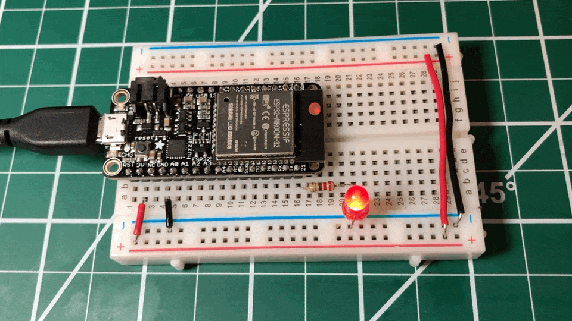

# {{ page.title | replace_first:'L','Lesson '}}
{: .no_toc }

## Table of Contents
{: .no_toc .text-delta }

1. TOC
{:toc}
---

In this lesson, we'll show how to use [PWM](https://www.arduino.cc/en/Tutorial/PWM) output on the ESP32 to smoothly fade an LED on and off. This is where our ESP32 lessons begin to diverge from the [Intro to Output](../arduino/intro-output.md) series—the ESP32 uses a different, more powerful PWM system than the Arduino Uno.

<!-- TODO: Replace GIF with <video> element showing fade on ESP32-S3 Feather -->
<video autoplay loop muted playsinline aria-label="Animation showing an LED smoothly fading in and out on an ESP32 board">
  <source src="assets/movies/Huzzah32_Fade-optimized.mp4" type="video/mp4">
  
</video>

{: .note }
> **In this lesson, you will learn:**
> - How PWM works on the ESP32 using the LEDC (LED Control) library
> - The relationship between PWM frequency and duty cycle resolution
> - How to use the ESP32 Arduino LEDC API to fade an LED
> - The difference between the v2.x and v3.x LEDC APIs

## Materials

You'll need the same materials as the [last lesson](led-blink.md):

| Breadboard | ESP32 | LED | Resistor |
| ---------- |:-----:|:-----:|:-----:|
|  |  |  |  |
| Breadboard | ESP32-S3 Feather | Red LED | 220Ω Resistor |

## PWM on the ESP32

To fade an LED on an Arduino Uno, you use [`analogWrite`](https://www.arduino.cc/reference/en/language/functions/analog-io/analogwrite/). As we know by now, `analogWrite` doesn't actually drive an analog voltage to the pin—it uses pulse-width modulation (PWM). These PWM waves are produced by hardware timers that precisely drive a pin `HIGH` and `LOW` based on the set duty cycle. So, on the Arduino Uno, `analogWrite(3, 127)` would output a 5V value for half the period (because 127/255 ≈ 50%) on Pin 3. The Arduino Uno and Leonardo only have **six** PWM outputs because they have three timers, each of which can control two PWM pins.

On the ESP32, **all** GPIO pins support PWM, but the programming approach is different. The ESP32 uses a dedicated hardware peripheral called **LEDC** (LED Control) for PWM generation. The LEDC module was designed primarily for LED dimming but can also drive motors, generate tones, and produce any PWM waveform.

{: .note }
> **What about `analogWrite` on the ESP32?** In **ESP32 Arduino core v3.x**, `analogWrite()` is now supported as a convenience wrapper around the LEDC library. So you *can* use `analogWrite()` on the ESP32, and it will work! However, we teach the LEDC API directly because it gives you more control over PWM frequency, resolution, and channel management—things you'll need for more advanced projects. And understanding the LEDC library helps you understand what `analogWrite` is doing under the hood.

### The LEDC PWM library

The LEDC library provides fine-grained control over PWM output. Unlike the Arduino `analogWrite` (which defaults to ~490 Hz, 8-bit resolution), the LEDC library lets you choose your own PWM frequency (up to 40 MHz) and resolution (1 to 16 bits). The Arduino version of this library is part of the core ESP32 Arduino library, so you don't need any `#include` statements to use it.

#### Understanding channels (the hardware)

Under the hood, the LEDC module works on **channels** rather than individual **pins**. The ESP32-S3 has **8 PWM channels**, each of which can generate an independent waveform. To apply a PWM wave to a pin, you configure a channel with a PWM frequency and resolution, then attach a pin to that channel. Multiple pins can attach to the same channel and will receive the same PWM waveform.

{: .note }
> In **ESP32 Arduino core v3.x**, the channel abstraction was removed from the public API—you attach PWM directly to a pin with `ledcAttach(pin, freq, resolution)`, and the library assigns a channel automatically behind the scenes. The channels still exist in hardware, but you don't need to manage them yourself. This is much simpler! We'll show both the v3.x and legacy v2.x APIs below.

#### The LEDC API (v3.x)

In ESP32 Arduino core v3.x (which we use in this course), the LEDC API has three key methods:

```cpp
/**
 * Attach a PWM channel to a pin with the specified frequency and resolution.
 * The library automatically assigns an available hardware channel.
 * Returns true on success, false if no channels are available.
 */
bool ledcAttach(uint8_t pin, uint32_t freq, uint8_t resolution);

/**
 * Write a duty cycle value to the specified pin.
 * The value should be between 0 and (2^resolution - 1).
 */
void ledcWrite(uint8_t pin, uint32_t duty);

/**
 * Detach the PWM channel from the specified pin.
 */
void ledcDetach(uint8_t pin);
```

Notice how much simpler this is compared to the old v2.x API (shown below for reference). You no longer need to manually manage channel numbers—just attach a pin, write a duty cycle, done!

<details markdown="1">
<summary><strong>Legacy v2.x API</strong> (click to expand)</summary>

In ESP32 Arduino core v2.x, you had to explicitly manage channels:

```cpp
// Step 1: Configure a channel (0-15) with a frequency and resolution
double ledcSetup(uint8_t channel, double freq, uint8_t resolution_bits);

// Step 2: Attach a pin to that channel
void ledcAttachPin(uint8_t pin, uint8_t channel);

// Step 3: Write a duty cycle to the channel (not the pin!)
void ledcWrite(uint8_t channel, uint32_t duty);

// Detach a pin
void ledcDetachPin(uint8_t pin);
```

The key difference: in v2.x, `ledcWrite` takes a **channel** number. In v3.x, `ledcWrite` takes a **pin** number. If you're following older tutorials online, this is the most common source of confusion. See the [migration guide](https://docs.espressif.com/projects/arduino-esp32/en/latest/migration_guides/2.x_to_3.0.html) for full details.

</details>

### PWM frequency and resolution tradeoff

The LEDC library lets you choose both the PWM frequency and the duty cycle resolution (in bits). But these two parameters are **interdependent**—you can't max out both simultaneously. The Espressif [docs](https://docs.espressif.com/projects/esp-idf/en/latest/esp32/api-reference/peripherals/ledc.html#supported-range-of-frequency-and-duty-resolutions) provide some examples:

- A PWM frequency of **5 kHz** can have a maximum duty resolution of **13 bits** ($$2^{13}=8192$$ discrete brightness levels)
- A PWM frequency of **20 MHz** can have a maximum duty resolution of **2 bits** (only $$2^2=4$$ discrete levels)
- A PWM frequency of **40 MHz** can have a duty resolution of 1 bit—meaning the duty cycle is fixed at 50% and cannot be adjusted!

If you attempt to set incompatible frequency and resolution combinations, you'll see an error on the Serial Monitor:

```
E (196) ledc: requested frequency and duty resolution cannot be achieved,
try reducing freq_hz or duty_resolution.
```

<!-- NOTE: In the Arduino LEDC library, ledcAttach (v3.x) / ledcSetup (v2.x) does bounds
     checking internally and may silently clamp values rather than showing this error.
     See: https://github.com/espressif/arduino-esp32/blob/master/cores/esp32/esp32-hal-ledc.c -->

<!-- TODO: experiment with different resolutions and frequency combos and report back -->

#### Why are frequency and resolution linked?

So *why* and *how* are the PWM frequency and resolution interdependent? Here's the explanation.

Imagine you have a clock running at some frequency (say 40 MHz), and you want to generate a PWM waveform at some frequency and resolution. The maximum PWM frequency is bounded by the clock—you can't produce a PWM wave faster than your clock.

But what about **resolution**? Resolution is about how finely you can slice up one period of the PWM wave into different duty cycles. And here's the key insight: slicing up the PWM wave requires a clock running at $$PWM_{freq} \times 2^{resolution}$$. Why? Because to generate those fine-grained duty cycles, the clock must be fast enough to create those time slices.

Here's a visual example. The clock runs at 40 MHz, the PWM frequency is set to 1 MHz, and we show how increasing the resolution requires finer and finer time slices—which in turn demand a faster clock:


**Figure.** As PWM resolution increases, the clock must be fast enough to support the finer time slices. At 1 MHz with 5-bit resolution, we need a clock of at least 32 MHz. At 6 bits, we'd exceed our 40 MHz clock. See this [PDF](assets/images/PWM_FrequencyAndDutyCycle.pdf) for more examples.
{: .fs-1 }

<!-- some discussion of max pwm freq on esp32:
https://forum.micropython.org/viewtopic.php?t=3717. Appears to be 40MHz, which is 1/6 clock speed of 240MHz -->

<!-- I read more about the relationship between PWM frequency and duty cycle resolution. Still reading. No definitive answers, but some potentially helpful posts:
- https://www.microchip.com/forums/m79448.aspx. Which says: 

"PWM output is a tradeoff between PWM frequency and duty cycle resolution. For example, with a 1MHz oscillator you get a minimum PWM time slice of 1uS. You chose how many of these to include in a PWM period. If Ts is the time slice period, and N is the number of time slices selected per period, then:

PWM Frequency = 1 / (Ts * N)
Duty cycle resolution = 1 / (N + 1)"

- http://www.t-es-t.hu/download/microchip/an539c.pdf
This datasheet has a PWM resolution vs PWM frequency graph 

https://electrosome.com/pwm-pulse-width-modulation/
http://inst.eecs.berkeley.edu/~ee40/calbot/pdf/ChapterFive/ChapterFive.pdf
-->

#### What frequency and resolution should I use?

For LED fading, you don't need extreme values. The Arduino Uno uses ~490 Hz at 8-bit resolution, and that's more than fast enough for smooth, flicker-free fading. A good starting point on the ESP32 is **5000 Hz at 8 bits**—comfortably within the clock's capability, with 256 brightness levels. Feel free to experiment!

### Alternatives to LEDC

In addition to the LEDC module, the ESP32 supports other analog output options:

- **Sigma-delta modulation** ([docs](https://docs.espressif.com/projects/esp-idf/en/latest/esp32/api-reference/peripherals/sigmadelta.html)): Uses a feedback loop to minimize timer errors and produce more accurate waveforms than PWM. There is a sigma-delta example in the Arduino IDE: File → Examples → ESP32 → AnalogOut → SigmaDelta.

- **DAC (original ESP32 only):** The original ESP32 has two 8-bit digital-to-analog converter channels on GPIO25 and GPIO26, which can output true analog voltages (not PWM!). This enables smooth sinusoidal waveforms and audio output. There are many examples online of using the ESP32's DAC to play music—see this [tutorial by Xtronical](https://www.xtronical.com/introduction-to-dac-audio/).

{: .warning }
> The **ESP32-S3 does not have a DAC**. If you need true analog output on the ESP32-S3, you'll need an external DAC module (like the MCP4725) connected via I2C, or you can use PWM with a low-pass RC filter to approximate an analog voltage.

## Let's make an ESP32-based LED fader!

Let's put it all together and fade an LED.

### The circuit

We can use the same circuit as the [Blink lesson](led-blink.md):


**Figure.** Same circuit as the Blink lesson. If you're using the ESP32-S3 Feather, use GPIO 13 (or any output-capable pin).
{: .fs-1 }

<!-- TODO: Create an ESP32-S3 Feather version of this Fritzing diagram -->

### The code (v3.x API)

We'll walk through the code step by step. You may also want to check out the official ESP32 fade example in the Arduino IDE: File → Examples → ESP32 → AnalogOut → LEDCSoftwareFade ([source on GitHub](https://github.com/espressif/arduino-esp32/blob/master/libraries/ESP32/examples/AnalogOut/LEDCSoftwareFade/LEDCSoftwareFade.ino)).

#### Step 1: Set up the PWM and pin constants

```cpp
const int LED_OUTPUT_PIN = 13;  // GPIO 13 = LED_BUILTIN on ESP32-S3 Feather and Huzzah32
                                // Change to match your wiring if using a different pin

const int PWM_FREQ = 5000;     // 5 kHz PWM frequency (Arduino Uno uses ~490 Hz)
const int PWM_RESOLUTION = 8;  // 8-bit resolution (0-255), same as Arduino Uno
                                // ESP32 supports up to 16-bit resolution!

// The max duty cycle value based on PWM resolution (255 for 8 bits)
const int MAX_DUTY_CYCLE = (int)(pow(2, PWM_RESOLUTION) - 1);

const int DELAY_MS = 4;        // delay between fade increments
int _ledFadeStep = 5;          // amount to fade per loop iteration
```

#### Step 2: Attach PWM to the pin in `setup()`

In v3.x, this is a single call—no separate channel setup required:

```cpp
void setup() {
  // Attach a PWM channel to the pin with the specified frequency and resolution.
  // The library automatically assigns an available hardware channel.
  ledcAttach(LED_OUTPUT_PIN, PWM_FREQ, PWM_RESOLUTION);
}
```

Compare this to the v2.x approach, which required two separate calls:
```cpp
// v2.x (legacy) — DON'T use this with ESP32 Arduino core v3.x!
// ledcSetup(PWM_CHANNEL, PWM_FREQ, PWM_RESOLUTION);
// ledcAttachPin(LED_OUTPUT_PIN, PWM_CHANNEL);
```

#### Step 3: Write the fade `loop()`

The fade loop is similar to the original Arduino [LED fade](../arduino/led-fade.md) lesson. Instead of `analogWrite(pin, value)`, we use `ledcWrite(pin, value)`:

```cpp
void loop() {
  // Fade up
  for (int dutyCycle = 0; dutyCycle <= MAX_DUTY_CYCLE; dutyCycle++) {
    ledcWrite(LED_OUTPUT_PIN, dutyCycle);
    delay(DELAY_MS);
  }

  // Fade down
  for (int dutyCycle = MAX_DUTY_CYCLE; dutyCycle >= 0; dutyCycle--) {
    ledcWrite(LED_OUTPUT_PIN, dutyCycle);
    delay(DELAY_MS);
  }
}
```

{: .note }
> In v3.x, `ledcWrite` takes a **pin** number. In the old v2.x API, it took a **channel** number. If you're following older tutorials online and your LED doesn't fade, this is probably why!

#### Step 4: Run it!

That's it—upload and run! You should see your LED smoothly fade on and off. Try experimenting with different `PWM_FREQ` and `PWM_RESOLUTION` values to see the tradeoff in action.

<!-- TODO: Replace GIF with <video> showing fade on ESP32-S3 Feather -->
<video autoplay loop muted playsinline aria-label="Animation showing an LED smoothly fading in and out on an ESP32 board">
  <source src="assets/movies/Huzzah32_Fade-optimized.mp4" type="video/mp4">
  
</video>
**Video.** LED fading on the Huzzah32 using the LEDC PWM library.
{: .fs-1 }

<!-- TODO: insert workbench video -->

<!-- TODO: consider an example that uses multiple channels to flash different freqs -->

<!-- TODO: Add Wokwi simulation link for this circuit
     > **Try it in the simulator!** [Open the Fade simulation in Wokwi →](URL) -->

### Full source code

Here's the complete program. This [source code](https://github.com/makeabilitylab/arduino/blob/master/ESP32/Basics/Fade/Fade.ino) is also on GitHub (note: the GitHub version may still use the v2.x API).

```cpp
/**
 * Fades an LED on and off using the ESP32 LEDC PWM library.
 *
 * Uses the v3.x LEDC API (ledcAttach / ledcWrite with pin numbers).
 * If you're using ESP32 Arduino core v2.x, see the legacy API in the lesson.
 *
 * See: https://makeabilitylab.github.io/physcomp/esp32/led-fade
 * Source: https://github.com/makeabilitylab/arduino/blob/master/ESP32/Basics/Fade/Fade.ino
 */

const int LED_OUTPUT_PIN = 13;
const int PWM_FREQ = 5000;
const int PWM_RESOLUTION = 8;
const int MAX_DUTY_CYCLE = (int)(pow(2, PWM_RESOLUTION) - 1);

const int DELAY_MS = 4;
int _ledFadeStep = 5;

void setup() {
  ledcAttach(LED_OUTPUT_PIN, PWM_FREQ, PWM_RESOLUTION);
}

void loop() {
  // Fade up
  for (int dutyCycle = 0; dutyCycle <= MAX_DUTY_CYCLE; dutyCycle++) {
    ledcWrite(LED_OUTPUT_PIN, dutyCycle);
    delay(DELAY_MS);
  }

  // Fade down
  for (int dutyCycle = MAX_DUTY_CYCLE; dutyCycle >= 0; dutyCycle--) {
    ledcWrite(LED_OUTPUT_PIN, dutyCycle);
    delay(DELAY_MS);
  }
}
```

<details markdown="1">
<summary><strong>Legacy v2.x version of this code</strong> (click to expand)</summary>

If you're using ESP32 Arduino core v2.x, the code uses explicit channel management:

```cpp
const int PWM_CHANNEL = 0;     // ESP32 has 16 channels (0-15) for independent waveforms
const int PWM_FREQ = 5000;
const int PWM_RESOLUTION = 8;
const int MAX_DUTY_CYCLE = (int)(pow(2, PWM_RESOLUTION) - 1);

const int LED_OUTPUT_PIN = 21;  // GPIO 21 on Huzzah32
const int DELAY_MS = 4;
int _ledFadeStep = 5;

void setup() {
  // Step 1: Configure channel 0 with frequency and resolution
  ledcSetup(PWM_CHANNEL, PWM_FREQ, PWM_RESOLUTION);

  // Step 2: Attach pin to that channel
  ledcAttachPin(LED_OUTPUT_PIN, PWM_CHANNEL);
}

void loop() {
  // Note: ledcWrite takes a CHANNEL number in v2.x, not a pin!
  for (int dutyCycle = 0; dutyCycle <= MAX_DUTY_CYCLE; dutyCycle++) {
    ledcWrite(PWM_CHANNEL, dutyCycle);
    delay(DELAY_MS);
  }

  for (int dutyCycle = MAX_DUTY_CYCLE; dutyCycle >= 0; dutyCycle--) {
    ledcWrite(PWM_CHANNEL, dutyCycle);
    delay(DELAY_MS);
  }
}
```

</details>

## Summary

In this lesson, you learned how to fade an LED on the ESP32 using the LEDC PWM library. The key takeaways:

- The ESP32 uses the **LEDC** (LED Control) hardware peripheral for PWM, which offers more control than Arduino's `analogWrite` (though `analogWrite` is now supported on the ESP32 as a convenience wrapper in v3.x).
- In v3.x, PWM setup is simple: `ledcAttach(pin, freq, resolution)` to configure, `ledcWrite(pin, duty)` to set the duty cycle.
- PWM **frequency** and **resolution** are interdependent—higher resolution requires a proportionally faster clock. For LED fading, 5 kHz at 8-bit resolution is a good default.
- The ESP32-S3 does **not** have a DAC for true analog output (the original ESP32 does). Use PWM or an external DAC.

## Exercises

{: .highlight }
> **Exercise 1:** Change the PWM resolution to 12 bits. What is the new maximum duty cycle value? Update `MAX_DUTY_CYCLE` and verify the fade still works smoothly. Do you notice any difference in the smoothness of the fade compared to 8 bits?

{: .highlight }
> **Exercise 2:** Try setting the PWM frequency to 100 Hz with 8-bit resolution. Can you see the LED flickering? At what frequency does the flickering become invisible to your eye? (Hint: try 200 Hz, 500 Hz, 1000 Hz.)

{: .highlight }
> **Exercise 3:** Rewrite the fade program using `analogWrite()` instead of the LEDC API. Does it work on ESP32 Arduino core v3.x? What PWM frequency and resolution does `analogWrite` use by default? (Hint: check the [Arduino-ESP32 docs](https://docs.espressif.com/projects/arduino-esp32/en/latest/api/ledc.html).)

{: .highlight }
> **Exercise 4:** Connect two LEDs to different GPIO pins and make them fade in **opposite** directions—when one is bright, the other is dim, and vice versa.

## Next Lesson

In the [next lesson](pot-fade.md), we'll use a potentiometer to control an LED's brightness and learn about the ESP32's analog input.

<span class="fs-6">
[Previous: Blinking an LED with ESP32](led-blink.md){: .btn .btn-outline }
[Next: Analog input with the ESP32](pot-fade.md){: .btn .btn-outline }
</span>