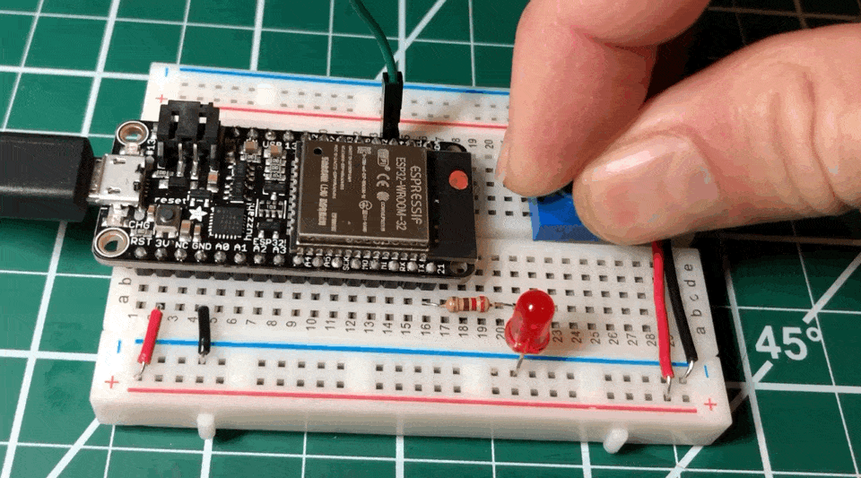
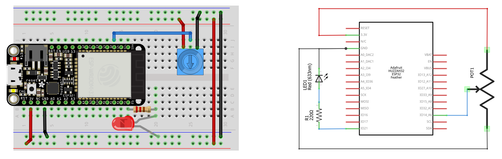

# {{ page.title | replace_first:'L','Lesson '}}
{: .no_toc }

## Table of Contents
{: .no_toc .text-delta }

1. TOC
{:toc}
---

In this lesson, we'll learn how to use analog input on the ESP32 by building a potentiometer-based LED fader.

## Materials

You'll need the same materials as the [last lesson](led-fade.md) but also a 10kΩ trim potentiometer.

| Breadboard | ESP32 | LED | Resistor | Trimpot | 
| ---------- |:-----:|:-----:|:-----:|
|  |     |  |  |  | 
| Breadboard | Huzzah32  | Red LED | 220Ω Resistor | 10kΩ Trimpot |

## The ADC on the ESP32

The ATmega chips used by the Arduino Uno ([ATmega328](http://ww1.microchip.com/downloads/en/DeviceDoc/Atmel-7810-Automotive-Microcontrollers-ATmega328P_Datasheet.pdf)) and the Arduino Leonardo ([ATmega32U4](http://ww1.microchip.com/downloads/en/DeviceDoc/Atmel-7766-8-bit-AVR-ATmega16U4-32U4_Datasheet.pdf)) both have 10-bit ADCs, which provide an analog-to-digital resolution of $$2^{10}=1024$$. 

In constrast, the ESP32 integrates two **12-bit** ADCs (resolution: $$2^{12}=4096$$) supporting a total of 18 measurement channels (analog enabled pins). The official ESP32 docs are [here](https://docs.espressif.com/projects/esp-idf/en/latest/esp32/api-reference/peripherals/adc.html).

The ADC pins are marked in teal. Right-click and open image in a new tab to zoom in.
{: .fs-1 } 

The pin assignments:
- **ADC1** has 8 channels attached to GPIO pins 32-39, which translates to A7 (32), A9 (33), A2 (34), A4 (36), and A3 (39); The GPIO pins are in parentheses. Note that GPIO 35, 37, and 38 are not exposed on the Huzzah32.
- **ADC2** has 10 channels attached to GPIOs 0, 2, 4, 12 - 15 and 25 - 27, which translates to A5(4), A11 (12), A12 (13), A6 (14), A8 (15), A1 (25), A0 (26), A10 (27). The GPIO pins 0, 2, are not exposed on the Huzzah32. 

So, in total, the Huzzah32 has 13 usable analog inputs (A0-A12).

### ADC2 Restrictions
ADC2 has some restrictions:
1. ADC2 is used by the Wi-Fi driver, so ADC2 is only usable when the Wi-Fi driver has **not** started.
2. Three of the ADC2 pins are strapping pins and thus should be used with caution. Strapping pins are used during power-on/reset to configure the device boot mode, the operating voltage, and other initial settings ([link](https://www.esp32.com/viewtopic.php?t=5970))

Importantly, the official Adafruit [docs](https://learn.adafruit.com/adafruit-huzzah32-esp32-feather/pinouts) for the Huzzah32 are confusing: they state that "you can only read analog inputs on ADC #1 once WiFi has started". Through experimentation and a [Reddit post](https://www.reddit.com/r/esp32/comments/gav6mw/huzzah32_pin_diagram_draft/fp1zcz5?utm_source=share&utm_medium=web2x&context=3), we found that Adafruit intended to say simply that ADC#2 is unavailable once WiFi has started (so you can only use ADC#1).

In the following video, I'm testing all 13 analog input pins (`A0` - `A12`) using a trim potentiometer for input and the Serial Plotter for output. WiFi is off and, indeed, all pins work.

<iframe width="736" height="414" src="https://www.youtube.com/embed/8BBY-5n4e5A" frameborder="0" allow="accelerometer; autoplay; encrypted-media; gyroscope; picture-in-picture" allowfullscreen></iframe>

## Let's make something!

Let's make a potentiometer-based LED fader.

### The circuit

The circuit is almost the same as the [previous lessons](led-fade.md); however, we need to add and hook up a potentiometer. So, we'll build two simple circuits:
1. The **input** circuit using the potentiometer, which we'll hook to `A6` (GPIO 14)
2. The **output** circuit, which is the same as the [previous lessons](led-fade.md)

### The code

The code simply adapts our LED fade code from the previous lesson to use the potentiometer's analog input value on `A6` to control the PWM duty cycle (rather than looping up and down).

Here's our implementation on [github](https://github.com/makeabilitylab/arduino/tree/master/ESP32/Basics/PotFade):

### Workbench video

Here's a workbench video with serial plotter graphing the analog input value from the potentiometer and the converted duty cycle value used in the `ledcWrite` method.

<iframe width="736" height="414" src="https://www.youtube.com/embed/E5YFtm0CLFY" frameborder="0" allow="accelerometer; autoplay; encrypted-media; gyroscope; picture-in-picture" allowfullscreen></iframe>

## Next Lesson

In the [next lesson](tone.md), we will learn how to play tones on the ESP32.

<!-- In the [next lesson](capacitive-touch-sensing.md), we will learn about and use the ESP32's built-in capacitive touch sensing module. -->

[Previous: Fading an LED with ESP32](led-fade.md){: .btn .btn-outline }
[Next: Playing tones](tone.md){: .btn .btn-outline }
<!-- [Next: Capacitive touch sensing with the ESP32](capacitive-touch-sensing.md){: .btn .btn-outline } -->

