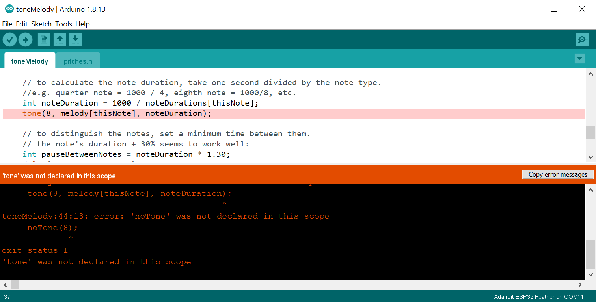
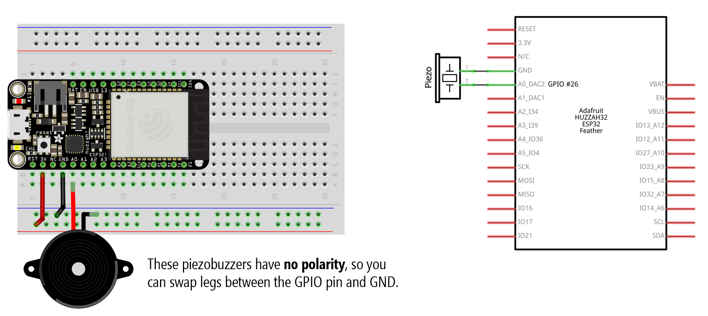
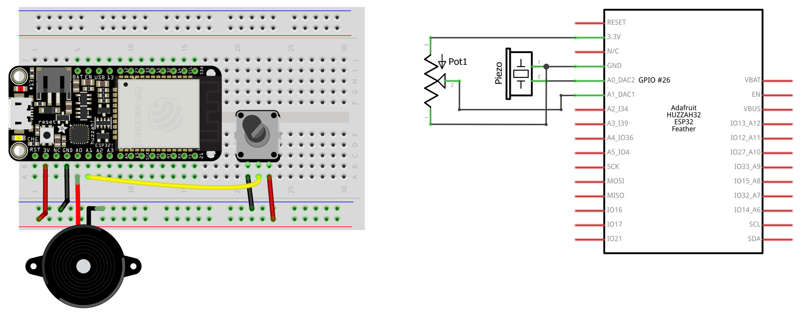

# {{ page.title | replace_first:'L','Lesson '}}
{: .no_toc }

## Table of Contents
{: .no_toc .text-delta }

1. TOC
{:toc}
---

<iframe width="736" height="414" src="https://www.youtube.com/embed/zFg1fSFGL7o" title="YouTube video player" frameborder="0" allow="accelerometer; autoplay; clipboard-write; encrypted-media; gyroscope; picture-in-picture" allowfullscreen></iframe>
**Video.** A video demonstrating the [Tone32.hpp](https://github.com/makeabilitylab/arduino/blob/master/MakeabilityLab_Arduino_Library/src/Tone32.hpp) class, which supports play durations on the ESP32. The code running on the ESP32 is available [here](https://github.com/makeabilitylab/arduino/blob/master/ESP32/Tone/AnalogInputTone32WithOLED/AnalogInputTone32WithOLED.ino). Make sure your sound is on.
{: .fs-1 }

On Arduino, the [`tone()`](https://www.arduino.cc/reference/en/language/functions/advanced-io/tone/) function generates a square wave of a specified frequency on a pin and is used to "play" tones on piezo buzzers or speakers; however, it is [famously unsupported](https://www.thomascountz.com/2021/02/21/arduino-tone-for-esp32) on the ESP32. In this lesson, we will provide some context about this problem and then show you how to play tones on the ESP32 using the [LEDC PWM library](https://github.com/espressif/arduino-esp32/blob/master/cores/esp32/esp32-hal-ledc.c), which we also used in our [ESP32 LED Fade lesson](led-fade.md).

## The ESP32 tone problem

The ESP32's Arduino library called [arduino-esp32](https://github.com/espressif/arduino-esp32/) attempts to mimic and/or directly replicate the functionality from [core Arduino](https://github.com/arduino/ArduinoCore-avr); however, as we saw in our [ESP32's LED Fade lesson](../esp32/led-fade.md), this is not always possible and key functions, like `analogWrite`, are different.

Just as `analogWrite` is not supported on [arduino-esp32](https://github.com/espressif/arduino-esp32/) so too is [`tone()`](https://www.arduino.cc/reference/en/language/functions/advanced-io/tone/) unavailable. Recall that on Arduino, `tone()`generates a square wave of a specified frequency (with fixed 50% duty cycle) on a pin and is used to "play" tones on piezo buzzers or speakers. In our [Intro to Arduino](../arduino/index.md) series, for example, we used [`tone()`](https://www.arduino.cc/reference/en/language/functions/advanced-io/tone/) to create a [piano](../arduino/piano.md).

However, if you attempt to compile code with `tone()` using the ESP32, you will receive a compiler error like this: `'tone' was not declared in this scope`. Thus, even basic tone examples built into the Arduino IDE like `Examples -> Digital -> toneMelody` fail, as shown below.

**Figure.** Example of how even basic tone examples, like [toneMelody.ino](https://github.com/arduino/arduino-examples/blob/main/examples/02.Digital/toneMelody/toneMelody.ino), which ships as a built-in example with the Arduino IDE, fails with a ESP32 board selected.
{: .fs-1 }

The lack of [`tone()`](https://www.arduino.cc/reference/en/language/functions/advanced-io/tone/) support has caused much chagrin and confusion in the maker community, including [Issue #980](https://github.com/espressif/arduino-esp32/issues/980) and [Issue #1720](https://github.com/espressif/arduino-esp32/issues/1720) in the [arduino-esp32](https://github.com/espressif/arduino-esp32/) GitHub repo as well as [forum](https://community.platformio.org/t/tone-not-working-on-espressif32-platform/7587) and [blog](https://www.thomascountz.com/2021/02/21/arduino-tone-for-esp32) posts.

What can we do about this? And why isn't tone supported anyway? Let's dive in below.

<!-- In this lesson, we will show you how to play tones using [`arduino-esp32`](https://github.com/espressif/arduino-esp32). -->

## How does Arduino's tone work?

Recall that Arduino's [tone](https://www.arduino.cc/reference/en/language/functions/advanced-io/tone/) provides three key methods:


void tone(uint8_t pin, unsigned int frequency)
void tone(uint8_t pin, unsigned int frequency, unsigned long duration)
void noTone(uint8_t pin)


Both tone methods drive a PWM waveform on the provided pin with the given frequency using timer interrupts. The second version adds in a `duration` parameter, which allows you to specify how *long* (in milliseconds) to play the tone for. Either way, you can call `noTone(pin)` to stop outputting the PWM waveform and turn off the tone.

<!-- With comments:


/**
 * @brief Drives a PWM waveform with the given frequency on the provided output pin
 *        for the given duration, in milliseconds.
 *
 * @param pin The Arduino pin on which to generate the tone.
 * @param frequency The frequency of the PWM waveform (driven at 50% duty cycle) 
 * @param duration The duration of the tone in milliseconds (optional). 
 */
void tone(uint8_t pin, unsigned int frequency, unsigned long duration)

/**
 * @brief Drives a PWM waveform with the given frequency on the provided output pin.
 *        Call noTone() to stop.
 *
 * @param pin The Arduino pin on which to generate the tone.
 * @param frequency The frequency of the PWM waveform (driven at 50% duty cycle) 
 */
void tone(uint8_t pin, unsigned int frequency)

/**
 * @brief Stops the PWM waveform on the provided pin
 *
 * @param pin The Arduino pin on which to stop the tone.
 */
void noTone(uint8_t pin)
 

**Code.** For tone implementations, see [Tone.cpp](https://github.com/arduino/ArduinoCore-avr/blob/master/cores/arduino/Tone.cpp) for [ArduinoCore-avr](https://github.com/arduino/ArduinoCore-avr) and [Tone.cpp](https://github.com/arduino/ArduinoCore-samd/blob/master/cores/arduino/Tone.cpp) for [ArduinoCore-samd](https://github.com/arduino/ArduinoCore-samd). See also [Brett Hagman's notes](https://github.com/bhagman/Tone#ugly-details).
{: .fs-1 }
-->

This tone API is simple and well-understood. It's implemented in core Arduino, including for AVR-based microcontrollers—[ArduinoCore-avr](https://github.com/arduino/ArduinoCore-avr) ([Tone.cpp](https://github.com/arduino/ArduinoCore-avr/blob/master/cores/arduino/Tone.cpp))—and SAMD-based microcontrollers— [ArduinoCore-samd](https://github.com/arduino/ArduinoCore-samd) ([Tone.cpp](https://github.com/arduino/ArduinoCore-samd/blob/master/cores/arduino/Tone.cpp)). When using Arduino, we expect [`tone()`](https://www.arduino.cc/reference/en/language/functions/advanced-io/tone/) to be available!

To generate the PWM waveforms and to track play tone duration, the tone library uses hardware timers (aka timer interrupts). However, these hardware timers and the functionality therein differs widely depending on microcontroller chip. The Atmel AVR microcontrollers like the [ATmega328](https://www.microchip.com/wwwproducts/en/ATmega328) used on the Arduino Uno and [ATmega32u4](https://www.microchip.com/wwwproducts/en/atmega32u4) used on the Arduino Leonardo handle them one way while the Atmel [SAMD21 microcontrollers](https://www.seeedstudio.com/blog/2020/01/09/samd21-arduino-boards-which-one-should-you-use/) handle them another. Even for just AVR-based microcontrollers, there is a lot of nuance and differences—see the `#ifdef` in [Tone.cpp](https://github.com/arduino/ArduinoCore-avr/blob/master/cores/arduino/Tone.cpp) for [ArduinoCore-avr](https://github.com/arduino/ArduinoCore-avr).

Most relevantly for us, Expressif decided **not** to implement `tone()` into [arduino-esp32](https://github.com/espressif/arduino-esp32). While we're not sure why, what can we do about it?

## Playing tones on ESP32

Fear not, things are not as dire as they seem. As Thomas Countz points out on [GitHub Issue #1720](https://github.com/espressif/arduino-esp32/issues/1720#issuecomment-782876308), the [LEDC PWM library](https://github.com/espressif/arduino-esp32/blob/master/cores/esp32/esp32-hal-ledc.c)—which we used in our [ESP32 LED Fade lesson](led-fade.md)—actually has tone related methods, including:


double ledcWriteTone(uint8_t chan, double freq)
double ledcWriteNote(uint8_t chan, note_t note, uint8_t octave)


where `note_t` is defined as the following in [esp32-hal-ledc.h](https://github.com/espressif/arduino-esp32/blob/master/cores/esp32/esp32-hal-ledc.h):


typedef enum {
    NOTE_C, NOTE_Cs, NOTE_D, NOTE_Eb, NOTE_E, NOTE_F, NOTE_Fs, 
    NOTE_G, NOTE_Gs, NOTE_A, NOTE_Bb, NOTE_B, NOTE_MAX
} note_t;


**Code.** See [esp32-hal-ledc.h](https://github.com/espressif/arduino-esp32/blob/master/cores/esp32/esp32-hal-ledc.h) and [esp32-hal-ledc.c](https://github.com/espressif/arduino-esp32/blob/master/cores/esp32/esp32-hal-ledc.c) from the [arduino-esp32 repo](https://github.com/espressif/arduino-esp32).
{: .fs-1 }

To use either `ledcWriteTone` and `ledcWriteNote`, we can follow a similar approach to what we did for fading an LED. First, let's build our circuit.

### Example circuit

Our circuit is as simple as they come. Simply attach your piezo buzzer to a GPIO pin. In this case, we're using GPIO Pin 26. In our courses, we often use the [TDK PS1240 ](https://product.tdk.com/system/files/dam/doc/product/sw_piezo/sw_piezo/piezo-buzzer/catalog/piezoelectronic_buzzer_ps_en.pdf) piezo buzzers (about $0.46 [Mouser](https://www.mouser.com/ProductDetail/810-PS1240P02BT) or $1.35 at [Adafruit](https://www.adafruit.com/product/160)). These buzzers work with both 3V and 5V square waves. Their resonant frequency (loudest tone) is 4kHz but you can drive them with a far larger range (we've tested from 32Hz up to 10Khz, at which point the sound is ear piercing). As non-polarized devices, they can be connected in either orientation (like resistors).

**Figure.** Circuit diagram to hook up [PS1240](https://www.adafruit.com/product/160) piezo buzzer with the ESP32. We've wired the buzzer to GPIO Pin 26. Image made in Fritzing and PowerPoint.
{: .fs-1 }

### Example code

Now, let's write the code.

First, we need to "attach" our piezo buzzer pin to one of the 16 PWM channels available on the ESP32 using the `ledcAttachPin` function. In this case, we'll use Pin 26 and PWM channel 0. Recall that the ESP32 has 16 PWM channels (0-15) and each can be configured independently to drive different PWM waveforms. In software, we "attach" pins to these PWM channels to receive the waveform.


// Change this depending on where you put your piezo buzzer
const int TONE_OUTPUT_PIN = 26;

// The ESP32 has 16 channels which can generate 16 independent waveforms
// We'll just choose PWM channel 0 here
const int TONE_PWM_CHANNEL = 0; 

void setup() {
  // ledcAttachPin(uint8_t pin, uint8_t channel);
  ledcAttachPin(TONE_OUTPUT_PIN, TONE_PWM_CHANNEL);
}


Great, now we've attached Pin 26 on PWM channel 0.

Now, we can simply play a note using `ledcWriteNote` or raw frequency using `ledcWriteTone`. For example, the code below loops through playing middle C using `ledcWriteNote` and then the frequency 800 Hz using `ledcWriteTone` with 500ms pauses in between.


void loop() {
  // Plays the middle C scale
  ledcWriteNote(TONE_PWM_CHANNEL, NOTE_C, 4);
  delay(500);
  ledcWriteTone(TONE_PWM_CHANNEL, 800);
  delay(500);
}


That's it! 

Now, those with a keen eye may have noticed that there are no functions that take in a `duration` parameter. Yes, this is a small problem. Yes, we will address this!

<!-- With comments:



/**
 * This typedef note_t is used in the ledcWriteNote function
 */
typedef enum {
    NOTE_C, NOTE_Cs, NOTE_D, NOTE_Eb, NOTE_E, NOTE_F, NOTE_Fs, NOTE_G, NOTE_Gs, NOTE_A, NOTE_Bb, NOTE_B, NOTE_MAX
} note_t;

/**
 * @brief Writes a PWM waveform with the given frequency on the provided PWM channel
 *
 * @param chan The PWM channel to play the tone (0 - 15) 
 * @param freq The frequency of the PWM waveform (driven at 50% duty cycle) 
 */
double ledcWriteTone(uint8_t chan, double freq)

/**
 * @brief Writes a PWM waveform with given note and octave on the provided PWM channel
 *
 * @param chan The PWM channel to play the tone (0 - 15) 
 * @param note The note to play
 * @param octave The octave to play at (0 - 8)
 */
double ledcWriteNote(uint8_t chan, note_t note, uint8_t octave)


**Code.** See [esp32-hal-ledc.h](https://github.com/espressif/arduino-esp32/blob/master/cores/esp32/esp32-hal-ledc.h) and [esp32-hal-ledc.c](https://github.com/espressif/arduino-esp32/blob/master/cores/esp32/esp32-hal-ledc.c) from the [arduino-esp32 repo](https://github.com/espressif/arduino-esp32).
{: .fs-1 } -->

Let's get making!

## Let's make stuff

In the activities below, we are going to first play a scale and various raw frequencies before introducing the Tone32.hpp class, which helps abstract some complexity. Generally, we try to embed mp4 videos directly into our lessons. To more easily control playback and sound, we are going to be using YouTube embeds here. So, make sure you have your sound on (and possibly wear headphones, to limit annoyance to others around you).

### Playing the C scale

Using the same circuit as before, let's write code to play a simple C major scale based on Thomas Countz's comment on [GitHub Issue 1720](https://github.com/Thomascountz). While we could use an array to step through notes, let's keep things super simple and just write out each note directly. The full code is:


// Change this depending on where you put your piezo buzzer
const int TONE_OUTPUT_PIN = 26;

// The ESP32 has 16 channels which can generate 16 independent waveforms
// We'll just choose PWM channel 0 here
const int TONE_PWM_CHANNEL = 0; 

void setup() {
  ledcAttachPin(TONE_OUTPUT_PIN, TONE_PWM_CHANNEL);
}

void loop() {
  // Plays the middle C scale
  ledcWriteNote(TONE_PWM_CHANNEL, NOTE_C, 4);
  delay(500);
  ledcWriteNote(TONE_PWM_CHANNEL, NOTE_D, 4);
  delay(500);
  ledcWriteNote(TONE_PWM_CHANNEL, NOTE_E, 4);
  delay(500);
  ledcWriteNote(TONE_PWM_CHANNEL, NOTE_F, 4);
  delay(500);
  ledcWriteNote(TONE_PWM_CHANNEL, NOTE_G, 4);
  delay(500);
  ledcWriteNote(TONE_PWM_CHANNEL, NOTE_A, 4);
  delay(500);
  ledcWriteNote(TONE_PWM_CHANNEL, NOTE_B, 4);
  delay(500);
  ledcWriteNote(TONE_PWM_CHANNEL, NOTE_C, 5);
  delay(500);
}


And a video demo below:

<iframe width="736" height="414" src="https://www.youtube.com/embed/H7MOhibjOO0" title="YouTube video player" frameborder="0" allow="accelerometer; autoplay; clipboard-write; encrypted-media; gyroscope; picture-in-picture" allowfullscreen></iframe>
**Video.** A video demonstration of [PlayScale.ino](https://github.com/makeabilitylab/arduino/blob/master/ESP32/Tone/PlayScale/PlayScale.ino). The actual version shown in the video is [PlayScaleWithOLED.ino](https://github.com/makeabilitylab/arduino/blob/master/ESP32/Tone/PlayScaleWithOLED/PlayScaleWithOLED.ino). Make sure your sound is on.
{: .fs-1 }

### Reading analog input, outputting raw frequencies

OK, now let's make a slightly more complicated version that reads in an analog input and translates this value into an output frequency. For our demo, we are using a potentiometer. But, of course, any analog input would work!

#### Build the circuit

We need to slightly modify our circuit by adding a potentiometer—in this case, a 10K potentiometer.

**Figure.** Circuit diagram of Huzzah32 with piezo buzzer and potentiometer. Image made in Fritzing and PowerPoint.
{: .fs-1 }

#### Write the code

Now, let's write code to take in the analog input and use this to set the frequency of the PWM output waveform.


// Change this depending on where you put your piezo buzzer
const int TONE_OUTPUT_PIN = 26;

// Change this depending on where you hook up your sensor
const int SENSOR_INPUT_PIN = A1;

// The ESP32 has 16 channels which can generate 16 independent waveforms
// We'll just choose PWM channel 0 here
const int TONE_PWM_CHANNEL = 0; 

const int MIN_FREQ = 32;   // min frequency in hz
const int MAX_FREQ = 1500; // max frequency in hz (1500 is a bit ear piercing; higher even more so)
const int MAX_ANALOG_VAL = 4095;

void setup() {
  ledcAttachPin(TONE_OUTPUT_PIN, TONE_PWM_CHANNEL);
}

void loop() {
  
  int sensorVal = analogRead(SENSOR_INPUT_PIN);
  int pwmFreq = map(sensorVal, 0, MAX_ANALOG_VAL, MIN_FREQ, MAX_FREQ);
  
  // The ledcWriteTone signature: double ledcWriteTone(uint8_t chan, double freq)
  // See: https://github.com/espressif/arduino-esp32/blob/master/cores/esp32/esp32-hal-ledc.c
  ledcWriteTone(TONE_PWM_CHANNEL, pwmFreq);

  delay(50);
}


Here's a video demo.

<iframe width="736" height="414" src="https://www.youtube.com/embed/xr_G_fkHcSo" title="YouTube video player" frameborder="0" allow="accelerometer; autoplay; clipboard-write; encrypted-media; gyroscope; picture-in-picture" allowfullscreen></iframe>
**Video.** A video demonstration of [AnalogInputTone.ino](https://github.com/makeabilitylab/arduino/blob/master/ESP32/Tone/AnalogInputTone/AnalogInputTone.ino). The actual version shown in the video is [AnalogInputToneWithOLED.ino](https://github.com/makeabilitylab/arduino/blob/master/ESP32/Tone/AnalogInputToneWithOLED/AnalogInputToneWithOLED.ino). Make sure your sound is on.
{: .fs-1 }

### Introducing the Tone32.hpp class

The examples above demonstrated how to use `ledcWriteTone` and `ledcWriteNote` from [esp32-hal-ledc.c](https://github.com/espressif/arduino-esp32/blob/master/cores/esp32/esp32-hal-ledc.c) to drive specific PWM frequencies on output pins—these square waves manifest as sound with the piezo buzzers.

However, these methods aren't as easy to use as the Arduino [`tone()`](https://www.arduino.cc/reference/en/language/functions/advanced-io/tone/) library and don't support play durations. To address these limitations, we created [Tone32.hpp](https://github.com/makeabilitylab/arduino/blob/master/MakeabilityLab_Arduino_Library/src/Tone32.hpp). Tone32.hpp is part of the [Makeability Lab Arduino Library](https://github.com/makeabilitylab/arduino/tree/master/MakeabilityLab_Arduino_Library). Follow the instructions [here](https://github.com/makeabilitylab/arduino/tree/master/MakeabilityLab_Arduino_Library) for installation and use.

#### Key Tone32 differences with tone library

There are a few key differences with: [`tone()`](https://www.arduino.cc/reference/en/language/functions/advanced-io/tone/) library:

- First, we use an object-oriented approach. To create a Tone32 object, simply call `Tone32 tone32(pin, pwmChannel)`, which creates a Tone32 object with the given output pin and PWM channel.
  
- Second, while [`tone()`](https://www.arduino.cc/reference/en/language/functions/advanced-io/tone/) uses timer interrupts to track play durations—and automatically stops playing after a duration has expired—we use a "polling" approach. So, you must call `update()` on each `loop()`. This is essential if you are using the duration parameters. Note: I encourage others to adapt Tone32 to use timer interrupts but polling is fine for our purposes (as long as you consistently call update() with limited time between calls)

- Third, unlike [`tone()`](https://www.arduino.cc/reference/en/language/functions/advanced-io/tone/), you play tones via either `playNote` or `playTone`, both of which are overloaded functions with `duration` options.

#### Primary Tone32 methods

Here are the key Tone32 methods:


Tone32(uint8_t outputPin, uint8_t pwmChannel) // constructor

// Play frequency at specified note and octave
void playNote(note_t note, uint8_t octave)
void playNote(note_t note, uint8_t octave, unsigned long duration)

// Play frequency
void playTone(double freq)
void playTone(double freq, unsigned long duration)

void stopPlaying() // stop playing
void update() // call on every pass through loop()


<!-- With comments:


/**
 * @brief Construct a new Tone32 object
 * 
 * @param outputPin The pin connected to your piezo buzzer
 * @param pwmChannel The PWM channel you want to use: ESP32 supports 0 - 15
 */
Tone32(uint8_t outputPin, uint8_t pwmChannel)

/**
 * @brief Plays current note_t at the given octave
 *        note_t is defined here: 
 *        https://github.com/espressif/arduino-esp32/blob/master/cores/esp32/esp32-hal-ledc.h
 * @param note the note to play
 * @param octave must be between 0 and 8
 */
void playNote(note_t note, uint8_t octave)

/**
 * @brief Plays current note_t at the given octave for the given duration in milliseconds
 *        For this to work, you must call update() on every loop() call
 * 
 * @param note the note to play
 * @param octave must be between 0 and 8
 * @param duration play duration in milliseconds
 */
void playNote(note_t note, uint8_t octave, unsigned long duration)

/**
 * @brief Plays the given frequency. To stop, call stopPlaying()
 * 
 * @param freq 
 */
void playTone(double freq)

/**
 * @brief Plays the given frequency for the given duration in milliseconds
 * 
 * @param freq 
 * @param duration play duration in milliseconds
 */
void playTone(double freq, unsigned long duration)

/**
 * @brief Stops playing
 */
void stopPlaying()

/**
 * @brief For any of the duration parameters to work, you must call update()
 *        on every loop()
 */
void update()
 -->

There are also some other helpful functions like:



// Returns true if currently playing, false otherwise
bool isPlaying() const

// Gets the current play duration in milliseconds. If nothing playing, returns 0
unsigned long getPlayDuration() const

// Gets the current play duration remaining in milliseconds. If nothing playing, returns 0
unsigned long getPlayDurationRemaining() const


Let's try building some stuff with [Tone32.hpp](https://github.com/makeabilitylab/arduino/blob/master/MakeabilityLab_Arduino_Library/src/Tone32.hpp)!

#### Demonstrating Tone32 tone durations

To demonstrate using durations, we wrote [AnalogInputTone32.ino](https://github.com/makeabilitylab/arduino/blob/master/ESP32/Tone/AnalogInputTone32/AnalogInputTone32.ino), which walks up and down the C scale using an analog input (we used a potentiometer). When you "land" on a new note, we play the note's frequency for 500 ms. We will use the same piezo buzzer + potentiometer circuit as before but with new code.

Here's the whole code:


#include <Tone32.hpp>

const int NUM_NOTES_IN_SCALE = 8;
const note_t C_SCALE[NUM_NOTES_IN_SCALE] = { NOTE_C, NOTE_D, NOTE_E, NOTE_F, NOTE_G, NOTE_A, NOTE_B, NOTE_C }; 
const int C_SCALE_OCTAVES[NUM_NOTES_IN_SCALE]  = { 4, 4, 4, 4, 4, 4, 4, 5 };
const char C_SCALE_CHARS[NUM_NOTES_IN_SCALE] = { 'C', 'D', 'E', 'F', 'G', 'A', 'B', 'C' }; 
note_t _lastNote = NOTE_C;

// Change this depending on where you connect your piezo buzzer
const int TONE_OUTPUT_PIN = 26;

// Change this depending on where you connect your input
const int SENSOR_INPUT_PIN = A1;

// The ESP32 has 16 channels which can generate 16 independent waveforms
// We'll just choose PWM channel 0 here
const int TONE_PWM_CHANNEL = 0; 

// Play each note for 500 ms
const int PLAY_NOTE_DURATION_MS = 500;

// The ESP32 has a 12-bit ADC, so our max analog value is 4095
const int MAX_ANALOG_VAL = 4095;

// Create our Tone32 object
Tone32 _tone32(TONE_OUTPUT_PIN, TONE_PWM_CHANNEL);

void setup() {
  // empty!
}

void loop() {
  
  int sensorVal = analogRead(SENSOR_INPUT_PIN);
  int scaleIndex = map(sensorVal, 0, MAX_ANALOG_VAL, 0, NUM_NOTES_IN_SCALE - 1);

  // Just walk up or down scale based on sensorVal position
  note_t note = C_SCALE[scaleIndex];
  int octave = C_SCALE_OCTAVES[scaleIndex];
  if(_lastNote != note){
     _tone32.playNote(note, octave, PLAY_NOTE_DURATION_MS);
  }

  // IMPORTANT: Unlike the regular Arduino tone function, which uses timer interrupts
  // for tracking time and automatically turning off PWM waves after the duration
  // interval passes, we use "polling". So, you must call update() to turn off
  // the sound automatically after the play duration expires
  _tone32.update();

  // Track the last note (we only play a note on a note change)
  // Yes, that means in this simple demo that we can't repeat the same
  // note twice consecutively!
  _lastNote = note;
}


Here's a video demonstration. Notice how we're displaying the `duration` remaining for each tone on the OLED—this is to help highlight the duration functionality of the [Tone32.hpp](https://github.com/makeabilitylab/arduino/blob/master/MakeabilityLab_Arduino_Library/src/Tone32.hpp) library.

<iframe width="736" height="414" src="https://www.youtube.com/embed/zFg1fSFGL7o" title="YouTube video player" frameborder="0" allow="accelerometer; autoplay; clipboard-write; encrypted-media; gyroscope; picture-in-picture" allowfullscreen></iframe>
**Video.** A video demonstrating [AnalogInputTone32](https://github.com/makeabilitylab/arduino/blob/master/ESP32/Tone/AnalogInputTone32/AnalogInputTone32.ino). Note that this video is running a slight variation with OLED output called [AnalogInputTone32WithOLED.ino](https://github.com/makeabilitylab/arduino/blob/master/ESP32/Tone/AnalogInputTone32WithOLED/AnalogInputTone32WithOLED.ino). Make sure your sound is on.
{: .fs-1 }

#### Bonus Ball Bounce Video

Finally, we've included a bonus [simple ball bounce demo](https://github.com/makeabilitylab/arduino/blob/master/ESP32/Tone/BallBounceTone32WithOLED/BallBounceTone32WithOLED.ino) using the Tone32.hpp library, again highlighting the play `duration` functionality. Here, we play a brief tone when the ball bounces off the floor or ceiling.

<iframe width="736" height="414" src="https://www.youtube.com/embed/cy7Jeri7vOA" title="YouTube video player" frameborder="0" allow="accelerometer; autoplay; clipboard-write; encrypted-media; gyroscope; picture-in-picture" allowfullscreen></iframe>
**Video.** A video demonstrating [BallBounceTone32WithOLED.ino](https://github.com/makeabilitylab/arduino/blob/master/ESP32/Tone/BallBounceTone32WithOLED/BallBounceTone32WithOLED.ino). Make sure your sound is on.
{: .fs-1 }

## Resources

- [Tone was Not Declared in this Scope](https://github.com/espressif/arduino-esp32/issues/1720), arduino-esp32 GitHub Issue #1720

- [Arduino Tone for ESP32](https://www.thomascountz.com/2021/02/21/arduino-tone-for-esp32), Thomas Countz

- [ESP32Servo](https://github.com/madhephaestus/ESP32Servo), a third-party Servo library for ESP32 that attempts to faithfully mimic the [Arduino Servo library](https://www.arduino.cc/reference/en/libraries/servo/) but also has [tone](https://github.com/madhephaestus/ESP32Servo/blob/master/src/ESP32Tone.h) functionality. 

## Next Lesson

In the [next lesson](capacitive-touch-sensing.md), we will learn about and use the ESP32's built-in capacitive touch sensing module.

[Previous: Analog input using the ESP32](pot-fade.md){: .btn .btn-outline }
[Next: Capacitive touch sensing with the ESP32](capacitive-touch-sensing.md){: .btn .btn-outline }
