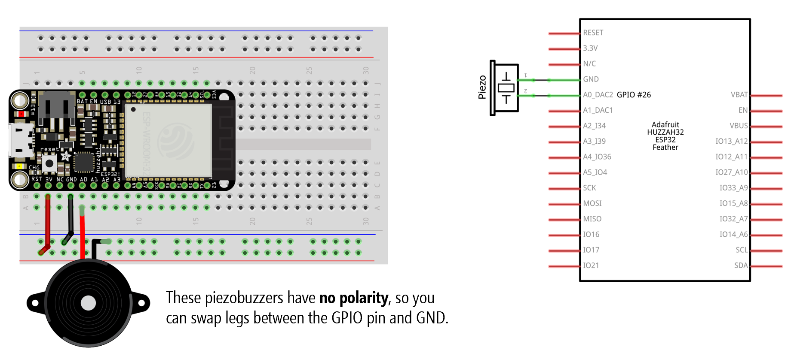
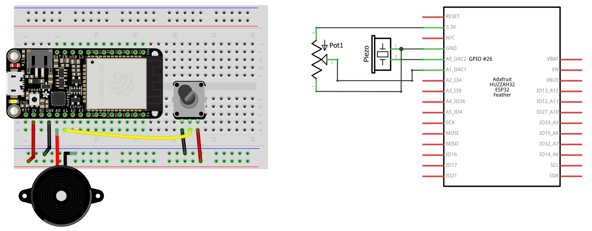

# {{ page.title | replace_first:'L','Lesson '}}
{: .no_toc }

## Table of Contents
{: .no_toc .text-delta }

1. TOC
{:toc}
---

<!-- Content TODOs:
1. Record a workbench video of the scale/melody playing on a piezo buzzer with an ESP32-S3 Feather
2. Record a video of the potentiometer-controlled tone with the ESP32-S3 Feather
3. Create updated Fritzing diagrams for ESP32-S3 Feather (currently using Huzzah32 diagrams)
4. Create a Wokwi project for the basic tone circuit
5. Create a Wokwi project for the melody
6. Create a Wokwi project for the pot-controlled tone
7. Port the interactive p5.js piezo buzzer simulation from the Arduino tone lesson
8. Port the interactive analogWrite vs. tone() p5.js simulation from the Arduino tone lesson
-->

<!-- See also:
- https://docs.espressif.com/projects/arduino-esp32/en/latest/api/ledc.html
- https://github.com/espressif/arduino-esp32/blob/master/cores/esp32/Tone.cpp
- https://github.com/espressif/arduino-esp32/pull/6402 (PR that added tone/noTone)
- Our Arduino tone lesson: ../arduino/tone.md
-->

<!-- TODO: Add a hero video or animated GIF showing something fun built with the ESP32 and a piezo buzzer
     (e.g., the potentiometer-controlled pitch demo, or the Imperial March playing) -->

So far, every output we've produced in the ESP32 module has been visual—turning LEDs on, off, fading, and reading analog input. In this lesson, we'll add a completely new output modality: **sound!** Using a piezo buzzer and the `tone()` function, we'll learn how to play individual notes, scales, and even melodies on the ESP32.

If you completed our [Intro to Arduino tone lesson](../arduino/tone.md), you'll be happy to know that `tone()` and `noTone()` now work on the ESP32 in **Arduino core v3.x**—the code is nearly identical! But we'll also explore the ESP32's more powerful alternative: the **LEDC tone functions** (`ledcWriteTone` and `ledcWriteNote`), which give you additional control and work directly with the same PWM hardware we used in [Lesson 3](led-fade.md).

{: .note }
> **In this lesson, you will learn:**
> - How to play tones on the ESP32 using `tone()` and `noTone()`—now supported in ESP32 Arduino core v3.x!
> - How to use the LEDC tone functions (`ledcWriteTone` and `ledcWriteNote`) for more control
> - The difference between `analogWrite` (duty cycle) and `tone()` (frequency)—and why it matters for sound
> - How to wire a passive piezo buzzer (no resistor needed!)
> - How to play scales, melodies, and even the Imperial March 🎵
> - How to combine tone output with an LED for multimodal feedback
> - How to use a potentiometer to control pitch interactively

## Materials

You'll need the same materials as the [last lesson](analog-input.md) plus a piezo buzzer. We use **[Adafruit's ESP32-S3 Feather](https://www.adafruit.com/product/5477)** but any ESP32-S3 board will work!

| Breadboard | ESP32 | Piezo Buzzer | Resistor | Trimpot |
| ---------- |:-----:|:-----:|:-----:|:-----:|
|  |  |  |  |  |
| Breadboard | [ESP32-S3 Feather](https://www.adafruit.com/product/5477) | Passive Piezo Buzzer | 220Ω Resistor (for LED) | 10kΩ Trimpot (later) |

We'll be using a passive piezo buzzer such as the [TDK PS1240](https://www.mouser.com/ProductDetail/810-PS1240P02BT) (~$0.40 from Mouser or ~$1.35 at [Adafruit](https://www.adafruit.com/product/160)). These buzzers work with both 3.3V and 5V signals, and their resonant frequency (loudest tone) is around 4 kHz—but they can produce a wide range of audible frequencies. We've tested from 32 Hz up to 10 kHz, at which point the sound is ear piercing! Piezo buzzers are **non-polarized** (like resistors), so they can be connected in either orientation.

{: .note }
> Make sure you have a **passive** piezo buzzer, not an **active** one. An active buzzer has a built-in oscillator and plays a fixed tone when powered. A passive buzzer requires an external signal (which is what `tone()` provides) and can play different frequencies. If your buzzer makes a sound when you simply connect it to 3.3V and GND, it's an active buzzer.
>
> Here's the [TDK PS1240 piezoelectronic buzzer datasheet](https://product.tdk.com/system/files/dam/doc/product/sw_piezo/sw_piezo/piezo-buzzer/catalog/piezoelectronic_buzzer_ps_en.pdf), which makes clear on the title page that it is "without an oscillator circuit".

## The tone() situation on ESP32: a brief history

{: .highlight }
If you've searched online for "ESP32 tone," you've probably encountered blog posts and forum threads declaring that `tone()` is "famously unsupported" on the ESP32. **This is no longer true!** Espressif added `tone()` and `noTone()` support in [PR #6402](https://github.com/espressif/arduino-esp32/pull/6402) (merged March 2022), and it shipped with ESP32 Arduino core v2.0.3+. If you're using **v3.x** (which we use in this course), `tone()` works out of the box.

The original version of this lesson was written when `tone()` was still unsupported and relied entirely on the LEDC PWM workaround. We used a custom library called [Tone32.hpp](https://github.com/makeabilitylab/arduino/blob/master/MakeabilityLab_Arduino_Library/src/Tone32.hpp) to add `duration` support to the LEDC tone functions. Now that `tone(pin, freq, duration)` works natively, Tone32.hpp is no longer needed—and you can write ESP32 tone code that's nearly identical to Arduino Uno code. 🎉

The YouTube demo videos throughout this lesson were recorded with the old Huzzah32 board and the legacy v2.x LEDC API. The concepts are the same—only the code has gotten simpler!

## `analogWrite` vs. `tone()`: what's the difference?

Before we start making sounds, it's important to understand how `tone()` differs from `analogWrite()`, which we used in the [LED fade lesson](led-fade.md) to control brightness. Both produce square waves, but they control **different properties** of the wave:

- **`analogWrite(pin, value)`** varies the **duty cycle** (the fraction of time the signal is HIGH) while keeping the frequency **fixed** (1 kHz by default on the ESP32 in v3.x). This is how we controlled LED brightness.

- **`tone(pin, frequency)`** varies the **frequency** (how many cycles per second) while keeping the duty cycle **fixed** at 50%. This is what controls pitch—the frequency of the sound wave determines whether you hear a low rumble or a high squeal.

<!-- TODO: Create a side-by-side diagram or animation showing: (1) analogWrite with varying duty cycles at fixed frequency, (2) tone() with varying frequencies at fixed 50% duty cycle -->

Here's a fun experiment to make this concrete: try connecting a piezo buzzer to a GPIO pin and running `analogWrite(pin, 127)`. You'll hear a steady buzz at the ESP32's default PWM frequency of 1 kHz. Now try `tone(pin, 440)`. You'll hear concert A—a completely different pitch. With `analogWrite`, you can change the duty cycle, which alters the harshness of the buzz, but you can't cleanly change the pitch.

{: .warning }
> Don't try running both `tone()` and `analogWrite()` on the same pin simultaneously—they both use the LEDC hardware under the hood, and they'll conflict. Use separate pins if you want to fade an LED while playing a tone.

## Making the circuit

The circuit couldn't be simpler. Connect one leg of the piezo buzzer to a GPIO pin (we'll use **GPIO 13**, which is also `LED_BUILTIN`) and the other leg to **GND**. No resistor is needed—the piezo buzzer draws very little current.

<!-- TODO: Create an updated Fritzing wiring diagram for the ESP32-S3 Feather with a piezo buzzer on GPIO 13 -->


**Figure.** A simple circuit connecting a passive piezo buzzer to a GPIO pin and GND. No current-limiting resistor is required. Image made in Fritzing and PowerPoint.
{: .fs-1 }

<details markdown="1">
<summary><strong>Using the Huzzah32 instead?</strong> (click to expand)</summary>

On the Huzzah32, our original code examples and Fritzing diagrams use **GPIO 26**. You can use any output-capable GPIO pin—just update the pin number in your code. Avoid pins 34, 39, and 36, which are input-only.

</details>

We'll use this basic circuit for most of the lesson—the real fun is in the code!

### Why no series resistor?

In our previous lessons, we stressed the importance of using a current-limiting resistor with every LED. So why are we wiring the piezo buzzer directly to a GPIO pin without one?

Unlike LEDs, passive piezo buzzers draw very little current. They behave more like a small capacitor than a simple resistive load. The internal piezoceramic disk flexes when voltage is applied, and this process only requires a tiny amount of current—typically under 5 mA. Since the ESP32's GPIO pins can safely source up to 20 mA, connecting the piezo buzzer directly is perfectly safe.

{: .note }
> **Piezo buzzers vs. electromagnetic speakers**
>
> You may have seen speaker circuits online that include an inline resistor (typically 100Ω–1kΩ). Those circuits use **electromagnetic speakers**, which have a low-impedance coil (commonly 8Ω or 16Ω) and can draw significant current. A series resistor is essential in those circuits.
>
> **Piezo buzzers** are fundamentally different: they are **capacitive** devices, not resistive, and can be safely driven directly from a microcontroller pin. This capacitance also explains why you can't easily use a series resistor to control volume—because a piezo's impedance varies with frequency, a resistor attenuates different frequencies by different amounts rather than uniformly reducing volume. The simplest way to reduce volume? Put a piece of tape over the hole!

## How do piezo buzzers actually work?

The word "piezoelectric" comes from the Greek word *piezein*, meaning to press or squeeze. Piezoelectric materials have a fascinating property: when you apply a voltage, they physically change shape. Inside your passive buzzer is a thin metal plate with a piezoceramic disk glued to it. When the ESP32 rapidly pulses voltage `HIGH` and `LOW` via the `tone()` function, the ceramic disk quickly bends back and forth. This rapid flexing pushes the surrounding air back and forth, generating the physical sound waves that reach your ears. The frequency of the electrical pulses directly dictates how fast the disk vibrates, which determines the pitch.

<!-- TODO: Port the interactive p5.js piezo buzzer simulation from the Arduino tone lesson:
     https://editor.p5js.org/jonfroehlich/sketches/mU7YwoUol -->

### Why do they sound so... buzzy?

If you've been playing tones, you've probably noticed they sound harsh and reminiscent of old 8-bit video games. There are two main reasons:

1. **The square wave:** The `tone()` function generates a perfect square wave, instantly snapping between 0V and 3.3V. Unlike the smooth, continuous curve of a sine wave—which produces a pure, clean tone like a tuning fork—a square wave contains many overlapping frequencies called *harmonics* (we explore this in [Frequency Analysis](../signals/frequency-analysis.html)). Our ears perceive these extra harmonics as a buzzy, aggressive sound.

2. **Physical resonance:** Piezo buzzers are designed primarily as alert buzzers (think microwave beeps or smoke detectors), not high-fidelity speakers. They are physically tuned to resonate and be loudest at a specific frequency—usually around 4 kHz. As you play different notes, some pitches will sound overwhelmingly loud while others sound thin or muted.

{: .note }
> **Want to hear the difference?** If you want to build deeper intuition for how different waveforms sound and look, check out this short, interactive guide by Josh Comeau: "[Let's Learn About Waveforms](https://pudding.cool/2018/02/waveforms/)." Make sure your sound is on (press 'm' to unmute).

## The `tone()` function

Arduino provides three functions for generating tones:

```cpp
tone(pin, frequency)              // play continuously until noTone() is called
tone(pin, frequency, duration)    // play for 'duration' milliseconds, then stop
noTone(pin)                       // stop playing
```

A few important details:

- `tone()` is **non-blocking**. The ESP32 will immediately move to the next line of code while the sound plays in the background (using an internal FreeRTOS task). If you want the program to wait until the note finishes, add a `delay(duration)` after the call.
- `tone()` can work on **any GPIO pin**—not just PWM pins. Under the hood, it uses the LEDC peripheral to generate the square wave.
- Only **one tone** can play at a time. If you call `tone()` on a different pin while a tone is already playing, the first tone stops. This is a hardware limitation.
- The `tone()` implementation on the ESP32 calls `ledcAttach()` internally to claim an available LEDC channel automatically (see [Tone.cpp](https://github.com/espressif/arduino-esp32/blob/master/cores/esp32/Tone.cpp) in the [arduino-esp32](https://github.com/espressif/arduino-esp32) repo). This means it may **conflict with PWM output** on other pins if all LEDC channels are in use. In practice this is rarely a problem—the ESP32-S3 has 8 channels. But it also means you should **not mix `tone()` and LEDC functions** (like `ledcWriteTone`) on the same pin—they will both try to manage the same underlying channel and interfere with each other. Pick one approach and stick with it.

{: .warning }
> **Timer conflict on the Arduino Uno:** On the Uno, `tone()` uses Timer2, which disables PWM on specific pins (3 and 11). On the ESP32, the LEDC peripheral handles this differently—`tone()` simply claims one of the available PWM channels. If you're also using `ledcAttach` for LED fading, just make sure you don't run out of channels (8 on the ESP32-S3, 16 on the original ESP32).

## Playing individual tones

Let's start simple. The following code plays concert A (440 Hz) for one second, pauses for half a second, then repeats:

```cpp
/**
 * Play a simple repeating tone on a piezo buzzer.
 *
 * See: https://makeabilitylab.github.io/physcomp/esp32/tone
 */
const int BUZZER_PIN = 13;

void setup() {
  Serial.begin(115200);
  Serial.println("Playing concert A (440 Hz)...");
}

void loop() {
  tone(BUZZER_PIN, 440);       // Play concert A (440 Hz)
  delay(1000);                 // Let it play for one second
  noTone(BUZZER_PIN);          // Stop the tone
  delay(500);                  // Pause for half a second
}
```

Try changing the frequency: 262 is middle C, 523 is one octave higher (C5), and 1000 produces a high-pitched tone. What's the lowest frequency you can hear? The highest? Most humans can hear roughly 20 Hz to 20 kHz, but this varies with age.

{: .note }
> **Pro Tip: How do I make it quieter?**
> Once you get your buzzer working, your first question will probably be: *"How do I turn the volume down?"* Because `tone()` always outputs a fixed 50% duty cycle square wave, you **cannot** control the volume via code. Instead, we use a classic physical computing hack: **put a piece of tape over it!** A small piece of masking tape or painter's tape directly over the hole on the piezo buzzer will significantly muffle the sound. As we discussed [above](#why-no-series-resistor), adding a series resistor doesn't work well here because the piezo's capacitive nature causes different frequencies to be muffled unevenly.

## Playing a scale

Now let's play something more musical. The Arduino IDE ships with a helpful file called `pitches.h` that defines frequency constants for musical notes. You can find it in the [toneMelody example](https://github.com/arduino/arduino-examples/blob/main/examples/02.Digital/toneMelody/pitches.h) or access it via `File -> Examples -> 02.Digital -> toneMelody` in the IDE. You can also find musical note frequencies in this [Piano Key Frequencies article](https://en.wikipedia.org/wiki/Piano_key_frequencies) on Wikipedia.

Here are a few of the note definitions from [`pitches.h`](https://github.com/arduino/arduino-examples/blob/main/examples/02.Digital/toneMelody/pitches.h):

```cpp
#define NOTE_C4  262   // Middle C
#define NOTE_D4  294
#define NOTE_E4  330
#define NOTE_F4  349
#define NOTE_G4  392
#define NOTE_A4  440   // Concert A
#define NOTE_B4  494
#define NOTE_C5  523   // C one octave above middle C
```

Using these constants, we can play a C major scale:

```cpp
#define NOTE_C4  262
#define NOTE_D4  294
#define NOTE_E4  330
#define NOTE_F4  349
#define NOTE_G4  392
#define NOTE_A4  440
#define NOTE_B4  494
#define NOTE_C5  523

const int BUZZER_PIN = 13;
const int NOTE_DURATION_MS = 400;
const int PAUSE_BETWEEN_NOTES_MS = 100;

int scale[] = {NOTE_C4, NOTE_D4, NOTE_E4, NOTE_F4, NOTE_G4, NOTE_A4, NOTE_B4, NOTE_C5};
int numNotes = 8;

void setup() {
  // Nothing to set up!
}

void loop() {
  // Play ascending
  for (int i = 0; i < numNotes; i++) {
    tone(BUZZER_PIN, scale[i], NOTE_DURATION_MS);
    delay(NOTE_DURATION_MS + PAUSE_BETWEEN_NOTES_MS);
  }

  delay(300);

  // Play descending
  for (int i = numNotes - 1; i >= 0; i--) {
    tone(BUZZER_PIN, scale[i], NOTE_DURATION_MS);
    delay(NOTE_DURATION_MS + PAUSE_BETWEEN_NOTES_MS);
  }

  delay(1000);
}
```

Notice that we use the `duration` parameter of `tone()`, so we don't need to call `noTone()` manually—the tone stops automatically after `NOTE_DURATION_MS` milliseconds. One subtlety: `tone()` is **non-blocking**, meaning the sketch continues executing immediately even while the tone is still playing. That's why we still need the `delay()` call—without it, the loop would race ahead to the next note before the current one finishes.

{: .note }
> **Behind the scenes:** On the Arduino Uno, `tone()` uses Timer2 and a hardware interrupt to track note duration. On the ESP32, `tone()` uses a [FreeRTOS](https://www.freertos.org/) task with a message queue to manage timing in the background. FreeRTOS is a real-time operating system that runs on the ESP32 and handles multitasking—it's why `tone()` can play a note asynchronously while your `loop()` code keeps running. This is fundamentally different from the bare-metal timer interrupts on the Uno, and it's a glimpse into why the ESP32 is so much more capable: it can run multiple concurrent tasks, manage WiFi and Bluetooth stacks, and still toggle a GPIO pin at precise frequencies—all at the same time. See [Tone.cpp](https://github.com/espressif/arduino-esp32/blob/master/cores/esp32/Tone.cpp) for the implementation, and the [FreeRTOS documentation](https://docs.espressif.com/projects/esp-idf/en/stable/esp32/api-reference/system/freertos.html) if you want to learn more about ESP32 multitasking.

<!-- TODO: Record a video of the C scale playing on a piezo buzzer with the ESP32-S3 Feather -->

Here's an earlier video demo using the Huzzah32 (the code concepts are the same, but the version shown uses the legacy LEDC API):

<iframe width="736" height="414" src="https://www.youtube.com/embed/H7MOhibjOO0" title="Playing the C scale on the ESP32 with a piezo buzzer" frameborder="0" allow="accelerometer; autoplay; clipboard-write; encrypted-media; gyroscope; picture-in-picture" allowfullscreen></iframe>
**Video.** A video demonstration of a C major scale playing on the ESP32. The code shown uses the legacy v2.x LEDC API; the v3.x `tone()` version above produces identical output. Source: [PlayScale.ino](https://github.com/makeabilitylab/arduino/blob/master/ESP32/Tone/PlayScale/PlayScale.ino) (legacy version). Make sure your sound is on.
{: .fs-1 }

## Playing a melody

Now for the fun part—let's play a real melody! We store the melody as two arrays: one for the notes and one for the note durations.

The Arduino IDE includes a built-in example that plays a short melody. You can access it via `File -> Examples -> 02.Digital -> toneMelody`. Instead, we've written our own version using the Imperial March from Star Wars:

```cpp
#define NOTE_C4  262
#define NOTE_D4  294
#define NOTE_E4  330
#define NOTE_F4  349
#define NOTE_G4  392
#define NOTE_GS4 415
#define NOTE_A4  440
#define NOTE_B4  494
#define NOTE_C5  523
#define NOTE_E5  659
#define NOTE_F5  698

const int BUZZER_PIN = 13;

// The Imperial March - Main Theme (two phrases)
int melody[] = {
  // Phrase 1: The iconic opening
  NOTE_A4, NOTE_A4, NOTE_A4, NOTE_F4, NOTE_C5,
  NOTE_A4, NOTE_F4, NOTE_C5, NOTE_A4,

  // Phrase 2: The response (up the octave)
  NOTE_E5, NOTE_E5, NOTE_E5, NOTE_F5, NOTE_C5,
  NOTE_GS4, NOTE_F4, NOTE_C5, NOTE_A4
};

// Note durations as divisors of DURATION_BASE:
//   2 = half, 4 = quarter, 6 = dotted eighth, 8 = eighth
int noteDurations[] = {
  4, 4, 4, 6, 16,
  4, 6, 16, 2,

  4, 4, 4, 6, 16,
  4, 6, 16, 2
};

// In C/C++, arrays don't have a built-in .length property.
// We calculate the number of elements by dividing the total array memory size (in bytes)
// by the memory size of a single element (the first item at index 0).
const int NUM_NOTES = sizeof(melody) / sizeof(melody[0]);

// The tempo in Beats Per Minute
const int BPM = 104;

// A minute has 60,000 ms. Divide by BPM for quarter-note duration.
// Multiply by 4 because our array uses '4' to represent a quarter note.
const int DURATION_BASE = (60000 / BPM) * 4;

// Pause between notes as a multiplier of note duration.
// 0.3 means 30% of the note length itself
const float NOTE_GAP_FACTOR = 0.30;

void setup() {
  for (int i = 0; i < NUM_NOTES; i++) {
    // Calculate note duration from the base tempo value
    // e.g., quarter note = 2308/4 = 577ms, dotted eighth = 2308/6 ≈ 385ms
    int duration = DURATION_BASE / noteDurations[i];
    if (melody[i] > 0) {
      tone(BUZZER_PIN, melody[i], duration);
    }
    delay(duration);  // Wait for the duration whether playing a note or resting

    // Pause between notes
    int pauseBetweenNotes = duration * NOTE_GAP_FACTOR;
    delay(pauseBetweenNotes);

    noTone(BUZZER_PIN);
  }
}

void loop() {
  // Melody plays once in setup(), nothing to do here
}
```

To represent a rest (silence), use a note value of `0` in the melody array. The code checks for this and simply skips the `tone()` call, relying on the `delay()` to produce a silent pause. Avoid calling `tone(pin, 0)` directly—while it may produce silence on some platforms, it can cause unexpected behavior on others due to division by zero in the timer math.

<!-- TODO: Record a video of the Imperial March playing on the ESP32-S3 Feather -->

{: .note }
> **Want to play more complex melodies?** Search online for "Arduino tone songs" or "Arduino buzzer melodies"—the community has transcribed hundreds of songs into Arduino `tone()` format. The [arduino-songs](https://github.com/robsoncouto/arduino-songs) repository by Robson Couto is a great collection. Just remember that the piezo buzzer can only play one note at a time (no chords!).
>
> **What about chords?** The default `tone()` library cannot generate multiple simultaneous frequencies. However, Brett Hagman, the original author of the Arduino tone function, wrote a more [advanced tone library](https://code.google.com/archive/p/rogue-code/wikis/ToneLibraryDocumentation.wiki) that supports multiple simultaneous tones on separate pins.

## Combining tone with an LED

Now let's bring together what we've learned. Since we already know how to control LEDs from lessons [L2](led-blink.md) through [L4](analog-input.md), we can add **visual feedback** synchronized with our audio output. This kind of **multimodal feedback**—combining sound and light—makes the output more engaging and is a common pattern in interactive projects.

### Flashing an LED with each note

The simplest approach is to turn an LED on while a note plays and off during the pause. Here's a simple two-tone siren that alternates an LED with each pitch change:

```cpp
const int BUZZER_PIN = 13;
const int LED_PIN = 5;       // Use any output-capable GPIO
const int SOUND_DURATION_MS = 500;

void setup() {
  pinMode(LED_PIN, OUTPUT);
}

void loop() {
  tone(BUZZER_PIN, 392);           // G4
  digitalWrite(LED_PIN, HIGH);     // LED on for high tone
  delay(SOUND_DURATION_MS);

  tone(BUZZER_PIN, 262);           // C4
  digitalWrite(LED_PIN, LOW);      // LED off for low tone
  delay(SOUND_DURATION_MS);
}
```

<!-- TODO: Record a video of the siren + LED on the ESP32-S3 Feather -->

You can also check out our Imperial March code, which turns on `LED_BUILTIN` whenever a note is played:

* **Imperial March simplified** on [GitHub](https://github.com/makeabilitylab/arduino/blob/master/Basics/tone/PlayImperialMarchSimple/PlayImperialMarchSimple.ino)
* **Imperial march advanced** on [GitHub](https://github.com/makeabilitylab/arduino/blob/master/Basics/tone/PlayImperialMarchAdvanced/PlayImperialMarchAdvanced.ino), which includes better rhythm and an extended melody.

## Controlling pitch with a potentiometer

Let's make things interactive! By combining `analogRead()` (from [Lesson 4](analog-input.md)) with `tone()`, we can build a simple instrument where a potentiometer controls the pitch. This is the same `analogRead()` → `map()` → output pattern we used in [Lesson 4](analog-input.md) to control LED brightness—but now we're driving a completely different output modality!

### The circuit

Add a potentiometer to the buzzer circuit. Connect the potentiometer's wiper (middle pin) to an analog input pin—we'll use **A5** since it's on ADC1 (works even with WiFi active, as we discussed in [Lesson 4](analog-input.md)).

<!-- TODO: Create an updated Fritzing diagram for ESP32-S3 + buzzer + potentiometer -->


**Figure.** Circuit diagram with a piezo buzzer and potentiometer connected to the ESP32. Image made in Fritzing and PowerPoint.
{: .fs-1 }

### Sweeping through frequencies

This version maps the potentiometer to a continuous range of frequencies:

```cpp
/**
 * Use a potentiometer to control the frequency of a piezo buzzer.
 * Turn the knob to sweep through audible frequencies!
 *
 * See: https://makeabilitylab.github.io/physcomp/esp32/tone
 */
const int BUZZER_PIN = 13;
const int POT_INPUT_PIN = A5;

#if defined(ESP32)
  const int MAX_ANALOG_VAL = 4095;
#else
  const int MAX_ANALOG_VAL = 1023;
#endif

const int MIN_FREQ = 31;    // Lowest frequency tone() supports
const int MAX_FREQ = 1500;  // 1500 Hz is already quite ear-piercing!

void setup() {
  Serial.begin(115200);
}

void loop() {
  int potVal = analogRead(POT_INPUT_PIN);
  int freq = map(potVal, 0, MAX_ANALOG_VAL, MIN_FREQ, MAX_FREQ);

  tone(BUZZER_PIN, freq);

  Serial.print("Pot: ");
  Serial.print(potVal);
  Serial.print(" -> Freq: ");
  Serial.print(freq);
  Serial.println(" Hz");

  delay(50);
}
```

Turn the potentiometer slowly and listen to the pitch sweep from a low rumble to a high squeal.

Here's an earlier video demo on the Huzzah32 (same concept, legacy LEDC API):

<iframe width="736" height="414" src="https://www.youtube.com/embed/xr_G_fkHcSo" title="Analog input controlling tone frequency on the ESP32" frameborder="0" allow="accelerometer; autoplay; clipboard-write; encrypted-media; gyroscope; picture-in-picture" allowfullscreen></iframe>
**Video.** A video demonstration of potentiometer-controlled frequency output on the Huzzah32. The code shown uses the legacy v2.x LEDC API; the v3.x `tone()` version above produces identical output. Source: [AnalogInputTone.ino](https://github.com/makeabilitylab/arduino/blob/master/ESP32/Tone/AnalogInputTone/AnalogInputTone.ino) (legacy version). The version shown in the video also displays the frequency on an OLED. Make sure your sound is on.
{: .fs-1 }

{: .note }
> **Challenge:** Modify the code so the potentiometer walks through the C major scale (8 discrete notes) instead of sweeping continuously through frequencies. Hint: use `map()` to convert the pot value to a scale index (0–7) and look up the frequency from an array.

<details markdown="1">
<summary><strong>Using the Huzzah32 instead?</strong> (click to expand)</summary>

On the Huzzah32, use **A1** (GPIO 25) for the potentiometer input and **GPIO 26** for the buzzer. A1 is on ADC2, which works fine when WiFi is off. If you need WiFi, use an ADC1 pin such as A7 (GPIO 32).

</details>

## The LEDC tone alternative

While `tone()` is the simplest approach and what we recommend for most projects, the ESP32 also offers the **LEDC tone functions**—`ledcWriteTone()` and `ledcWriteNote()`—which use the same LEDC PWM hardware we learned about in [Lesson 3](led-fade.md). These give you some advantages:

- **`ledcWriteNote(pin, note, octave)`** lets you specify notes by name and octave using the built-in `note_t` enum—no `pitches.h` needed.
- **`ledcWriteTone(pin, frequency)`** plays a specific frequency, similar to `tone()`.
- Both work directly with the LEDC channel system, which can be useful if you're already using LEDC for other purposes.

{: .note }
> In ESP32 Arduino core **v3.x**, the LEDC tone functions take a **pin** number (not a channel number). In the old v2.x API, they took a **channel** number. This is the same v2 → v3 migration we discussed in [Lesson 3](led-fade.md). If you see old tutorials using `ledcAttachPin` and passing channel numbers to `ledcWriteTone`, that's the v2.x API.

### Using `ledcWriteNote`

The `note_t` enum provides named constants for all twelve chromatic notes:

```cpp
typedef enum {
    NOTE_C, NOTE_Cs, NOTE_D, NOTE_Eb, NOTE_E, NOTE_F, NOTE_Fs,
    NOTE_G, NOTE_Gs, NOTE_A, NOTE_Bb, NOTE_B, NOTE_MAX
} note_t;
```

To play a note, first attach the pin with `ledcAttach`, then call `ledcWriteNote`:

```cpp
const int BUZZER_PIN = 13;

void setup() {
  // Attach the pin to the LEDC peripheral
  // The initial frequency (2000) will be overridden by ledcWriteNote
  ledcAttach(BUZZER_PIN, 2000, 10);
}

void loop() {
  // Play the C major scale using ledcWriteNote
  ledcWriteNote(BUZZER_PIN, NOTE_C, 4);   // Middle C (C4)
  delay(500);
  ledcWriteNote(BUZZER_PIN, NOTE_D, 4);
  delay(500);
  ledcWriteNote(BUZZER_PIN, NOTE_E, 4);
  delay(500);
  ledcWriteNote(BUZZER_PIN, NOTE_F, 4);
  delay(500);
  ledcWriteNote(BUZZER_PIN, NOTE_G, 4);
  delay(500);
  ledcWriteNote(BUZZER_PIN, NOTE_A, 4);
  delay(500);
  ledcWriteNote(BUZZER_PIN, NOTE_B, 4);
  delay(500);
  ledcWriteNote(BUZZER_PIN, NOTE_C, 5);   // C5
  delay(500);
}
```

The nice thing about `ledcWriteNote` is that you don't need `pitches.h`—the frequency lookup is built into the ESP32 library.

### Stopping the tone with LEDC

To stop a tone with the LEDC functions, call `ledcWriteTone(pin, 0)` to silence the pin while keeping the channel attached, or `ledcDetach(pin)` to fully release the channel.

{: .warning }
> **Don't mix `tone()` and LEDC on the same pin.** If you start a sound with `tone()`, stop it with `noTone()`. If you start a sound with `ledcWriteTone()` or `ledcWriteNote()`, stop it with `ledcWriteTone(pin, 0)` or `ledcDetach(pin)`. Mixing the two APIs on the same pin will cause them to fight over the underlying LEDC channel, leading to unpredictable behavior. Pick one approach per pin and stick with it.

<details markdown="1">
<summary><strong>Legacy v2.x LEDC API</strong> (click to expand)</summary>

In ESP32 Arduino core v2.x, the LEDC tone functions took a **channel** number instead of a pin number:

```cpp
// v2.x API (old — don't use with v3.x!)
ledcSetup(channel, freq, resolution);    // configure a channel
ledcAttachPin(pin, channel);             // attach pin to channel
ledcWriteTone(channel, frequency);       // play tone on channel
ledcWriteNote(channel, note, octave);    // play note on channel
```

The key difference: in v2.x, `ledcWriteTone` takes a **channel** number. In v3.x, `ledcWriteTone` takes a **pin** number. If you're following older tutorials online, this is the most common source of confusion. See the [migration guide](https://docs.espressif.com/projects/arduino-esp32/en/latest/migration_guides/2.x_to_3.0.html) for full details.

The YouTube videos throughout this lesson were recorded with the v2.x API—the concepts are the same; only the function signatures changed.

</details>

### `tone()` vs. LEDC: which should I use?

| | `tone()` / `noTone()` | `ledcWriteTone()` / `ledcWriteNote()` |
|---|---|---|
| **Simplicity** | ✅ Familiar Arduino API | Requires `ledcAttach` setup |
| **Cross-platform** | ✅ Works on Uno, Leonardo, ESP32 | ESP32 only |
| **Duration support** | ✅ Built-in `duration` parameter | ❌ Must manage timing yourself |
| **Named notes** | ❌ Need `pitches.h` for note names | ✅ Built-in `note_t` enum |
| **Channel control** | ❌ Automatic | ✅ Can choose channels explicitly |

For most projects in this course, **`tone()` is the simplest and best choice**. Use the LEDC functions when you need finer control over PWM channels or when you want the convenience of the built-in `note_t` enum.

## Bonus demo videos

Here are two additional demo videos from our earlier Huzzah32 work. These use the legacy v2.x API and our old Tone32.hpp library for duration tracking, but the *concepts*—reading analog input, mapping to notes, playing tones with durations—are exactly what you've learned in this lesson using the standard `tone()` function.

### Potentiometer-controlled scale with OLED

<iframe width="736" height="414" src="https://www.youtube.com/embed/zFg1fSFGL7o" title="Potentiometer controlling C scale with duration display on OLED" frameborder="0" allow="accelerometer; autoplay; clipboard-write; encrypted-media; gyroscope; picture-in-picture" allowfullscreen></iframe>
**Video.** A potentiometer walks up and down the C scale, with each note playing for 500ms. The OLED shows the note name and remaining duration. Recorded on the Huzzah32 with the legacy v2.x API. Source: [AnalogInputTone32WithOLED.ino](https://github.com/makeabilitylab/arduino/blob/master/ESP32/Tone/AnalogInputTone32WithOLED/AnalogInputTone32WithOLED.ino). Make sure your sound is on.
{: .fs-1 }

### Ball bounce with sound effects

<iframe width="736" height="414" src="https://www.youtube.com/embed/cy7Jeri7vOA" title="Ball bounce demo with sound effects on ESP32 with OLED" frameborder="0" allow="accelerometer; autoplay; clipboard-write; encrypted-media; gyroscope; picture-in-picture" allowfullscreen></iframe>
**Video.** A ball bouncing on an OLED display, playing a brief tone on each collision with the floor or ceiling. This demonstrates using tone durations for sound effects in a game-like application. Source: [BallBounceTone32WithOLED.ino](https://github.com/makeabilitylab/arduino/blob/master/ESP32/Tone/BallBounceTone32WithOLED/BallBounceTone32WithOLED.ino). Make sure your sound is on.
{: .fs-1 }

## Exercises

Want to go further? Here are some challenges:

**Exercise 1:** Write a program that plays a short tune when the board boots, then stops. Use `setup()` to play the melody (like the Imperial March example) and leave `loop()` empty.

**Exercise 2: Hearing range test.** Write a program that sweeps from 20 Hz to 20,000 Hz. At what frequency can you no longer hear the tone? Compare with classmates—does it vary?

**Exercise 3: LED + melody.** Modify the Imperial March code to also light up the onboard NeoPixel in different colors for different notes. High notes could be red, low notes could be blue—use `map()` to convert the frequency to a hue value and `ColorHSV()` from the [Adafruit NeoPixel library](https://github.com/adafruit/Adafruit_NeoPixel)!

**Exercise 4: Two-pot instrument.** Add a second potentiometer to control the **duration** of each note independently from the pitch. One knob controls frequency, the other controls how long each tone plays before a brief silence.

**Exercise 5: Port from Arduino.** Take the scale or melody code from our [Intro to Arduino tone lesson](../arduino/tone.md) and run it on the ESP32 without changes. Does it work? What (if anything) needs to change? (Spoiler: very little!)

**Exercise 6: Compare `tone()` vs. LEDC.** Rewrite the C scale example using `ledcWriteNote()` instead of `tone()`. What are the practical differences you notice? Which approach do you prefer, and why?

## Summary

In this lesson, you added sound to your ESP32 repertoire! Here's what you learned:

- The `tone()` and `noTone()` functions are **now supported on the ESP32** in Arduino core v3.x (added in v2.0.3), making tone code nearly identical between the Arduino Uno and ESP32.
- The ESP32 also provides **LEDC tone functions** (`ledcWriteTone` and `ledcWriteNote`) as a more powerful alternative, with built-in support for named notes via the `note_t` enum.
- The critical difference between `analogWrite()` (varies **duty cycle** at a fixed frequency) and `tone()` (varies **frequency** at a fixed 50% duty cycle). Only `tone()` can produce different pitches.
- Passive piezo buzzers are **capacitive** devices that draw very little current and can be connected directly to a GPIO pin without a resistor.
- The `analogRead()` → `map()` → output pattern works for driving *any* output—LEDs, tones, and beyond.
- Combining sound and light creates **multimodal feedback** that makes interactive projects more engaging.

## Resources

- [Arduino `tone()` reference](https://www.arduino.cc/reference/en/language/functions/advanced-io/tone/)
- [ESP32 LEDC API documentation](https://docs.espressif.com/projects/arduino-esp32/en/latest/api/ledc.html)
- [ESP32 Tone.cpp source](https://github.com/espressif/arduino-esp32/blob/master/cores/esp32/Tone.cpp) — the implementation of `tone()` and `noTone()` for the ESP32
- [PR #6402](https://github.com/espressif/arduino-esp32/pull/6402) — the pull request that added `tone()` and `noTone()` to the ESP32 Arduino core
- [arduino-songs](https://github.com/robsoncouto/arduino-songs) — a community collection of melodies transcribed into Arduino `tone()` format
- [Let's Learn About Waveforms](https://pudding.cool/2018/02/waveforms/) — interactive guide to understanding waveform shapes and their sounds

## Next Lesson

In the [next lesson](capacitive-touch-sensing.md), we'll learn about the ESP32's built-in capacitive touch sensing hardware—no external components needed! You'll use touch inputs to trigger tones and build a simple touch piano.

<span class="fs-6">
[Previous: Analog input](analog-input.md){: .btn .btn-outline }
[Next: Capacitive touch sensing](capacitive-touch-sensing.md){: .btn .btn-outline }
</span>