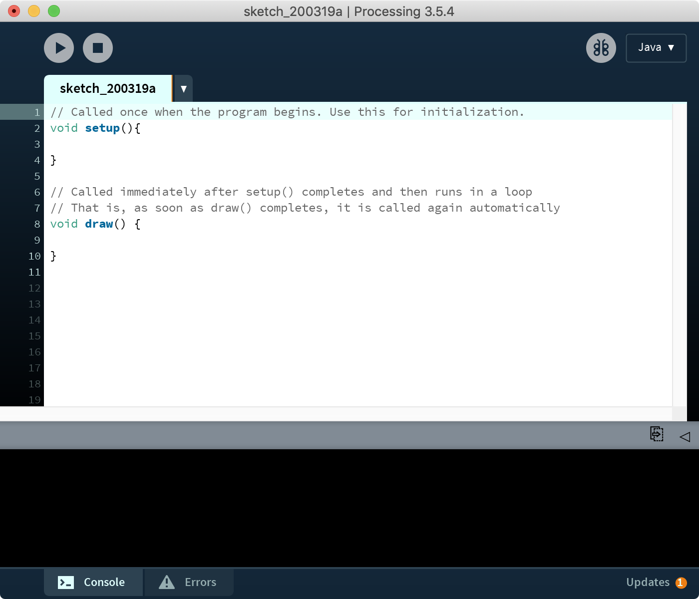

# Programmatically Blink an LED
{: .no_toc }

## Table of Contents
{: .no_toc .text-delta }

1. TOC
{:toc}
---
In our [first activity](led-on.md), we directly hooked up an LED circuit to the Arduino's 5V pin. While this enabled learning about Arduino's supply voltage and GND pins and gave us practical experience wiring electrical components into the Arduino ports, it was admittedly, a toy exercise.

In this activity, we are going to do something more exciting: use the Arduino to turn the LED on and off by programatically controlling the output voltage on one of Arduino's GPIO pins.

This begins our entrée into the two key parts of using microcontrollers: (1) building circuits and (2) writing code to interact with those circuits.

## Materials

You will use the same materials as before:

| Arduino | LED | Resistor |
|:-----:|:-----:|:-----:|
| Arduino Uno, Leonardo, or similar  | Red LED | 220Ω Resistor |
|     |  |  |
| Arduino Uno, Leonardo, or similar  | Red LED | 220Ω Resistor |

## Making the circuit
Using the same resistor-wrapped red LED from [before](led-on.md#step-1-wrap-resistor-around-led-leg), plug the anode + resistor side into Pin 3 and the cathode into GND.

Next, we'll write C code for the Arduino to turn on the LED from Pin 3 (which programmatically sets Pin 3 to 5V).

## Download, install, and open the Arduino IDE

But first, we need to download and install the Arduino IDE (if you haven't already).

### Step 1: Download and install the Arduino IDE

Download and install the local Mac, Windows, or Linux version of the [Arduino IDE](https://www.arduino.cc/en/main/software). We will **not** be using the Cloud version.

### Step 2: Open the IDE

After installation is complete, open the Arduino IDE. Notice that there are **two blocks** of code (called functions):

1. The first block: `setup()`, which is called once and only once when the Arduino is turned on (or reset)
2. And the second block: `loop()`, which is called as soon as `setup()` completes and, when finished, is automatically called again and again (until the Arduino is turned off).

For those who have used [Processing](https://processing.org/)—a programming environment for digital artists and creators—this code structure should seem familiar. Indeed, the Arduino IDE derives from Processing.

| Processing | p5js |
|----|----|
|  |  |

## Turn on LED programatically via Pin 3
TODO:
- Simply shows how to program Pin 3 to turn on LED

## Turn on and off the LED programatically via Pin 3

In this part, we will write a simple program for the Arduino that will turn on and off the LED programatically.

The full Blink code is below (from my [Arduino GitHub repository](https://github.com/jonfroehlich/arduino)).

## Upload the code to the Arduino microcontroller
TODO:
- Show how to do this with screenshot of Arduino IDE
- Show animation of the code working without being plugged into USB (e.g., with battery)

## TODO:
- Next step is fading the LED

[Previous](led-on.md){: .btn .btn-outline }
[Next](led-fade.md){: .btn .btn-outline }
