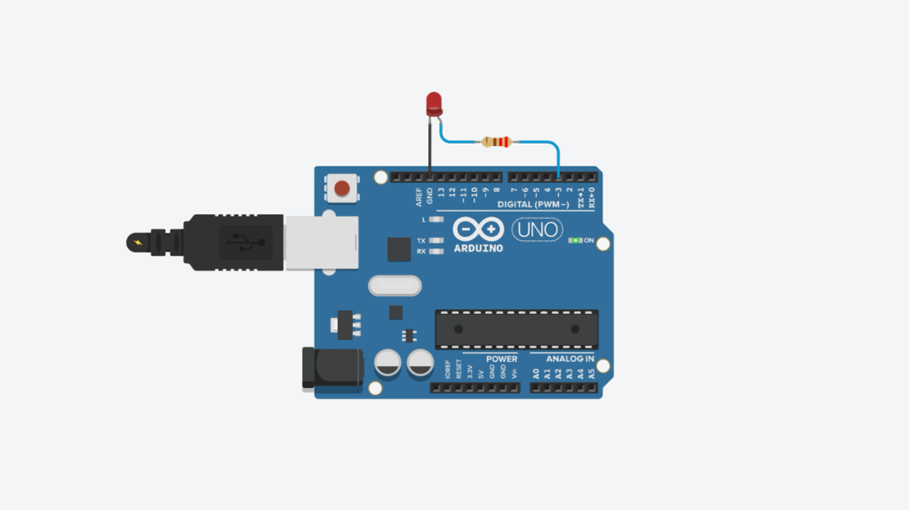
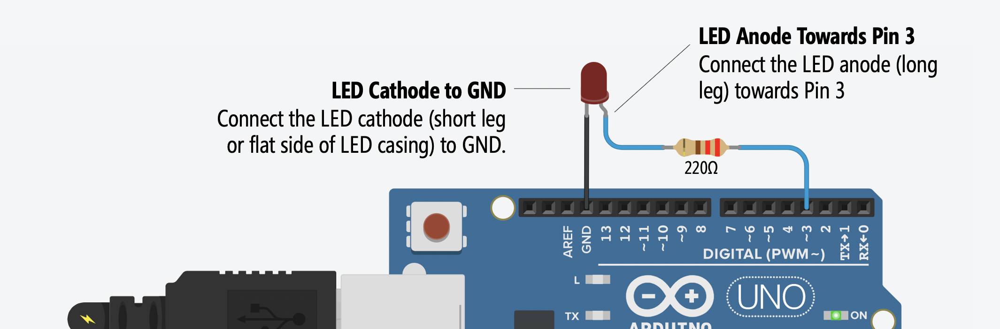
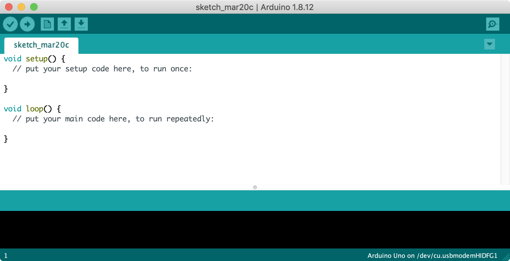

# Fading an LED
{: .no_toc }

## Table of Contents
{: .no_toc .text-delta }

1. TOC
{:toc}
---

In the [previous lesson](led-blink.md), we learned how to turn on and off an LED using [`digitalWrite`](https://www.arduino.cc/reference/en/language/functions/digital-io/digitalwrite/)—which worked by alternating between setting Pin 3 to 5V (`HIGH`) and 0V (`LOW`). In this lesson, we'll learn how to programatically control the output voltage at finer gradations using [`analogWrite`](https://www.arduino.cc/reference/en/language/functions/analog-io/analogwrite/). More specifically, we will gradually fade an LED on and off.

## Materials
You will use the same materials as [before](led-blink.md), including the [Arduino IDE](https://www.arduino.cc/en/main/software) and a USB cable to upload your program from your computer to your Arduino.

| Arduino | LED | Resistor |
|:-----:|:-----:|:-----:|
| Arduino Uno, Leonardo, or similar  | Red LED | 220Ω Resistor |
|     |  |  |
| Arduino Uno, Leonardo, or similar  | Red LED | 220Ω Resistor |

## Fade Circuit

As noted in our previous lesson, the Arduino Uno has 14 digital I/O pins:

However, **6** of the 14 I/O pins can also be used for analog output. These pins are indicated by the tilde (`~`) printed next to the pin on the Arduino (*i.e.,* silkscreened on the Arduino's PCB).

So, we don't actually have to change our circuit at all! (Indeed, this is the reason why we selected Pin 3 in the first place).

---
**IMPORTANT NOTE:**

A common confusion amongst beginners is mixing up the analog **output** pins and the analog **input** pins. Whereas for digital I/O, the input and output pins are the same and configurable to `INPUT` or `OUTPUT` using the [`pinMode`](https://www.arduino.cc/reference/en/language/functions/digital-io/pinmode/) command, the analog I/O pins are different!

We'll learn about analog output in this lesson (using [`analogWrite`](https://www.arduino.cc/reference/en/language/functions/analog-io/analogwrite/)). In a future lesson, we will learn about analog input (using [`analogRead`](https://www.arduino.cc/reference/en/language/functions/analog-io/analogread/))

---

## Initial Fading Approach

### Step 1: Start a new sketch in the Arduino IDE

Start a new sketch in the Arduino IDE:

## Improved Fading Approach

Outline:
1. Using a for loop: Fade LED on (then immediately go back to zero)
2. Using a for loop: Fade LED on and then off
3. Without a for loop: fade led on and off

For both, show graph of what happens either via Tinkercad serial plotter or the oscilloscope (oscilloscope would show PWM...)

[Previous](led-blink.md){: .btn .btn-outline }
[Next](led-blink2.md){: .btn .btn-outline }
