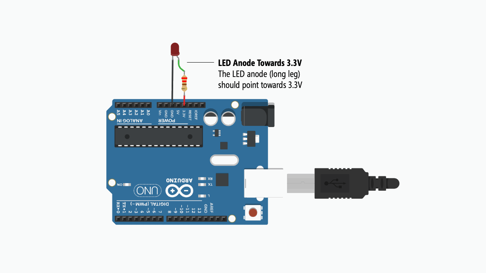
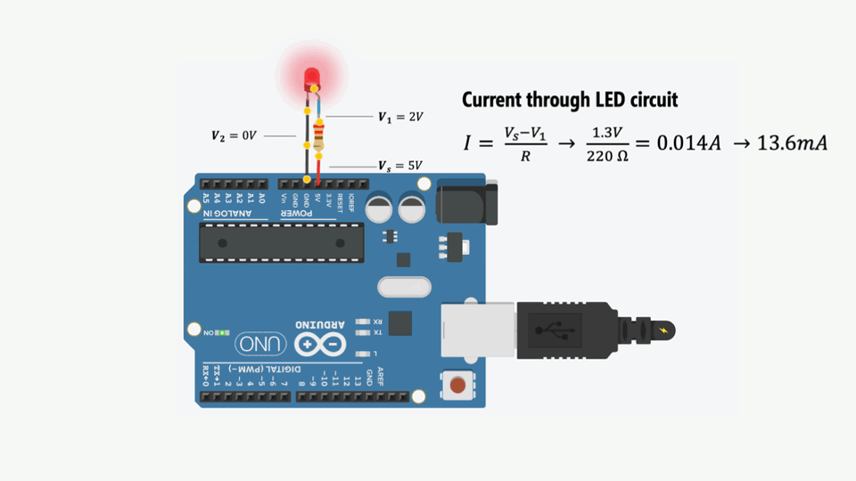
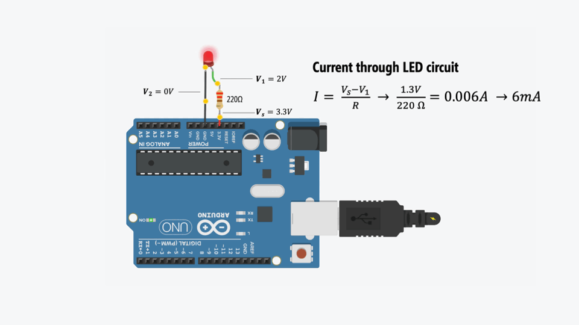

# Hook up an LED to Arduino (Always On)
{: .no_toc }

## Table of Contents
{: .no_toc .text-delta }

1. TOC
{:toc}
---
For our first activity, we are going to use Arduino to turn on an [LED](../../electronics/leds.md). We're *not* going to write any code. Instead, the goal here is to build some initial familiarity with Arduino hardware and connecting components to Arduino pins.

## Materials
You will need the following materials:

| Arduino | LED | Resistor |
|:-----:|:-----:|:-----:|
| Arduino Uno, Leonardo, or similar  | Red LED | 220Ω Resistor |
|     |  |  |
| Arduino Uno, Leonardo, or similar  | Red LED | 220Ω Resistor |

## Hook up LED to Arduino 5V pin

### Step 1: Wrap resistor around LED leg

Grab a 220Ω resistor (or any resistor 220Ω or greater) and twist one leg around an LED leg. If you want to follow my example, connect the resistor to the LED's anode (long leg) but either leg will work.

TODO: insert animated gif of twisting the resistor around LED.

### Step 2: Connect components to Arduino

Insert the LED + resistor into the Arduino: the LED's cathode (short leg) to GND and the LED's anode (long leg) + resistor to 5V.

### Step 3: Connect your Arduino to power

Now connect your Arduino to power and the LED should light up. You did it!

For power, you can use a USB cable or a 9V battery. Either way, the Arduino supplies 5V through the 5V pin.

| USB Power        | 9V Power          |
|:-------------|:------------------|
|  |  |
| With USB power, the 5V pin supplies 5V | With a 9V battery, the 5V pin still supplies 5V |

## How can we make the LED less bright?

LED brightness is controlled by **current**. So, to dim an LED, we need to reduce current. But how? Recall Ohm's Law: $$V=I * R$$ or $$I = \frac{V}{R}$$. Thus, we can reduce current either by:

1. Decreasing **voltage**
2. Increasing **resistance**

In future tutorials, we'll show how you can **control voltage output programmatically** by writing code for the Arduino microcontroller. But, for now, let's dim the LED by first decreasing voltage using the Arduino's 3.3V pin (rather than the 5V pin) and then by using stronger resistors.

### Hooking up the LED to 3.3V Pin
Let's move the LED anode (long leg) from the 5V pin to the 3.3V pin. What do you observe? The LED should be less bright!

Let's compare the current and brightness between supplying 5V *vs.* 3.3V.

| 5V        | 3.3V          |
|:-------------|:------------------|
|  |  |
| With a 5V supply, the voltage drop across the 220Ω is ~3V. Thus, $$I = \frac{3V}{220Ω}= 13.6mA $$ | With a 3.3V supply, the voltage drop across the 220Ω resistor is ~1.3V, thus $$I = \frac{1.3V}{220Ω}= 5.9mA $$|

<!-- <video width="640" controls="controls">
  <source src="images/Arduino_LEDOn_5VFixed.mp4" type="video/mp4">
</video> -->

## TODO
- [done] add alt text 
- [done] add caption
- [done] add 3.3V version
- Try other resistors. What happens?
