# {{ page.title }}
{: .no_toc }

## Table of Contents
{: .no_toc .text-delta }

1. TOC
{:toc}
---

In this lesson, you will learn about two types of magnetic sensors: Hall effect sensors and reed switches. You will then use a [DRV5055](http://www.ti.com/lit/ds/symlink/drv5055.pdf) Hall effect sensor to build a simple auto-brightening LED circuit first without and then with a microcontroller.

## Introduction

Magnet-based sensors such as [reed switches](https://en.wikipedia.org/wiki/Reed_switch) and [Hall effect sensors](https://en.wikipedia.org/wiki/Hall_effect_sensor) react to the presence of a magnetic field. They are truly ubiquitous sensors found in everything from automobile control circuits and fluid control systems to electronic devices like cell phones and computers. While **Reed switches** are electro-mechanical: two internal contacts physically close when a properly oriented magnetic field is within range, **Hall effect sensors** are solid state (no moving parts) transducers: they convert magnetic energy to electrical energy and can either be used as analog sensors or switches. 

A key benefit of a magnet-based sensors is that the magnet itself does not need to be powered and can even be fully encased in a moving part like a window, a wheel, a turbine, *etc.* For example, a bicycle tachometer works by affixing a magnet to the bike wheel (which spins) while a Hall Effect sensor or reed switch is attached to a wheel fork and used by a microcontroller to count revolutions. Magnet-based sensors are also commonly use to track rotations in DC electric motors, which already contain magnets to power the motor. 

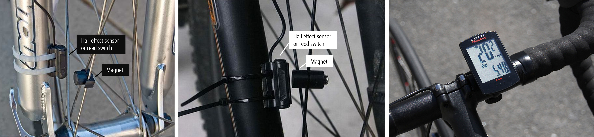
Two example bike wheel tracking systems (left and middle) along with a bike speedometer. Typically, these systems are made with Hall effect sensors or reed switches to measure wheel revolutions, which are converted to distance and speed by a small computer with a display (often mounted on the handlebars). Note: to use this system, the bicyclist must first complete a calibration step by moving the wheel a set distance (thereby providing the necessary data to convert from revolutions to distance).
{: .fs-1 }

<!-- https://en.wikipedia.org/wiki/Hall_effect_sensor has a good intro too, some animations, and some application ideas. -->

## The Hall effect

How do electric fields and magnetic fields interact? You may remember that electric current produces a magnetic field (recall the [right-hand rule](https://en.wikipedia.org/wiki/Right-hand_rule#Electromagnetics) from high school physics). But does a magnetic field also affect current? Yes!

Electricity and magnetism have long captured human interest but were considered separate phenomena. It wasn't until the late 19th century when James Maxwell published [*A Treatise on Electricity and Magnetism*](https://en.wikipedia.org/wiki/A_Treatise_on_Electricity_and_Magnetism) that electricity and magnetism were united into one interrelated force: electromagnetism. But key questions remained, including, most relevantly for us: how do **magnets** interact with **electric current**? 

Enter Edwin Hall. As a PhD student at Johns Hopkins in 1879, Hall discovered the "Hall effect", which is the production of a small voltage difference across an electrical conductor **transverse** to the electric current when a magnetic field is applied ([Wikipedia](https://en.wikipedia.org/wiki/Hall_effect#Discovery)). This [animation](https://youtu.be/wpAA3qeOYiI) by "How to Mechatronics" helps demonstrate the effect. When a magnet is introduced, it repels negative charges to one side of the conductor creating an asymmetric distribution of charge (perpendicular to the flow of current) on the conductor. This separation of charge establishes a new electric field with a small electric potential (often in the millivolts), which can be measured by a multimeter or similar device.

Animation from ["How to Mechatronics"](https://youtu.be/wpAA3qeOYiI)
{: .fs-1 }

Note that though the animation appears to show the cessation of current through the conductor during the Hall effect, this is not the case. Current continues to flow even in the presence of a magnetic field. The animation also does not show that when the magnet is reversed, the Hall effect is also reversed: negative and positive charges would displace to opposite sides of the conductor (and again, this displacement is *transverse* to the flow of current).

Confused? That's ok!

To better understand the Hall effect, watch this 5-minute video from Professor Bowley at the University of Nottingham. He provides a wonderful set of visual experiments and explanations (the best we've seen) that should clarify things:

<iframe width="736" height="414" src="https://www.youtube.com/embed/AcRCgyComEw" frameborder="0" allow="accelerometer; autoplay; encrypted-media; gyroscope; picture-in-picture" allowfullscreen></iframe>
In this [wonderful video](https://youtu.be/AcRCgyComEw) from the University of Notthingham, Professor Bowley explains the physics of the Hall Effect.
{: .fs-1 }

## Hall effect sensors

[Hall effect sensors](https://en.wikipedia.org/wiki/Hall_effect_sensor) use the "Hall effect" to measure the magnitude of a proximal magnetic field. More precisely, Hall effect sensors measure "magnetic flux" ($$Φ$$), which is the total magnetic field $$\vec{B}$$ passing through a given area $$\vec{A}$$ (where A is the area of the sensing unit normal to the magnetic field): $$Φ = \vec{B} \cdot \vec{A}$$. While [inductive sensors](https://en.wikipedia.org/wiki/Inductive_sensor) respond to *changing* magnetic fields, one benefit of Hall effect sensors is that they work with static (non-changing) fields. So, a Hall effect sensor can respond to a magnet even if it's not moving.

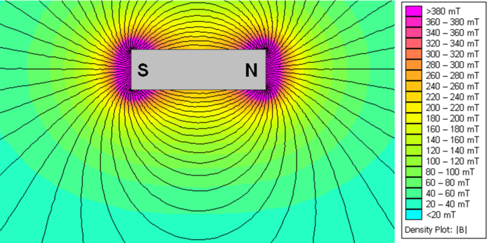
Simulated magnetic flux of a NdFeB magnet. Image from the [DRV5055](http://www.ti.com/lit/ds/symlink/drv5055.pdf) Hall effect sensor datasheet.
{: .fs-1 }

<!-- Great explanation of flux and magnetic flux on Khan Academy: https://www.khanacademy.org/science/physics/magnetic-forces-and-magnetic-fields/magnetic-flux-faradays-law/v/flux-and-magnetic-flux -->

Because a magnetic field vectors flow from a magnet's north to south poles, magnetic flux will change based on a magnet's orientation to the Hall effect sensor. The amount of magnetic flux is maximized when the poles of the magnet are orthogonal to the sensor. To learn more about magnetic flux, see this [Khan Academy lesson](https://www.khanacademy.org/science/physics/magnetic-forces-and-magnetic-fields/magnetic-flux-faradays-law/v/flux-and-magnetic-flux).

<!-- TODO insert graphic that shows orientation differences? Or at least a graphic of magnetic field around a magnet? -->

### Hall effect sensor applications

Hall effect sensors are used in a range of consumer and industrial applications from automotive to fluid monitoring to building automation. Some applications, like sensing seat and safety belt position, use Hall effect sensors for localizing objects while others use Hall effect sensors as contactless measurements of DC current (measuring the induced magnetic field by current through a wire). Modern automotive vehicles alone contain 10 or more Hall effect sensors for everything from windshield wiper position sensing to brake and gas pedals to the ignition system ([Landuyt et al., SPLC’14](https://doi.org/10.1145/2648511.2648546)).

In their [handbook](https://sensing.honeywell.com/hallbook.pdf) for Hall effect sensors, Honeywell provides dozens of application ideas:

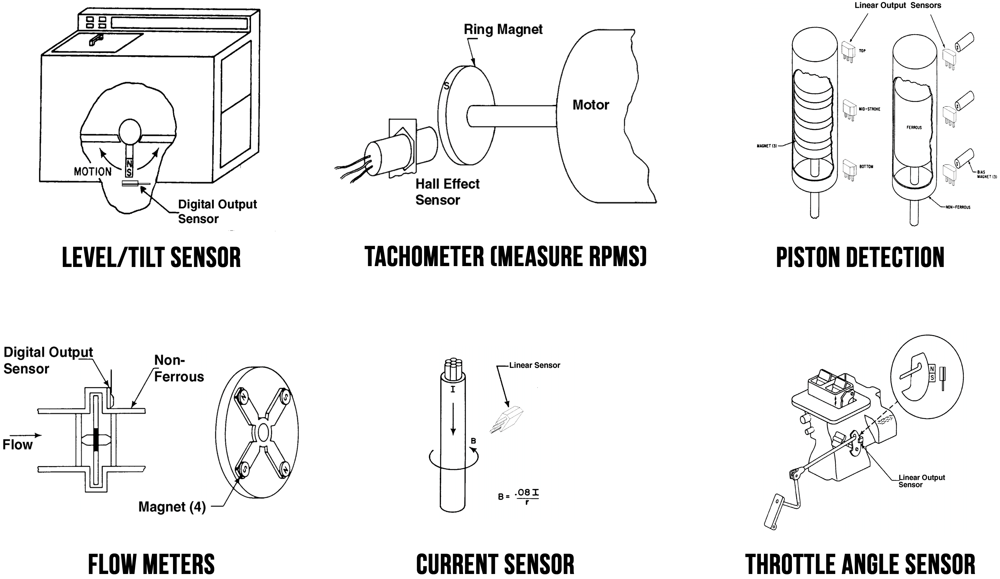
A subset of Hall effect sensor application ideas presented in the [Honeywell handbook](https://sensing.honeywell.com/hallbook.pdf).
{: .fs-1 }

### Analog vs. binary output

Hall effect sensors can provide either **analog** or **binary** output. In either case, they are **active** sensors with three pins ($$V_{CC}$$, $$GND$$, and $$Out$$).

#### Analog Hall effect sensors

In previous lessons, we've covered resistive sensors like force-sensitive resistors and photoresistors, both which change their **resistance** based on some external stimulus. In contrast, an analog Hall effect sensor outputs a varying **voltage**. This voltage is directly proportional to the sensed magnetic flux density. 

#### Binary (switch-based) Hall effect sensors

Some Hall effect sensors act as switches: either on (in the presence of a sufficiently strong magnetic field) or off (if not). For example, the [US5881LUA](https://www.adafruit.com/product/158) sold by Adafruit is normally `HIGH` but switches to `LOW` in the presence of a **south** magnetic pole. Some Hall effect switches are **latching**, which remain in their activated state even when the magnet is removed. For example, the US1881 latching Hall effect sensor switches to `HIGH` in the presence of a **north** magnetic pole but remains in that state even after the magnet is removed and until a **south** magnetic pole is sensed.

To produce a binary output, these Hall effect sensors have an additional internal element called a Schmitt Trigger connected to the analog output, which converts the internal analog output signal to the external digital output (`HIGH` or `LOW`). See [this video](https://youtu.be/wpAA3qeOYiI?t=143) by "How to Mechatronics."

<!-- TODO: talk about strength of magnetic field: size of magnet, proximity? Or maybe magnetic flux density -->

### Reed switches

Image from [Wikipedia](https://en.wikipedia.org/wiki/Reed_switch).
{: .fs-1 }

While some Hall effect sensors produce binary output (`HIGH` or `LOW`) and thus, can function as switches, they are not to be confused with [reed switches](https://en.wikipedia.org/wiki/Reed_switch), which are **electromechanical** devices. With a reed switch, two ferromagnetic metal contacts close in the presence of a magnetic field (and are otherwise normally open). Because a reed switch is a mechanical device, the switch contacts can wear over time. See the animations below.

| Reed Switch Animation | Slow Motion Activation Video |
| ---------- | ----------- |
|  |  |

The slow-motion activation video is from [Wikipedia](https://en.wikipedia.org/wiki/Reed_switch).
{: .fs-1 }

A reed switch is a passive sensor: its contacts will close in the presence of a magnetic field regardless of whether it's even hooked up in a circuit. Unlike Hall effect sensors, reed switches are not sensitive to magnetic field polarity; however, the magnetic field has to be parallel to the reeds—either north-to-south or south-to-north. See figure below.

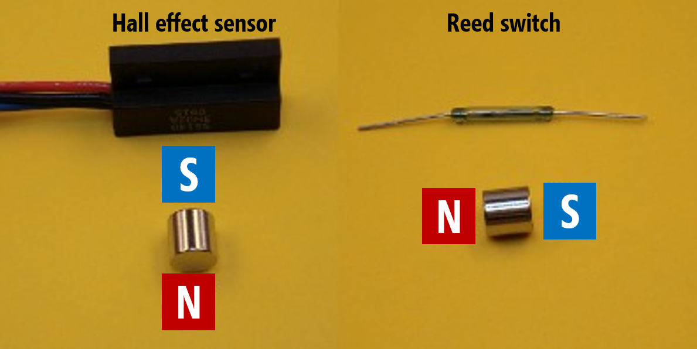
With a Hall effect sensor, the magnetic flux density through the sensor is maximized when a magnetic pole is directly facing the sensor. With a reed switch, the magnetic poles should be parallel to the sensor. Image derived from [KJMagnetics](https://www.kjmagnetics.com/blog.asp?p=reed-switches-and-hall-effect-sensors).
{: .fs-1 }

Here's a [video](https://youtu.be/hnCEQYO-i_E) demonstrating a reed switch functioning with three different magnets from K&J Magnetics:

<iframe width="736" height="414" src="https://www.youtube.com/embed/hnCEQYO-i_E" frameborder="0" allow="accelerometer; autoplay; encrypted-media; gyroscope; picture-in-picture" allowfullscreen></iframe>

### The DRV5055 Hall effect sensor

In our hardware kits, we provide the Texas Instruments (TI) [DRV5055](http://www.ti.com/lit/ds/symlink/drv5055.pdf) ratiometric linear hall effect sensor, which varies its voltage output proportionally to magnetic flux density. Ratiometric means that the sensor's voltage output is proportional to the supply voltage ($$V_{CC}$$). 

The DRV5055 can operate with both 3.3V and 5V power supplies (with +/- 10% tolerance). The sensor can be sampled at 20kHz. To provide a reliable voltage output across a range of deployment conditions, the DRV5055 chip includes temperature compensation circuits, mechanical stress cancellation, signal conditioning, and amplification. So, while small, there is a significant amount of sophisticated hardware packed into this piece of hardware.

Two packages are available: a surface-mount package SOT-23 (left diagram below) and a through hole package TO-92 (right). We will be using the through-hole package (TO-92). 

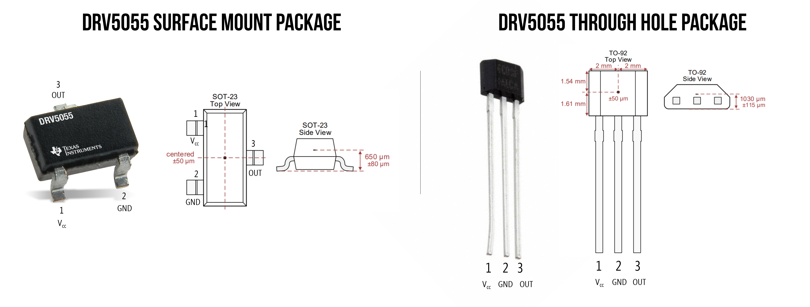
The two DRV5055 packages with pin configurations and Hall element location is labeled in red (at center of the sensor)
{: .fs-1 }

#### Wiring the DRV5055

To use the sensor, hook up Leg 1 to $$V_{CC}$$*, Leg 2 to $$GND$$, and Leg 3 to an analog input pin on your Arduino (say, `A0`). 

*TI recommends connecting Leg 1 to a ceramic capacitor to ground with a value of at least 0.01 µF. This is called a **decoupling capacitor** (or bypass capacitor) and is a common addition to help smooth the voltage supply as the sensor is operating. See wiring diagram below. While not absolutely necessary—and some of you may not have access to ceramic capacitors—it's recommended (it will improve performance and reliability). To see the effect of adding a decoupling capacitor on a voltage supply to a chip, see this [video](https://youtu.be/UW_XFGGTh0I). Dave Jones at the EEVblog also provides a nice whiteboard lesson ([link](https://youtu.be/BcJ6UdDx1vg)). 

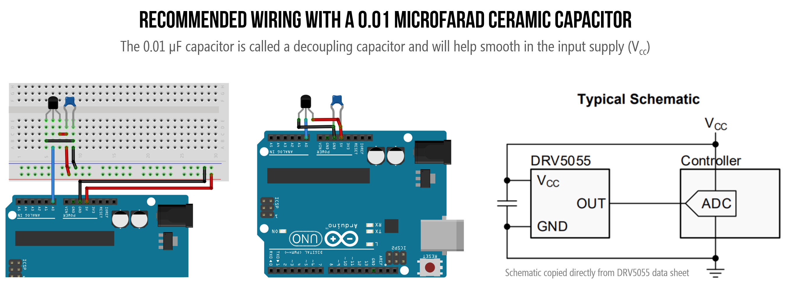
We've included two equivalent Arduino wirings. The left diagram includes a breadboard, which we felt may be a bit confusing to those still becoming familiar with breadboards. The middle diagram is the same wiring but without a breadboard. The schematic on the right is copy/pasted directly from the [DRV5055](http://www.ti.com/lit/ds/symlink/drv5055.pdf) datasheet.
{: .fs-1 }

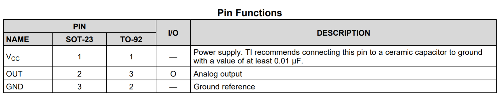

#### Sensor response to magnetic field

So, how does the DRV5055 output pin (Leg 3) respond to a magnetic field?

When no magnetic field is present, the analog output drives **half** of $$V_{cc}$$. So, on an Arduino Uno, `analogRead(A0)` would return 512 (1023/2) in the default state (with no magnet present). The sensor's output will then change linearly with the applied magnetic flux density. If the south pole of the magnet is facing the sensor, the analog output will increase between $$V_{cc}/2$$ - $$V_{cc}$$. If the north pole faces the sensor, the output will decrease from $$V_{cc}/2$$) to 0V. See the magnetic response graph below and Section 7.3.2 of the [DRV5055](http://www.ti.com/lit/ds/symlink/drv5055.pdf) datasheet.

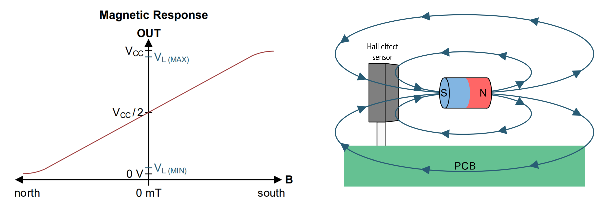
The magnetic response graph for the [DRV5055](http://www.ti.com/lit/ds/symlink/drv5055.pdf) Hall effect sensor. The diagram on the right shows a magnet's south pole orthogonal to the sensing surface, which would result in a positive $$\vec{B}$$ and an analog output voltage > $$V_{cc}/2$$. If the magnet's orientation is flipped such that the north pole is facing the sensor, then the $$\vec{B}$$ will be negative and the analog output voltage will range between 0 and $$V_{cc}/2$$.
{: .fs-1 }

## Let's make stuff

First, we're going to use the Hall effect sensor in a "bare bones" circuit without a microcontroller and then we'll show how to use the sensor with Arduino.

## Make a magical magnetic LED brightener

Let's use the Hall effect sensor to automatically change the brightness of our LED. Recall that $$V_{out}$$ increases as the south pole of a magnet nears and $$V_{out}$$ decreases as the north pole nears. Let's use this property to control the brightness of our LED. 

Even with this simple circuit, there are many creative possibilities: imagine a Harry Potter light that only turns on when a wizard's wand is close (the light would contain a Hall effect sensor and the wand a magnet).  

The [DRV5055](http://www.ti.com/lit/ds/symlink/drv5055.pdf) datasheet states that the maximum continuous output current is 1mA. Using Ohm's Law, we can calculate a safe resistance value for the current-limiting resistor such that the LED does not pull too much current. $$I=\frac{V_{cc} - V_f}{R} \to 1mA=\frac{5V-2V}{R} \to R=\frac{3V}{0.001A} = 3,000Ω$$. So, we'll use a 3.3kΩ.

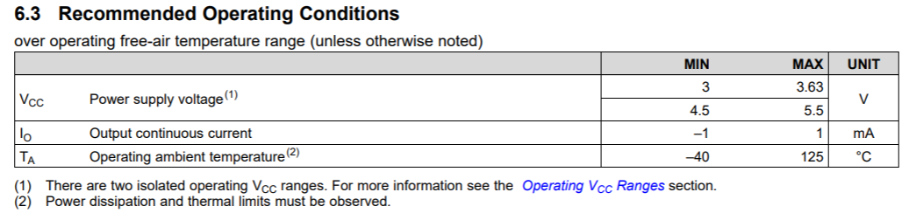

We've included two wiring diagrams: on the left, the suggested wiring by the DRV5055 datasheet with the decoupling capacitor and, on the right, the same wiring but without the capacitor. Both will work similarly for our purposes here, so if you don't have a capacitor handy, just make the circuit on the right.

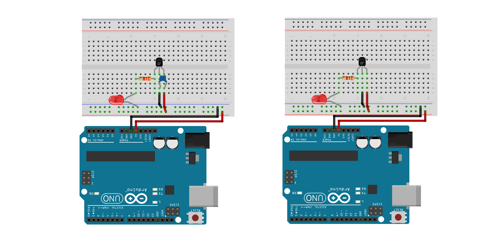

### Workbench video

And here's a workbench video demonstrating the circuit (without a capacitor). The second half of the video includes two multimeters: one to measure the current through the circuit and the other to measure the voltage output from the Hall effect sensor. 

<iframe width="736" height="414" src="https://www.youtube.com/embed/RLNx7tHCxC0" frameborder="0" allow="accelerometer; autoplay; encrypted-media; gyroscope; picture-in-picture" allowfullscreen></iframe>
My vocal narration is quite soft as I recorded the video early in the morning and did not want to disturb my house! :D
{: .fs-1 }

### Improving the circuit

What if we wanted to supply more than 1mA through our LED? We have have two choices: 
1. Just like with our [photoresistor](photoresistors.md#An-improved-auto-on-nightlight-circuit) circuit, we could change our circuit to use a **transistor**. In this case, the Hall effect sensor output would be connected to a transistor, which would control the current through our LED. If you have a transistor, feel free to try this!
2. We could move on to using a microcontroller, which is what we're going to do!

## Make an Arduino-based magical magnetic LED brightener

Let's adapt our circuit to use the Arduino. We'll make one circuit to read the Hall effect sensor on `A0` and another circuit to turn on and auto-brighten an LED using PWM (via GPIO Pin 3).

### Hall effect Arduino circuit

Below, we provide two wiring diagrams: one with the decoupling capacitor (0.01 µF) and one without. The decoupling capacitor is necessary to ensure that the voltage supply is constant while the Hall effect sensor is operating; however, it's not absolutely necessary for simple prototyping and learning. 

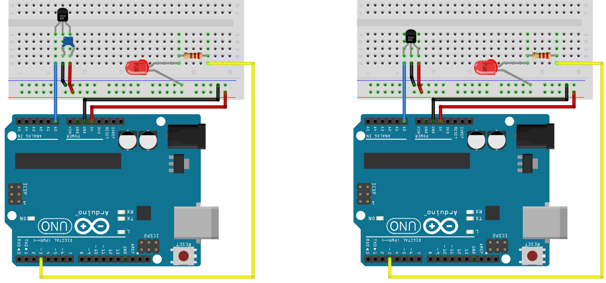

### The code

Our code is the simplest possible take. We simply read in the Hall effect sensor's output voltage on `A0` and directly translate this to the LED's PWM output. Recall that the Hall effect sensor outputs $$V_{cc}/2$$ when no magnet is present. Thus, the LED is "half on" (`analogWrite(LED_PIN, 128)`) with no magnet, fully bright when the south pole is facing and directly in front of the sensor, and fully off when the north pole is facing and directly in front of the sensor. 

One simple modification you may want to try: when no magnet is present, make the LED off. When either the south or north magnetic field poles are sensed, brighten the LED accordingly.

### Workbench video

<iframe width="736" height="414" src="https://www.youtube.com/embed/MvVfq6AAEQU" frameborder="0" allow="accelerometer; autoplay; encrypted-media; gyroscope; picture-in-picture" allowfullscreen></iframe>

<!-- ## Reed switches
My lecture CMSC838f_Lecture05_AllThingsResistance_v2 has a great reed switch video that we might be able to convert part of to animation: http://youtu.be/qje8LhZXwO0. Update: OK, I've m

- https://www.magnelinkinc.com/blog/reed-vs-hall-effect-switch/
From: "https://www.kjmagnetics.com/blog.asp?p=reed-switches-and-hall-effect-sensors":

The reed switch is an electrical switch operated by an applied magnetic field.  It consists of a pair of contacts on ferrous metal reeds in an airtight glass envelope.  The contacts are normally open, making no electrical contact.  The switch is actuated (closed) by bringing a magnet near the switch.  Once the magnet is pulled away, the reed switch will go back to its original position.

What is a Hall Effect Sensor?
A Hall effect sensor is a transducer that varies its output voltage in response to changes in magnetic field.  In some ways, Hall effect sensors can ultimately perform a similar function as a reed switch, but with no moving parts.  Think of it as a solid-state component, good for digital applications.

Which of these two sensors is right for your application depends on a number of things.  Factors include cost, magnet orientation, frequency range (reed switches typically aren't usable over 10 kHz), signal bounce and the design of the associated logic circuitry. -->

## References
- [TI DRV5055 datasheet](http://www.ti.com/lit/ds/symlink/drv5055.pdf), Texas Instruments
- [Hall Effect Sensing and Applications](https://sensing.honeywell.com/hallbook.pdf), Honeywell

## Videos
- [What is the Hall Effect and How do Hall Effect Sensors Work](https://youtu.be/wpAA3qeOYiI), How to Mechatronics
- [Hall Effect Sensors](https://youtu.be/jdgU49ne4gA), Ludic Science
- [Arduino Tutorial: Tachometer (RPM Counter)](https://youtu.be/u2uJMJWsfsg), InterlinkKnight
- [Bypass Capacitor Tutorial](https://youtu.be/BcJ6UdDx1vg), EEVblog

## Citations
Dimitri Van Landuyt, Steven Op de beeck, Aram Hovsepyan, Sam Michiels, Wouter Joosen, Sven Meynckens, Gjalt de Jong, Olivier Barais, and Mathieu Acher. 2014. Towards managing variability in the safety design of an automotive hall effect sensor. In Proceedings of the 18th International Software Product Line Conference - Volume 1 (SPLC ’14). Association for Computing Machinery, New York, NY, USA, 304–309. DOI:https://doi.org/10.1145/2648511.2648546
