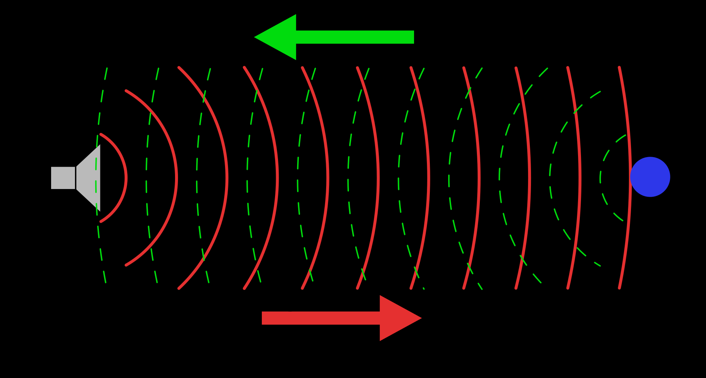
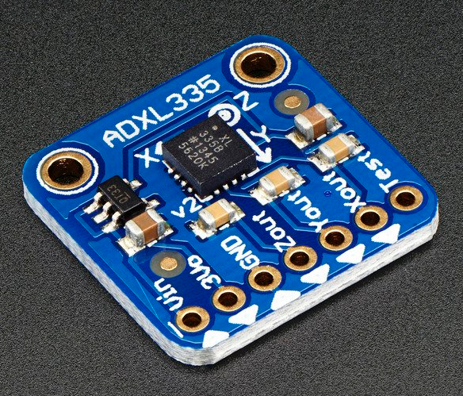
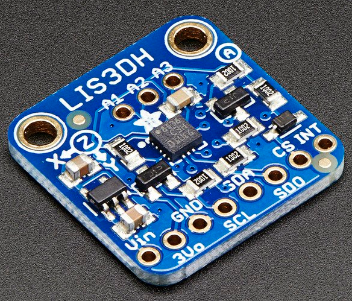
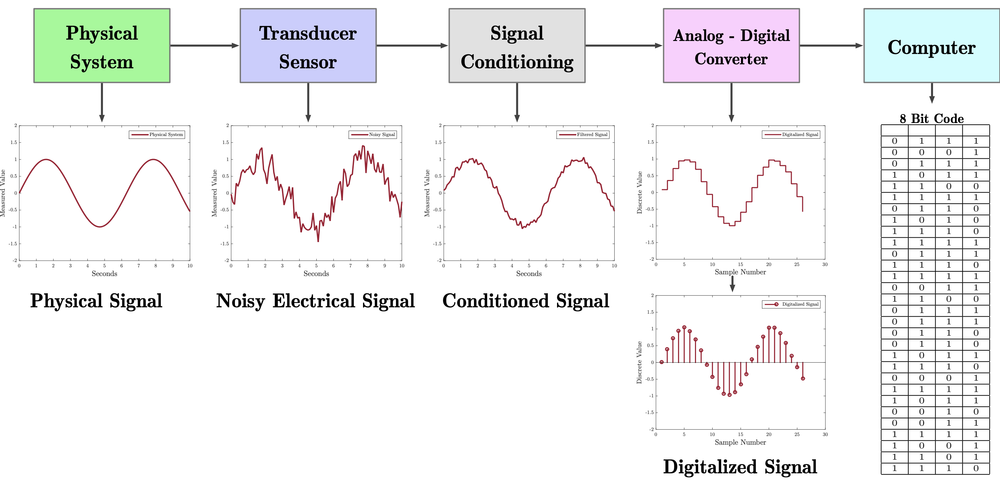

# {{ page.title }}
{: .no_toc }

## Table of Contents
{: .no_toc .text-delta }

1. TOC
{:toc}
---

From an early age, we are taught of the five basic human senses: touch, sight, hearing, smell, and taste. But we don't often think about just how sophisticated and wonderfully complex the human sensing system is from our largest organ, our skin, which can sense temperature and various tactile stimuli (pressure, texture, vibration) to our eyes and optic nerves, which can dynamically focus, adapt to lighting levels, and even help preattentively identify moving objects and other shapes. And this interconnected network of sensors function in real-time, transmitting information to the brain for processing and analysis. Amazing!

Still, we can't sense everything. Dolphins and bats use [echolocation](https://en.wikipedia.org/wiki/Animal_echolocation) to navigate and forage using high-frequency sound pulses, some fish use [electrolocation](https://en.wikipedia.org/wiki/Passive_electrolocation_in_fish) to navigate murky waters by generating electric fields and detecting distortions in these fields [using electroreceptor organs](https://en.wikipedia.org/wiki/Electroreception), some snakes have infrared vision allowing them to see at night, and other animals have the ability to sense and detect a magnetic field to perceive direction, altitude, or location (called [magnetoreception](https://en.wikipedia.org/wiki/Magnetoreception)).

<!-- maybe include some creative commons or wikimedia pictures here? -->

Even for the senses that we do have—as remarkable as they are—our senses will never be as precise or refined as a hawk's vision, a wolf's smell, or a cat's hearing. And, even then, there are far more things to sense in the world than there are biological sensors.

For computing, sensors provide a way to access information about the world, human activity, and beyond. And electronic sensors are not limited to biology—as amazing and diverse as it is—but rather to our own ingenuity in coming up with ways to capture the world. This is an incredibly exciting challenge!

With advances in sensing technology like [MEMs](https://en.wikipedia.org/wiki/Microelectromechanical_systems), computing (storage, networking, wearables), and in processing and machine learning, now is a fascinating time to think about and study the role of sensing in an increasingly computational society.

How can new sensing and processing systems help identify cancer cells, find new life-supporting planets, or change how we fundamentally interact with computing itself (ala capacitive touchscreens on tablets and phones!)?

<!-- primary learning goals: expose to certain types of sensors, how to use them, how to process them? how to make some yourself? -->

<!-- There's also an interesting potential sub-section here--especially since we are teaching HCI and human-oriented engineering--in talking about how human's sense and translate sensations. The Weber-Fechner Law relates to human perception: the change in a physical stimulus and the perceived change (also relates to JND: https://en.wikipedia.org/wiki/Weber%E2%80%93Fechner_law)>

## Introduction to Sensors

Humans have invented thousands of sensors. How should we organize and characterize them? There are numerous pragmatic factors, including reliability, precision, manufacturing cost, availability, power usage, and designer familiarity—all important. However, for our purposes, we will focus on three characteristics:

1. **What** a sensor does (its function)
2. **How** it senses (passively or actively)
3. **What output** it provides 

### Characterizing sensors by function

Perhaps the most intuitive scheme is organizing sensors by function. Wikipedia lists [hundreds of sensors](https://en.wikipedia.org/wiki/List_of_sensors) in broad categories, including:

1. Acoustic, sound, and vibration
2. Moisture and humidity
3. Flow and fluid velocity
4. Optical, light, and imaging
5. Thermal, heat, and temperature
6. Position, angle, displacement, distance, and more 

Other categorizations are also possible: Platt's 3rd volume of "Encyclopedia of Electronic Components", for example, categorizes sensors into spatial, mechanical, fluid, radiation, and electricity ([link](https://learning.oreilly.com/library/view/encyclopedia-of-electronic/9781449334307)). 

<!-- Regardless of functional categorization, we will only cover a small fraction here.

But first, let's break sensors down by **how** they sense and **what** output they provide. -->

In addition to **what** a sensor does, we can characterize them by **how** they sense and **what** output they provide.

### Passive vs. active sensing

There are two basic classes of sensors: active and passive. **Active** sensors require external power (and will thus have a Vcc pin and GND) while **passive** sensors do not. Yes, that's it. That's the key difference! For example, the popular [ADXL335](https://www.adafruit.com/product/163) 3-axis accelerometer is an **active** sensor: it has a Vin, a GND, and three analog outputs (Xout, Yout, and Zout), which translate acceleration along each axis into ratiometric (proportional) voltage levels. In contrast, a [thermistor](https://en.wikipedia.org/wiki/Thermistor) is a passive sensor: it changes its resistance in response to heat, which can be used to calculate temperature.

Some active sensors transmit a signal and then analyze some reflected property of that signal for sensing. For example, an infrared (IR) proximity sensor like the [Sharp GP2Y0A21YK](https://www.sparkfun.com/products/242) contains both an infrared (IR) transmitter and IR receiver. The sensor calculates distance by transmitting an IR beam and measuring the reflection angle back on the IR receiver. Similarly, an ultrasonic distance sensor like the popular [HC-SR04](https://www.sparkfun.com/products/15569) transmits ultrasonic pings and listens for reflected ultrasonic waves. A connected microcontroller can than calculate the distance between the sensor to the sound-reflecting object by using the speed of sound through air.

Ultrasonic distance sensors are a type of **active** sensor consisting of both a transmitter and receiver. They work by transmitting an ultrasonic pulse, which is partially reflected back by objects in the sound wave path (if any). By measuring the time between the pulse transmission and the echo reception, distance can be determined.
{: .fs-1 }

Active sensors may also include sophisticated (but tiny) on-board hardware to counteract sensor drift, to filter/smooth a signal, and/or to communicate output via a digital communication protocol like [I2C](https://en.wikipedia.org/wiki/I%C2%B2C). 

In contrast, a **passive** sensor generates an output signal based on some external stimulus and does not require external power. For example, a [photoresistor](https://en.wikipedia.org/wiki/Photoresistor) changes its resistance in response to light, a [thermistor](https://en.wikipedia.org/wiki/Thermistor) in response to temperature, and a [force-sensitive resistor](https://en.wikipedia.org/wiki/Force-sensing_resistor) in response to pressure. Of course, we need a powered circuit to "retrieve" information from the sensor—like a voltage divider—but the underlying sensor is responding to environmental phenomena regardless of this applied power.

A simple heuristic to distinguish active from passive sensors is to count pins: active sensors have at least three pins (one for Vin, one for GND, and at least one for output) while passive sensors have two.

<!-- TODO: in future add in a sub-section on MEMS because it's so AWESOME! : -->

### Sensor output

Sensors output either analog, binary (on/off), or digital signals (*e.g.,* [SPI](https://en.wikipedia.org/wiki/Serial_Peripheral_Interface)). Yes, "binary" is a type of digital output but it's worth distinguishing.

#### Analog output

Pure analog sensors include resistive sensors, like the aforementioned thermistors and photoresistors, which **change their resistance** based on some stimuli as well as ratiometric sensors like the aforementioned [ADXL335](https://learn.adafruit.com/adafruit-analog-accelerometer-breakouts/overview) accelerometer or the [DRV5055 Hall Effect](https://www.ti.com/product/DRV5055) sensor, both which vary their voltage output linearly in response to some stimuli—in this case, acceleration and magnetic fields, respectively.

#### Digital output

Many modern sensors are chip-based and include some on-board processing. These sensors process and convert raw analog signals to digital output. This output is stored in a memory location (called a register) on the sensor chip itself and accessed by a microcontroller via a communication protocol like [I2C](https://en.wikipedia.org/wiki/I%C2%B2C) and [SPI](https://en.wikipedia.org/wiki/Serial_Peripheral_Interface). 

For example, in contrast to the [ADXL335](https://learn.adafruit.com/adafruit-analog-accelerometer-breakouts/overview) accelerometer, which outputs a voltage proportional to acceleration on each axis on pins X, Y, and Z, the [LIS3DH](https://www.adafruit.com/product/2809) accelerometer communicates over either I2C or SPI. We often supply one or the other in our hardware kits. 

Because the LIS3DH supports a digital communication protocol (both I2C and SPI), you can configure the sensor hardware via code (*e.g.,* set the [acceleration range](https://learn.adafruit.com/adafruit-lis3dh-triple-axis-accelerometer-breakout/arduino) from +-2g to +-16g). This is a nice benefit of sensors with built-in chips but can also increase their cost.

| ADXL335 Accelerometer | LIS3DH Accelerometer |
| --------------------- | -------------------- |
|  |  |

<!--TODO: add a bit on advantages vs. disadvnatages of analog vs. digital sensors: for example, with a digital communication protocol like SPI, can have error correction, etc. -->

#### Binary output

Finally, some "sensors" are either on or off (which could be construed as a type of simple digital output but not one specifically encoded for a microcontroller so does not qualify as "digital signal" in our taxonomy). For example, [reed switches](https://en.wikipedia.org/wiki/Reed_switch) close in the presence of a magnetic field and [tilt ball switches](https://www.adafruit.com/product/173) are hollow tubes with an enclosed conductive ball, which moves to close internal contacts in certain tube orientations (or tilts).

<!-- TODO: would be nice to have either lil animations of these or video snippets -->

[Platt](https://learning.oreilly.com/library/view/encyclopedia-of-electronic/9781449334307) provides an even deeper breakdown of sensor output types, including open collectors and sensors that change in current rather than voltage. See his book for details.

### Evaluating a sensor

There are a variety of important criteria when evaluating a sensor's capabilities, including:

* **Sampling rate**: How fast does the sensor provide output?
* **Resolution**: What is the smallest change in physical quantity that the sensor can identify?
* **Quantization error**: What is the error caused by rounding due to digitizing the analog data in the ADC? See *Signal acquisition pipeline* section below.
* **Absolute error**: What's the difference between sensor readings and the true physical quantity?
* **Drift**: How does the absolute error change over time while operating the sensor?
* **Environmental stability**: How does the sensor change in response to differences in temperature or moisture?

## Signal acquisition pipeline

Let's examine the entire signal acquisition pipeline from raw physical signal to the digitized representation. We'll learn more about signals and signal processing in the [Signals](../signals/index.md) lessons.

1. First, there exists some physical phenomena that exists in the world (Stage 1). 
2. We need to develop and/or utilize a method to sense that phenomena and output an electrical signal (which will be readable by a computer) (Stage 2). 
3. Some sensor chips process this electrical signal (*e.g.,* smooth, filter, amplify)—Stage 3. 
4. In Stage 4, an analog-to-digital converter (ADC) converts the electrical signal to bits (a process called quantization). 
5. Finally, in Stage 5, we can process and analyze the digitized signal using digital signal processing (DSP) techniques and machine learning, woohoo!

Block diagram from Wikipedia ["Data acquisition"](https://en.wikipedia.org/wiki/Data_acquisition) article. [Direct link](https://en.wikipedia.org/wiki/File:DigitalDAQv2.pdf).
{: .fs-1 }

### Some signal acquisition considerations

When selecting sensors and a data processing pipeline, there are multiple considerations, including:

- **Sampling rates.** How often does the target physical signal change? How quickly can your sensor respond? Does this response rate matter? A photoresistor, for example, takes several milliseconds to respond to bright light and can require more than one second to regain its dark resistance while a phototransitor and photodiode are more responsive (see [Platt](https://learning.oreilly.com/library/view/encyclopedia-of-electronic/9781449334307/ch20.html#SECTION_PHOTORESISTOR)). 
- **ADC conversion rates** How fast can your microcontroller sample the signal and perform the analog-to-digital conversion?
- **ADC precision** What precision of ADC do you need? The ATmega328 microcontroller uses a 10-bit ADC. So, by default, the voltage range of 0-5V is mapped to 0-1023 $$2^10$$ and, thus, the resolution between readings is 5V / 1024 or 0.0049 volts (4.9 mV). If you require greater precision—that is, changes in sensor output < 0.0049V are important—then you either need to change the [`analogReference`](https://www.arduino.cc/reference/en/language/functions/analog-io/analogreference/) or you need a different ADC. The difference between a raw continuous signal and its digitized version is called the quantization error.

<!-- TODO: Where to talk about quantization error? https://en.wikipedia.org/wiki/Quantization_(signal_processing) or quantization in general? -->

<!-- TODO: consider moving signal acquisition pipeline into the Signals section? -->

### Nyquist sampling theorem

One of the most important (and interesting!) theorems in DSP is the [*Nyquist-Shannon Sampling Theorem*](https://en.wikipedia.org/wiki/Nyquist%E2%80%93Shannon_sampling_theorem), which states that a continuous time signal (the raw physical signal) can be sampled and perfectly reconstructed if the sampling rate (sometimes called the sampling frequency or $$F_s$$) is over twice as fast as the raw signal's highest frequency component. That is, the minimum sampling frequency $$min(F_s)$$ must be greater than $$2 * max(F_{signal})$$.

For example, a common digital audio sampling rate is [44,100Hz](https://en.wikipedia.org/wiki/44,100_Hz) (44.1 kHz). This is what compact discs (CDs) use and is also standard for mp3s. Why 44.1 kHz? This sampling rate was chosen, in part, because the human hearing range is ~20 Hz to 20kHz. Hence, according to the above theorem, the minimum sampling frequency needed to be at least $$2 * 20kHz$$ or 40kHz. 

To learn more about the Nyquist sampling theorem along with concrete, interactive examples, please see our [Quantization and Sampling Jupyter Notebook](../signals/QuantizationAndSampling/index.html).

<!-- TODO: make interactive visualization that shows off Nyquist and its effect. Perhaps show two graphs: on left, the real signal with circles that represent sampling points. And then, on the right, the resulting signal. Update: I've now done this here https://makeabilitylab.github.io/physcomp/signals/QuantizationAndSampling/index.html -->

### ATmega328 ADC conversion rate

The ATmega328 ADC requires an input clock frequency between 50kHz and 200kHz (Section 24.4 of [datasheet](http://ww1.microchip.com/downloads/en/DeviceDoc/ATmega48A-PA-88A-PA-168A-PA-328-P-DS-DS40002061A.pdf)). A normal conversion takes 13 ADC clock cycles (though the very first conversion takes 25 ADC clock cycles to initialize the analog circuitry).

The ATmega328 CPU and ADC share the same clock; however, the microcontroller clock is too fast (16MHz) for the ADC, so you can control a "prescaler" to divide the CPU clock into an acceptable range (divisors are 2, 4, 8, 16, 32, 64, 128). By default, the Arduino library sets the prescaler to 128 (16MHz/128 = 125 KHz) in `wiring.c` (by setting a bit in a configuration register). Since a conversion takes 13 ADC clocks, the sample rate is about 125KHz/13 or **9600 Hz**. And this doesn't consider the overhead of the other code running on the microcontroller. 

Is this fast enough? For a vast majority of human-oriented sensing, yes! For example, video games target 60 fps (60Hz) refresh rates and human reaction time is ~150-250 ms (~4 Hz). So, 9600Hz is blazingly fast in comparison! For sampling sound, however, 9600Hz is on the low end. Recall that most digital music files have a sampling rate of 44.1 kHz—4.6 times faster than the ATmega328's 9600Hz. At 9600Hz, the maximum recognizable frequency in the sound wave would be 4800Hz. We'll investigate this further in the [Signals](../signals/index.md) portion of the class.

Note: It is possible to sample the ATmega328 at a faster rate but at a cost of accuracy. The ATmega328 datasheet warns that if the ADC input clock frequency exceeds 200kHz then not all 10 bits of conversion may be ready (perhaps just the first 8 bits or less). If you want to learn more about faster analog reads on the Arduino, Open Music Labs has explored the speed/quality tradeoffs of the ATmega328 ADC [here](http://www.openmusiclabs.com/learning/digital/atmega-adc/index.html) and [here](http://www.openmusiclabs.com/learning/digital/atmega-adc/in-depth/index.html). In addition, this [blog post ](http://yaab-arduino.blogspot.com/2015/02/fast-sampling-from-analog-input.html) talks about using the "ADC Free Running mode" with interrupts to get a 76.8 KHz sampling rate (and also links [here](https://sites.google.com/site/qeewiki/books/avr-guide/analog-input)).

<!-- See also: http://ee-classes.usc.edu/ee459/library/documents/ADC.pdf -->

### ATmega328 ADC resolution

By default, the ADC resolution on the ATmega328 is 10bits (0-1023) across 0-5V. So, a 4.88mV resolution (smallest recognizable voltage step). You can change this, however, if you do not need the full 0-5V range.

Indeed, the Arduino library supports changing the ADC range from the default of $$0-5V$$ to $$0-X$$ where $$X$$ is any value between 1.0V and $$V_{cc}$$ (which is 5V on the Uno). You can do this via the [`analogReference`](https://www.arduino.cc/reference/en/language/functions/analog-io/analogreference/) function. This may be useful, for example, if you know that your sensors output voltage ranges between 0-3.3V, then setting `analogReference(EXTERNAL)` and applying 3.3V to the `AREF` pin on the Arduino improves the ADC resolution from 4.9mV to 3.2mV. 

[Tronixstuff.com](https://tronixstuff.com/2013/12/12/arduino-tutorials-chapter-22-aref-pin/) has a nice AREF tutorial.

## Let's make stuff!

With that, let's make some stuff with sensors! 

The lessons below assume that you've completed both our [Intro to Output](../arduino/intro-output.md) and [Intro to Input](../arduino/intro-input.md) series.

### Force

Learn how to sense force using a [force-sensitive resistor (FSR)](../arduino/force-sensitive-resistors.md). This is what you did in the [Intro to Input](../arduino/intro-input.md) series.

### Light

Learn how to sense light using a [photoresistor (aka photocell)](photoresistors.md).

### Magnetic fields

Learn how to sense magnetic fields using a [Hall effect sensor](hall-effect.md).

### Distance

Learn how to sense distance (2-400cm) using the [HC-SR04 ultrasonic distance sensor](https://www.makerguides.com/hc-sr04-arduino-tutorial/)

### Sound

Learn how to sense sound using an [electret microphone](https://www.adafruit.com/product/1063) with a MAX4466 amplifier.

### Accelerometer

Learn how to sense acceleration using the [LIS3DH 3-axis accelerometer](https://learn.adafruit.com/adafruit-lis3dh-triple-axis-accelerometer-breakout/overview).

<!-- ### Human related I/O
For human related I/O, human reaction time to an external stimulus is ~150-300ms (try a [human benchmark](https://www.humanbenchmark.com/tests/reactiontime)) and modern monitors refresh at 60Hz

Joysticks are often made from poteniometers like this one: https://www.adafruit.com/product/2765 and this one: https://www.adafruit.com/product/245

See: https://gamedev.stackexchange.com/a/30289 -->

<!-- ## Lesson possibilities
- Force: FSR
- Light: photocell
- Movement: Accel
- Movement 2: IMU
  - CSE590 VR had some slides on IMU, gyro, and accel: https://courses.cs.washington.edu/courses/cse490v/20wi/uwnetid/lecture9.pdf
  - https://courses.cs.washington.edu/courses/cse490v/20wi/uwnetid/lecture10.pdf
- Distance: Ultrasonic
- Magnetic field: hall effect
- Sound: microphone -->
