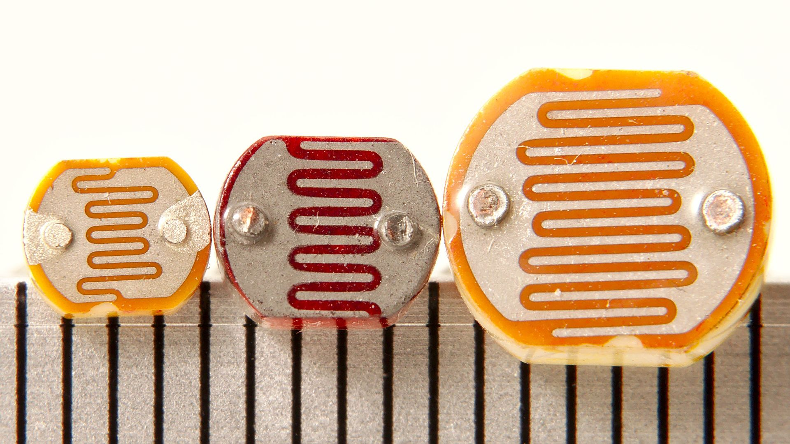
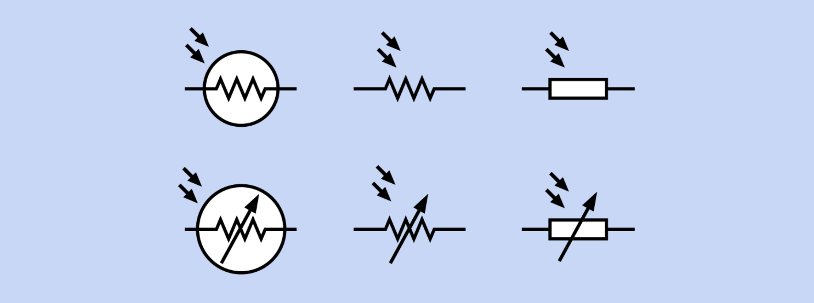
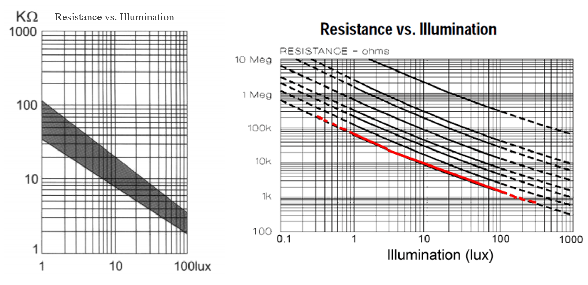
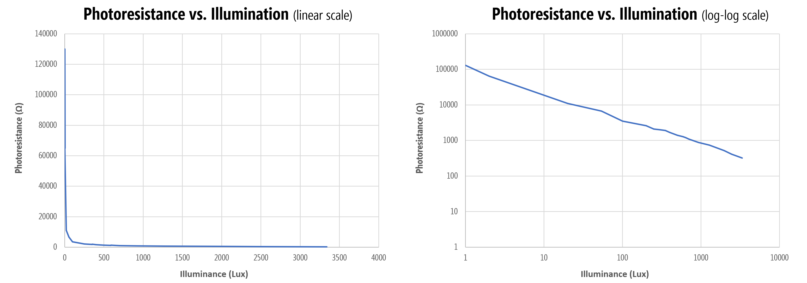
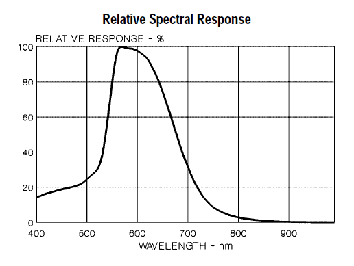
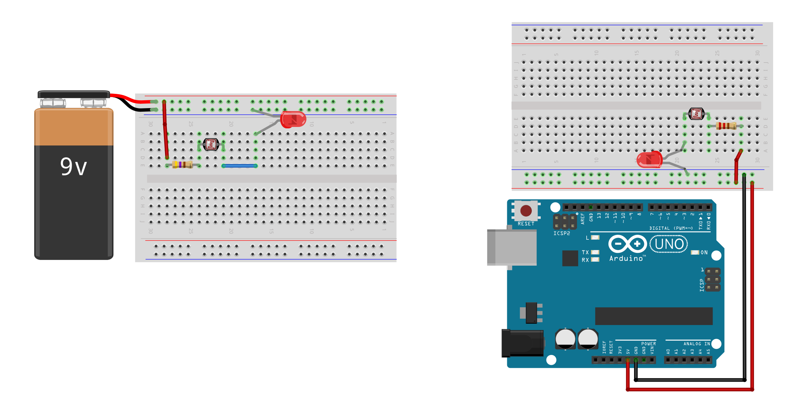
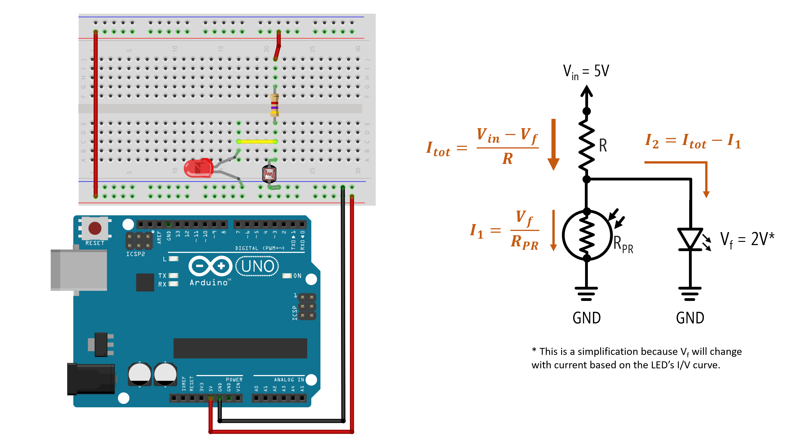
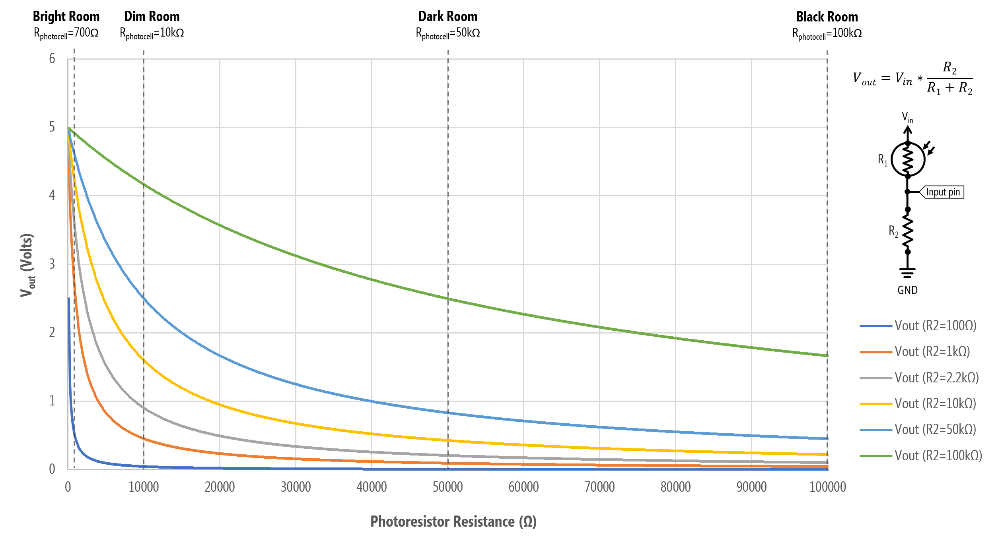
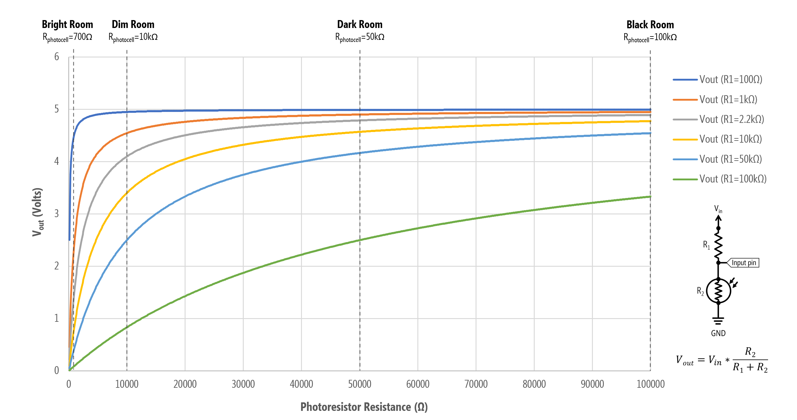
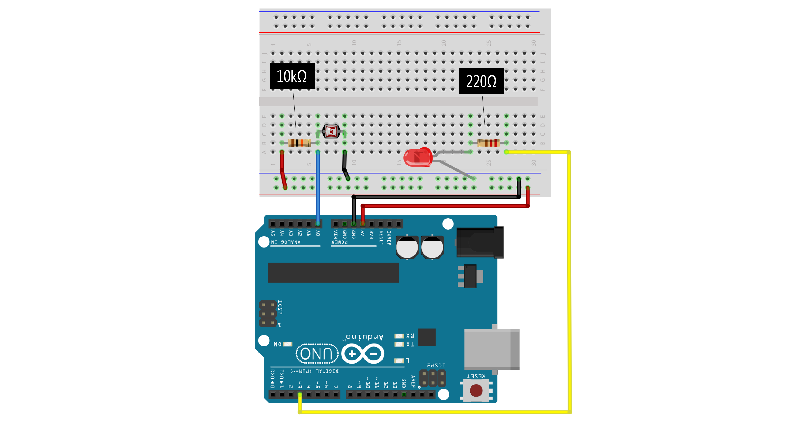

# {{ page.title }}
{: .no_toc }

## Table of Contents
{: .no_toc .text-delta }

1. TOC
{:toc}
---

In this lesson, you'll learn about [photoresistors](https://en.wikipedia.org/wiki/Photoresistor) and how to use them with and without microcontrollers.

## Photoresistors 

| Photoresistors | Schematic Symbol |
| -------------- | ---------------- |
|  |  |
| Three differently sized photoresistors with scale in mm. Image from [Wikipedia](https://en.wikipedia.org/wiki/Photoresistor). | There are six interchangeable photoresistor schematic symbols. Image from [Platt](https://learning.oreilly.com/library/view/encyclopedia-of-electronic/9781449334307) |

A photoresistor—sometimes called a photocell or light-dependent resistor (LDR)—varies its resistance in response to light. They are small, inexpensive, and easy-to-use. Consequently, photoresistors are popular in children's toys (see example below), nightlights, clock radios, and other inexpensive gadgets. However, they are not particularly accurate so are best suited for measuring coarse-grain light levels (*e.g.,* the difference between a light and dark room) rather than precise illuminance. Other common light sensors include phototransistors and [photodiodes](https://en.wikipedia.org/wiki/Photodiode), both which are more accurate and responsive.

### Photoresistor examples

As one example use case in consumer toys, this Melissa and Doug wooden fire truck puzzle uses embedded photoresistors to detect when each puzzle piece has been placed and when the puzzle is complete. There is one embedded photoresistor per puzzle piece location. When the all pieces are placed (all photoresistors have been covered), the puzzle plays a rewarding "fire truck siren":

<iframe width="736" height="414" src="https://www.youtube.com/embed/ySJw510mVgs" frameborder="0" allow="accelerometer; autoplay; encrypted-media; gyroscope; picture-in-picture" allowfullscreen></iframe>
Each puzzle piece location has a respective embedded photoresistor, which is used to track whether a piece has been placed or not. When the puzzle is completed (and all photoresistors have been covered), the puzzle plays a fire truck siren. There are a few limitations to this sensing technique: while cheap, the "fire truck" siren can be triggered when the photoresistors are covered (either accidentally via an errant puzzle piece or hand or on purpose), occassionally the siren will be triggered before the puzzle is actually completed (just when the last puzzle piece is hovering over the remaining location), and, of course, the sensing method cannot tell whether a puzzle piece is in the correct position (which is fine if one just needs to infer when the puzzle is completed and not, for example, to help guide a child in completing the puzzle).
{: .fs-1 }

Another example use case from inexpensive consumer electronics: an auto-brightening nightlight from General Electric, which gets brighter as the ambient light gets darker.

<iframe width="736" height="414" src="https://www.youtube.com/embed/EkBDjZZ3v00" frameborder="0" allow="accelerometer; autoplay; encrypted-media; gyroscope; picture-in-picture" allowfullscreen></iframe>
An auto-brightness fading night light from General Electric.
{: .fs-1 }

### How do photoresistors work?

Photoresistors are typically made of Cadmium-Sulfide (CdS), which is a semiconductor that reacts to light. As [Platt](https://learning.oreilly.com/library/view/encyclopedia-of-electronic/9781449334307) describes, "*when exposed to light, more charge carriers are excited into states where they are mobile and can participate in conduction. As a result, electrical resistance decreases.*" Because they are made from Cadmium-Sulfide, they are sometimes referred to as CdS cells.

### Photoresistor resistance vs. illumination

To describe the relationship between photoresistance and light level, we need a more precise definition of the how light levels are characterized. Enter: [Lux](https://en.wikipedia.org/wiki/Lux)!

The SI unit of illuminance is called [lux](https://en.wikipedia.org/wiki/Lux), which is, formally, the "*luminous flux per unit area*". In photometry, lux is used as a measure of the intensity of light that hits or passes through a surface as perceived by the human eye.

If you're unfamiliar with lux (as we once were), it's useful to provide some examples (from [Wikipedia](https://en.wikipedia.org/wiki/Lux)). 

| Illuminance (lux) | Example |
| ----------------: | ------- |
| 0.0001            | Moonless, overcast night sky |
| 0.05 - 0.3        | Full moon on a clear night |
| 50                | Lighting in a domestic family room |
| 80                | Office building hallway |
| 100               | Dark overcast day |
| 400               | Sunrise or sunset on a clear day |
| 1,000             | Overcast day |
| 10k - 25k         | Full daylight (not direct sun) |
| 32k - 100k        | Direct sunlight |

While finding a detailed datasheet on photoresistors is difficult, both [Sparkfun](https://cdn.sparkfun.com/datasheets/Sensors/LightImaging/SEN-09088.pdf) and [Adafruit](https://learn.adafruit.com/photocells/measuring-light) provide low-quality graphs of photoresistor resistance *vs.* lux on their websites.

Graphs from [Sparkfun](https://cdn.sparkfun.com/datasheets/Sensors/LightImaging/SEN-09088.pdf) and [Adafruit](https://learn.adafruit.com/photocells/measuring-light). Both are in log-log scale.
{: .fs-1 }

Using a professional light meter, David Williams at [All About Circuits](https://www.allaboutcircuits.com/projects/design-a-luxmeter-using-a-light-dependent-resistor/) also conducted their own experiments of photoresistance *vs.* illumination and found the same log-log relationship. We've used this data to graph both a linear version (which is easier to understand) and log-log version with annotations. Same data, just the scales are different.

In short, a photoresistor is most sensitive to light differences at lower lux levels (*i.e.,* in darker environments). This sensitivity drops exponentially as lux decreases. For example, photoresistance drops 65kΩ between $$lux=1$$ and $$lux=2$$ (~65kΩ per lux) and 54kΩ between $$lux=2$$ and $$lux=20$$ (~3kΩ per lux in this range). Between $$lux=900$$ and $$lux=~1300$$, however, the resistance only drops 140Ω (2.8Ω per lux).

The Adafruit documentation emphasizes that each photocell will perform differently due to manufacturing and other variations and reaffirms that photocells should not be used to precisely measure light levels (and each photocell requires individual calibration).

<!-- Therefore, the resistance of LDRs is an inverse, nonlinear function of light intensity.
Read more http://www.resistorguide.com/photoresistor/ -->

#### Photoresistor spectral response graph

Photoresistors are also not uniformly responsive to all wavelengths of light. Their sensitivity peaks between 500nm (green) and 700nm (red). See the relative spectral response graph below:

Graph from [Adafruit](https://learn.adafruit.com/photocells/measuring-light).
{: .fs-1 }

#### Photoresistors lag

Photoresistors should also not be used to sense or measure rapid fluctuations of light because of response latency. According to [Platt](https://learning.oreilly.com/library/view/encyclopedia-of-electronic/9781449334307) as well as [others](http://www.resistorguide.com/photoresistor/), photoresistors may take ~10ms to stabilize at a lower resistance when light is applied after total darkness and up to 1 second to rise back to a stable high resistance after light's removal. Phototransistors and photodiodes are both more responsive. 

#### Cadmium-Sulfide is classified as a hazardous material

Cadmium-Sulfide is classified as a hazardous environmental chemical by the [RoHS](https://www.rohsguide.com/rohs-faq.htm) and are thus unavailable in Europe. They are, however, still available in the US (and still used in toy manufacturing, yay!). 

### Measuring photoresistance with a multimeter

If you have a multimeter, let's use it to get your own empirical sense of a photoresistor's resistance as a function of light. Hook up each leg of the photoresistor to the multimeter (with the ohmmeter setting): one leg to the red probe and the other to the black probe (either orientation works as photoresistors have no polarity). What do you observe?

Here's the results of our own informal experiments:

| Lighting condition | Photoresistance |
| ------------------ | ------------------------ |
| iPhone LED flashlight on full power directly against photoresistor   | ~50-100Ω                     |
| Desk lamp **on**   | 1.6kΩ                    |
| Desk lamp **off** but some ambient light (*e.g.,* from computer monitor )   | 10kΩ                    |
| Finger over photoresistor   | ~130kΩ                    |
| Very dark room (basement, no ambient light) | 1+ MΩ                    |

And a video:

<iframe width="736" height="414" src="https://www.youtube.com/embed/imbN0PtUQg0" frameborder="0" allow="accelerometer; autoplay; encrypted-media; gyroscope; picture-in-picture" allowfullscreen></iframe>
Our photoresistor ranges from 1.6kΩ with our desk lamp to 10kΩ with the lights off to over ~10MΩ when covered by a coffee cup.
{: .fs-1 }

## Making an LED dimmer with a photoresistor

Let's make something. How about a simple nightlight that automatically turns **on** (gets brighter) in the dark. 

As before, we're going to explore this sensor first **without** a microcontroller to build up familiarity. 

### Initial auto-on nightlight circuit

Like the [FSR](../arduino/force-sensitive-resistors.md), the photoresistor is a two-legged resistive sensor and is non-polarized. So, you can connect them in "either direction" in your circuits. 

You might initially try to hook up the photoresistor in the same way as the [FSR](../arduino/force-sensitive-resistors.md): in-series with the LED. As we measured a minimum resistance of ~50-100Ω when an ultrabright LED flashlight was pointed directly at the photoresistor, in both wiring diagrams, we include a backup current limiting resistor.

Try making this circuit. What happens?

Because the photoresistor resistance **decreases** with light levels, the LED gets brighter as the ambient light gets brighter. This is the opposite behavior of what we want! See video below.

<iframe width="736" height="414" src="https://www.youtube.com/embed/tNOG2tYaBQU" frameborder="0" allow="accelerometer; autoplay; encrypted-media; gyroscope; picture-in-picture" allowfullscreen></iframe>
In this video, the photoresistor is in series with the LED. As the ambient light level increases, the photoresistor resistance decreases, and the LED gets brighter. But we want the opposite effect? Remember, we are using the Arduino only for power here. Note: this video has no audio.
{: .fs-1 }

What should we do? Well, the coder in us wants to immediately hook the sensor up to the microcontroller and solve this in code (which is a fine solution and, ultimately, what we will do!). However, can we solve this in hardware too?

Let's try it.

### An improved auto-on nightlight circuit

We are going to create an inverse relationship between ambient light levels and LED brightness by placing the LED in parallel with the photoresistor wired in a voltage divider configuration. Now, as the photoresistor resistance drops, the LED will get brighter. The key is in selecting an appropriate fixed resistor $$R$$. 

If $$R$$ is too small, the LED will still turn on even in ambient light. Through experimentation, we determined that $$R=4.7kΩ$$ resulted in the best performance: a 1.72V drop and 0.10mA through the LED with a **desk lamp off** and a 0.8V drop and 0mA through the LED with the **lamp on**. 

| R     | Desk Lamp **Off** LED Voltage Drop  | Desk Lamp **Off** LED Current | Desk Lamp **On** LED Voltage Drop  | Desk Lamp **On** LED Current  |
| ----- | ----------------- | ----------------- | ----------------- | ----------------- |
| 1kΩ   | 1.89V             | 2.9mA             | 1.85V             | 2.13mA            |
| 2.2kΩ | 1.82V             | 1.23mA            | 1.78V             | 0.5mA             |
| 4.7kΩ | 1.78V             | 0.48mA            | 1.41V             | 0mA               |
| 10kΩ  | 1.72V             | 0.10mA            | 0.80V             | 0mA               |

So, while this circuit works, it doesn't work well. We are not able to sufficiently control the current through the LED based on lighting conditions. Yes, we have the general LED behavior we want but 0.10mA is a very small current, so the LED is not very bright (even in the darkest conditions). See video below.

<iframe width="736" height="414" src="https://www.youtube.com/embed/ZYVQLw-7HU0" frameborder="0" allow="accelerometer; autoplay; encrypted-media; gyroscope; picture-in-picture" allowfullscreen></iframe>
This video shows a photoresistor wired in parallel with an LED in a voltage divider to inverse the relationship between ambient light levels and LED brightness. Again, the Arduino is used solely for power. Note: this video has no audio.
{: .fs-1 }

So, what should we do?

Two potential solutions: 

1. We could continue a pure hardware solution and add in a transistor like [this video](https://youtu.be/eEBMTpxdPiE). This would be the cheapest solution and the one EE's would advocate! :)
2. We could add in a microcontroller and solve this in software (a place where we are more comfortable but it's always useful to consider a pure hardware solution, if possible). 

Let's pursue the latter option!

<!-- Using Thevenin equivalent circuits: https://ultimateelectronicsbook.com/voltage-dividers/#solving-by-hand-->

<!-- my own experiments voltage drop over LED and measured current through LED in dark | light
1.72V (0.10mA) | 0.80V (0mA) with 10kOhm (and turns off in light but LED dim)
1.78V (0.48mA) | 1.41V (0mA) with 4.7kOhm (and turns off in light but LED dim)
1.82V (1.23mA) | 1.78 (0.5mA) with 2.2k resistor (but still on in light)
1.89V (2.9mA) | 1.85V (2.13mA) with 1K resistor (but still on in light).
2.09V | 2.07V with 220 resistor -->

## Using photoresistors with microcontrollers

As a two-legged variable resistor, we can use the same voltage divider wiring as the [FSR](../arduino/force-sensitive-resistors.md). Recall the voltage divider equation introduced in the [potentiometers](../arduino/potentiometers.md) lesson: $$V_{out} = V_{in} \cdot \frac{R_2}{R_1 + R_2}$$. 

Below, we show two wiring options. On the left, the photoresistor is $$R_1$$ in the voltage divider configuration so $$V_{out}$$ will increase as light levels increase. On the right, the photoresistor is $$R_2$$ so $$V_{out}$$ will increase as light levels decrease (a "darkness" sensor, if you will).

Either wiring will work. They are functionally equivalent but have opposite behavior. 
{: .fs-1 }

And, of course, we could inverse the relationship in software (rather than hardware). So, for example, if we wanted to make an LED brighter as light levels decrease with the left wiring configuration, we could do the following:



// In this code, we brighten an LED inversely proportional to light level (as measured by 
// a photoresistor). We assume the photoresistor is R1 and fixed resistor is R2 in the 
// voltage divider
int photoresistorVal = analogRead(INPUT_PHOTORESISTOR_PIN); // read in photoresistor val
int ledVal = map(photoresistorVal, 0, 1023, 0, 255); // convert to 8-bit range (0-255)
ledVal = 255 - ledVal; // invert so that LED gets brighter as photoresistor gets darker
analogWrite(OUTPUT_LED_PIN, ledVal);



And I often like to simplify this even more by relying on `map` for the inversion (notice how I flip the order of `255` and `0`), so the code becomes:



int photoresistorVal = analogRead(INPUT_PHOTORESISTOR_PIN); // read in photoresistor val
int ledVal = map(photoresistorVal, 0, 1023, 255, 0); // inverse relationship
analogWrite(OUTPUT_LED_PIN, ledVal);



### What value should we make our fixed resistor?

I think, by now, we understand how to hook up a two-leg resistive sensor to a microcontroller: using a voltage divider! We covered this both in our [potentiometers lesson](../arduino/potentiometers.md) and our [force-sensitive resistor lesson](../arduino/force-sensitive-resistors.md). 

However, one key question remains: how do we know what to use as the fixed resistor in the voltage divider?

Ideally, we would want to: (1) vary $$V_{out}$$ across our entire ADC range (0-5V)—otherwise, we're artificially limiting our precision—and (2) focus our sensing range on the expected light levels of interest (for example, do we care more about bright lights or darker environments?).

To help answer this, we can graph $$V_{out}$$ as a function of various fixed resistors and a range of photoresistor resistances. We've also marked approximate resistances of the photoresistor based on ambient light levels. Note that these graphs don't incorporate how the photoresistor's resistance changes in response to light: they simply graph the voltage divider output for $$R_1$$ and varying $$R_2$$. Both graphs show the same data, just the inverse depending on whether the fixed resistor is $$R_1$$ or $$R_2$$.

<!-- TODO: in future, use equation for photoresistance as a function of lux to provide a graph where lux is x value rather than photoresistance -->

A graph of $$V_{out}$$ as a function of photoresistance values for various fixed resistors. In this configuration, the fixed resistor is $$R_1$$ and the photoresistor is $$R_2$$, so this matches the "lightness" sensor configuration in the wiring diagram (the left one). $$V_{out}$$ decreases as the light level increases.
{: .fs-1 }

A graph of $$V_{out}$$ as a function of photoresistance values for various fixed resistors. In this configuration, the photoresistor is $$R_1$$ and the fixed resistor is $$R_2$$, so this matches the "darkness" sensor configuration in the wiring diagram (the right one). $$V_{out}$$ increases as the light level decreases.
{: .fs-1 }

Let's focus on the bottom graph for now (the "darkness" sensor configuration). Here's a table of $$V_{out}$$ values for six different fixed resistors ($$R_1$$) and some various resistances for the photoresistor ($$R_2$$) extracted from the graph.

| $$R_1$$ | $$R_2=100Ω$$ | $$R_2=1kΩ$$ | $$R_2=10kΩ$$ | $$R_2=50kΩ$$ | $$R_2=100kΩ$$ | 
| ------- | ------------ | ----------- | ------------ | ------------ | ------------- |
| 100Ω    | 2.50V 	     | 4.55V       | 4.95V        | 4.99V        | 5.00V         |
| 1kΩ     | 0.45V	     | 2.50V       | 4.55V        | 4.90V        | 4.95V         |
| 2.2kΩ   | 0.22V        | 1.56V       | 4.10V        | 4.79V        | 4.89V         |
| 10kΩ    | 0.10V	     | 0.88V       | 3.40V        | 4.57V        | 4.78V         |
| 50kΩ    | 0.05V	     | 0.45V       | 2.50V        | 4.17V        | 4.55V         |
| 100kΩ   | 0.01V        | 0.10V       | 0.83V        | 2.50V        | 3.33V         |

<!-- Make this in to a table visualization where we color cells based on value; like conditional formatting in Excel -->

From the graph and table, we can select an $$R_1$$ best suited for our expected light level in our deployment environment.

For example, if we want more sensitivity for higher light levels, then a $$R_1=1kΩ$$ may be suitable. Why? Note how with a 1kΩ for $$R_1$$, almost our entire $$V_{out}$$ range falls between the photoresistance $$R_2=100Ω$$ and $$R_2=10kΩ$$. So, a 1kΩ for $$R_1$$ is useful if we want to discriminate between brighter light levels but not as useful for darker light levels (indeed, from $$R_2=50kΩ$$ to $$R_2=100kΩ$$—darker resistance levels—there is only a 0.05V difference across a 50kΩ range!). 

In contrast, if we select a 100kΩ for $$R_1$$, then at bright light levels ($$R_2=100Ω$$ to $$R_2=1kΩ$$), our voltage only differs by 0.09V but at darker light levels ($$R_2=50kΩ$$ to $$R_2=100kΩ$$), the voltage differs by 0.83V. So, there is comparatively more precision in darker environments with $$R_1=100kΩ$$ than $$R_2=1kΩ$$

Once again, the handy 10kΩ for $$R_1$$ may be a nice compromise.

#### Using the "Axel Benz" formulation

To help select a fixed resistor value, both [Platt](https://learning.oreilly.com/library/view/encyclopedia-of-electronic/9781449334307) and the Adafruit tutorial recommend the following equation: $$R_{fixed} = \sqrt{R_{min} \cdot R_{max}}$$ where $$R_{min}$$ is the minimum photoresistance value expected in the deployment environment (*i.e.,* resistance at highest light intensity) and $$R_{max}$$ is the maximum resistance value expected (*i.e.,* resistance at lowest light intensity). [Adafruit](https://learn.adafruit.com/photocells/using-a-photocell) refers to this as the "Axel Benz" formulation but we couldn't determine a reliable source for this.

<!--TODO: give example from my informal experiment multimeter data -->

## Let's make a simple auto-on nightlight with Arduino

OK, now let's make a simple auto-on nightlight with the Arduino that inversely sets an LED's brightness based on light level.

### Make the circuit

We need to make **two independent circuits**: one for the photoresistor and one for the LED. Unlike our non-microcontroller examples where the photoresistor was part of the same circuit as the LED, in this case, they are two separate circuits. Make sure you understand this conceptually because it's a common point of confusion amongst beginning students! We have one input circuit (the photoresistor) and one output circuit (the LED). They are not connected in anyway except via code!

Below, we've wired the photoresistor using a voltage divider with a fixed resistor of 10kΩ in the $$R_1$$ position (so, the 'darkness' sensor configuration). The voltage divider output is connected to `A0`. For the LED circuit, we've wired the LED anode towards Pin 3 with a 220Ω current-limiting resistor. 

### Write the code

Try writing the code before looking at our solution. Print your `analogRead` values from the photoresistor to better determine light/dark thresholds to set your LED brightness. For example, your auto-on nightlight should be completely off when it's "light" and fully bright when it's "dark" (but you can control these tolerances).

Our code:

### Workbench video

<iframe width="736" height="414" src="https://www.youtube.com/embed/CIhCJCBrOYU" frameborder="0" allow="accelerometer; autoplay; encrypted-media; gyroscope; picture-in-picture" allowfullscreen></iframe>

## Exercises
- `map()` assumes a linear mapping between two value ranges. What if you wanted a logarithmic or exponential conversion? How would you implement this? How might this be useful for working with sensors?
- Just like we did for the [FSR lesson](../arduino/force-sensitive-resistors.md), try hooking up a piezo buzzer (and be creative about how it makes "music").
- Make the night light brighter or multi-color (either with your RGB LEDs or individually colored LEDs)

## References
- [Photocells](https://learn.adafruit.com/photocells?view=all), Adafruit tutorial
- [Designing a Luxmeter Using a Light-Dependent Resistor](https://www.allaboutcircuits.com/projects/design-a-luxmeter-using-a-light-dependent-resistor/), All About Circuits, David Williams 
- Chapter 20: Photoresistor in Platt, [*Make: Encyclopedia of Electronic Components Volume 3: Sensing Light, Sound, Heat, Motion, and More*](https://learning.oreilly.com/library/view/encyclopedia-of-electronic/9781449334307), O'Reilly, 2016.
- [Photoresistor](https://en.wikipedia.org/wiki/Photoresistor), Wikipedia
- [Photoresistor](http://www.resistorguide.com/photoresistor/), Resistorguide.com

## Photoresistor uses

Some interesting uses of photoresistors in HCI/UbiComp research and beyond:

- Chris Harrison and Scott E. Hudson. 2008. Lightweight material detection for placement-aware mobile computing. In Proceedings of the 21st annual ACM symposium on User interface software and technology (UIST ’08). Association for Computing Machinery, New York, NY, USA, 279–282. DOI:https://doi.org/10.1145/1449715.1449761

- Azusa Kadomura, Cheng-Yuan Li, Yen-Chang Chen, Koji Tsukada, Itiro Siio, and Hao-hua Chu. 2013. Sensing fork: eating behavior detection utensil and mobile persuasive game. In CHI ’13 Extended Abstracts on Human Factors in Computing Systems (CHI EA ’13). Association for Computing Machinery, New York, NY, USA, 1551–1556. DOI:https://doi.org/10.1145/2468356.2468634

- Stacey Kuznetsov, Eric Paulos, and Mark D. Gross. 2010. WallBots: interactive wall-crawling robots in the hands of public artists and political activists. In Proceedings of the 8th ACM Conference on Designing Interactive Systems (DIS ’10). Association for Computing Machinery, New York, NY, USA, 208–217. DOI:https://doi.org/10.1145/1858171.1858208

- Preetha Moorthy, Michaela Honauer, Eva Hornecker, and Andreas Mühlenberend. 2017. Hello world: a children’s touch and feel books enhanced with DIY electronics. In Proceedings of the 16th International Conference on Mobile and Ubiquitous Multimedia (MUM ’17). Association for Computing Machinery, New York, NY, USA, 481–488. DOI:https://doi.org/10.1145/3152832.3157811

- Jay Vidyarthi, Alissa N. Antle, and Bernhard E. Riecke. 2011. Sympathetic guitar: can a digitally augmented guitar be a social entity? In CHI ’11 Extended Abstracts on Human Factors in Computing Systems (CHI EA ’11). Association for Computing Machinery, New York, NY, USA, 1819–1824. DOI:https://doi.org/10.1145/1979742.1979863

- Photoresistor, Arduino, and Servo to Auto-Play Chrome Dinosaur Game [link1](https://twitter.com/null4bl3/status/1247032404990210053?s=20) [link2](https://www.tomshardware.com/news/how-to-beat-googles-chrome-dinosaur-game-with-arduino)

<!-- Selenium history:

"The word 'optophone' was first used by Dr. E E. Fournier d'Albe, who in 1910 was appointed Assistant Lecturer in Physics at the University of Birmingham in England. It was here that he set up a laboratory to look into the properties of selnium. Selenium had been discovered by Berzelius in 1817 and in the years that followed, it became apparent that selenium was photosensitive, racting to light in such a way as to vary its conductivity. Possibly uknown to Fournier d'Albe, a few devices had already been inveted, such as the Elktroftalm and the Photophonic book. The Elektroftalm, originally created in 1897 by Noiszewski, was a mobility aid for the blind. It used a single selenium cell that was placed on the forehad to control the intensity of a sound output, thus allowing a blind persont o distinguish between light and dark." From Capp_TheOptophone-AnElectronicBlindAid_BiomedicalEngineering2000.pdf

The Elektroftalm is described in:

Starkiewicz, W. and Kuluiszewski, Tv. "Active energy radiating system: the 80-channel Elektroftalm" Proc Int Congress on Technology and Blindness, 1963. Vol 1., pp. 157-166 (The American Foundation for the Blind, New York) -->