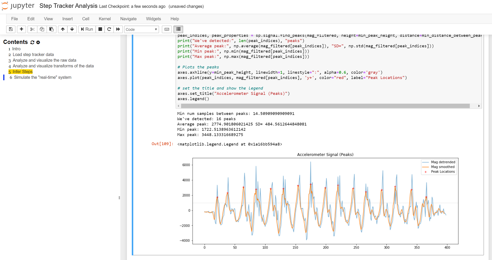
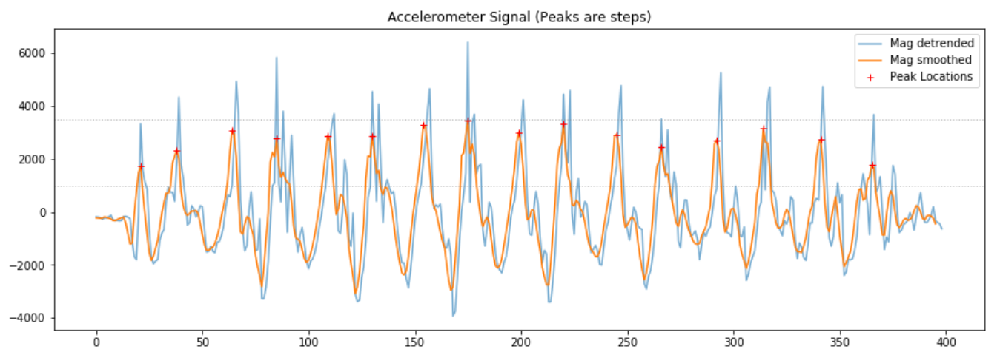

# {{ page.title }}
{: .no_toc }

## Table of Contents
{: .no_toc .text-delta }

1. TOC
{:toc}
---

<!-- TODO: write an intro for signal processing and move this to jupyter.md -->



Jupyter Notebook screenshot showing an analysis and visualization of a 3-axis accelerometer to infer step counts.
{: .fs-1 }

We will be using [Jupyter Notebook](https://jupyter.org/index.html) for the signal processing and machine learning portion of our course. Jupyter Notebook is a popular data science platform for analyzing, processing, classifying, modeling, and visualizing data. While Notebook supports multiple languages (like R, Julia), we'll be using Python (specifically, Python 3). For those familiar with Python, Jupyter Notebook is built on the IPython kernel so you can use all of the IPython [magic](https://ipython.readthedocs.io/en/stable/interactive/magics.html) commands!

For analysis, we'll be using the [SciPy](https://www.scipy.org/) ("Sigh Pie") ecosystem of open-source libraries for mathematics, science, and engineering. Specifically, [NumPy](https://numpy.org/), [SciPy](https://www.scipy.org/scipylib/index.html), and [matplotlib](https://matplotlib.org/). We may also dabble in [Pandas](https://pandas.pydata.org/) and [Seaborn](https://seaborn.pydata.org/). For machine learning, we'll be using [sci-kit learn](https://scikit-learn.org/stable/). And don't worry, all of these libraries will be managed and installed for us!

Just like for Arduino, there is a plethora of wonderful tutorials, forums, and videos about Jupyter Notebook and the SciPy libraries. Please feel free to search online and to share what you find with the class.

<!-- maybe talking about Google Colab here? https://colab.research.google.com/notebooks/intro.ipynb -->

## Lessons

These lessons are intended to be interactive. You should modify, run, iterate, and play with the cells. Make these notebooks your own!

There are three ways to view the lessons: **first**, you can click on the exported HTML versions; however, these are not interactive; **second**, you can clone our [Signals repo](https://github.com/makeabilitylab/signals) and open the `ipynb` files locally on your computer (this is our recommended approach):

```
git clone https://github.com/makeabilitylab/signals.git
```

**Third and finally,** if you want a quick, easy method to interact with the notebooks, you can use [Binder](https://mybinder.org/) or [Google Colab](https://colab.research.google.com/)—both cloud services dynamically load our notebooks directly from GitHub, so you can play, edit code, *etc.* right from your browser—and just a click away. Yay!

**Note:** Again, for your actual assignments, you'll likely want to run your notebooks **locally** because you'll want to load data from disk. You can also do this with Google Colab (you'll just need to get your data into the cloud environment; see below).

<!-- TODO: add in a very first notebook on using Jupyter Notebook -->
<!-- TODO: add in an H3 that separates this stuff out a bit -->
### Introduction to Jupyter Notebook, Python, and SciPy

#### [Lesson 0: Install Jupyter Notebook and Tips](jupyter-notebook.md)

In [our initial lesson](jupyter-notebook.md), we will learn how to install Jupyter Notebook, a helpful extension that auto-generates table of contents, and go over some tips.

#### Lesson 1: Introduction to Jupyter Notebook

There are many introductory tutorials and videos to Jupyter Notebook online. We'll quickly demo Notebook in class but if you want to learn more, you could consult this [Datacamp tutorial](https://www.datacamp.com/community/tutorials/tutorial-jupyter-notebook) or this [Dataquest tutorial](https://www.dataquest.io/blog/jupyter-notebook-tutorial/). Regardless, you will learn Notebook as you go through the lessons below and work on your assignments.

<!-- MusicInformationRetrieval has a good Jupyter Notebook basics page: https://musicinformationretrieval.com/get_good_at_ipython.html -->

#### [Lesson 2: Introduction to Python](IntroToPython.html) ([ipynb](https://github.com/makeabilitylab/signals/blob/master/Tutorials/IntroToPython.ipynb)) 

If you're not familiar with Python—or even if you are—it's a good idea to start with this (rapid) introduction to Python. It will also give you a feel for Jupyter Notebook. To gain the most value from these example Notebooks, you should modify and run the cells yourself (and add your own cells). [](https://mybinder.org/v2/gh/makeabilitylab/signals/master?filepath=Tutorials%2FIntroToPython.ipynb) [](https://colab.research.google.com/github/makeabilitylab/signals/blob/master/Tutorials/IntroToPython.ipynb).

#### [Lesson 3: Introduction to NumPy](IntroToNumPy.html) ([ipynb](https://github.com/makeabilitylab/signals/blob/master/Tutorials/IntroToNumPy.ipynb))

We'll be using [NumPy arrays](https://numpy.org/doc/stable/reference/arrays.html) as one of our primary data structures. Use this notebook to build up some initial familiarity. You need not become an expert here but it's useful to understand what `np.array`'s are and how they're used and manipulated. [](https://mybinder.org/v2/gh/makeabilitylab/signals/master?filepath=Tutorials%2FIntroToNumPy.ipynb) [](https://colab.research.google.com/github/makeabilitylab/signals/blob/master/Tutorials/IntroToNumPy.ipynb)

#### [Lesson 4: Introduction to Matplotlib](IntroToMatplotlib.html) ([ipynb](https://github.com/makeabilitylab/signals/blob/master/Tutorials/IntroToMatplotlib.ipynb))

For visualizing our data, we'll be using [Matplotlib](https://matplotlib.org/)—an incredibly powerful visualization library with a bit of an eccentric API (thanks to Matlab). Open this notebook, learn about creating basic charts, and try to build some of your own. [](https://mybinder.org/v2/gh/makeabilitylab/signals/master?filepath=Tutorials%2FIntroToMatplotlib.ipynb) [](https://colab.research.google.com/github/makeabilitylab/signals/blob/master/Tutorials/IntroToMatplotlib.ipynb)

### Signals

<!-- I can't seem to get Binder to work on the following lessons, perhaps because of spaces in the filenames? -->
<!-- For example: https://mybinder.org/v2/gh/makeabilitylab/signals/master?filepath=Tutorials%2FSignals%2520-%2520Comparing%2520Signals.ipynb doesn't work -->

#### [Lesson 1: Quantization and Sampling](QuantizationAndSampling/index.html) ([ipynb](https://github.com/makeabilitylab/signals/blob/master/Tutorials/Signals%20-%20Quantization%20and%20Sampling.ipynb))

Introduces the two primary factors in digitizing an analog signal: **quantization** and **sampling**. Describes and shows the effect of different quantization levels and sampling rates on real signals (audio data) and introduces the Nyquist sampling theorem, aliasing, and some frequency plots. 

#### [Lesson 2: Comparing Signals (Time Domain)](ComparingSignals/index.html) ([ipynb](https://github.com/makeabilitylab/signals/blob/master/Tutorials/Signals%20-%20Comparing%20Signals.ipynb))

Introduces techniques to compare signals in the time domain, including Euclidean distance, cross-correlation, and Dynamic Time Warping (DTW).

#### [Lesson 3: Frequency Analysis](FrequencyAnalysis/index.html) ([ipynb](https://github.com/makeabilitylab/signals/blob/master/Tutorials/Signals%20-%20Frequency%20Analysis.ipynb))

Introduces frequency analysis, including Discrete Fourier Transforms (DFTs) and the intuition for how they work, Fast Fourier Transforms and spectral frequency plots, and Short-time Fourier Transforms (STFTs) and spectrograms.

### Exercises

#### [Exercise 1: Step Tracker](StepTracker/index.html) ([ipynb](https://github.com/makeabilitylab/signals/blob/master/Projects/StepTracker/StepTracker-Exercises.ipynb))

Building off our A2 assignment, let's analyze some example accelerometer step data and write an algorithm in Jupyter Notebook to infer steps. Notebook is perfectly suited for this task: it's easy to visualize data with [Matplotlib](https://matplotlib.org/) and [NumPy](https://numpy.org/) and [SciPy](https://www.scipy.org/scipylib/index.html) offer filtering, detrending, and other useful signal processing algorithms. You can try lots of ideas, see how well they work on some test data, and then implement your most promising idea on the ESP32. [](https://colab.research.google.com/github/makeabilitylab/signals/blob/master/Projects/StepTracker/StepTracker-Exercises.ipynb). 

#### [Exercise 2: Gesture Recognizer: Shape Matching](gesturerec/shapebased/index.html) ([ipynb](https://github.com/makeabilitylab/signals/blob/master/Projects/GestureRecognizer/GestureRecognizer-ShapeBased.ipynb))

Let's build a shape-based (or template-based) gesture recognizer! This Notebook provides the data structures and experimental scaffolding to write and test shape-based gesture classifiers.

#### [Exercise 3: Gesture Recognizer: Supervised Learning](gesturerec/featurebased/index.html) ([ipynb](https://github.com/makeabilitylab/signals/blob/master/Projects/GestureRecognizer/GestureRecognizer-FeatureBased.ipynb))

Let's build a feature-based (or model-based) gesture recognizer using supervised learning! This Notebook provides an overview of how to use supervised learning and the Scikit-learn library to classify gestures.

#### [Exercise 4: Gesture Recognizer: Automatic Feature Selection and Hyperparameter Tuning](FeatureSelectionAndHyperparameterTuning/index.html) ([ipynb](https://github.com/makeabilitylab/signals/blob/master/Projects/GestureRecognizer/Feature%20Selection%20and%20Hyperparameter%20Tuning.ipynb))

In this Notebook, you'll learn about automatic feature selection and hyperparameter tuning.

<!--  -->

<!-- ## Sampling

Love this video by Monty Montgomery at Xiph on sampling: https://youtu.be/FG9jemV1T7I entitled: "A Digital Media Primer For Geeks by Christopher "Monty" Montgomery and Xiph.org". Also shows impact of sampling rate and quantization on audio -->

<!-- Urban sound classification: https://aqibsaeed.github.io/2016-09-03-urban-sound-classification-part-1/ -->