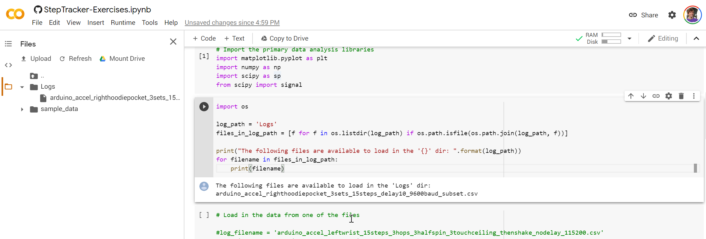
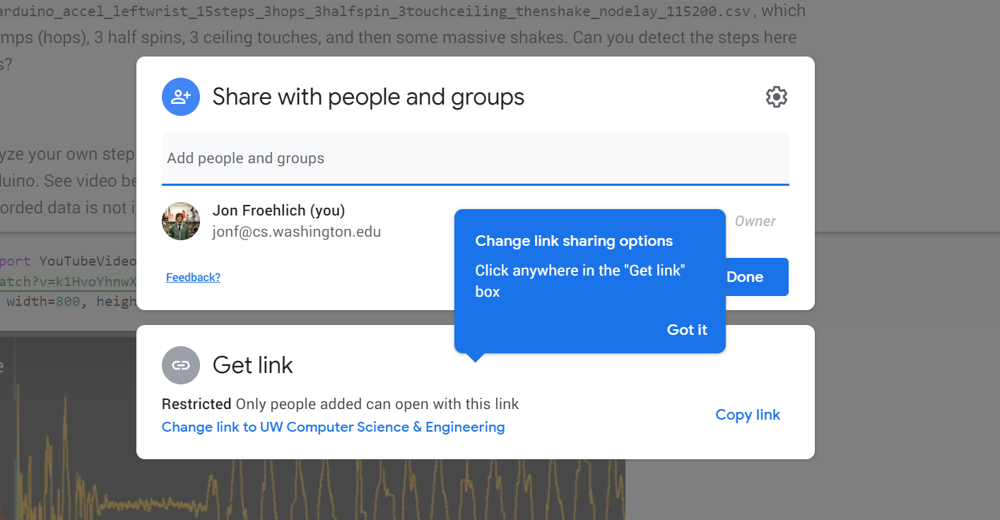

# {{ page.title }}
{: .no_toc }

## Table of Contents
{: .no_toc .text-delta }

1. TOC
{:toc}
---

<!-- TODO: write an intro for signal processing and move this to jupyter.md -->


Jupyter Notebook screenshot showing an analysis and visualization of a 3-axis accelerometer to infer step counts.
{: .fs-1 }

We will be using [Jupyter Notebook](https://jupyter.org/index.html) for the signal processing and machine learning portion of our course. Jupyter Notebook is a popular data science platform for analyzing, processing, classifying, modeling, and visualizing data. While Notebook supports multiple languages (like R, Julia), we'll be using Python (specifically, Python 3). For those familiar with Python, Jupyter Notebook is built on the IPython kernel so you can use all of the IPython [magic](https://ipython.readthedocs.io/en/stable/interactive/magics.html) commands!

For analysis, we'll be using the [SciPy](https://www.scipy.org/) ("Sigh Pie") ecosystem of open-source libraries for mathematics, science, and engineering. Specifically, [NumPy](https://numpy.org/), [SciPy](https://www.scipy.org/scipylib/index.html), and [matplotlib](https://matplotlib.org/). We may also dabble in [Pandas](https://pandas.pydata.org/) and [Seaborn](https://seaborn.pydata.org/). For machine learning, we'll be using [sci-kit learn](https://scikit-learn.org/stable/). And don't worry, all of these libraries will be managed and installed for us!

Just like for Arduino, there is a plethora of wonderful tutorials, forums, and videos about Jupyter Notebook and the SciPy libraries. Please feel free to search online and to share what you find with the class.

<!-- maybe talking about Google Colab here? https://colab.research.google.com/notebooks/intro.ipynb -->

## Jupyter Notebook installation and configuration

To install, Jupyter Notebook, follow the installation instructions below (or read the official [quickstart guide](https://jupyter.readthedocs.io/en/latest/install.html)).

**Importantly**, please use [**Anaconda**](https://www.anaconda.com/download) to install Jupyter Notebook and all dependencies. This is the officially recommended way to install and use Notebook ([link](https://jupyter.readthedocs.io/en/latest/install.html#id3)).

#### Step 1: Download Anaconda

Download and install [Anaconda](https://www.anaconda.com/download) (latest Python 3 version)

#### Step 2: Run the server

Open your terminal (on linux or Mac) or the Anaconda Prompt (on Windows) and type:

```
> jupyter notebook
```

See "Running the Notebook" in the official Jupyter Notebook [docs](https://jupyter.readthedocs.io/en/latest/running.html).

### Installing notebook extensions

We strongly recommend installing the [`jupyter_contrib_nbextensions`](https://jupyter-contrib-nbextensions.readthedocs.io/en/latest/index.html) notebook extensions, which contains a collection of community-contributed (unofficial) extensions for Jupyter Notebook, including a table of contents generator and navigation pane called [Table of Contents (2)](https://jupyter-contrib-nbextensions.readthedocs.io/en/latest/nbextensions/toc2/README.html). See figure below.


Screenshot of a Jupyter Notebook with the nbextension called Table of Contents (2), which auto-generates a navigation pane based on markdown headers.
{: .fs-1 }

Feel free to follow the official installation instructions [here](https://jupyter-contrib-nbextensions.readthedocs.io/en/latest/install.html) or our simplified version below:

#### Step 1: Use conda to install nbextensions

To install the `nbextensions`, open your terminal (on linux or Mac) or the Anaconda Prompt (on Windows) and type:

```
> conda install -c conda-forge jupyter_contrib_nbextensions
```

#### Step 2: Open Jupyter Notebook and configure extensions

Restart Jupyter Notebook and you should see a tab called `Nbextensions` on the home screen. Click on that tab and then you should see all nbextensions. Click on `Table of Contents (2)` to configure and Enable it. See screenshots below.


#### Step 3: Try out TOC

Make some headers in markdown and then click on the `Table of Contents` button in the toolbar to see an auto-generated and clickable navigation sidebar. You can also access the TOC via the `Navigate` menu item.


Example of TOC running in Jupyter Notebook
{: .fs-1 }

## How to use Jupyter Notebook

Start by reading the official introduction to Jupyter Notebook ([link](https://jupyter-notebook.readthedocs.io/en/stable/notebook.html)). We will also go over basic functionality in class. Finally, there are many good tutorials online.

Please follow the [Python](https://www.python.org/dev/peps/pep-0008/) style guide for variable and function naming conventions and other formatting. This will make your code easier to follow and debug. And, of course, we all often (accidentally or intentionally) intermix styles from other programming languages—this is especially true in this course as we toggle between so many languages.

### Some useful tips

Please share your own tips and I'll add them to this list.

1. Regularly save your Notebooks using `ctrl-s` (on Windows) or `cmd-s` (on a Mac). Notebooks are also regularly autosaved.
2. Before turning in or sharing a notebook, it's useful (and important) to restart the kernel and rerun all cells. Why? Because the **most common mistake** I've seen with Jupyter Notebook is code that refers to variables that are in memory but were renamed or deleted (either intentionally or accidentally) thereby breaking the code! How? Go to the file menu, then `Kernel -> Restart & Run All`
3. Hit `shift-enter` to execute the current cell.
4. Hit `esc` to enter "command" mode (the cell will turn **blue**) and then:
   - The `m` key to switch the current cell to markdown
   - The `a` or `b` keys to insert a new cell above or below the current cell, respectively
   - The `d` key twice to delete the current cell
   - The `f` key to find in your code but not outputs
5. `shift-tab` will show you the dcostring for the object you have just typed into code
6. To select multiple cells, enter command mode (`esc`) and then use `shift-j` (or `shift-down`) to select cells below the current cell. Once cells are selected, you can copy or cut and paste them somewhere else. 
7. Because Jupyter Notebook is built on the IPython kernel so you can use all of the IPython [magic](https://ipython.readthedocs.io/en/stable/interactive/magics.html) commands, including:
   - Type `%who` in a cell to list all variables in global scope. As noted above, determining variables loaded into memory is, perhaps, the single most confusing thing about using Notebooks. What cell did I execute again?
   - Type `%who <data type>` will list only variables of that type *e.g.,* `%who str`
8. How fast is my code? You can use the magic command: `%%time` at the beginning of a cell to determine how long it takes to execute said cell. You can also use `%prun` to show much time your program spent in each function.
9. Suppress final output of a cell. By default, Notebook will display the output of the function of the final line on your cell. Sometimes, you don't want this! In those cases, just add a semicolon to the end of the line
10. You can execute shell commands inside your notebook by prefixing an exclamation point `!ls *.csv`
11. You can use LaTeX formulas in a Markdown cell, which will be rendered using MathJax (just like we use on this website!)

For more tips, see this [dataquest](https://www.dataquest.io/blog/jupyter-notebook-tips-tricks-shortcuts/) article.

## Lessons

These lessons are intended to be interactive. You should modify, run, iterate, and play with the cells. Make these notebooks your own!

There are three ways to view the lessons: **first**, you can click on the exported HTML versions; however, these are not interactive; **second**, you can clone our [Signals repo](https://github.com/makeabilitylab/signals) and open the `ipynb` files locally on your computer (this is our recommended approach):

```
git clone https://github.com/makeabilitylab/signals.git
```

**Third and finally,** if you want a quick, easy method to interact with the notebooks, you can use [Binder](https://mybinder.org/) or [Google Colab](https://colab.research.google.com/)—both cloud services dynamically load our notebooks directly from GitHub, so you can play, edit code, *etc.* right from your browser—and just a click away. Yay!

**Note:** Again, for your actual assignments, you'll likely want to run your notebooks **locally** because you'll want to load data from disk. You can also do this with Google Colab (you'll just need to get your data into the cloud environment; see below).

<!-- TODO: add in a very first notebook on using Jupyter Notebook -->

1. **Introduction to Jupyter Notebook**. There are many introductory tutorials and videos to Jupyter Notebook online. We'll quickly demo Notebook in class but if you want to learn more, you could consult this [Datacamp tutorial](https://www.datacamp.com/community/tutorials/tutorial-jupyter-notebook) or this [Dataquest tutorial](https://www.dataquest.io/blog/jupyter-notebook-tutorial/). Regardless, you will learn Notebook as you go through the lessons below and work on your assignments.

<!-- MusicInformationRetrieval has a good Jupyter Notebook basics page: https://musicinformationretrieval.com/get_good_at_ipython.html -->

2. [**Introduction to Python**](IntroToPython.html) ([ipynb](https://github.com/makeabilitylab/signals/blob/master/Tutorials/IntroToPython.ipynb)). If you're not familiar with Python—or even if you are—it's a good idea to start with this (rapid) introduction to Python. It was also give you a feel for Jupyter Notebook. To gain the most value from these example Notebooks, you should feel free to modify and run the cells (and add your own cells). [](https://mybinder.org/v2/gh/makeabilitylab/signals/master?filepath=Tutorials%2FIntroToPython.ipynb) [](https://colab.research.google.com/github/makeabilitylab/signals/blob/master/Tutorials/IntroToPython.ipynb). 

3. [**Introduction to NumPy**](IntroToNumPy.html) ([ipynb](https://github.com/makeabilitylab/signals/blob/master/Tutorials/IntroToNumPy.ipynb)). We'll be using [NumPy arrays](https://numpy.org/doc/stable/reference/arrays.html) as one of our primary data structures. Use this notebook to build up some initial familiarity. You need not become an expert here but it's useful to understand what `np.array`'s are and how they're used and manipulated. [](https://mybinder.org/v2/gh/makeabilitylab/signals/master?filepath=Tutorials%2FIntroToNumPy.ipynb) [](https://colab.research.google.com/github/makeabilitylab/signals/blob/master/Tutorials/IntroToNumPy.ipynb)

4. [**Introduction to Matplotlib**](IntroToMatplotlib.html) ([ipynb](https://github.com/makeabilitylab/signals/blob/master/Tutorials/IntroToMatplotlib.ipynb)). For visualizing our data, we'll be using [Matplotlib](https://matplotlib.org/)—an incredibly powerful with a bit of an eccentric API (thanks to Matlab). Open this notebook, learn about creating basic charts, and try to build some of your own. [](https://mybinder.org/v2/gh/makeabilitylab/signals/master?filepath=Tutorials%2FIntroToMatplotlib.ipynb) [](https://colab.research.google.com/github/makeabilitylab/signals/blob/master/Tutorials/IntroToMatplotlib.ipynb)

5. [**Step Tracker Exercises**](https://github.com/makeabilitylab/signals/blob/master/Projects/StepTracker/StepTracker-Exercises.ipynb). Now, let's actually work on a **real** problem with **real** data. Building off our A2 assignment, let's analyze some example accelerometer step data and write an algorithm in Jupyter Notebook to infer steps. Notebook is perfectly suited for this task: it's easy to visualize data with [Matplotlib](https://matplotlib.org/) and [NumPy](https://numpy.org/) and [SciPy](https://www.scipy.org/scipylib/index.html) offer filtering, detrending, and other useful signal processing algorithms. You can try lots of ideas, see how well they work on some test data, and then implement your most promising idea on the ESP32. [](https://colab.research.google.com/github/makeabilitylab/signals/blob/master/Projects/StepTracker/StepTracker-Exercises.ipynb). 

6. [**Gesture Recognizer: Shape Matching**](gesturerec/shapebased/index.html) ([ipynb](https://github.com/makeabilitylab/signals/blob/master/Projects/GestureRecognizer/GestureRecognizer-ShapeBased.ipynb)). Let's build a shape-based (or template-based) gesture recognizer! This Notebook provides the data structures and experimental scaffolding to write and test shape-based gesture classifiers.

### Using Google Colab

**Importantly,** to get the Step Tracker Exercise notebook to work in Colab, you must create a folder called `Logs` and copy over at least one log file from [here](https://github.com/makeabilitylab/signals/tree/master/Projects/StepTracker/Logs). I suggest starting with [`arduino_accel_righthoodiepocket_3sets_15steps_delay10_9600baud_subset.csv`](https://github.com/makeabilitylab/signals/blob/master/Projects/StepTracker/Logs/arduino_accel_righthoodiepocket_3sets_15steps_delay10_9600baud_subset.csv) because it's the most straightforward. 

To upload data to Colab, click on the folder icon on the left sidebar, then make a new folder called `Logs`, and then right-click on that folder and select `Upload`. Finally, select the file that you want to upload:



Once you've done this, you can save the project to your Google Drive and then invite your breakout group to collaborate and code together in the Colab notebook.



<!--  -->

<!-- ## Sampling

Love this video by Monty Montgomery at Xiph on sampling: https://youtu.be/FG9jemV1T7I entitled: "A Digital Media Primer For Geeks by Christopher "Monty" Montgomery and Xiph.org". Also shows impact of sampling rate and quantization on audio -->

<!-- Urban sound classification: https://aqibsaeed.github.io/2016-09-03-urban-sound-classification-part-1/ -->