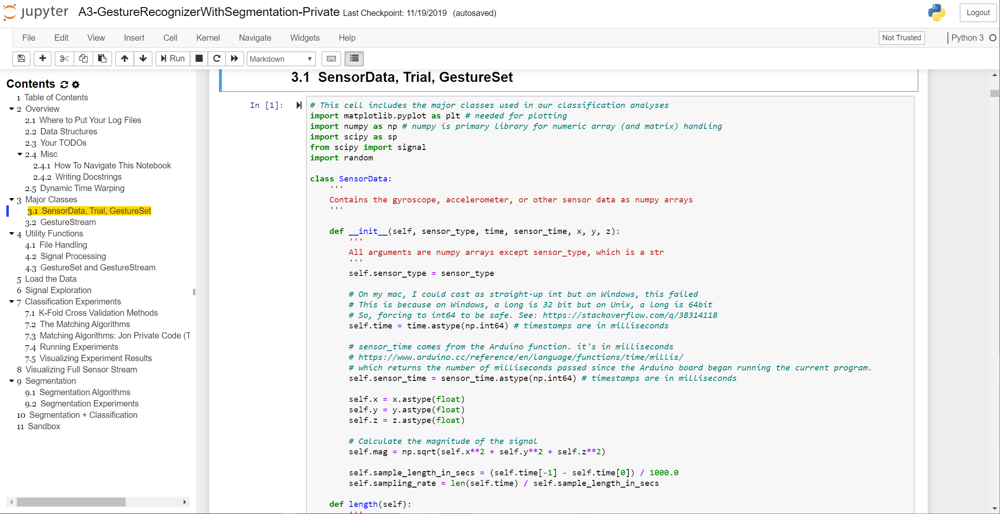
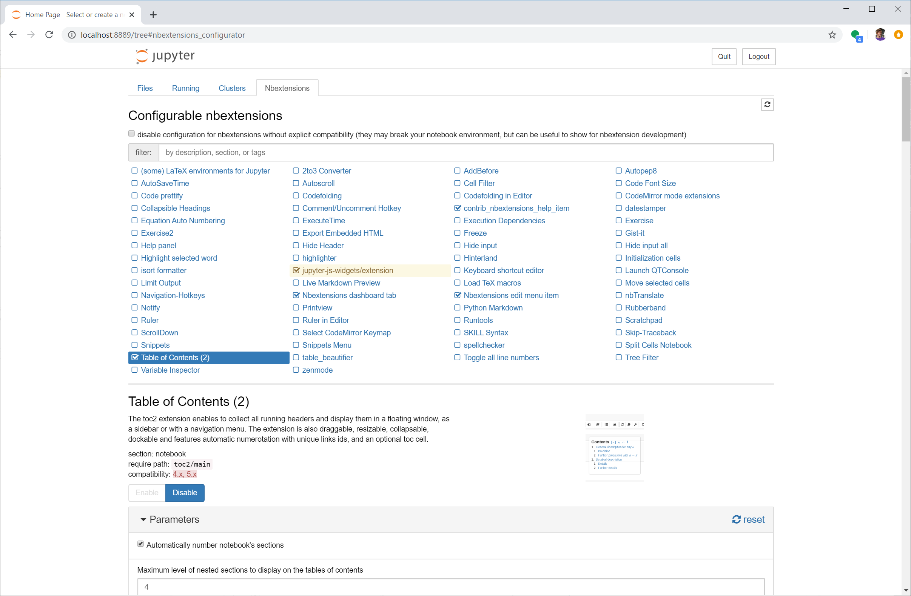

# {{ page.title }}
{: .no_toc }

## Table of Contents
{: .no_toc .text-delta }

1. TOC
{:toc}
---

We will be using [Jupyter Notebook](https://jupyter.org/index.html) for the signal processing and machine learning portion of our course. Jupyter Notebook is a popular data science platform for analyzing, processing, classifying, modeling, and visualizing data. While Notebook supports multiple languages (like R, Julia), we'll be using Python (specifically, Python 3). 


## Jupyter Notebook installation and configuration

To install, Jupyter Notebook, follow the installation instructions below (or read the official [quickstart guide](https://jupyter.readthedocs.io/en/latest/install.html)).

**Importantly**, please use [**Anaconda**](https://www.anaconda.com/download) to install Jupyter Notebook and all dependencies. This is the officially recommended way to install and use Notebook ([link](https://jupyter.readthedocs.io/en/latest/install.html#id3)).

#### Step 1: Download Anaconda

Download and install [Anaconda](https://www.anaconda.com/download) (latest Python 3 version)

#### Step 2: Run the server

Open your terminal (on linux or Mac) or the Anaconda Prompt (on Windows) and type:

```
> jupyter notebook
```

See "Running the Notebook" in the official Jupyter Notebook [docs](https://jupyter.readthedocs.io/en/latest/running.html).

### Installing notebook extensions

We strongly recommend installing the [`jupyter_contrib_nbextensions`](https://jupyter-contrib-nbextensions.readthedocs.io/en/latest/index.html) notebook extensions, which contains a collection of community-contributed (unofficial) extensions for Jupyter Notebook, including a table of contents generator and navigation pane called [Table of Contents (2)](https://jupyter-contrib-nbextensions.readthedocs.io/en/latest/nbextensions/toc2/README.html). See figure below. 

TOC2 provides two primary benefits: first, it auto-generates (and updates in real-time) a clickable table of contents based on the header markdown in the Notebook, which greatly simplifies navigation (you will **want** this). Second, it shows, which cells are queued for execution (in yellow in the navigation pane) and which cells are executing (in red).



Screenshot of a Jupyter Notebook with the nbextension called Table of Contents (2), which auto-generates a navigation pane based on markdown headers.
{: .fs-1 }

Feel free to follow the official installation instructions [here](https://jupyter-contrib-nbextensions.readthedocs.io/en/latest/install.html) or our simplified version below:

#### Step 1: Use conda to install nbextensions

To install the `nbextensions`, open your terminal (on linux or Mac) or the Anaconda Prompt (on Windows) and type:

```
> conda install -c conda-forge jupyter_contrib_nbextensions
```

#### Step 2: Open Jupyter Notebook and configure extensions

Restart Jupyter Notebook and you should see a tab called `Nbextensions` on the home screen. Click on that tab and then you should see all nbextensions. Click on `Table of Contents (2)` to configure and Enable it. See screenshots below.



#### Step 3: Try out TOC

Make some headers in markdown and then click on the `Table of Contents` button in the toolbar to see an auto-generated and clickable navigation sidebar. You can also access the TOC via the `Navigate` menu item.


Example of TOC running in Jupyter Notebook
{: .fs-1 }

## How to use Jupyter Notebook

There are many introductory tutorials and videos to Jupyter Notebook online. We'll quickly demo Notebook in class but if you want to learn more, start by reading the official introduction to Jupyter Notebook ([link](https://jupyter-notebook.readthedocs.io/en/stable/notebook.html)). You could also consult this [Datacamp tutorial](https://www.datacamp.com/community/tutorials/tutorial-jupyter-notebook) or this [Dataquest tutorial](https://www.dataquest.io/blog/jupyter-notebook-tutorial/). 

Again, you will learn Notebook as you go through the lessons and work on your assignments.

Please follow the [Python](https://www.python.org/dev/peps/pep-0008/) style guide for variable and function naming conventions and other formatting. This will make your code easier to follow and debug. And, of course, we all often (accidentally or intentionally) intermix styles from other programming languages—this is especially true in this course as we toggle between so many languages.

### Some useful tips

Please share your own tips and I'll add them to this list.

0. Hit `shift-enter` to execute the current cell.
1. Regularly save your Notebooks using `ctrl-s` (on Windows) or `cmd-s` (on a Mac). Notebooks are also regularly autosaved.
2. Before turning in or sharing a notebook, it's useful (and important) to restart the kernel and rerun all cells. Why? Because the **most common mistake** I've seen with Jupyter Notebook is code that refers to variables that are in memory but were renamed or deleted (either intentionally or accidentally) thereby breaking the code! How? Go to the file menu, then `Kernel -> Restart & Run All`
4. Hit `esc` to enter "command" mode (the cell will turn **blue**) and then:
   - The `m` key to switch the current cell to markdown
   - The `a` or `b` keys to insert a new cell above or below the current cell, respectively
   - The `d` key twice to delete the current cell
   - The `f` key to find in your code but not outputs
5. `shift-tab` will show you the dcostring for the object you have just typed into code
6. To select multiple cells, enter command mode (`esc`) and then use `shift-j` (or `shift-down`) to select cells below the current cell. Once cells are selected, you can copy or cut and paste them somewhere else. 
7. Because Jupyter Notebook is built on the IPython kernel so you can use all of the IPython [magic](https://ipython.readthedocs.io/en/stable/interactive/magics.html) commands, including:
   - Type `%who` in a cell to list all variables in global scope. As noted above, determining variables loaded into memory is, perhaps, the single most confusing thing about using Notebooks. What cell did I execute again?
   - Type `%who <data type>` will list only variables of that type *e.g.,* `%who str`
8. How fast is my code? You can use the magic command: `%%time` at the beginning of a cell to determine how long it takes to execute said cell. You can also use `%prun` to show much time your program spent in each function.
9. Suppress final output of a cell. By default, Notebook will display the output of the function of the final line on your cell. Sometimes, you don't want this! In those cases, just add a semicolon to the end of the line
10. You can execute shell commands inside your notebook by prefixing an exclamation point `!ls *.csv`
11. You can use LaTeX formulas in a Markdown cell, which will be rendered using MathJax (just like we use on this website!)

For more tips, see this [dataquest](https://www.dataquest.io/blog/jupyter-notebook-tips-tricks-shortcuts/) article.

## Next Lesson

In the [next lesson](python.md), you will learn about the Python programming language and gain practical experience using Jupyter Notebook.

<span class="fs-6">
[Next: Introduction to Python](python.md){: .btn .btn-outline }
</span>