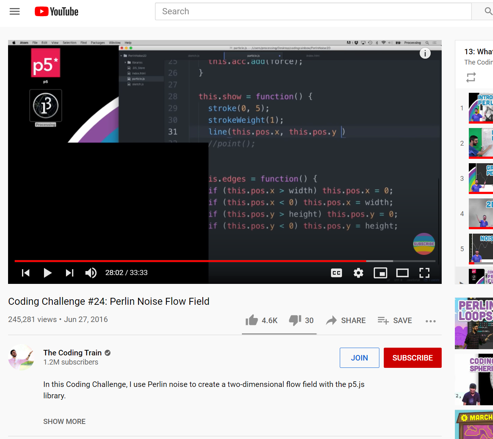

# {{ page.title | replace_first:'L','Lesson '}}
{: .no_toc }

## Table of Contents
{: .no_toc .text-delta }

1. TOC
{:toc}
---

## Green Screen Setup

### Coding Train Setup
In this video on [Perlin Noise Flow Fields](https://youtu.be/BjoM9oKOAKY?t=1682) by Coding Train, the webcam turns off allowing us to see how much of the screen Shiffman has dedicated to the webcam vs. laptop stream.

