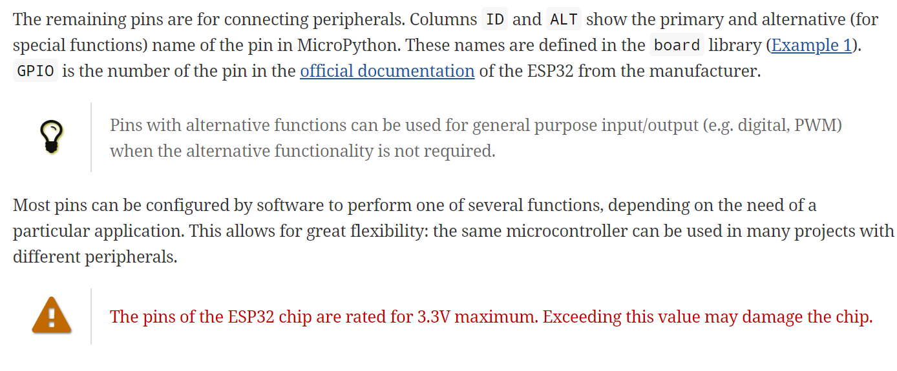

# {{ page.title | replace_first:'L','Lesson '}}
{: .no_toc }

## Table of Contents
{: .no_toc .text-delta }

1. TOC
{:toc}
---

## Running the website
Assuming you have the prerequisite libraries and software infrastructure (e.g., Jekyll)—see our [website development setup guide here](website-install.md)—you can open terminal in VSCode and type:

```
> bundle exec jekyll serve 
```

## VS Code
I've been using [VS Code](https://code.visualstudio.com/) with some popular markdown extensions to develop the website. 

### Extensions
I have the following extensions installed for VS Code:
- Code Spell Check 1.8.0 (1.1m downloads)
- Markdown All in One 2.7.0 (1.2m downloads)
- markdownlint 0.34.0 (1.5, downloads)
- Paste Image 1.0.4 (45K): Allows user to paste images in clipboard using `alt-cmd-v` (Mac) and `ctrl-alt-v` (Windows)

## Embedding markdown content on a page

Including other markdown pages: https://stackoverflow.com/a/41966993/388117.

<!-- {percent sign include_relative tutorials/index.md percent sign} -->

## Code highlighting
<!-- Code snippet highlighting: https://jekyllrb.com/docs/liquid/tags/#code-snippet-highlighting -->

### Using Jekyll's `highlight` functionality
This is a test.

void loop() {
  digitalWrite(led, HIGH);   // turn the LED on (HIGH is the voltage level)
  delay(1000);               // wait for a second
  digitalWrite(led, LOW);    // turn the LED off by making the voltage LOW
  delay(1000);               // wait for a second
}


### Using Markdown's tickmarks

```
void loop() {
  digitalWrite(led, HIGH);   // turn the LED on (HIGH is the voltage level)
  delay(1000);               // wait for a second
  digitalWrite(led, LOW);    // turn the LED off by making the voltage LOW
  delay(1000);               // wait for a second
}
```

### Using `gist-it.appspot.com` to embed code directly from GitHub
<!-- <script src="http://gist-it.appspot.com/http://github.com/$file"></script> -->
This is awesome! Can embed code directly!
<script src="http://gist-it.appspot.com/https://github.com/jonfroehlich/arduino/blob/master/Basics/digitalWrite/Blink/Blink.ino?footer=minimal"></script>

## Styling tables

To set the size of a table, we can use inline spans.
| <span style="display: inline-block; width:500px">text</span> | description      |
| --------------------------------------- | ------------------------------------- |
| `border-bottom-right-radius`            | Defines the shape of the bottom-right |


## Make a Note (Call Out Box)
There are a variety of ways to make "call out boxes" in markdown.

### Option 1: Two horizontal lines
The simplest and most universal way—recommended by this [Stack Overflow post](https://stackoverflow.com/a/41449789/388117)—is to draw two horizontal lines surrounding the content like this:

---

**NOTE**

It works with almost all markdown flavours (the below blank line matters). This is from [link](https://stackoverflow.com/a/41449789/388117).

---

### Option 2: Use block quotes

> **_NOTE:_**  You could also try a block quote format from [link](https://stackoverflow.com/a/43120795/388117).

### Option 3: Use tabs
This version is using tabs:

    Start on a fresh line
    Hit tab twice, type up the content
    Your content should appear in a box. However, doesn't appear to now support markdown. For example, **this** should be bold. However, I can still use html it appears? For example, <b>this</b> is bold? Or maybe not! So, perhaps this is treated as a code block or something...

This version is using tick marks (rather than tabs) but it should render in the same way:
```
Use tickmarks
```

### Option 4: Custom CSS
But if we want to do something more complicated, it's going to take custom css. For example, I quite like the call-out boxes on Boser's Berkeley teaching page [IoT49](https://people.eecs.berkeley.edu/~boser/courses/49_sp_2019/N_gpio.html):



This would take some experimentation and custom css to get right, however.

## How to add custom CSS to markdown
Adding custom CSS to markdown is relatively straightforward.

### Modify custom.css
First, add your custom CSS to `assets\css\custom.css`. Let's add the following new CSS class called `.test-css`:

```css
.test-css{
  font-size: 14 pt;
  font-family: 'Courier New', Courier, monospace;
}
```

### Use custom CSS
Now, let' use this new CSS class to style our markdown. 

This paragraph is now using the `.test-css` style. We do this by using this syntax `{: .test-css}` below the element we want styled.
{: .test-css}

So, the markdown looks like this:

```
This paragraph is now using the `.test-css` style. We do this by using this syntax `{: .test-css}` below the element we want styled.
{: .test-css}
```

## LaTeX

### Adding LaTeX support
After a bit of experimentation, I got LaTeX to work using a **remote** Jekyll template and GitHub Pages. Steps:
1. I largely followed the advice from this [blog post](https://alan97.github.io/random/mathjax/)
2. Since I'm currently using `remote_theme: pmarsceill/just-the-docs`, I was a bit confused about how to make local configuration changes since most online blogs, forum posts talk about editing content in the `_includes` folder; however, I didn't have this in my local dev environment. So, what to do?
3. I manually made a `_includes` folder with the filename `head_custom.html` and put in there:



<script type="text/javascript" async
 src="https://cdn.mathjax.org/mathjax/latest/MathJax.js?config=TeX-MML-AM_CHTML">
</script>



### Using LaTeX on markdown pages
On pages where you want to use LaTeX, then add `usemathjax: true` to the header content

Here's a test LaTeX equation. If it works, this should render correctly.

$$\frac{\partial f(y)}{\partial x} = \frac{\partial f}{\partial y} \times \frac{\partial y}{\partial x}$$

Because I'm forever a LaTeX n00b, I found this online [WYSIWYG LaTeX math editor](https://www.mathcha.io/editor). For a discussion of other WYSIWYG editors, see [this Stack Overflow post](https://tex.stackexchange.com/questions/57068/wysiwyg-latex-editor-for-maths). 

## Disqus

I tried to get Disqus working with Jekyll by following their official instructions; however, it *just* wouldn't work and I didn't have significant time to try and troubleshoot/debug. I kept getting the non-help error printed out in Chrome's dev tool console:

```
Uncaught SyntaxError: Unexpected end of input   led-on.html:1
```

And in FireFox:

```
SyntaxError: missing } after function body led-on.html:1:754
note: { opened at line 1, column 287  led-on.html:1:287
```

But I thought I'd try once more and I came across a [blog posting](https://disqus.com/home/discussion/channel-discussdisqus/why_does_the_disqus_not_work_in_jekyll/) that had the solution The "Universal Code" that Disqus has you embed on your website includes `// single line` comments and `/* multi-line */` comments. However, when Jekyll builds the website, it places the entire produced html on one line (read: not beautified), so the single-line comments disrupt the code. Here's the code that **doesn't work**.


<div id="disqus_thread"></div>
<script>
    /**
     *  RECOMMENDED CONFIGURATION VARIABLES: EDIT AND UNCOMMENT THE SECTION BELOW TO INSERT DYNAMIC 
     *  VALUES FROM YOUR PLATFORM OR CMS.
     *  LEARN WHY DEFINING THESE VARIABLES IS IMPORTANT: 
     * https://disqus.com/admin/universalcode/#configuration-variables */
    
    var disqus_config = function () {
        this.page.url = document.location.href;  // Replace PAGE_URL with your page's canonical URL variable
        this.page.identifier = document.location.pathname; // Replace PAGE_IDENTIFIER with your page's unique identifier variable
    };
    
    (function () { // DON'T EDIT BELOW THIS LINE
        var d = document,
            s = d.createElement('script');
        s.src = 'https://physical-computing.disqus.com/embed.js';
        s.setAttribute('data-timestamp', +new Date());
        (d.head || d.body).appendChild(s);
    })();
</script>
<noscript>Please enable JavaScript to view the <a href="https://disqus.com/?ref_noscript">comments powered by
        Disqus.</a></noscript>
</div>


And here's the code that **does** work with the single line comments replaced with multi-line comments:


<div id="disqus_thread"></div>
<script>
    /**
     *  RECOMMENDED CONFIGURATION VARIABLES: EDIT AND UNCOMMENT THE SECTION BELOW TO INSERT DYNAMIC 
     *  VALUES FROM YOUR PLATFORM OR CMS.
     *  LEARN WHY DEFINING THESE VARIABLES IS IMPORTANT: 
     * https://disqus.com/admin/universalcode/#configuration-variables */
    
    var disqus_config = function () {
        this.page.url = document.location.href;  /* Replace PAGE_URL with your page's canonical URL variable */
        this.page.identifier = document.location.pathname; /* Replace PAGE_IDENTIFIER with your page's unique identifier variable */
    };
    
    (function () { /* DON'T EDIT BELOW THIS LINE */
        var d = document,
            s = d.createElement('script');
        s.src = 'https://physical-computing.disqus.com/embed.js';
        s.setAttribute('data-timestamp', +new Date());
        (d.head || d.body).appendChild(s);
    })();
</script>
<noscript>Please enable JavaScript to view the <a href="https://disqus.com/?ref_noscript">comments powered by
        Disqus.</a></noscript>
</div>


## Tools

### Making animated gifs
To create animated gifs, I use [https://ezgif.com/](https://ezgif.com/).

#### Templates
- Minimal Mistakes
- "Just the Docs". Probably my favorite template that I've evaluated so far