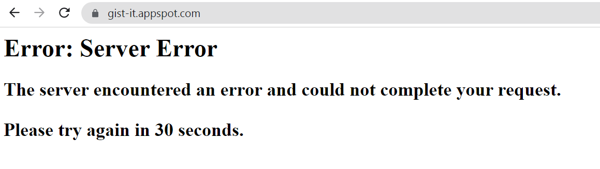

# {{ page.title | replace_first:'L','Lesson '}}
{: .no_toc }

## Table of Contents
{: .no_toc .text-delta }

1. TOC
{:toc}
---

## Running the website
Assuming you have the prerequisite libraries and software infrastructure (e.g., Jekyll)—see our [website development setup guide here](website-install.md)—you can open terminal in VSCode and type:

```
> bundle exec jekyll serve 
```

## Deployment (GitHub Actions)

The live site at <https://makeabilitylab.github.io/physcomp/> is built and
published by the GitHub Actions workflow in
[`.github/workflows/jekyll.yml`](https://github.com/makeabilitylab/physcomp/blob/main/.github/workflows/jekyll.yml). On every push to
`main` (and on manual runs from the **Actions** tab), the workflow runs
`bundle exec jekyll build` on a clean Ubuntu runner and deploys the resulting
`_site/` to GitHub Pages with `actions/deploy-pages`.

This replaced the older "Deploy from a branch" GitHub Pages build, which only
ran whitelisted plugins and no custom build steps. Building in Actions lets us
run custom Jekyll plugins, inline source code at build time, and add content
lint/test gates. See [issue #98](https://github.com/makeabilitylab/physcomp/issues/98).

For the Actions deploy to publish, the repo's **Settings → Pages → Build and
deployment → Source** must be set to **GitHub Actions** (not "Deploy from a
branch"). The workflow still installs the same `github-pages` gem from the
`Gemfile`, so the built output matches the previous branch-based build.

## VS Code
I've been using [VS Code](https://code.visualstudio.com/) with some popular markdown extensions to develop the website. 

### Extensions
I have the following extensions installed for VS Code:
- Code Spell Check 1.8.0 (1.1m downloads)
- Markdown All in One 2.7.0 (1.2m downloads)
- markdownlint 0.34.0 (1.5, downloads)
- Paste Image 1.0.4 (45K): Allows user to paste images in clipboard using `alt-cmd-v` (Mac) and `ctrl-alt-v` (Windows)

## Embedding markdown content on a page

Including other markdown pages: https://stackoverflow.com/a/41966993/388117.

<!-- {percent sign include_relative tutorials/index.md percent sign} -->

## SEO and social cards (per-page front matter)

The site uses [`jekyll-seo-tag`](https://github.com/jekyll/jekyll-seo-tag) (pulled in
via the `github-pages` gem) to emit `<meta>` description, [Open Graph](https://ogp.me/),
and Twitter-card tags. **Every lesson page should set two front-matter keys** so search
results and link previews (Slack, iMessage, Discord, X, LinkedIn, Facebook) are
page-specific instead of falling back to the generic site description and card.

```yaml
---
layout: default
title: L4&#58; Fading an LED
description: "Smoothly fade an LED on and off with Arduino's analogWrite() and pulse-width modulation (PWM), controlling output voltage at fine gradations beyond just HIGH/LOW."
image: /arduino/assets/movies/Arduino_LEDFade_Pin3.gif
nav_order: 4
parent: Output
---
```

**`description:`** — a 1–2 sentence summary, ideally **≤ 160 characters** (search engines
truncate the visible snippet around there). Write it for a human skimming search results:
lead with the concrete thing they'll learn/build. Wrap it in double quotes so `:` and `()`
don't break the YAML.

**`image:`** — the social-card preview. Use a **root-absolute path** (leading `/`, no
`{{ site.baseurl }}` — `jekyll-seo-tag` prepends `site.url` + `baseurl` automatically), or
a full external URL. It **must be a static image** — social crawlers never render video as
the card. Pick, in order of preference:

1. The page's own hero image, if it's a `.png`/`.jpg` (or a `.gif` whose **first frame**
   reads well — platforms show GIFs as a static first frame).
2. For pages whose hero is an **MP4 `<video>`**: run `scripts/generate_og_posters.py`, which
   uses `ffmpeg`'s `thumbnail` filter to extract a representative still into
   `<module>/assets/og/<lesson>.jpg` and sets `image:` for you (dry run by default; pass
   `--run`, or a list of `.md` files to limit scope). Requires `ffmpeg` on PATH.
3. For pages whose hero is a **YouTube embed**: the thumbnail
   `https://img.youtube.com/vi/<VIDEO_ID>/hqdefault.jpg` (`hqdefault` always exists;
   `maxresdefault` does not).
4. If there's no good static image (e.g. a section index page), **omit `image:`** — the
   generic site card (`/assets/images/physcomp-og-card.jpg`, set in `_config.yml` `defaults`)
   is used automatically.

The ideal OG image is 1200×630 (1.91:1); existing figures rarely match this exactly, which is
fine for now. A future improvement (once we're off the `github-pages` gem) is auto-generating
branded 1200×630 cards with the page title overlaid.

To verify after a build, grep the output, e.g.:

```bash
grep -oiE '<meta (name|property)="(og:image|og:description|description)" content="[^"]*"' _site/arduino/led-fade.html
```

### New pages and enforcement

This is **required**, not optional. A CI check (`scripts/check_seo_frontmatter.py`, run by
the **Content lint** workflow on every pull request) fails the PR if any published page is
missing `description:`. So when you author a new lesson, start from this minimal front matter:

```yaml
---
layout: default
title: "Your Lesson Title"
description: "One or two sentences (≤160 chars) on what the reader learns or builds."
# image:  ← add per the rules above; for an MP4 hero, run the poster script (below) instead
parent: Your Section
nav_order: 1
---
```

If a page isn't ready to publish, mark it `nav_exclude: true` (or `search_exclude: true`) and
the check skips it until you publish it. The `image:` key is advisory — the check only *reminds*
you when an MP4-hero page has no poster yet.

For a new page whose hero is an **MP4 `<video>`**, generate its social poster (and have `image:`
set for you) with:

```bash
python scripts/generate_og_posters.py --run <module>/<your-page>.md
```

## Accessibility and content QA

Two CI checks in the **Content lint** workflow guard accessibility and link health.
They are complementary — neither subsumes the other:

| Check (job) | Tool | Runs against | Catches |
|---|---|---|---|
| `media-a11y` | `scripts/check_a11y.py` | Markdown **source** | YouTube `<iframe>` without `title=`, `<video>` without `aria-label`, image with empty/missing alt |
| `link-check` | [`html-proofer`](https://github.com/gjtorikian/html-proofer) | built **`_site/`** | broken internal links, broken `#anchors`, missing `alt` attribute, malformed HTML |

We use the off-the-shelf `html-proofer` for the commodity problem (links/HTML);
`check_a11y.py` only covers the source conventions html-proofer can't see (it permits
empty `alt=""` as "decorative" and has no notion of iframe titles or video labels).

**Authoring rules** (all enforced):

- **YouTube embeds** — give the `<iframe>` a `title=` describing the video, e.g.
  `<iframe title="An RGB LED fading between colors" src="https://www.youtube.com/embed/…" …>`.
- **`<video>` heroes/demos** — add an `aria-label=` describing the clip.
- **Images** — informative images need descriptive alt: ``.
  Don't start with "Image of"; don't dump the filename. A genuinely *decorative* image
  may use empty `alt=""`, but `check_a11y` flags `` in source, so make alt explicit.
- **Drafts / WIP** — a page that intentionally references not-yet-created assets should be
  `nav_exclude: true` (the `media-a11y` check skips drafts). If a published page must keep a
  not-yet-added asset, add its built path to the `--ignore-files` list in
  `content-lint.yml` **with a tracking issue** (don't ignore silently).

**Running html-proofer locally.** It needs `libcurl` (via `typhoeus`/`ethon`), which isn't
present on stock Windows — so it runs in CI (Ubuntu) but may fail to even load on native
Win11 (`Could not open library 'libcurl'`). Options: rely on CI; run it under **WSL2 or
macOS** (libcurl present, matches CI); or on native Win11 install it once with
`ridk exec pacman -S mingw-w64-ucrt-x86_64-curl`. To run it (after a build):

```bash
bundle exec jekyll build --baseurl "/physcomp"
gem install html-proofer -v 5.0.9
htmlproofer ./_site --disable-external --swap-urls "^/physcomp:" \
  --ignore-files "/\/signals\/.+\/index\.html/,/\/signals\/IntroTo[A-Za-z]+\.html/,/\/arduino\/accel\.html/,/\/esp32\/capacitive-touch\.html/"
```

`check_a11y.py` is pure Python (no libcurl) and runs anywhere:
`python scripts/check_a11y.py` (add `--summary` for counts, `--ci` to fail on any issue).

## Code highlighting
<!-- Code snippet highlighting: https://jekyllrb.com/docs/liquid/tags/#code-snippet-highlighting -->

### Using Jekyll's `highlight` functionality
This is a test.

void loop() {
  digitalWrite(led, HIGH);   // turn the LED on (HIGH is the voltage level)
  delay(1000);               // wait for a second
  digitalWrite(led, LOW);    // turn the LED off by making the voltage LOW
  delay(1000);               // wait for a second
}


### Using Markdown's tickmarks

```
void loop() {
  digitalWrite(led, HIGH);   // turn the LED on (HIGH is the voltage level)
  delay(1000);               // wait for a second
  digitalWrite(led, LOW);    // turn the LED off by making the voltage LOW
  delay(1000);               // wait for a second
}
```

### Using `gist-it.appspot.com` to embed code directly from GitHub
<!-- <script src="http://gist-it.appspot.com/http://github.com/$file"></script> -->
This is awesome! Can embed code directly! If this works, it should embed the code [Blink.ino](https://github.com/jonfroehlich/arduino/blob/master/Basics/digitalWrite/Blink/Blink.ino) directly below.

<script src="http://gist-it.appspot.com/https://github.com/jonfroehlich/arduino/blob/master/Basics/digitalWrite/Blink/Blink.ino?footer=minimal"></script>

Update: [gist-it.appspot.com](https://gist-it.appspot.com/)appears to be down.



### Using `emgithub.com` to embed code directly from GitHub
Alternatively, as it seems like [gist-it.appspot.com](https://gist-it.appspot.com/) is down, we could use [emgithub.com](https://emgithub.com/)

<script src="https://emgithub.com/embed.js?target=https%3A%2F%2Fgithub.com%2Fjonfroehlich%2Farduino%2Fblob%2Fmaster%2FBasics%2FdigitalWrite%2FBlink%2FBlink.ino&style=github&showBorder=on&showLineNumbers=on&showFileMeta=on&showCopy=on"></script>

Same thing without special sauce except copy button:

<script src="https://emgithub.com/embed.js?target=https%3A%2F%2Fgithub.com%2Fjonfroehlich%2Farduino%2Fblob%2Fmaster%2FBasics%2FdigitalWrite%2FBlink%2FBlink.ino&style=github&showCopy=on"></script>

Same thing without borders, line numbers, file meta data, and the copy button:

<script src="https://emgithub.com/embed.js?target=https%3A%2F%2Fgithub.com%2Fjonfroehlich%2Farduino%2Fblob%2Fmaster%2FBasics%2FdigitalWrite%2FBlink%2FBlink.ino&style=github"></script>

## Styling tables

| Column 1 | Column 2      |
| --------------------------------------- | ------------------------------------- |
| `border-bottom-right-radius`            | Defines the shape of the bottom-right |

To set the size of a table, we can use inline spans.

| <span style="display: inline-block; width:500px">text</span> | description      |
| --------------------------------------- | ------------------------------------- |
| `border-bottom-right-radius`            | Defines the shape of the bottom-right |


## Make a Note (Call Out Box)
There are a variety of ways to make "call out boxes" in markdown.

### Option 1: Two horizontal lines
The simplest and most universal way—recommended by this [Stack Overflow post](https://stackoverflow.com/a/41449789/388117)—is to draw two horizontal lines surrounding the content like this:

---

**NOTE**

It works with almost all markdown flavours (the below blank line matters). This is from [link](https://stackoverflow.com/a/41449789/388117).

---

### Option 2: Use block quotes

> **_NOTE:_**  You could also try a block quote format from [link](https://stackoverflow.com/a/43120795/388117).

### Option 3: Use tabs
This version is using tabs:

    Start on a fresh line
    Hit tab twice, type up the content
    Your content should appear in a box. However, doesn't appear to now support markdown. For example, **this** should be bold. However, I can still use html it appears? For example, <b>this</b> is bold? Or maybe not! So, perhaps this is treated as a code block or something...

This version is using tick marks (rather than tabs) but it should render in the same way:
```
Use tickmarks
```

### Option 4: Custom CSS
But if we want to do something more complicated, it's going to take custom css. For example, I quite like the call-out boxes on Boser's Berkeley teaching page [IoT49](https://people.eecs.berkeley.edu/~boser/courses/49_sp_2019/N_gpio.html):


This would take some experimentation and custom css to get right, however.

## How to add custom CSS to markdown
Adding custom CSS to markdown is relatively straightforward.

### Modify custom.css
First, add your custom CSS to `assets\css\custom.css`. Let's add the following new CSS class called `.test-css`:

```css
.test-css{
  font-size: 14 pt;
  font-family: 'Courier New', Courier, monospace;
}
```

### Use custom CSS
Now, let' use this new CSS class to style our markdown. 

This paragraph is now using the `.test-css` style. We do this by using this syntax `{: .test-css}` below the element we want styled.
{: .test-css}

So, the markdown looks like this:

```
This paragraph is now using the `.test-css` style. We do this by using this syntax `{: .test-css}` below the element we want styled.
{: .test-css}
```

## LaTeX

### Adding LaTeX support
After a bit of experimentation, I got LaTeX to work using a **remote** Jekyll template and GitHub Pages. Steps:
1. I largely followed the advice from this [blog post](https://alan97.github.io/random/mathjax/)
2. Since I'm currently using `remote_theme: pmarsceill/just-the-docs`, I was a bit confused about how to make local configuration changes since most online blogs, forum posts talk about editing content in the `_includes` folder; however, I didn't have this in my local dev environment. So, what to do?
3. I manually made a `_includes` folder with the filename `head_custom.html` and put in there:



<script type="text/javascript" async
 src="https://cdn.mathjax.org/mathjax/latest/MathJax.js?config=TeX-MML-AM_CHTML">
</script>



### Using LaTeX on markdown pages
On pages where you want to use LaTeX, then add `usemathjax: true` to the header content

Here's a test LaTeX equation. If it works, this should render correctly.

$$\frac{\partial f(y)}{\partial x} = \frac{\partial f}{\partial y} \times \frac{\partial y}{\partial x}$$

Because I'm forever a LaTeX n00b, I found this online [WYSIWYG LaTeX math editor](https://www.mathcha.io/editor). For a discussion of other WYSIWYG editors, see [this Stack Overflow post](https://tex.stackexchange.com/questions/57068/wysiwyg-latex-editor-for-maths). 

## Disqus

I tried to get Disqus working with Jekyll by following their official instructions; however, it *just* wouldn't work and I didn't have significant time to try and troubleshoot/debug. I kept getting the non-help error printed out in Chrome's dev tool console:

```
Uncaught SyntaxError: Unexpected end of input   led-on.html:1
```

And in FireFox:

```
SyntaxError: missing } after function body led-on.html:1:754
note: { opened at line 1, column 287  led-on.html:1:287
```

But I thought I'd try once more and I came across a [blog posting](https://disqus.com/home/discussion/channel-discussdisqus/why_does_the_disqus_not_work_in_jekyll/) that had the solution The "Universal Code" that Disqus has you embed on your website includes `// single line` comments and `/* multi-line */` comments. However, when Jekyll builds the website, it places the entire produced html on one line (read: not beautified), so the single-line comments disrupt the code. Here's the code that **doesn't work**.


<div id="disqus_thread"></div>
<script>
    /**
     *  RECOMMENDED CONFIGURATION VARIABLES: EDIT AND UNCOMMENT THE SECTION BELOW TO INSERT DYNAMIC 
     *  VALUES FROM YOUR PLATFORM OR CMS.
     *  LEARN WHY DEFINING THESE VARIABLES IS IMPORTANT: 
     * https://disqus.com/admin/universalcode/#configuration-variables */
    
    var disqus_config = function () {
        this.page.url = document.location.href;  // Replace PAGE_URL with your page's canonical URL variable
        this.page.identifier = document.location.pathname; // Replace PAGE_IDENTIFIER with your page's unique identifier variable
    };
    
    (function () { // DON'T EDIT BELOW THIS LINE
        var d = document,
            s = d.createElement('script');
        s.src = 'https://physical-computing.disqus.com/embed.js';
        s.setAttribute('data-timestamp', +new Date());
        (d.head || d.body).appendChild(s);
    })();
</script>
<noscript>Please enable JavaScript to view the <a href="https://disqus.com/?ref_noscript">comments powered by
        Disqus.</a></noscript>
</div>


And here's the code that **does** work with the single line comments replaced with multi-line comments:


<div id="disqus_thread"></div>
<script>
    /**
     *  RECOMMENDED CONFIGURATION VARIABLES: EDIT AND UNCOMMENT THE SECTION BELOW TO INSERT DYNAMIC 
     *  VALUES FROM YOUR PLATFORM OR CMS.
     *  LEARN WHY DEFINING THESE VARIABLES IS IMPORTANT: 
     * https://disqus.com/admin/universalcode/#configuration-variables */
    
    var disqus_config = function () {
        this.page.url = document.location.href;  /* Replace PAGE_URL with your page's canonical URL variable */
        this.page.identifier = document.location.pathname; /* Replace PAGE_IDENTIFIER with your page's unique identifier variable */
    };
    
    (function () { /* DON'T EDIT BELOW THIS LINE */
        var d = document,
            s = d.createElement('script');
        s.src = 'https://physical-computing.disqus.com/embed.js';
        s.setAttribute('data-timestamp', +new Date());
        (d.head || d.body).appendChild(s);
    })();
</script>
<noscript>Please enable JavaScript to view the <a href="https://disqus.com/?ref_noscript">comments powered by
        Disqus.</a></noscript>
</div>


## Troubleshooting video playback locally

Jekyll's built-in WEBrick server doesn't support HTTP range requests, 
which browsers need to stream `<video>` elements. If videos fail to 
load or play, try serving the built site with a different local server:

    bundle exec jekyll build
    python3 -m http.server 4000 --directory _site

Alternatively, `npx serve _site` works well. Both support range 
requests and handle large media files reliably.

If videos are still slow, check file sizes. Compress large `.mp4` 
files with ffmpeg:

    ffmpeg -i input.mp4 -crf 28 -preset fast -movflags +faststart output.mp4

The `-movflags +faststart` flag moves metadata to the front of the 
file so browsers can begin playback before the full download completes.

## Tools

### Making animated gifs
To create animated gifs, I use [https://ezgif.com/](https://ezgif.com/).

#### Templates
- Minimal Mistakes
- "Just the Docs". Probably my favorite template that I've evaluated so far