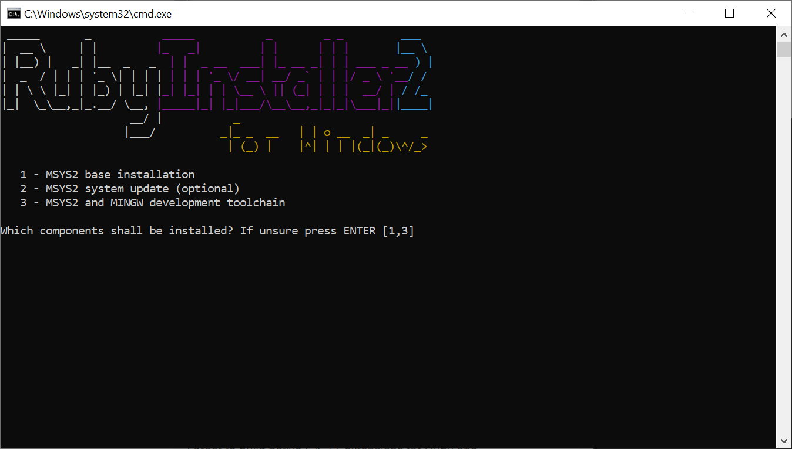
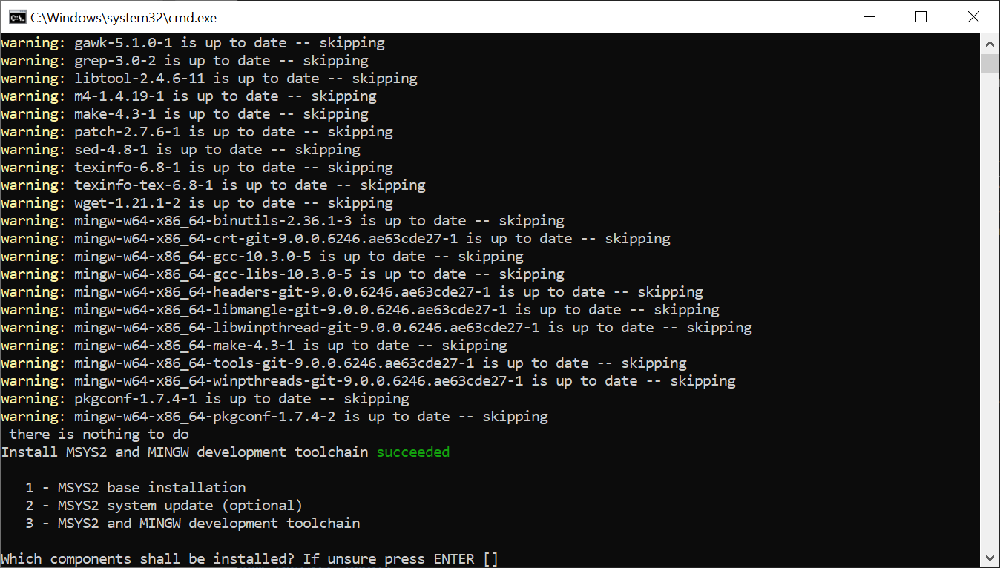
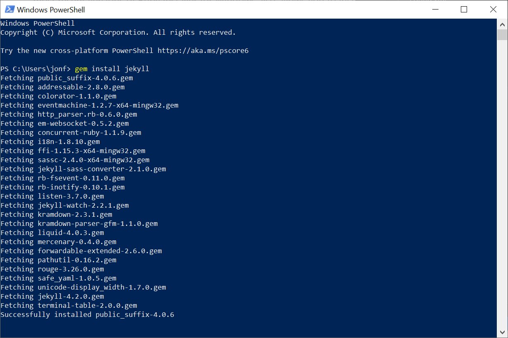
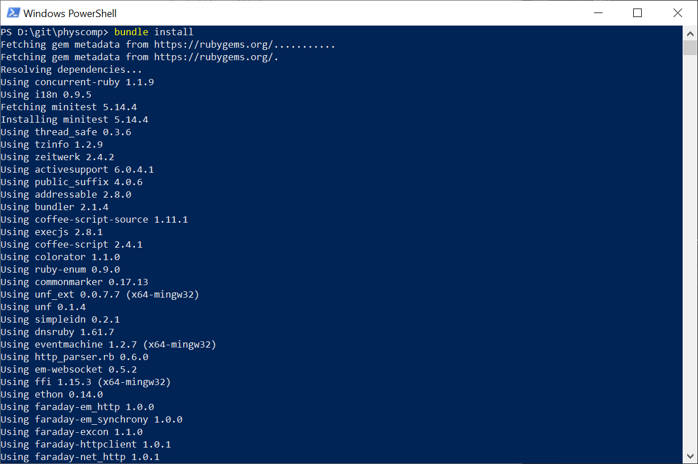
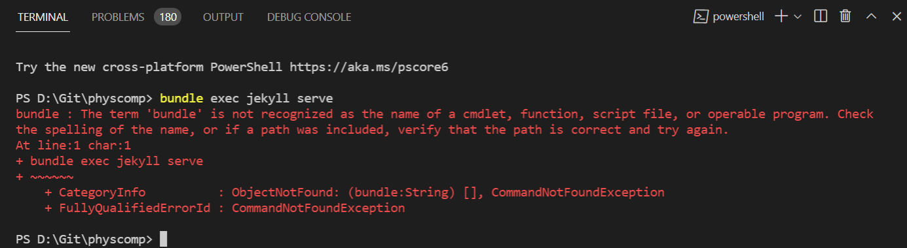

# {{ page.title | replace_first:'L','Lesson '}}
{: .no_toc }

## Table of Contents
{: .no_toc .text-delta }

1. TOC
{:toc}
---

This website is built in [Jekyll](https://jekyllrb.com/), which is a static site generator built in the [Ruby](https://www.ruby-lang.org/en/) language. You do not need to know Ruby to build sites with Jekyll but you do need to know [markdown](https://www.markdownguide.org/) and html/css. We use a Jekyll template called ['Just the Docs'](https://pmarsceill.github.io/just-the-docs/).

## Dev environment setup
Below, we will walk you through dev environment setup on both Mac and Windows. 

Regardless of which platform you're using, the first step is to clone the [physcomp repo](https://github.com/makeabilitylab/physcomp). Open your command prompt and run:

```
> git clone https://github.com/makeabilitylab/physcomp.git`
```

Note: I use [GitHub Desktop](https://desktop.github.com/), which I strongly recommend. VSCode also has built-in git support.

### Mac
Installing the prequisite libraries and setting up your dev environment is easy on the Mac (much harder on Windows). 

#### Follow official installation guide
For MacOS, simply follow the [official installation guide](https://jekyllrb.com/docs/installation/macos/). Because you have to install the XCode development environment, [Homebrew](https://brew.sh/), [Ruby](https://www.ruby-lang.org/en/), and [Jekyll](https://jekyllrb.com/), this installation process may take ~1 hour (depending on your download speeds).

Follow the installation guide closely. I did each step except for I skipped the [rbenv part](https://jekyllrb.com/docs/installation/macos/#rbenv) (as I only use Ruby for Jekyll, no need for selecting between multiple Ruby versions on my dev environment).

#### Run 'bundle install' in physcomp dir
After finishing the last step in the [MacOS installation guide](https://jekyllrb.com/docs/installation/macos/), which is running the command `> sudo gem install -n /usr/local/bin/ jekyll`, then go to the `physcomp` folder and type `> bundle install`. Note: I typically do this from within VSCode's Terminal.

#### Run 'bundle exec jekyll serve' in physcomp dir
Finally, type `> bundle exec jekyll serve` in the `physcomp` folder. Again, I typically do this from within VSCode's Terminal.

And that's it! Hopefully the server will be running at at [http://127.0.0.1:4000/physcomp/](http://127.0.0.1:4000/physcomp/).

#### Potential problems
I just tried this full installation process from end-to-end and ran into the following issue on this last command:

```
jonf-macbook:physcomp jonf$ bundle exec jekyll serve
Configuration file: /Users/jonf/Git/physcomp/_config.yml
            Source: /Users/jonf/Git/physcomp
       Destination: /Users/jonf/Git/physcomp/_site
 Incremental build: disabled. Enable with --incremental
      Generating... 
      Remote Theme: Using theme pmarsceill/just-the-docs
                    done in 17.425 seconds.
 Auto-regeneration: enabled for '/Users/jonf/Git/physcomp'
bundler: failed to load command: jekyll (/usr/local/lib/ruby/gems/3.0.0/bin/jekyll)

/usr/local/lib/ruby/gems/3.0.0/gems/jekyll-3.9.0/lib/jekyll/commands/serve/servlet.rb:3:in `require': cannot load such file -- webrick (LoadError)
```
The problem is that webrick no longer comes with Ruby 3.0. To solve this, I simply typed `> bundle add webrick` and then again `> bundle exec jekyll serve`. And then things worked!

### Windows

I have tried to get Jekyll installed in Windows in the past and failed. It's unfortunately complicated. Indeed, the [Jekyll website](https://jekyllrb.com/docs/installation/windows/) says that Windows is not officially supported:

> While Windows is not an officially-supported platform, it can be used to run Jekyll with the proper tweaks.
{: .fs-4 }

However, here's how I eventually got it to work. These instructions have since been replicated by me (Jon) and Liang. Yay!

#### Download and run Ruby Installer
**First**, although this documentation is old, I started with this [Run Jekyll on Windows](https://jekyll-windows.juthilo.com/) guide. The first step states to Install Ruby via the [rubyinstaller.org](http://rubyinstaller.org/downloads/) website and then to install the Ruby Devkit; however, the most recent versions of Ruby Installer for Windows also allows you to install the Devkit. So, that's what I did. 

Specifically, I downloaded and installed the [Ruby+Devkit 2.7.X (x64) installer](https://rubyinstaller.org/downloads/), which according to the RubyInstaller website "provides the biggest number of compatible gems and installs the MSYS2 Devkit alongside Ruby, so gems with C-extensions can be compiled immediately."

When the Ruby Installer command prompt asks you which option to install (see screenshot below), just press 'Enter'.


**Figure.** When prompted, just hit enter to accept defaults.
{: .fs-1 }

You may be prompted a second time. Again, just press 'Enter'.


**Figure.** If prompted again, just hit enter to accept defaults.
{: .fs-1 }

When the Ruby Installer finishes, it just disappears. So, on to the next step!

#### Run 'gem install jekyll'
**Second**, I then opened `Windows Powershell` and typed `gem install jekyll`:

```
gem install jekyll
Fetching jekyll-4.1.1.gem
Fetching mercenary-0.4.0.gem
Successfully installed mercenary-0.4.0
Successfully installed jekyll-4.1.1
Parsing documentation for mercenary-0.4.0
Installing ri documentation for mercenary-0.4.0
Parsing documentation for jekyll-4.1.1
Installing ri documentation for jekyll-4.1.1
Done installing documentation for mercenary, jekyll after 16 seconds
2 gems installed
```

Here's a screenshot:


**Figure.** A screenshot of PowerShell running the `gem install jekyll` command.
{: .fs-1 }

#### Run 'gem install github-pages'
**Third**, I then tried to install `github-pages` via: `gem install github-pages`. So, run:

```
> gem install github-pages
```

This worked well on some of our Windows systems but others failed with. If this succeeded for you, great! Skip to the next step. If not, check out the error below and see if it matches your problem (or contact us to help and copy/paste the error outcome in your email or Slack message).

##### Handling error installing github-pages

```
ERROR:  Error installing github-pages:
        The last version of nokogiri (>= 1.10.4, < 2.0) to support your Ruby & RubyGems was 1.10.9. Try installing it with `gem install nokogiri -v 1.10.9` and then running the current command again
        nokogiri requires Ruby version >= 2.3, < 2.7.dev. The current ruby version is 2.7.0.0.
```

So, I tried:

```
> gem install nokogiri -v 1.10.9
ERROR:  Error installing nokogiri:
        The last version of nokogiri (= 1.10.9) to support your Ruby & RubyGems was 1.10.9. Try installing it with `gem install nokogiri -v 1.10.9`
        nokogiri requires Ruby version >= 2.3, < 2.7.dev. The current ruby version is 2.7.0.0.
```

But this also failed. And given that I have no idea how hard it would be to downgrade Ruby and whether that would wreck other dependences, I searched the Internet and found this [Issue](https://github.com/sparklemotion/nokogiri/issues/1961) on the Nokogiri GitHub. So, then I tried [this](https://github.com/sparklemotion/nokogiri/issues/1961#issuecomment-581851368):

```
> gem inst nokogiri --pre
Fetching nokogiri-1.11.0.rc2-x64-mingw32.gem
Nokogiri is built with the packaged libraries: libxml2-2.9.10, libxslt-1.1.34, zlib-1.2.11, libiconv-1.15.
Successfully installed nokogiri-1.11.0.rc2-x64-mingw32
Parsing documentation for nokogiri-1.11.0.rc2-x64-mingw32
Installing ri documentation for nokogiri-1.11.0.rc2-x64-mingw32
Done installing documentation for nokogiri after 10 seconds
1 gem installed
```

This worked. Yay!

But I still couldn't install github pages, boo!

```
gem install github-pages
ERROR:  Error installing github-pages:
        The last version of nokogiri (>= 1.10.4, < 2.0) to support your Ruby & RubyGems was 1.10.9. Try installing it with `gem install nokogiri -v 1.10.9` and then running the current command again
        nokogiri requires Ruby version >= 2.3, < 2.7.dev. The current ruby version is 2.7.0.0.
```

So, then I just skipped to the final step and ran `bundle install` and things worked. Hope it does for you too!

#### Run 'bundle install'


From the shell, change directories to `physcomp`. On my machine:

```
> cd c:\git\physcomp
```

And then run `bundle install`:

```
C:\git\physcomp> bundle install
Fetching gem metadata from https://rubygems.org/...........
Fetching gem metadata from https://rubygems.org/.
Resolving dependencies.....
Using concurrent-ruby 1.1.8
Using i18n 0.9.5
Fetching minitest 5.14.4
Installing minitest 5.14.4
...
Using github-pages 218
Fetching wdm 0.1.1
Installing wdm 0.1.1 with native extensions
Bundle complete! 2 Gemfile dependencies, 100 gems now installed.
Use `bundle info [gemname]` to see where a bundled gem is installed.
```

You've done it!

## Running the website locally

Assuming you have the prerequisite libraries and software infrastructure (e.g., Jekyll), you can open terminal in VSCode and type:

```
> bundle exec jekyll serve 
```

The website should then be available at [http://127.0.0.1:4000/physcomp/](http://127.0.0.1:4000/physcomp/).

### Bundle exec fails in VSCode terminal

If you receive an error like the following, you may need to *restart* your computer (not just VSCode). 



```
Try the new cross-platform PowerShell https://aka.ms/pscore6

PS D:\Git\physcomp> bundle exec jekyll serve 
bundle : The term 'bundle' is not recognized as the name of a cmdlet, function, script file, or operable program. Check 
the spelling of the name, or if a path was included, verify that the path is correct and try again.
At line:1 char:1
+ bundle exec jekyll serve
+ ~~~~~~
    + CategoryInfo          : ObjectNotFound: (bundle:String) [], CommandNotFoundException
    + FullyQualifiedErrorId : CommandNotFoundException
```

To resolve this error, simply restart your machine, reopen VSCode, and try again. That fixed it for me!

## Developing the website
1. Download [VS Code](https://code.visualstudio.com/Download)
2. Open the `physcomp` folder in VS Code
3. Use markdown to build new pages. We are using the ['Just the Docs'](https://pmarsceill.github.io/just-the-docs/) Jekyll template.
4. Read more about website dev [here](website-dev.md)